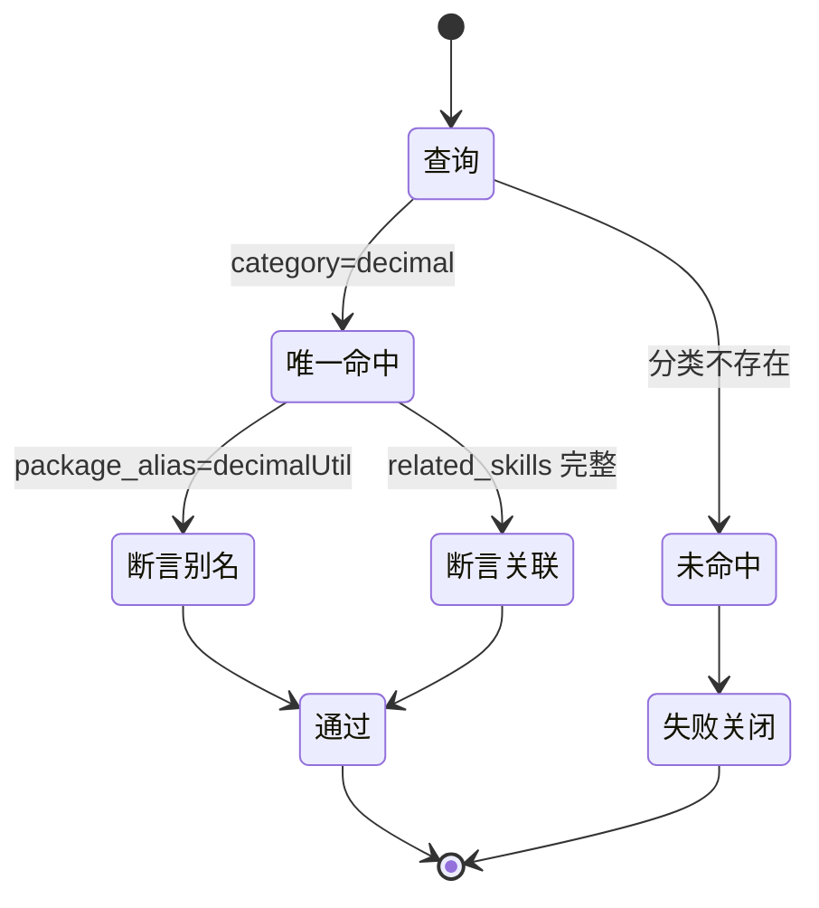

# 代码位置目录规则 V2 实施周期 04：Decimal 目录规则收录

结论：本周期把真实项目中的 Decimal 工具包收录为目录规则，让 Catalog 可查询唯一落点、Go 包别名、关联 skill 与用法 recipe。影响：金额与 Decimal 类型编码可经 guide 查询获得唯一位置和用法，不再依赖临时查阅项目源码。范围：Catalog 新增 Decimal 条目、后端目录树、util 职责表、recipe 索引、SKILL 示例与契约测试。非范围：不修改真实项目源码，不修改 CLI 脚本与 Schema，不涉及数据库、依赖清单和 HTTP API，不执行 Git 历史写入。变化：Catalog 条目、目录树节点、recipe 小节、索引行和 4 个专项测试均新增。完成标准：guide 查询 Decimal 返回正确别名，专项测试全部通过，文档门禁通过。术语说明：guide 是目录用法查询子命令；recipe 是跨 skill 的代码用法示例。验证状态：五个最小任务均已完成实现、真实测试和风格回归，全部通过。

## 当前周期最终方案简要说明

推荐方案：在现有 `package-structure-rules` 内为 `utils/decimal/` 补齐 Catalog 条目、目录树节点、util 职责表、recipe 小节和契约测试，不新增独立 Skill。主落点是 `placement-catalog.yaml`、`project-layout-v2.md`、`backend-util-layout.md`、`usage-recipes-go.md`、`directory-usage-routing.md`、`SKILL.md` 与 `backend_utils_usage_routing_test.py`；之所以这么做，是因为现有目录用法索引机制已经存在，缺口只是 Decimal 条目缺失，补强现有 Owner 的改动最小。

## Agent 对当前问题的理解

| 项目 | 结论 |
|---|---|
| 问题/目标 | 让 Decimal 工具包能被 Catalog 查询并在目录树、recipe 和索引中拥有唯一位置 |
| 本周期范围 | 新增 `backend.utils.decimal` 条目、目录树节点、util 职责行、Go recipe、索引行、SKILL 示例和 4 个专项测试 |
| 非范围 | 真实项目源码、CLI 脚本、Schema、数据库、依赖清单、HTTP API、Git 历史写入 |
| 优先闭环 | 需求与实施总览 -> Catalog/目录/recipe -> 专项测试 -> 文档门禁与风格回归 -> 项目记忆同步 |
| 关键假设 | Decimal 作为项目无关、可独立复制的技术工具包，落点为后端根 `utils/decimal/`；Go 包别名 `decimalUtil`，与既有工具包命名风格一致 |
| 当前状态 | `T04-01` 至 `T04-05` 均已完成，前置取舍已由用户源码和需求阶段确认 |
| 最大推进边界 | 完成规则、目录、recipe、测试和记忆同步；不修改真实项目源码，不提交 Git |

## 当前周期目标、边界与进入条件

| 项目 | 冻结内容 |
|---|---|
| 周期目标 | 让 `utils/decimal/` 在 Catalog、目录树、util 职责、recipe 索引和 guide CLI 中拥有唯一且一致的事实 |
| 范围 | `placement-catalog.yaml`、`project-layout-v2.md`、`backend-util-layout.md`、`usage-recipes-go.md`、`directory-usage-routing.md`、`SKILL.md`、`backend_utils_usage_routing_test.py`、需求与实施文档、项目记忆 |
| 非范围 | 真实项目源码、CLI 脚本、Schema、数据库、依赖清单、HTTP API、Git 历史写入 |
| 进入条件 | 用户已提供 Decimal 源码并要求收录；Catalog 查询基线为未匹配；既有 guide 机制已存在 |
| 收口条件 | guide 查询 Decimal 返回唯一正确条目；9/9 专项测试通过；需求/实施总览/周期文档门禁通过；6-review 风格回归通过 |
| 图片资产决策 | 图片资产决策：N/A + 原因：本周期不涉及界面、截图或视觉验收对象 + 证据：任务依赖与判定关系已由本文两张 Mermaid 图表达 |

## 当前代码/文档基线

| 项目 | 基线 |
|---|---|
| 基线提交 | 未提交工作树；`git status` 显示本仓库存在既有未提交改动 |
| 工作树状态 | 进入本周期前工作树包含目录用法升级等既有未提交改动，本周期不覆盖、不还原 |
| 被修订的历史结论 | 既有 Go recipe 首批覆盖 convert/time/cache/redis/json/log/http 六类，缺少 Decimal |
| 关键基线事实 | Decimal 源码包含 sql.Scanner、driver.Valuer、四则运算、比较、判断、四舍五入和四个构造函数 |
| 关键基线事实 | `guide --category decimal --language go` 基线返回 `ok=false`、`matches=0` |
| 关键基线事实 | Catalog 是 JSON 兼容 YAML，utils 条目已具备元数据字段；`project-layout-v2.md` 已包含既有 utils 目录树 |

## 文件/符号操作契约

| 序号 | 文件/符号 | 操作 | 契约 |
|---|---|---|---|
| 1 | `package-structure-rules/references/placement-catalog.yaml` | 修改 | 新增 `backend.utils.decimal` 条目，category=decimal、package_alias=decimalUtil、related_skills 含 common-util-rules/database-query-rules/database-schema-rules、usage_recipes 含 decimal 小节 |
| 2 | `package-structure-rules/references/project-layout-v2.md` | 修改 | 后端与同仓后端目录树的 `utils/` 下新增 `decimal/` 节点 |
| 3 | `package-structure-rules/references/backend-util-layout.md` | 修改 | 职责表新增 Decimal 分类行；Go 包别名列表追加 `utils/decimal` 到 `decimalUtil` |
| 4 | `package-structure-rules/references/usage-recipes-go.md` | 修改 | 新增 decimal recipe 小节，覆盖数据库扫描、四则运算、比较、构造与注意事项 |
| 5 | `package-structure-rules/references/directory-usage-routing.md` | 修改 | utils 索引表新增 `utils/decimal/` 行 |
| 6 | `package-structure-rules/SKILL.md` | 修改 | guide 示例追加 Decimal 查询行；不新增二级标题 |
| 7 | `test/package-structure-rules/backend_utils_usage_routing_test.py` | 修改 | 新增 4 个 Decimal 专项测试，目标 9/9 |
| 8 | 需求、实施总览、周期文档、测试 README、6-review | 修改/新增 | 补齐 CYCLE-04 工程文档并运行门禁 |
| 9 | `PROJECT_CURRENT.md`、`PROJECT_MEMORY.md`、`PROJECT_HISTORY.md` | 修改 | 同步本轮状态、稳定决策与历史事件 |

### 任务依赖关系

图形目的：说明本周期五个最小任务的先后依赖，解释为什么需求与实施总览必须先于 Catalog 与测试。关联 ID：`T04-01` 至 `T04-05`。

### 判定分流与预期结论

图形目的：说明 guide 查询对 Decimal 条目的分流结论，作为真实测试断言的依据。关联 ID：`T04-02`、`T04-03`。

## 周期内最小任务执行顺序

必须逐个闭环：每个任务先实现，再跑自己的真实测试，再做风格回归，通过后才允许推进下一个任务。禁止先做完多个任务再统一验证。

| 顺序 | 任务 ID | 任务 | 文件数 | 依赖 |
|---|---|---|---|---|
| 1 | `T04-01` | 更新需求、实施总览并新增周期文档 | 3 | 无 |
| 2 | `T04-02` | 新增 Catalog 条目、两棵目录树、util 职责与包名例外 | 4 | `T04-01` 已闭环 |
| 3 | `T04-03` | 新增完整 Decimal recipe、目录路由、SKILL 示例和 4 个测试 | 3 | `T04-02` 已闭环 |
| 4 | `T04-04` | 全量回归、quick validation、文档门禁、测试证据和 6-review | 0 | `T04-03` 已闭环 |
| 5 | `T04-05` | 同步项目四件套 | 3 | `T04-04` 已闭环 |

## 最小任务闭环

### T04-01 更新需求、实施总览并新增周期文档

| 项目 | 内容 |
|---|---|
| 产出 | 需求文档升级 v1.1、实施总览新增 CYCLE-04 行与 T04 任务、周期文档落盘 |
| 文件/符号 | 操作契约第 8 项中的三份文档 |
| 真实测试 | 需求 profile 与实施总览/周期 profile 由 `T04-04` 文档门禁覆盖；本任务同时人工核对版本与追踪一致 |
| 通过标准 | 需求版本 v1.1、新增 AC-DECIMAL-001 至 004、CYCLE-04 行与 T04 任务齐全 |
| 停止条件 | 文档门禁失败且无法在本周期内修正时停止 |
| 最大推进边界 | 只更新三份工程文档 |

### T04-02 新增 Catalog 条目、目录树与 util 职责

| 项目 | 内容 |
|---|---|
| 产出 | `backend.utils.decimal` 条目、两棵后端目录树 decimal 节点、util 职责行与 Go 包别名 |
| 文件/符号 | 操作契约第 1、2、3 项 |
| 真实测试 | `guide --category decimal --language go` 返回 `decimalUtil` 别名；`project-layout-v2.md` 包含 decimal 节点 |
| 通过标准 | guide 查询唯一命中且元数据完整；目录树与 Catalog 一致 |
| 停止条件 | 需要改动 CLI 脚本或 Schema 时停止 |
| 最大推进边界 | 只改 Catalog 与两棵目录树、util 职责文档 |

### T04-03 新增 Decimal recipe、索引与专项测试

| 项目 | 内容 |
|---|---|
| 产出 | usage-recipes-go.md decimal 小节、directory-usage-routing.md 索引行、SKILL 示例、4 个专项测试 |
| 文件/符号 | 操作契约第 4、5、6、7 项 |
| 真实测试 | `python -X utf8 -m unittest discover -s test/package-structure-rules -p backend_utils_usage_routing_test.py -v` 断言 9/9 |
| 通过标准 | 9/9 通过；recipe 文档、索引文档与 Catalog 引用一致 |
| 停止条件 | 任一专项测试失败且无法在本周期内修正时停止 |
| 最大推进边界 | 只改 recipe、索引、SKILL 示例和测试文件 |

### T04-04 全量回归、文档门禁与风格回归

| 项目 | 内容 |
|---|---|
| 产出 | 测试证据、6-review 文档、全量回归结论 |
| 文件/符号 | 操作契约第 8 项中的测试 README 与 6-review |
| 真实测试 | 专项 9/9、py_compile、git diff --check、需求/实施总览/周期文档门禁 |
| 通过标准 | 专项测试全绿；文档门禁全 PASS；6-review 为 STYLE: PASS |
| 停止条件 | 任一验证失败且无法在本周期内修正时停止 |
| 最大推进边界 | 只补文档证据与验证结论，不改业务规则 |

### T04-05 同步项目四件套

| 项目 | 内容 |
|---|---|
| 产出 | `PROJECT_CURRENT.md`、`PROJECT_MEMORY.md`、`PROJECT_HISTORY.md` 同步 |
| 文件/符号 | 操作契约第 9 项 |
| 真实测试 | 免可执行测试；靠 UTF-8 回读与 `git diff --check` 自查替代 |
| 通过标准 | 三个文件更新完成且 UTF-8 回读无乱码 |
| 停止条件 | 发现文件被外部改动或编码漂移时停止 |
| 最大推进边界 | 只更新三个项目记忆文件 |

## 当前周期验证矩阵

| 验证项 | 命令/入口 | 通过标准 | 证据 |
|---|---|---|---|
| guide Decimal 查询 | `placement_catalog.py guide --category decimal --language go` | 返回 decimalUtil 别名与完整元数据 | `test_guide_returns_decimal_recipe` |
| 目录树收录 | `project-layout-v2.md` 检查 | 后端与同仓后端目录树包含 decimal 节点 | `test_project_layout_contains_decimal_directory` |
| recipe 文档 | `usage-recipes-go.md` 检查 | 包含 decimal 小节与 decimalUtil 引用 | `test_usage_recipe_contains_decimal_section` |
| 索引文档 | `directory-usage-routing.md` 检查 | 包含 utils/decimal 索引行 | `test_directory_routing_contains_decimal_index` |
| 专项测试 | `backend_utils_usage_routing_test.py` | 9/9 通过 | 测试命令输出 |
| 文档门禁 | `validate_engineering_docs.py --profile requirement/implementation_overview/implementation_cycle` | 全部 PASS | 门禁 JSON 输出 |
| 语法与格式 | `py_compile`、`git diff --check` | 退出码 0、无 whitespace 错误 | 命令输出 |

## 周期阻断、停止与回滚

| 项目 | 冻结内容 |
|---|---|
| 阻断 | 无；Obsidian 固定根未注册仅阻断知识沉淀，不阻断仓库目录规则实施，已在最终收口中如实记录 |
| 停止条件 | 需要修改 CLI 脚本或 Schema、需要修改真实项目源码、需要扩大规则语义时停止 |
| 回滚 | 删除 Decimal Catalog 条目与目录树节点，还原 recipe/索引/SKILL/测试文件，重跑测试与文档门禁即可回到改动前状态；检查过程只读，不自动创建、迁移或删除用户文件 |
| 文件/符号 | 所有回滚动作只针对本周期列出的文件与符号，不触碰既有未提交改动 |
| 真实测试 | 回滚后重跑专项测试确认无残留断言 |

## 自审结论

| 项目 | 结论 |
|---|---|
| 覆盖度 | 已覆盖 Catalog、目录树、util 职责、recipe、索引、SKILL 示例、专项测试与工程文档 |
| 周期检查 | 5 个最小任务按依赖顺序推进，每个任务均有真实测试或明确免测 |
| 可执行性 | 文件落点、命令、断言、完成条件、停止条件与回滚已冻结 |
| 用户确认状态 | 用户提供源码并要求收录，落点与包别名已确认 |
| 收口要求 | `skill-execution-compliance-gate-rules` 与 `skill-audit-rules` 已执行，最终风格回归为 `STYLE: PASS` |

## 执行附录

- 所有命令均在本地执行；未连接数据库、缓存、消息队列或外部服务。
- guide 查询与测试只读本地工作树。
- Obsidian 知识沉淀因固定根未注册而阻断，只影响知识捕获，不影响本周期实施结论。

## 追踪附录

| 稳定 ID | 规则 | 任务 | 测试 | 文件/符号 |
|---|---|---|---|---|
| CHG-DECIMAL-001 | Decimal Catalog 条目唯一可查 | T04-02 | guide 查询测试 | placement-catalog.yaml |
| CHG-DECIMAL-002 | 后端目录树包含 utils/decimal | T04-02 | 目录树检查测试 | project-layout-v2.md |
| CHG-DECIMAL-003 | recipe 文档包含 decimal 小节 | T04-03 | recipe 文档检查测试 | usage-recipes-go.md |
| CHG-DECIMAL-004 | 索引文档包含 utils/decimal | T04-03 | 索引文档检查测试 | directory-usage-routing.md |
| AC-DECIMAL-001 至 004 | guide/目录树/recipe/索引一致 | T04-02/03 | 9/9 专项测试 | backend_utils_usage_routing_test.py |
