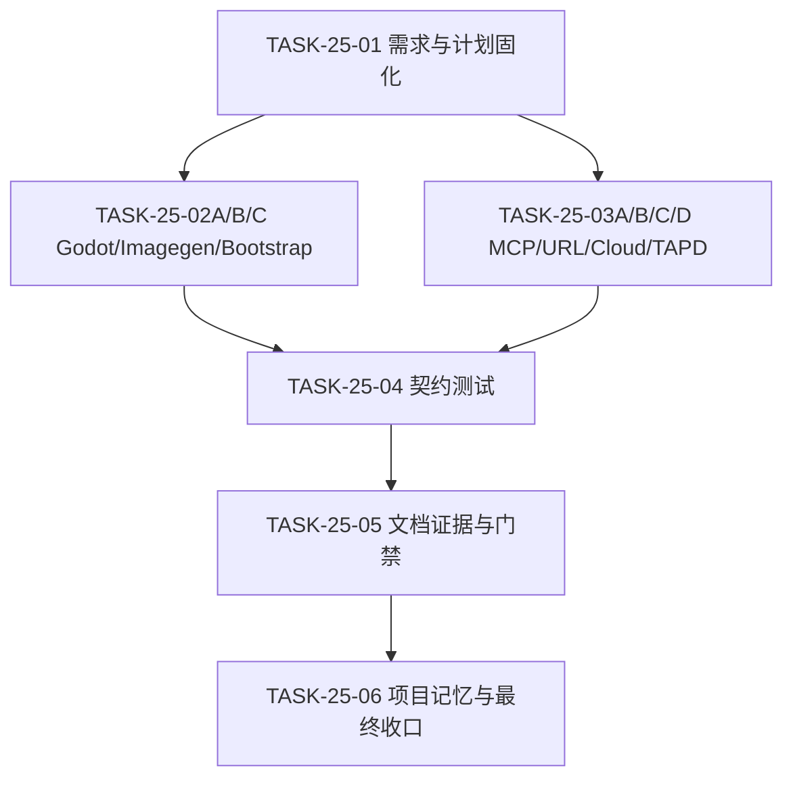
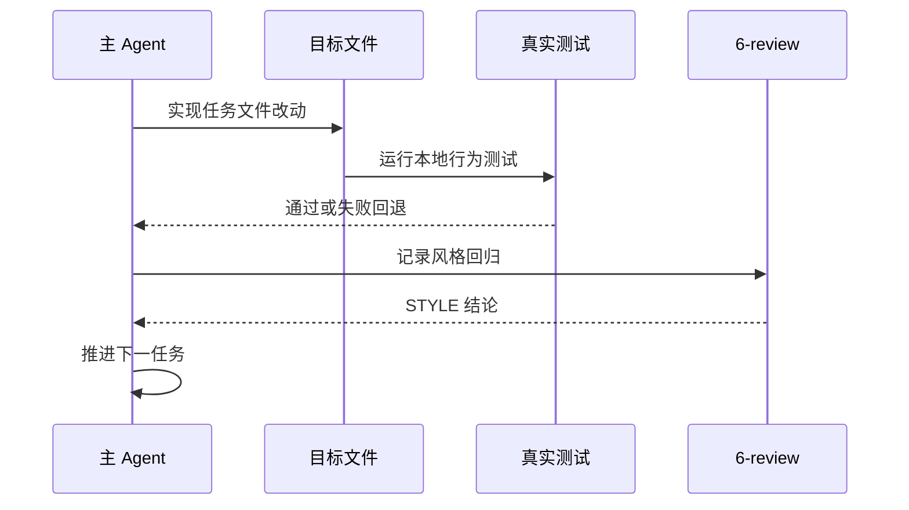

# 跨 Skill 凭据默认代码持久化与来源优先级统一：实施周期 25

结论：本周期把 上一周期已完成的"允许持久化"口径强化为"项目代码/配置为凭据默认来源，环境变量仅作运行时覆盖"，并逐文件修改九个 Skill 的旧口径；影响：godot、bootstrap、imagegen、mcp、认证 URL、browser cloud、tapd 等九个 Skill 的规则与配置来源说明；范围：九个 Skill 的 SKILL.md/references/scripts、契约测试、文档证据和项目记忆；非范围：真实后端加载器、真实密钥、外部服务、test/prod 连接、Git 历史写入；变化：不再要求凭据来源必须经过环境变量，项目代码/配置成为默认持久化位置，环境变量只作为运行时覆盖方案；完成标准：九项验收条件、六任务真实测试、五档文档 profile、Skill 合规和 6-review 全部通过。术语说明：凭据原值指真实 API key、token、密码、私钥、连接串；过程性输出指日志、错误信息、测试报告与证据、终端输出、Agent 回复、会话交接、执行失败案例、自动知识摘要。验证状态：六任务全部完成，门禁全部通过。

## 当前周期最终方案简要说明

主落点是九个 Skill 的 SKILL.md/references/scripts 和新增契约测试，因为它们是规则读取与机器查询的唯一权威源；采用"项目代码/配置默认 + 环境变量仅作运行时覆盖 + 禁止过程性输出回显"的单一口径，避免每个 skill 各自维护一套敏感边界。

## Agent 对当前问题的理解

| 项目 | 结论 |
|---|---|
| 问题/目标 | CYCLE-24 已允许凭据持久化，但未明确"项目代码/配置是默认来源"，多个 Skill 仍保留环境变量唯一来源或"留空由用户填写"的旧口径。 |
| 本周期范围 | 九个 Skill 的 SKILL.md/references/scripts、契约测试、文档证据和项目记忆。 |
| 非范围 | 真实后端加载器、真实密钥、外部服务、test/prod 连接、Git 历史写入。 |
| 当前优先闭环 | 先冻结需求与周期契约，再并行推进三路互斥写集，最后收口文档证据与项目记忆。 |
| 最大边界 | CYCLE-25 完成后停止，不进入具体业务项目运行时改造。 |

## 当前周期目标、边界与进入条件

| 项目 | 冻结内容 |
|---|---|
| 周期目标 | 九个 Skill 的 SKILL.md/references/scripts 统一为"项目代码/配置默认，环境变量仅作运行时覆盖，禁止过程性输出回显"；新增契约测试。 |
| 范围 | 九个 Skill 的 SKILL.md/references/scripts、契约测试、文档证据和项目记忆。 |
| 非范围 | 真实后端加载器、真实密钥、外部服务、test/prod 连接、Git 历史写入。 |
| 进入条件 | `REQ-PSR-CONFIG-SECRET-003` 与 `CHG-PSR-CONFIG-SECRET-003` 已冻结；CYCLE-24 周期和既有工作树改动保留。 |
| 收口条件 | `AC-PSR-CONFIG-SECRET-013..016`、六任务真实测试、五档文档 profile、Skill 合规和 6-review 全部通过。 |
| 最大推进边界 | CYCLE-25 收口后停止。 |

图片资产决策：N/A + 原因：纯规则、元数据和测试变更，无界面或视觉产物 + 证据：本文 Mermaid 依赖图与任务闭环图。

## 当前代码/文档基线

当前工作树已包含 CYCLE-24 已提交的 `AGENTS.md`/`CLAUDE.md`、`placement-catalog.yaml`、`configuration-layout.md` 等改动；本周期只在既有文件上做目标区段手术式修改，不覆盖 CYCLE-24 已确认的禁止原值规则对象。基线测试：`bootstrap_agents_test.py`、`pre_commit_gate_test.py`、`configuration_layout_test.py` 等既有测试入口。

## 周期依赖图

图形目的：表达需求冻结、三路并行实现、文档证据与最终门禁的顺序。关联 ID：`TASK-25-01..06`。

## 任务闭环时序图

图形目的：表达单个最小任务「实现 -> 真实测试 -> 6-review -> 推进」的强制闭环。关联 ID：`TASK-25-01..06`、`TEST-PSR-CONFIG-SECRET-011..014`。

## 任务执行顺序与闭环契约

顺序固定为 `TASK-25-01 -> TASK-25-02A/B/C（写集互斥，可并行）+ TASK-25-03A/B/C/D（写集互斥，可并行）-> TASK-25-04 -> TASK-25-05 -> TASK-25-06`。每个任务必须完成文档/实现、local 真实测试、清理和 6-review 后才能推进；并行任务由主 agent 负责回收与冲突裁决。

## 周期内最小任务执行顺序

`TASK-25-01 → TASK-25-02A/B/C → TASK-25-03A/B/C/D → TASK-25-04 → TASK-25-05 → TASK-25-06`；每个任务必须先完成自身实现、真实测试和 `6-review`，不得跨任务合并验证。

## 最小任务闭环

- `TASK-25-01`：落盘需求主文档、实施总览、实施周期文档；运行 requirement/implementation_overview/implementation_cycle 三档 profile；STYLE 检查章节、ID 和中文表达；通过后进入 TASK-25-02A/B/C。
- `TASK-25-02A`：修改 `godot-project-bootstrap-rules/SKILL.md` 旧口径；grep 合规检查；通过后进入 TASK-25-04。
- `TASK-25-02B`：修改 `project-rule-file-bootstrap-rules/SKILL.md` 与 `scripts/bootstrap_agents.sh` 旧口径；运行 `bootstrap_agents_test.py`；通过后进入 TASK-25-04。
- `TASK-25-02C`：修改 `imagegen/SKILL.md`、`references/local-entrypoints.md`、`scripts/bootstrap_imagegen_env.py` 旧口径；dry-run/check；通过后进入 TASK-25-04。
- `TASK-25-03A`：修改 `mcp-installation-rules/SKILL.md` 与 `references/tapd-skills-install.md` 旧口径；grep 合规检查；通过后进入 TASK-25-04。
- `TASK-25-03B`：修改 `authenticated-url-routing-rules/SKILL.md` 旧口径；grep 合规检查；通过后进入 TASK-25-04。
- `TASK-25-03C`：修改 `browser-use-cloud-rules/SKILL.md` 旧口径；grep 合规检查；通过后进入 TASK-25-04。
- `TASK-25-03D`：修改 `tapd-addcomment/SKILL.md`、`tapd-cli/SKILL.md`、`tapd-openapi/SKILL.md` 旧口径；grep 合规检查；通过后进入 TASK-25-04。
- `TASK-25-04`：新增 `test/credential-policy/credential_policy_contract_test.py`；运行契约测试；通过后进入 TASK-25-05。
- `TASK-25-05`：回填测试 README 与 6-review；运行五档 profile；通过后进入 TASK-25-06。
- `TASK-25-06`：更新项目四件套；运行根回归、字典生成、`git diff --check`、Skill 合规门禁与 6-review 复核；全部通过后周期结束。

## 文件与符号操作契约

| 文件/符号 | 允许操作 | 禁止操作 |
|---|---|---|
| `godot-project-bootstrap-rules/SKILL.md` | 更新凭据边界条目 | 覆盖其他规则章节 |
| `project-rule-file-bootstrap-rules/SKILL.md`、`scripts/bootstrap_agents.sh` | 更新凭据边界条目 | 创建第二份实现或改动其他受管章节 |
| `imagegen/SKILL.md`、`references/local-entrypoints.md`、`scripts/bootstrap_imagegen_env.py` | 更新来源优先级 | 覆盖其他配置章节 |
| `mcp-installation-rules/SKILL.md`、`references/tapd-skills-install.md` | 更新来源优先级 | 删除 TAPD 技能包归一化 |
| `authenticated-url-routing-rules/SKILL.md` | 更新来源优先级 | 删除认证流程规则 |
| `browser-use-cloud-rules/SKILL.md` | 更新来源优先级 | 删除 Cloud 专属需求规则 |
| `tapd-addcomment/SKILL.md`、`tapd-cli/SKILL.md`、`tapd-openapi/SKILL.md` | 更新来源优先级 | 删除 TAPD 技能用法 |
| `test/credential-policy/credential_policy_contract_test.py` | 新增契约测试 | 读取真实密钥、连接外部服务 |
| `PROJECT_CURRENT.md` | 覆盖当前状态，原样保留 v4 registry | 删除其他会话 projection |
| `PROJECT_MEMORY.md` | 更新凭据来源优先级实体 | 覆盖非相关人类区或机器索引区内容 |
| `PROJECT_HISTORY.md` | 追加事件并裁剪至最近 20 条 | 覆盖或重排既有历史 |

## 任务图片资产执行契约

| 任务 | 图片决策 | 生成输入与 imagegen 命令 | 目标资产路径 | Markdown 相对引用 | `IMG-*` / 版本 | 资产清单与引用章节 | Mermaid 不替代说明 |
|---|---|---|---|---|---|---|---|
| `TASK-25-01` | `N/A + 原因 + 证据` | 无 | 无 | 无 | 无 | 无 | 本文 Mermaid 图已覆盖依赖与时序 |
| `TASK-25-02A/B/C` | `N/A + 原因 + 证据` | 无 | 无 | 无 | 无 | 无 | 纯规则文本 |
| `TASK-25-03A/B/C/D` | `N/A + 原因 + 证据` | 无 | 无 | 无 | 无 | 无 | 纯规则文本 |
| `TASK-25-04` | `N/A + 原因 + 证据` | 无 | 无 | 无 | 无 | 无 | 纯测试代码 |
| `TASK-25-05` | `N/A + 原因 + 证据` | 无 | 无 | 无 | 无 | 无 | 纯文档 |
| `TASK-25-06` | `N/A + 原因 + 证据` | 无 | 无 | 无 | 无 | 无 | 纯项目记忆 |

## 真实测试与断言

| TEST | 对应任务 | 精确命令 | local 依赖 | fixture/数据 | 断言 | 失败预期 | 清理 |
|---|---|---|---|---|---|---|---|
| `TEST-PSR-CONFIG-SECRET-011` | `TASK-25-02A/B/C` | `grep -n "不得明文\|不得写入真实密钥\|案例中禁止写入 API key" godot-project-bootstrap-rules/SKILL.md project-rule-file-bootstrap-rules/SKILL.md imagegen/SKILL.md` | 无 | 九个 Skill 的 SKILL.md | 无旧口径残留 | 任一 grep 命中 | 无 |
| `TEST-PSR-CONFIG-SECRET-012` | `TASK-25-03A/B/C/D` | `grep -n "必须留空\|只从本机环境变量读取\|只报告存在或缺失" mcp-installation-rules/SKILL.md authenticated-url-routing-rules/SKILL.md browser-use-cloud-rules/SKILL.md tapd-*/SKILL.md` | 无 | 九个 Skill 的 SKILL.md | 无旧口径残留 | 任一 grep 命中 | 无 |
| `TEST-PSR-CONFIG-SECRET-013` | `TASK-25-04` | `py.exe -3 -X utf8 -B test/credential-policy/credential_policy_contract_test.py` | Python 3 | 九个 Skill 的 SKILL.md | 全部断言通过 | 任一断言失败 | 无 |
| `TEST-PSR-CONFIG-SECRET-014` | `TASK-25-05/06` | `validate_engineering_docs.py` 五档 profile、根回归、字典、`git diff --check`、Skill 合规 | Python 3 | 文档与测试 | 全部 PASS | 任一失败 | 无 |

## 回滚与停止条件

- `ROLLBACK-25`：任何任务失败只回退该任务文件，不覆盖已独立验证通过的并行结果；禁止 `git reset --hard`、`git checkout --` 等破坏性命令。
- 停止条件：需求边界漂移、规则文件被覆盖、测试必须连接非 local 环境、或出现 CYCLE-24 已确认禁止原值规则对象的放宽要求。
- 阻断条件：`validate_engineering_docs.py` 任一 profile 失败且无法修复；九个 Skill 的 SKILL.md 旧口径残留无法消除；工作树目标区段与记忆内容漂移。
- 恢复路径：回到失败任务，补证据后重启。

## 当前周期验证矩阵

| AC | 验证 | 证据 |
|---|---|---|
| `AC-PSR-CONFIG-SECRET-013` | 九文件 grep 合规 | `TEST-PSR-CONFIG-SECRET-011/012` |
| `AC-PSR-CONFIG-SECRET-014` | 来源优先级统一 | `TEST-PSR-CONFIG-SECRET-013` |
| `AC-PSR-CONFIG-SECRET-015` | 禁止回显保留 | `TEST-PSR-CONFIG-SECRET-013` |
| `AC-PSR-CONFIG-SECRET-016` | 保护边界不扩散 | `TEST-PSR-CONFIG-SECRET-014` |

## 自审结论

| 检查项 | 结论 | 依据 |
|---|---|---|
| 需求与周期追踪 | 通过 | `SRC -> CHG -> RULE -> AC -> CYCLE -> TASK -> TEST` 双向可追踪 |
| 文件/符号冻结 | 通过 | 上表逐文件允许/禁止操作明确 |
| 真实测试 | 通过 | 六任务均有本地真实测试入口与通过标准 |
| 停止/回滚边界 | 通过 | 明确停止条件、阻断条件和回滚边界 |
| 最终放行 | 通过 | 六任务、五档 profile、根回归、Skill 合规和 6-review 全部通过 |

## 执行附录

- 需求主文档：`doc/2-需求/2026-08-10_094500_REQ-PSR-CONFIG-SECRET-003_凭据默认代码持久化与来源优先级.md`
- 实施总览：`doc/3-实施/2026-08-10_094500_REQ-PSR-CONFIG-SECRET-003_实施总览.md`
- 测试 README：`doc/5-tests/2026-08-10_094500_REQ-PSR-CONFIG-SECRET-003/README.md`
- 6-review：`doc/6-review/2026-08-10_094500_REQ-PSR-CONFIG-SECRET-003_6-review.md`

## 追踪附录

| 上游 | 规则 | AC | 任务 | 文件/符号 | 测试 |
|---|---|---|---|---|---|
| `REQ-PSR-CONFIG-SECRET-003`、`CHG-PSR-CONFIG-SECRET-003` | `RULE-PSR-CONFIG-SECRET-009..012` | `AC-PSR-CONFIG-SECRET-013..016` | `TASK-25-01..06` | 九个 Skill 的 SKILL.md/references/scripts、契约测试、四件套 | `TEST-PSR-CONFIG-SECRET-011..014` |
