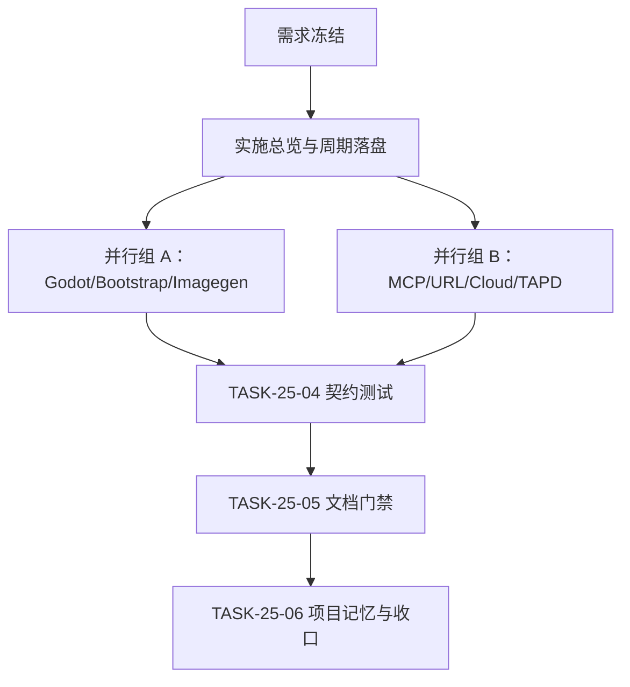
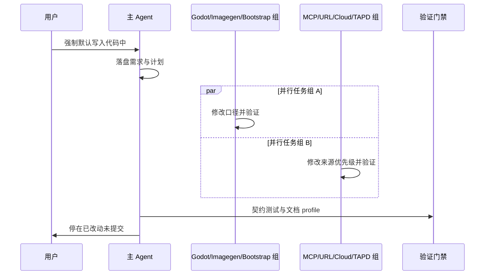
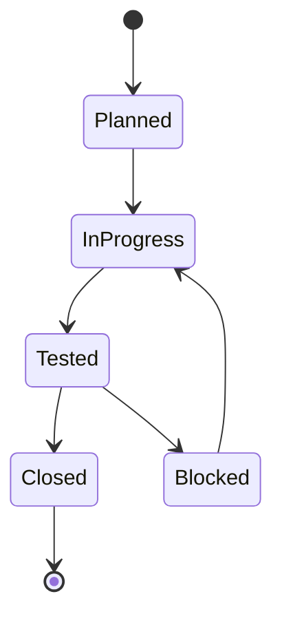

# 凭据默认代码持久化与来源优先级统一：实施总览

结论：本总览把多个 Skill 的旧凭据口径（"不得写入真实密钥""环境变量唯一来源""必须留空由用户填写"）统一为"项目代码/配置默认，环境变量仅作运行时覆盖，禁止过程性输出回显"；影响：godot、bootstrap、imagegen、mcp、认证 URL、browser cloud、tapd 等九个 Skill 的规则与配置来源说明；范围：九个 Skill 的 SKILL.md/references/scripts 与验证门禁；非范围：真实后端加载器、真实密钥、外部服务、test/prod 连接、Git 历史写入；变化：不再要求凭据来源必须经过环境变量，项目代码/配置成为默认持久化位置，环境变量只作为运行时覆盖方案；完成标准：九项验收条件全部可验证，五档文档 profile PASS；术语说明：凭据原值指真实 API key、token、密码、私钥、连接串；过程性输出指日志、错误信息、测试报告等；验证状态：计划已冻结，需求文档 PASS。

## 当前计划最终方案简要说明

推荐方案：把九个 Skill 的凭据口径统一为"项目代码/配置默认，环境变量仅作运行时覆盖，禁止过程性输出回显"，并新增跨 Skill 凭据政策契约测试。主落点：九个 Skill 的 SKILL.md/references/scripts 与 `test/credential-policy/credential_policy_contract_test.py`。原因：CYCLE-24 只完成"允许持久化"，未冻结"默认来源"，导致多个 Skill 仍保留环境变量唯一来源或"留空由用户填写"的旧口径，必须逐文件统一。

## Agent 对当前问题的理解

| 维度 | 结论 |
|---|---|
| 问题/目标 | CYCLE-24 已允许凭据持久化，但未明确项目代码/配置是默认来源，多个 Skill 仍保留旧口径 |
| 本轮范围 | godot、bootstrap、imagegen、mcp、认证 URL、browser cloud、tapd 等九个 Skill |
| 非范围 | 真实后端加载器、真实密钥、外部服务、test/prod 连接、Git 历史写入 |
| 当前优先闭环 | 先冻结需求与周期契约，再并行推进三路互斥写集，最后收口文档证据与项目记忆 |
| 关键假设/待确认点 | 无未决决策 |


- 问题 / 目标：CYCLE-24 已允许凭据持久化，但未明确"项目代码/配置是默认来源"，多个 Skill 仍保留旧口径。
- 本轮范围：godot-project-bootstrap-rules、project-rule-file-bootstrap-rules、imagegen、mcp-installation-rules、authenticated-url-routing-rules、browser-use-cloud-rules、tapd-addcomment、tapd-cli、tapd-openapi 的 SKILL.md/references/scripts。
- 非范围：真实后端加载器、真实密钥、外部服务、test/prod 连接、Git 历史写入。
- 当前优先闭环：先冻结需求与周期契约，再并行推进三路互斥写集，最后收口文档证据与项目记忆。
- 关键假设 / 待确认点：无未决决策；凭据允许持久化到代码/配置/普通维护文档和对应 Git 提交，禁止在过程性输出中回显原值。

## 跨会话独立执行与外部项目代码引用清单

| 项目 | 内容 |
|---|---|
| 新会话接手第一步 | 读取本实施总览与周期文档，核对工作树与基线 `ac6e5cc`，从第一个未完成 `TASK-25-*` 开始 |
| 主项目名称与项目根 | `luode-skills`，本机绝对路径 `F:/luode-skills` |
| 主项目仓库类型与代码基线 | Git 仓库，HEAD `ac6e5cc` |
| 计划源文件与版本 | 本实施总览、需求主文档、实施周期文档，v1.0 |
| 依赖安装、local 配置和服务启动入口 | Python 3 与仓库自带脚本，无外部服务 |
| 中断点核验顺序 | 先核对工作树 `git status`，确认九个 Skill 改动与计划一致，再核对契约测试，最后核对正式文档 |
| 外部项目代码引用 | `N/A + 原因`：只修改本仓库自身规则、测试与文档，不读取其他项目代码 |


- 新会话接手第一步：读取本实施总览与周期文档，核对工作树与基线 `ac6e5cc`，从第一个未完成 `TASK-25-*` 开始。
- 主项目名称与项目根：`luode-skills`，本机绝对路径 `F:/luode-skills`。
- 主项目仓库类型与代码基线：Git 仓库，HEAD `ac6e5cc`。
- 计划源文件与版本：本实施总览、需求主文档、实施周期文档，v1.0。
- 依赖安装、local 配置和服务启动入口：Python 3 与仓库自带脚本，无外部服务；所有命令使用 local 工作树。
- 中断点核验顺序：先核对工作树 `git status`，确认九个 Skill 改动与计划一致，再核对根 `test/credential-policy/` 测试入口，最后核对正式文档。
- 外部项目代码引用：`N/A + 原因`：本计划只修改 `F:/luode-skills` 自身规则、测试与文档，不读取、复制、对照、调用或修改其他项目代码 `+ 证据`：全部文件落点均为本仓库相对路径。

## 现状与落点

图片资产决策：`N/A + 原因`：本总览只涉及规则文本、目录树和文档，不存在界面或视觉产物 `+ 证据`：三张 Mermaid 图已表达周期、依赖与验证关系。

- 已核实目录：`godot-project-bootstrap-rules/`、`project-rule-file-bootstrap-rules/`、`imagegen/`、`mcp-installation-rules/`、`authenticated-url-routing-rules/`、`browser-use-cloud-rules/`、`tapd-addcomment/`、`tapd-cli/`、`tapd-openapi/`、`test/credential-policy/`、`doc/2-需求/`、`doc/3-实施/`、`doc/6-review/`。
- 已核实基线：HEAD `ac6e5cc`；工作树存在需求主文档与本文档，后续改动不覆盖 CYCLE-24 已确认的禁止原值规则对象。
- 关键符号：九个 Skill 的 SKILL.md 中旧凭据口径行、`bootstrap_agents.sh` 受管章节、`secret_policy`、`source_policy`、`credential-policy-contract.md`。

```text
godot-project-bootstrap-rules/
├── SKILL.md                                # 修改旧口径
project-rule-file-bootstrap-rules/
├── SKILL.md                                # 修改旧口径
├── scripts/
│   └── bootstrap_agents.sh                 # 修改生成源
imagegen/
├── SKILL.md                                # 修改旧口径
├── references/
│   └── local-entrypoints.md                # 修改来源优先级
├── scripts/
│   └── bootstrap_imagegen_env.py           # 修改来源优先级
mcp-installation-rules/
├── SKILL.md                                # 修改旧口径
├── references/
│   └── tapd-skills-install.md              # 修改来源优先级
authenticated-url-routing-rules/
├── SKILL.md                                # 修改旧口径
browser-use-cloud-rules/
├── SKILL.md                                # 修改旧口径
tapd-addcomment/
├── SKILL.md                                # 修改旧口径
tapd-cli/
├── SKILL.md                                # 修改旧口径
tapd-openapi/
├── SKILL.md                                # 修改旧口径
test/credential-policy/
├── credential_policy_contract_test.py      # 新增跨 Skill 凭据政策契约测试
doc/
├── 2-需求/REQ-PSR-CONFIG-SECRET-003.md     # 需求主文档
├── 3-实施/IMP-PSR-CONFIG-SECRET-003.md     # 实施总览
├── 3-实施/CYCLE-PSR-CONFIG-SECRET-003.md   # 实施周期文档
├── 5-tests/README.md                       # 测试 README
└── 6-review/6-review.md                    # 6-review 记录
```

## 实施周期总览

- 总周期说明：本计划为一个实施周期，覆盖九个 Skill 的凭据口径统一与契约测试。
- 本次计划拆分的子任务周期数：1。
- 周期拆分原则：按写集互斥拆分并行任务组，避免跨 Skill 冲突。
- 周期排序说明：第一期。
- 周期 1：
  - 周期序号 / 期次定位：`CYCLE-25` / 第一期。
  - 周期目标：九个 Skill 的 SKILL.md/references/scripts 统一为"项目代码/配置默认，环境变量仅作运行时覆盖，禁止过程性输出回显"，并新增契约测试。
  - 本周期包含的最小任务：`TASK-25-01` 需求与计划固化；`TASK-25-02A/B/C` Godot/Imagegen/Bootstrap 口径；`TASK-25-03A/B/C/D` MCP/URL/Cloud/TAPD 来源优先级；`TASK-25-04` 契约测试；`TASK-25-05` 文档证据与门禁；`TASK-25-06` 项目记忆与最终收口。
  - 周期内最小任务执行顺序：`TASK-25-01 -> TASK-25-02A/B/C（并行） -> TASK-25-03A/B/C/D（并行） -> TASK-25-04 -> TASK-25-05 -> TASK-25-06`。
  - 进入条件：需求文档 PASS，实施总览与周期文档落盘。
  - 收口条件：九项验收条件全部可验证，五档文档 profile PASS，根回归与契约测试通过。
  - 完成标志：九个 Skill 的 SKILL.md 中无旧口径，来源优先级统一，禁止过程性输出回显保留。
  - 与前后周期衔接：CYCLE-24 已完成"允许持久化"，本周期追加"默认来源"；后续不进入具体业务项目运行时改造。

## 真实测试安排

| 项目 | 内容 |
|---|---|
| 真实测试是否默认必需 | 是 |
| 覆盖最小任务 | `TASK-25-04` 契约测试、`TASK-25-05` 文档 profile、`TASK-25-06` 根回归 |
| 公共测试环境/依赖 | Python 3、`validate_engineering_docs.py`、local 工作树 |
| 公共样本/数据来源 | 九个 Skill 的 SKILL.md 与 references/scripts |
| 总体通过标准 | 九项验收条件全部可验证，五档文档 profile PASS，根回归与契约测试通过 |

## 阶段计划

- 阶段 1：计划与需求固化。
  - 阶段目标：落盘需求主文档、实施总览、实施周期文档并通过 profile。
  - 只做这一件事：冻结凭据口径变更契约。
  - 输入条件：用户确认"强制默认写入代码中"。
  - 输出产物：需求主文档、实施总览、实施周期文档。
  - 验证门槛：requirement/implementation_overview/implementation_cycle 三档 profile PASS。
- 阶段 2：九文件并行修改。
  - 阶段目标：九个 Skill 的 SKILL.md/references/scripts 统一为"项目代码/配置默认，环境变量仅作运行时覆盖，禁止过程性输出回显"。
  - 只做这一件事：修改九个 Skill 的旧凭据口径。
  - 输入条件：需求与周期文档 PASS。
  - 输出产物：九个 Skill 的 SKILL.md/references/scripts 改动。
  - 验证门槛：逐文件 grep 合规检查，无旧口径残留。
- 阶段 3：契约测试与文档证据。
  - 阶段目标：新增跨 Skill 凭据政策契约测试，运行五档文档 profile。
  - 只做这一件事：验证门禁与文档证据。
  - 输入条件：九文件修改完成。
  - 输出产物：`test/credential-policy/credential_policy_contract_test.py`、测试 README、6-review 记录。
  - 验证门槛：契约测试通过、五档文档 profile PASS。
- 阶段 4：项目记忆与最终收口。
  - 阶段目标：同步项目四件套，运行根回归与 Skill 合规门禁。
  - 只做这一件事：收口与记忆同步。
  - 输入条件：所有契约测试与文档 profile PASS。
  - 输出产物：`PROJECT_CURRENT.md`、`PROJECT_MEMORY.md`、`PROJECT_HISTORY.md` 同步。
  - 验证门槛：根回归与 Skill 合规 PASS，`git diff --check` 无错误。

## 图形化执行路径

图片资产决策：`N/A + 原因`：本总览只涉及规则文本、目录树和文档，不存在界面或视觉产物 `+ 证据`：下方流程图与时序图已表达周期、依赖与验证关系。

### 流程图

图形目的：说明需求冻结、并行任务组、验证门禁和最终收口的顺序。关联 ID：`REQ-PSR-CONFIG-SECRET-003`、`CYCLE-25`、`TASK-25-01..06`。



### 时序图

图形目的：说明用户确认、需求落盘、并行任务组、验证门禁和最终收口的时序。关联 ID：`REQ-PSR-CONFIG-SECRET-003`、`CYCLE-25`、`TASK-25-01..06`。



### 状态图

图形目的：说明任务状态流转与收口门禁。关联 ID：`CYCLE-25`、`TASK-25-01..06`。



## 最小任务清单

- 最小任务 1：
  - 任务名：`TASK-25-01` 需求与计划固化。
  - 所属周期：`CYCLE-25`。
  - 周期内顺序：1。
  - 所属阶段：阶段 1。
  - 本任务只做这一件事：落盘需求主文档、实施总览、实施周期文档并通过 profile。
  - 垂直切片目标：冻结凭据口径变更契约。
  - 输入条件：用户确认"强制默认写入代码中"。
  - 实现产出：需求主文档、实施总览、实施周期文档。
  - 真实测试是否必需：是（文档 profile）。
  - 真实测试入口：`validate_engineering_docs.py --profile requirement/implementation_overview/implementation_cycle`。
  - 真实测试依赖环境：Python 3、local 工作树。
  - 真实测试样本 / 数据来源：需求主文档、实施总览、实施周期文档。
  - 真实测试通过标准：三档 profile PASS。
  - 测试点：文档结构、稳定 ID、Mermaid、追踪矩阵。
  - `6-review` 风格回归点：章节、ID 和中文表达。
  - 任务完成条件：三档 profile PASS。
  - 任务停止 / 结束条件：任一 profile 失败即停止并回滚。
  - 阻断条件：文档结构不合格或需求未确认。
  - 前置依赖：用户确认。
  - 下一任务依赖：`TASK-25-02A/B/C`。
  - 预计触达文件数：3。
- 最小任务 2：
  - 任务名：`TASK-25-02A` Godot 口径。
  - 所属周期：`CYCLE-25`。
  - 周期内顺序：2。
  - 所属阶段：阶段 2。
  - 本任务只做这一件事：修改 `godot-project-bootstrap-rules/SKILL.md` 旧口径。
  - 垂直切片目标：Godot 规则允许明文写真实凭据，禁止过程性输出回显。
  - 输入条件：需求与周期文档 PASS。
  - 实现产出：`godot-project-bootstrap-rules/SKILL.md` 一行修改。
  - 真实测试是否必需：否（纯规则文本改动，靠 grep 合规检查验证）。
  - 真实测试入口：`grep -n "不得明文\|真实凭据\|明文写真实" godot-project-bootstrap-rules/SKILL.md`。
  - 真实测试依赖环境：无。
  - 真实测试样本 / 数据来源：SKILL.md。
  - 真实测试通过标准：无旧口径残留，新口径存在。
  - 测试点：规则文本。
  - `6-review` 风格回归点：中文表达、UTF-8。
  - 任务完成条件：无旧口径残留。
  - 任务停止 / 结束条件：grep 发现旧口径即停止。
  - 阻断条件：文件不存在或内容与预期不一致。
  - 前置依赖：`TASK-25-01`。
  - 下一任务依赖：`TASK-25-04`。
  - 预计触达文件数：1。
- 最小任务 3：
  - 任务名：`TASK-25-02B` Bootstrap 口径。
  - 所属周期：`CYCLE-25`。
  - 周期内顺序：3。
  - 所属阶段：阶段 2。
  - 本任务只做这一件事：修改 `project-rule-file-bootstrap-rules/SKILL.md` 与 `scripts/bootstrap_agents.sh` 旧口径。
  - 垂直切片目标：Bootstrap 生成源允许写入真实凭据。
  - 输入条件：需求与周期文档 PASS。
  - 实现产出：`project-rule-file-bootstrap-rules/SKILL.md` 与 `scripts/bootstrap_agents.sh` 修改。
  - 真实测试是否必需：是（`bootstrap_agents_test.py`）。
  - 真实测试入口：`py.exe -3 -X utf8 -B test/project-rule-file-bootstrap-rules/bootstrap_agents_test.py`。
  - 真实测试依赖环境：Python 3、local 工作树。
  - 真实测试样本 / 数据来源：bootstrap 脚本。
  - 真实测试通过标准：测试通过。
  - 测试点：生成源不允许旧口径。
  - `6-review` 风格回归点：脚本命名、UTF-8。
  - 任务完成条件：测试通过。
  - 任务停止 / 结束条件：任一断言失败即停止。
  - 阻断条件：脚本不存在或测试失败。
  - 前置依赖：`TASK-25-01`。
  - 下一任务依赖：`TASK-25-04`。
  - 预计触达文件数：2。
- 最小任务 4：
  - 任务名：`TASK-25-02C` Imagegen 口径。
  - 所属周期：`CYCLE-25`。
  - 周期内顺序：4。
  - 所属阶段：阶段 2。
  - 本任务只做这一件事：修改 `imagegen/SKILL.md`、`references/local-entrypoints.md`、`scripts/bootstrap_imagegen_env.py` 旧口径。
  - 垂直切片目标：imagegen 配置允许持久化凭据，项目配置优先于环境变量。
  - 输入条件：需求与周期文档 PASS。
  - 实现产出：`imagegen/SKILL.md`、`references/local-entrypoints.md`、`scripts/bootstrap_imagegen_env.py` 修改。
  - 真实测试是否必需：是（dry-run/check）。
  - 真实测试入口：`py.exe -3 -X utf8 -B imagegen/scripts/bootstrap_imagegen_env.py --check`。
  - 真实测试依赖环境：Python 3、local 工作树。
  - 真实测试样本 / 数据来源：imagegen 脚本。
  - 真实测试通过标准：dry-run 通过，不读取真实 key。
  - 测试点：来源优先级、环境变量覆盖边界。
  - `6-review` 风格回归点：脚本命名、UTF-8。
  - 任务完成条件：dry-run 通过。
  - 任务停止 / 结束条件：失败即停止。
  - 阻断条件：脚本不存在或失败。
  - 前置依赖：`TASK-25-01`。
  - 下一任务依赖：`TASK-25-04`。
  - 预计触达文件数：3。
- 最小任务 5：
  - 任务名：`TASK-25-03A` MCP 口径。
  - 所属周期：`CYCLE-25`。
  - 周期内顺序：5。
  - 所属阶段：阶段 2。
  - 本任务只做这一件事：修改 `mcp-installation-rules/SKILL.md` 与 `references/tapd-skills-install.md` 旧口径。
  - 垂直切片目标：TAPD_TOKEN 改为项目配置默认，环境变量运行时可覆盖。
  - 输入条件：需求与周期文档 PASS。
  - 实现产出：`mcp-installation-rules/SKILL.md` 与 `references/tapd-skills-install.md` 修改。
  - 真实测试是否必需：否（纯规则文本改动，靠 grep 合规检查验证）。
  - 真实测试入口：`grep -n "必须留空\|TAPD_TOKEN\|环境变量" mcp-installation-rules/SKILL.md`。
  - 真实测试依赖环境：无。
  - 真实测试样本 / 数据来源：SKILL.md。
  - 真实测试通过标准：无旧口径残留，新口径存在。
  - 测试点：规则文本。
  - `6-review` 风格回归点：中文表达、UTF-8。
  - 任务完成条件：无旧口径残留。
  - 任务停止 / 结束条件：grep 发现旧口径即停止。
  - 阻断条件：文件不存在或内容与预期不一致。
  - 前置依赖：`TASK-25-01`。
  - 下一任务依赖：`TASK-25-04`。
  - 预计触达文件数：2。
- 最小任务 6：
  - 任务名：`TASK-25-03B` 认证 URL 口径。
  - 所属周期：`CYCLE-25`。
  - 周期内顺序：6。
  - 所属阶段：阶段 2。
  - 本任务只做这一件事：修改 `authenticated-url-routing-rules/SKILL.md` 旧口径。
  - 垂直切片目标：Cloud 凭据默认可从项目配置读取，环境变量仅作运行时覆盖。
  - 输入条件：需求与周期文档 PASS。
  - 实现产出：`authenticated-url-routing-rules/SKILL.md` 修改。
  - 真实测试是否必需：否（纯规则文本改动，靠 grep 合规检查验证）。
  - 真实测试入口：`grep -n "只从本机环境变量\|BROWSER_USE_API_KEY" authenticated-url-routing-rules/SKILL.md`。
  - 真实测试依赖环境：无。
  - 真实测试样本 / 数据来源：SKILL.md。
  - 真实测试通过标准：无旧口径残留，新口径存在。
  - 测试点：规则文本。
  - `6-review` 风格回归点：中文表达、UTF-8。
  - 任务完成条件：无旧口径残留。
  - 任务停止 / 结束条件：grep 发现旧口径即停止。
  - 阻断条件：文件不存在或内容与预期不一致。
  - 前置依赖：`TASK-25-01`。
  - 下一任务依赖：`TASK-25-04`。
  - 预计触达文件数：1。
- 最小任务 7：
  - 任务名：`TASK-25-03C` Browser Cloud 口径。
  - 所属周期：`CYCLE-25`。
  - 周期内顺序：7。
  - 所属阶段：阶段 2。
  - 本任务只做这一件事：修改 `browser-use-cloud-rules/SKILL.md` 旧口径。
  - 垂直切片目标：Cloud 凭据默认可从项目配置读取，环境变量仅作运行时覆盖。
  - 输入条件：需求与周期文档 PASS。
  - 实现产出：`browser-use-cloud-rules/SKILL.md` 修改。
  - 真实测试是否必需：否（纯规则文本改动，靠 grep 合规检查验证）。
  - 真实测试入口：`grep -n "只报告存在或缺失\|BROWSER_USE_API_KEY" browser-use-cloud-rules/SKILL.md`。
  - 真实测试依赖环境：无。
  - 真实测试样本 / 数据来源：SKILL.md。
  - 真实测试通过标准：无旧口径残留，新口径存在。
  - 测试点：规则文本。
  - `6-review` 风格回归点：中文表达、UTF-8。
  - 任务完成条件：无旧口径残留。
  - 任务停止 / 结束条件：grep 发现旧口径即停止。
  - 阻断条件：文件不存在或内容与预期不一致。
  - 前置依赖：`TASK-25-01`。
  - 下一任务依赖：`TASK-25-04`。
  - 预计触达文件数：1。
- 最小任务 8：
  - 任务名：`TASK-25-03D` TAPD 口径。
  - 所属周期：`CYCLE-25`。
  - 周期内顺序：8。
  - 所属阶段：阶段 2。
  - 本任务只做这一件事：修改 `tapd-addcomment/SKILL.md`、`tapd-cli/SKILL.md`、`tapd-openapi/SKILL.md` 旧口径。
  - 垂直切片目标：TAPD 凭据默认可从项目配置读取，环境变量仅作运行时覆盖。
  - 输入条件：需求与周期文档 PASS。
  - 实现产出：三个 TAPD SKILL.md 修改。
  - 真实测试是否必需：否（纯规则文本改动，靠 grep 合规检查验证）。
  - 真实测试入口：`grep -n "环境变量\|TAPD_TOKEN\|凭据" tapd-*/SKILL.md`。
  - 真实测试依赖环境：无。
  - 真实测试样本 / 数据来源：SKILL.md。
  - 真实测试通过标准：无旧口径残留，新口径存在。
  - 测试点：规则文本。
  - `6-review` 风格回归点：中文表达、UTF-8。
  - 任务完成条件：无旧口径残留。
  - 任务停止 / 结束条件：grep 发现旧口径即停止。
  - 阻断条件：文件不存在或内容与预期不一致。
  - 前置依赖：`TASK-25-01`。
  - 下一任务依赖：`TASK-25-04`。
  - 预计触达文件数：3。
- 最小任务 9：
  - 任务名：`TASK-25-04` 契约测试。
  - 所属周期：`CYCLE-25`。
  - 周期内顺序：9。
  - 所属阶段：阶段 3。
  - 本任务只做这一件事：新增跨 Skill 凭据政策契约测试。
  - 垂直切片目标：把九个 Skill 的凭据口径冻结为可执行契约。
  - 输入条件：九文件修改完成。
  - 实现产出：`test/credential-policy/credential_policy_contract_test.py`。
  - 真实测试是否必需：是。
  - 真实测试入口：`py.exe -3 -X utf8 -B test/credential-policy/credential_policy_contract_test.py`。
  - 真实测试依赖环境：Python 3、local 工作树。
  - 真实测试样本 / 数据来源：九个 Skill 的 SKILL.md。
  - 真实测试通过标准：全部断言通过。
  - 测试点：无旧口径残留、来源优先级、禁止回显保留。
  - `6-review` 风格回归点：测试命名、隔离、UTF-8。
  - 任务完成条件：全部断言通过。
  - 任务停止 / 结束条件：任一断言失败即停止。
  - 阻断条件：测试无法运行。
  - 前置依赖：`TASK-25-02A/B/C`、`TASK-25-03A/B/C/D`。
  - 下一任务依赖：`TASK-25-05`。
  - 预计触达文件数：1。
- 最小任务 10：
  - 任务名：`TASK-25-05` 文档证据与门禁。
  - 所属周期：`CYCLE-25`。
  - 周期内顺序：10。
  - 所属阶段：阶段 3。
  - 本任务只做这一件事：回填测试 README 与 6-review，运行五档文档 profile。
  - 垂直切片目标：把本轮改动固化为可追溯的文档证据。
  - 输入条件：契约测试通过。
  - 实现产出：`doc/5-tests/README.md`、`doc/6-review/6-review.md`。
  - 真实测试是否必需：是（文档 profile）。
  - 真实测试入口：`validate_engineering_docs.py --profile test/style_regression`。
  - 真实测试依赖环境：Python 3、local 工作树。
  - 真实测试样本 / 数据来源：本轮改动。
  - 真实测试通过标准：五档 profile PASS。
  - 测试点：文档结构、追踪矩阵。
  - `6-review` 风格回归点：章节、ID 和中文表达。
  - 任务完成条件：五档 profile PASS。
  - 任务停止 / 结束条件：任一 profile 失败即停止。
  - 阻断条件：文档结构不合格。
  - 前置依赖：`TASK-25-04`。
  - 下一任务依赖：`TASK-25-06`。
  - 预计触达文件数：2。
- 最小任务 11：
  - 任务名：`TASK-25-06` 项目记忆与最终收口。
  - 所属周期：`CYCLE-25`。
  - 周期内顺序：11。
  - 所属阶段：阶段 4。
  - 本任务只做这一件事：同步项目四件套，运行根回归与 Skill 合规门禁。
  - 垂直切片目标：让本轮改动可恢复、可追踪。
  - 输入条件：所有契约测试与文档 profile PASS。
  - 实现产出：`PROJECT_CURRENT.md`、`PROJECT_MEMORY.md`、`PROJECT_HISTORY.md` 同步。
  - 真实测试是否必需：是（根回归）。
  - 真实测试入口：`py.exe -3 -X utf8 -B test/run_python_tests.py`。
  - 真实测试依赖环境：Python 3、local 工作树。
  - 真实测试样本 / 数据来源：全量测试。
  - 真实测试通过标准：根回归通过或失败集合不扩大。
  - 测试点：全量回归、Skill 合规、`git diff --check`。
  - `6-review` 风格回归点：中文表达、UTF-8。
  - 任务完成条件：根回归通过或失败集合不扩大，Skill 合规 PASS。
  - 任务停止 / 结束条件：任一新增失败即停止。
  - 阻断条件：全量测试失败集合扩大。
  - 前置依赖：`TASK-25-05`。
  - 下一任务依赖：无。
  - 预计触达文件数：3。

## 方案选择

- 方案 A：逐文件修改九个 Skill 的旧口径，保留 CYCLE-24 已确认的禁止原值规则对象。
- 方案 B：新增一条补充规则覆盖所有 Skill，不逐文件修改。
- 推荐方案与原因：方案 A。用户明确要求"扫描所有已有真实凭据、密钥、私钥相关禁止规则并修改旧口径"，逐文件修改才能消除旧口径残留，新增补充规则无法覆盖既有 Skill 的旧表述。

## 实施步骤

1. 第一步：
   - 所属周期：`CYCLE-25`。
   - 所属阶段：阶段 1。
   - 对应最小任务：`TASK-25-01`。
   - 本步只做：落盘需求主文档、实施总览、实施周期文档并通过 profile。
2. 第二步：
   - 所属周期：`CYCLE-25`。
   - 所属阶段：阶段 2。
   - 对应最小任务：`TASK-25-02A/B/C`。
   - 本步只做：并行修改 Godot/Bootstrap/Imagegen 三个 Skill 的旧口径。
3. 第三步：
   - 所属周期：`CYCLE-25`。
   - 所属阶段：阶段 2。
   - 对应最小任务：`TASK-25-03A/B/C/D`。
   - 本步只做：并行修改 MCP/URL/Cloud/TAPD 四个 Skill 的旧口径。
4. 第四步：
   - 所属周期：`CYCLE-25`。
   - 所属阶段：阶段 3。
   - 对应最小任务：`TASK-25-04`。
   - 本步只做：新增跨 Skill 凭据政策契约测试。
5. 第五步：
   - 所属周期：`CYCLE-25`。
   - 所属阶段：阶段 3。
   - 对应最小任务：`TASK-25-05`。
   - 本步只做：回填测试 README 与 6-review，运行五档文档 profile。
6. 第六步：
   - 所属周期：`CYCLE-25`。
   - 所属阶段：阶段 4。
   - 对应最小任务：`TASK-25-06`。
   - 本步只做：同步项目四件套，运行根回归与 Skill 合规门禁。

## 风险与阻断项

- 风险：九个 Skill 改动可能影响既有规则行为；通过逐文件回读和 grep 合规检查验证。
- 依赖：需求主文档、实施总览、实施周期文档、契约测试、文档 profile 校验器。
- 任务停止 / 结束条件总表：任一任务失败即停止并回滚；所有任务完成且五档 profile PASS 才收口。
- 最大推进边界：CYCLE-25 收口后停止，不进入具体业务项目运行时改造，不执行 Git 历史写入。

## 文件/符号操作总表

| 任务 | 文件路径 | 操作 | 符号/区段 | 修改前职责 | 修改后职责 | 兼容要求 |
|---|---|---|---|---|---|---|
| `TASK-25-02A` | `godot-project-bootstrap-rules/SKILL.md` | 修改 | 第 47 行"不得明文写真实" | 禁止明文写真实凭据 | 允许明文写真实凭据，禁止过程性输出回显 | 向后兼容 |
| `TASK-25-02B` | `project-rule-file-bootstrap-rules/SKILL.md` | 修改 | 第 51 行"不得写入真实密钥" | 禁止写入真实密钥 | 允许写入真实密钥，禁止过程性输出回显 | 向后兼容 |
| `TASK-25-02C` | `imagegen/SKILL.md` | 修改 | 第 72 行"案例中禁止写入 API key" | 禁止写入 API key | 允许写入 API key，禁止过程性输出回显 | 向后兼容 |
| `TASK-25-03A` | `mcp-installation-rules/SKILL.md` | 修改 | 第 78 行"必须留空由用户自行填写" | 要求留空 | 项目代码/配置默认，运行时可适配到 env | 向后兼容 |
| `TASK-25-03B` | `authenticated-url-routing-rules/SKILL.md` | 修改 | 第 115 行"只从本机环境变量读取" | 环境变量唯一来源 | 项目代码/配置默认，环境变量作运行时覆盖 | 向后兼容 |
| `TASK-25-03C` | `browser-use-cloud-rules/SKILL.md` | 修改 | 第 19 行"只报告存在或缺失" | 只从环境变量读取 | 项目代码/配置默认，环境变量作运行时覆盖 | 向后兼容 |
| `TASK-25-03D` | `tapd-*/SKILL.md` | 修改 | 环境变量默认表述 | 环境变量唯一来源 | 项目代码/配置默认，环境变量作运行时覆盖 | 向后兼容 |
| `TASK-25-04` | `test/credential-policy/credential_policy_contract_test.py` | 新增 | 全部 | — | 跨 Skill 凭据政策契约测试 | 新增文件 |

## 自审结论

- 风险：九个 Skill 改动可能影响既有规则行为；通过逐文件回读和 grep 合规检查验证。
- 依赖：需求主文档、实施总览、实施周期文档、契约测试、文档 profile 校验器。
- 任务停止 / 结束条件总表：任一任务失败即停止并回滚；所有任务完成且五档 profile PASS 才收口。

## 自审结论

- 覆盖度检查：九个 Skill 全部覆盖。
- 实施周期检查：一个周期，任务顺序明确。
- 最小任务闭环检查：每个任务有实现、测试、6-review。
- 阶段单一目标检查：每个阶段只有一个目标。
- 占位词检查：无占位词。
- 可执行性检查：命令与断言明确。
- 图文一致性检查：Mermaid 与任务顺序一致。
- 用户确认状态：无未决决策。

## 执行附录

- local 环境、周期内执行步骤、命令、样本、预期失败、清理和回滚：见 `CYCLE-PSR-CONFIG-SECRET-003` 实施周期文档。
- 目录树、文件和符号定位、SQL、接口报文及测试记录：见本总览"现状与落点"。

## 追踪附录

- `SRC -> DEC -> REQ/RULE -> AC -> CYCLE -> TASK -> TEST -> EVIDENCE` 双向追踪：见需求主文档"追踪矩阵"。
- 来源、稳定标识、实施计划完成条件、`TEST`/`STYLE` 证据定位及图片资产清单：见需求主文档"追踪矩阵"。
