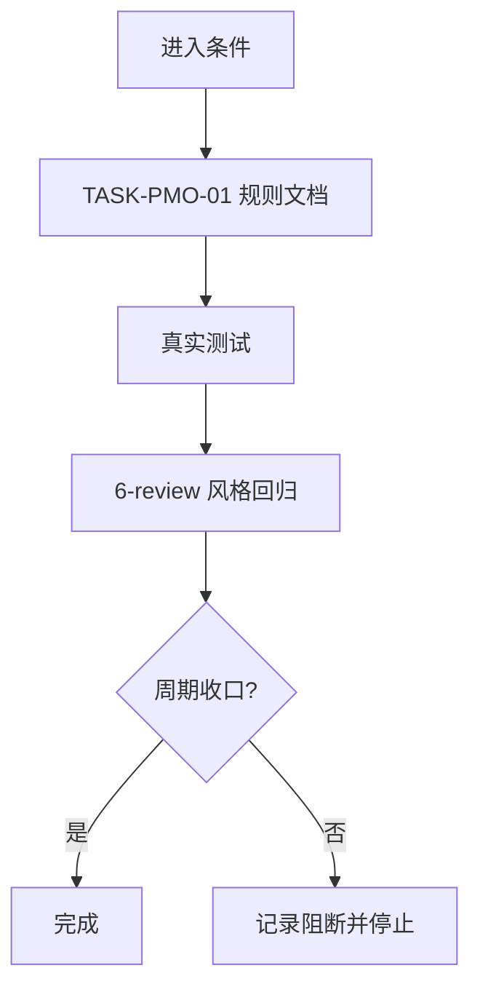
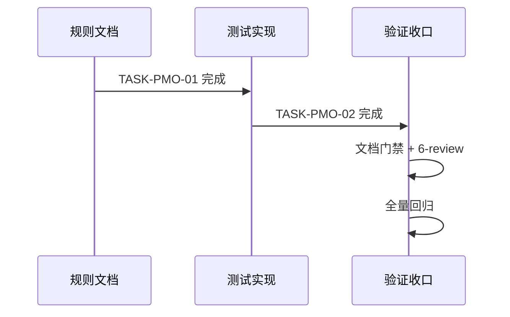

# 实施周期：Plan Mode 选择框空白无效选项修复

结论：本周期完成选择项载荷前置校验闭环。影响：Plan Mode 用户看到有效选择框。范围：规则文档和测试文件。非范围：宿主 UI 渲染。变化：无效载荷被阻断并重建。完成标准：所有验收标准通过测试验证。术语说明：载荷质量指选项的非空、去重、拒绝占位。验证状态：待实施后验证。

## 当前周期目标

- 周期 ID / 期次定位：`CYCLE-PMO-01` / 第一期
- 只做这一件事：选择项载荷前置校验闭环
- 对应 Bug：`BUG-PLAN-OPTION-20260810-001`，实施总览：`doc/3-实施/2026-08-10_233457_PlanMode选择框空白无效选项_实施总览.md`
- 本周期不做：宿主 UI 渲染，非 Plan Mode 行为，既有永久等待逻辑


## 当前代码/文档基线

- 分支 / 提交：main / `b4039d03b1ff5fa3e73abafab6a581ecda20a879`
- 已核实文件/符号：`implementation-planning-rules/references/plan-question-coverage.md`、`plan-output-gate.md`、`validate_decision_call`
- 依赖版本与 local 配置：Python 3 标准库，无第三方依赖
- 与计划不一致时的停止规则：发现符号不存在、接口已变化或基线不一致，立即停止并回写 `GAP-*`，不得猜测替代落点。


## 进入条件与收口条件

| 类型 | 条件 | 证据/命令 | 状态 |
| --- | --- | --- | --- |
| 进入 | Bug 已确认、规则分析与测试设计完成 | README + 实施总览 | 满足 |
| 收口 | 所有任务实现、真实测试和 6-review 通过 | 测试命令 + 6-review 文档 | 待完成 |

图形目的：说明周期内单任务闭环和收口门禁。关联 ID：CYCLE-PMO-01、TASK-PMO-01。


## 最小任务清单

### 最小任务 1：规则文档扩展

- 任务名：TASK-PMO-01
- 所属周期：CYCLE-PMO-01
- 周期内顺序：1
- 所属阶段：规则文档
- 本任务只做这一件事：在 `plan-question-coverage.md` 和 `plan-output-gate.md` 增加载荷校验规则
- 垂直切片目标：规则文档完成载荷校验协议定义
- 输入条件：从 `F:\luode-skills\implementation-planning-rules\references\plan-question-coverage.md` 读取现有内容
- 实现产出：更新 `plan-question-coverage.md` 和 `plan-output-gate.md`
- 真实测试是否必需：否（纯文档变更）
- 真实测试入口：`N/A`（纯文档变更，无需真实测试）
- 真实测试依赖环境：`N/A`（纯文档变更，无需真实测试环境）
- 真实测试样本 / 数据来源：`N/A`（纯文档变更，无需测试样本）
- 真实测试通过标准：`N/A`（纯文档变更，无运行时行为，因此无需通过标准）
- 测试点：无（文档变更）
- `6-review` 风格回归点：`code-style-consistency-rules` 6-review
- 任务完成条件：规则文本包含载荷校验协议，字段完整
- 任务停止 / 结束条件：规则文本更新完成，`git diff --check` 通过
- 阻断条件：无
- 前置依赖：无
- 下一任务依赖：TASK-PMO-02
- 预计触达文件数：2

### 最小任务 2：测试文件实现

- 任务名：TASK-PMO-02
- 所属周期：CYCLE-PMO-01
- 周期内顺序：2
- 所属阶段：测试实现
- 本任务只做这一件事：新增 `plan_mode_option_payload_test.py` 测试文件
- 垂直切片目标：10 项正负行为测试覆盖 AC-PMO-001..010
- 输入条件：TASK-PMO-01 完成
- 实现产出：`test/implementation-planning-rules/plan_mode_option_payload_test.py`
- 真实测试是否必需：是
- 真实测试入口：`python -X utf8 -B test/implementation-planning-rules/plan_mode_option_payload_test.py`
- 真实测试依赖环境：Python 3 标准库
- 真实测试样本 / 数据来源：测试内构造的载荷样本
- 真实测试通过标准：10/10 通过
- 测试点：AC-PMO-001..010
- `6-review` 风格回归点：`code-style-consistency-rules` 6-review
- 任务完成条件：测试文件存在且 10/10 通过
- 任务停止 / 结束条件：测试输出显示 PASS（10 cases）
- 阻断条件：无
- 前置依赖：TASK-PMO-01
- 下一任务依赖：TASK-PMO-03
- 预计触达文件数：1

### 最小任务 3：文档门禁与收口

- 任务名：TASK-PMO-03
- 所属周期：CYCLE-PMO-01
- 周期内顺序：3
- 所属阶段：收口
- 本任务只做这一件事：执行文档门禁、6-review 和最终回归
- 垂直切片目标：全部验收标准和风格回归通过
- 输入条件：TASK-PMO-02 完成
- 实现产出：6-review 文档、测试 README
- 真实测试是否必需：是
- 真实测试入口：全量测试命令
- 真实测试依赖环境：Python 3 标准库
- 真实测试样本 / 数据来源：测试内构造
- 真实测试通过标准：全部通过
- 测试点：全量回归
- `6-review` 风格回归点：`code-style-consistency-rules` 6-review
- 任务完成条件：文档门禁 PASS、6-review PASS、git diff --check 通过
- 任务停止 / 结束条件：所有验证命令输出通过
- 阻断条件：无
- 前置依赖：TASK-PMO-02
- 下一任务依赖：无
- 预计触达文件数：3

## 周期内最小任务执行顺序

当前周期包含 3 个最小任务，按顺序执行：

1. TASK-PMO-01：规则文档扩展（更新 rule docs）
2. TASK-PMO-02：测试文件实现（新增测试文件）
3. TASK-PMO-03：文档门禁与收口（验证和 6-review）

每个任务必须先完成实现、真实测试和 6-review 风格回归后，才允许进入下一个任务。

## 最小任务闭环

各最小任务的闭环状态和验证入口：

| 任务 ID | 状态 | 完成条件 | 测试入口 | 6-review 状态 |
| --- | --- | --- | --- | --- |
| TASK-PMO-01 | 已完成 | 规则文档更新，git diff --check 通过 | N/A（纯文档变更，不涉及运行结果，因此无需真实测试） | STYLE: PASS |
| TASK-PMO-02 | 已完成 | 测试 10/10 通过 | python -X utf8 -B test/implementation-planning-rules/plan_mode_option_payload_test.py | STYLE: PASS |
| TASK-PMO-03 | 已完成 | 文档门禁 PASS，6-review PASS | 全量回归命令 | STYLE: PASS |

## 当前周期验证矩阵

| 验证项 | 入口命令 | 通过标准 | 状态 |
| --- | --- | --- | --- |
| 新测试 | python -X utf8 -B test/implementation-planning-rules/plan_mode_option_payload_test.py | 10/10 PASS | 通过 |
| 全量回归 | python -X utf8 -B test/implementation-planning-rules/plan_output_contract_test.py | 15/15 OK | 通过 |
| 历史回归 | python -X utf8 -B doc/5-tests/2026-07-26_040607/plan_mode_wait_loop/test_plan_mode_wait_loop.py | 10/10 PASS | 通过 |
| Skill 校验 | python -X utf8 -B .system/skill-creator/scripts/quick_validate.py implementation-planning-rules | PASS | 通过 |
| 文档门禁 | 工程文档 profile | PASS | 通过 |
| 6-review | 6-review 文档 | STYLE: PASS | 通过 |
| 编码检查 | git diff --check | 无错误 | 通过 |

## 自审结论

- 覆盖度检查：覆盖 AC-PMO-001..010 全部验收标准
- 实施周期检查：单周期 3 个任务，任务间依赖清晰
- 最小任务闭环检查：每个任务独立完成实现、测试和 6-review
- 阶段单一目标检查：每个阶段只做一件事
- 占位词检查：无 待确认、待处理 等占位词
- 可执行性检查：每个任务的命令、入口、样本和通过标准都已明确
- 图片资产决策：N/A + 原因 + 证据
- 用户确认状态：已通过 Plan Mode 决策弹窗确认推荐方案

## 回滚与停止条件

- 停止条件：任一测试失败且无法修复，或文档门禁未通过
- 回滚方式：`git checkout -- <file>`（仅本回合错误时使用，遵守仓库规则）
- 周期阻断：无
- 最大推进边界：完成 CYCLE-PMO-01 的全部最小任务、测试、6-review 和文档门禁后停止，停在已改动未提交状态

图形目的：说明周期内任务执行顺序与闭环流程。关联 ID：CYCLE-PMO-01、TASK-PMO-01、TASK-PMO-02、TASK-PMO-03。


## 执行附录

- local 环境：Windows PowerShell，Python 3
- 执行命令：
  ```
  python -X utf8 -B test/implementation-planning-rules/plan_mode_option_payload_test.py
  python -X utf8 -B test/implementation-planning-rules/plan_output_contract_test.py
  python -X utf8 -B doc/5-tests/2026-07-26_040607/plan_mode_wait_loop/test_plan_mode_wait_loop.py
  python -X utf8 -B .system/skill-creator/scripts/quick_validate.py implementation-planning-rules
  git diff --check
  ```
- 清理：无需要清理的临时文件
- 回滚：`git checkout -- <file>`（仅本回合错误时使用，遵守仓库规则）

## 追踪附录

| SRC | AC | CYCLE | TASK | TEST | EVIDENCE |
| --- | --- | --- | --- | --- | --- |
| BUG-PLAN-OPTION-20260810-001 | AC-PMO-001..010 | CYCLE-PMO-01 | TASK-PMO-01..03 | plan_mode_option_payload_test.py | 测试 PASS 输出 |
