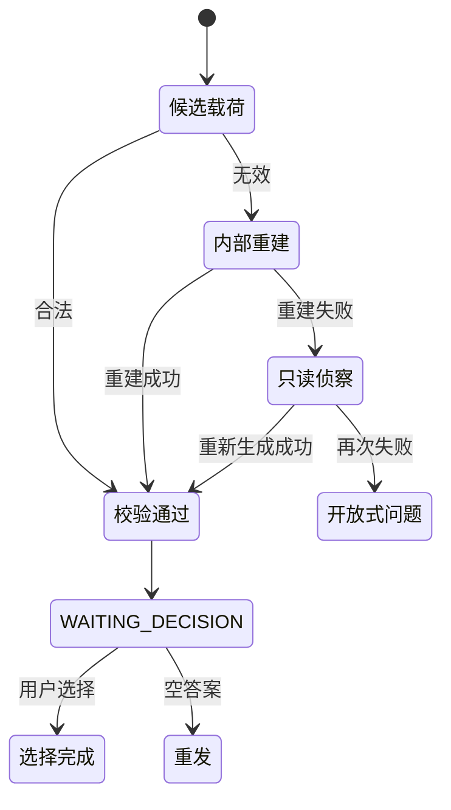
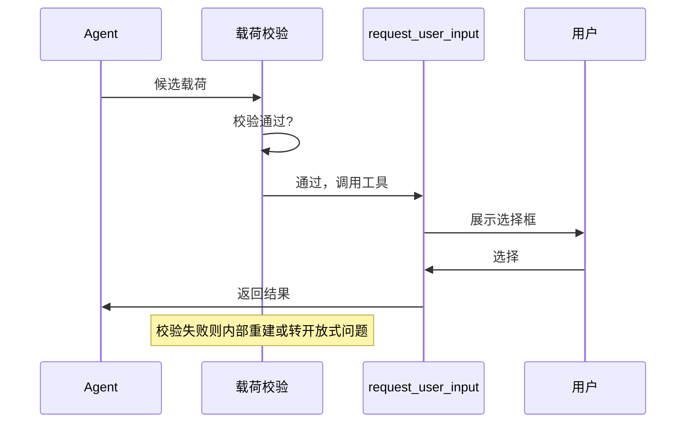
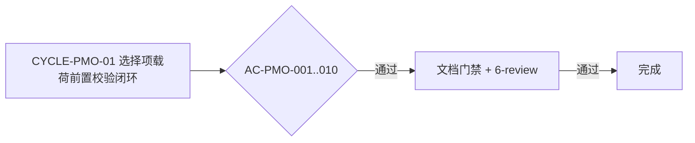

# 需求实施总览：Plan Mode 选择框空白无效选项修复

结论：在调用 request_user_input 前增加载荷质量校验，确保每个选择框都展示有效选项。影响：Plan Mode 用户不再看到空白或无效选择框。范围：规则文档和测试文件。非范围：宿主 UI 渲染和非 Plan Mode 行为。变化：无效载荷在调用前被阻断，重建合法后才进入选择框。完成标准：所有验收标准通过测试验证。术语说明：载荷质量指选项的 label、description 非空、去重、拒绝占位标签。验证状态：计划阶段，待实施后通过真实测试验证。

## 1. 当前计划最终方案简要说明

推荐方案：在 `plan-question-coverage.md` 扩展调用前校验协议，新增 `validate_option_payload` 独立校验函数，无效载荷先内部重建，仍无效则转开放式问题。主落点：`implementation-planning-rules/references/plan-question-coverage.md` 和 `plan-output-gate.md` 的规则文本，以及 `test/implementation-planning-rules/plan_mode_option_payload_test.py` 的测试文件。选择原因：零改动现有永久等待逻辑，仅增加前置校验层，风险最小可验证。

## 2. Agent 对当前问题的理解

- 问题 / 目标：解决 Plan Mode 选择框出现空白、占位、重复等无效选项的问题
- 本轮范围：修改规则文档、新增测试文件、不修改工具 schema 或宿主代码
- 非范围：Codex Desktop 宿主 UI 渲染优化、非 Plan Mode 行为、Goal/任务投影
- 当前优先闭环：完成 CYCLE-PMO-01 的全部最小任务，通过 AC-PMO-001..010
- 关键假设：当前工具契约 request_user_input 的 schema 保持不变，只约束调用方载荷
- unresolved_decisions：无，所有决策已在 Plan Mode 中确认

## 3. 图片资产决策

`N/A`。原因：本任务只处理文本协议、状态逻辑和测试代码，流程关系使用 Mermaid 足以表达。证据：Mermaid 流程图可表达校验流程，无需位图。

## 4. 已冻结决策

| ID | 决策问题 | 选定方案 | 排除原因 | 影响面 |
| --- | --- | --- | --- | --- |
| DEC-PMO-01 | 无效载荷处理方式 | 内部重建后再展示 | 直接阻断不展示会让用户无选择入口 | 选择框体验 |
| DEC-PMO-02 | 重建失败后的降级 | 转开放式问题 | 不展示会导致用户无法推进 | 用户体验 |
| DEC-PMO-03 | 测试位置 | 根 `test/implementation-planning-rules/` | 旧 `doc/5-tests/` 只读 | 测试目录统一 |


## 阶段计划

- 阶段 1：规则文档
  - 阶段名称：规则文档扩展
  - 阶段目标：在 `plan-question-coverage.md` 和 `plan-output-gate.md` 增加载荷校验协议
  - 只做这一件事：更新规则文档
  - 输入条件：规则分析完成
  - 输出产物：更新后的规则文档
  - 验证门槛：`git diff --check` 通过
- 阶段 2：测试实现
  - 阶段名称：测试实现
  - 阶段目标：新增 `plan_mode_option_payload_test.py` 覆盖 AC-PMO-001..010
  - 只做这一件事：编写测试代码
  - 输入条件：规则文档完成
  - 输出产物：测试文件
  - 验证门槛：测试 10/10 通过
- 阶段 3：收口
  - 阶段名称：文档门禁与收口
  - 阶段目标：执行文档门禁、6-review 和全量回归
  - 只做这一件事：验证和收口
  - 输入条件：测试实现完成
  - 输出产物：6-review 文档、测试 README
  - 验证门槛：全部验证命令通过

## 最小任务清单

- 最小任务 1：规则文档扩展（TASK-PMO-01）
  - 所属周期：CYCLE-PMO-01
  - 周期内顺序：1
  - 所属阶段：规则文档
  - 本任务只做这一件事：更新规则文档
  - 垂直切片目标：规则文档完成载荷校验协议定义
  - 输入条件：规则分析完成
  - 实现产出：更新 `plan-question-coverage.md` 和 `plan-output-gate.md`
  - 真实测试是否必需：否（纯文档变更）
  - 真实测试入口：`N/A`
  - 真实测试依赖环境：`N/A`
  - 真实测试样本 / 数据来源：`N/A`
  - 真实测试通过标准：`N/A`
  - 测试点：无（文档变更）
  - `6-review` 风格回归点：`code-style-consistency-rules` 6-review
  - 任务完成条件：规则文本包含载荷校验协议，字段完整
  - 任务停止 / 结束条件：规则文本更新完成，`git diff --check` 通过
  - 阻断条件：无
  - 前置依赖：无
  - 下一任务依赖：TASK-PMO-02
  - 预计触达文件数：2
- 最小任务 2：测试文件实现（TASK-PMO-02）
  - 所属周期：CYCLE-PMO-01
  - 周期内顺序：2
  - 所属阶段：测试实现
  - 本任务只做这一件事：新增测试文件
  - 垂直切片目标：10 项正负行为测试覆盖 AC-PMO-001..010
  - 输入条件：TASK-PMO-01 完成
  - 实现产出：`test/implementation-planning-rules/plan_mode_option_payload_test.py`
  - 真实测试是否必需：是
  - 真实测试入口：`python -X utf8 -B test/implementation-planning-rules/plan_mode_option_payload_test.py`
  - 真实测试依赖环境：Python 3 标准库
  - 真实测试样本 / 数据来源：测试内构造的载荷样本
  - 真实测试通过标准：10/10 通过
  - 测试点：AC-PMO-001..010
  - `6-review` 风格回归点：`code-style-consistency-rules` 6-review
  - 任务完成条件：测试文件存在且 10/10 通过
  - 任务停止 / 结束条件：测试输出显示 PASS（10 cases）
  - 阻断条件：无
  - 前置依赖：TASK-PMO-01
  - 下一任务依赖：TASK-PMO-03
  - 预计触达文件数：1
- 最小任务 3：文档门禁与收口（TASK-PMO-03）
  - 所属周期：CYCLE-PMO-01
  - 周期内顺序：3
  - 所属阶段：收口
  - 本任务只做这一件事：执行文档门禁、6-review 和最终回归
  - 垂直切片目标：全部验收标准和风格回归通过
  - 输入条件：TASK-PMO-02 完成
  - 实现产出：6-review 文档、测试 README
  - 真实测试是否必需：是
  - 真实测试入口：全量测试命令
  - 真实测试依赖环境：Python 3 标准库
  - 真实测试样本 / 数据来源：测试内构造
  - 真实测试通过标准：全部通过
  - 测试点：全量回归
  - `6-review` 风格回归点：`code-style-consistency-rules` 6-review
  - 任务完成条件：文档门禁 PASS、6-review PASS、git diff --check 通过
  - 任务停止 / 结束条件：所有验证命令输出通过
  - 阻断条件：无
  - 前置依赖：TASK-PMO-02
  - 下一任务依赖：无
  - 预计触达文件数：3


## 现状与落点

- 涉及目录：`implementation-planning-rules/references/`、`test/implementation-planning-rules/`
- 涉及文件/符号：
  - `implementation-planning-rules/references/plan-question-coverage.md`（已有规则文档）
  - `implementation-planning-rules/references/plan-output-gate.md`（已有规则文档）
  - `test/implementation-planning-rules/plan_mode_option_payload_test.py`（新增）
- 复用点：`validate_decision_call` 的异常类 `ContractViolation` 风格，新增 `PayloadViolation`
- 需要新增的内容：`test/implementation-planning-rules/plan_mode_option_payload_test.py`

## 真实测试安排

- 真实测试总表：
  | 测试文件 | 覆盖 AC | 入口命令 |
  | --- | --- | --- |
  | `plan_mode_option_payload_test.py` | AC-PMO-001..010 | `python -X utf8 -B test/implementation-planning-rules/plan_mode_option_payload_test.py` |
  | 全量回归 | 既有回归 | `python -X utf8 -B test/implementation-planning-rules/plan_output_contract_test.py` |
  | 历史回归 | 既有历史 | `python -X utf8 -B doc/5-tests/2026-07-26_040607/plan_mode_wait_loop/test_plan_mode_wait_loop.py` |
- 免测任务及理由：TASK-PMO-01 纯文档变更，无需真实测试
- 通过标准：新测试 10/10、全量回归 15/15、历史回归 10/10


图形目的：说明 Agent 调用 request_user_input 前经过载荷校验的时序。关联 ID：CYCLE-PMO-01、TASK-PMO-01。
图形目的：说明载荷校验的状态迁移。关联 ID：CYCLE-PMO-01、AC-PMO-010。


图形目的：说明载荷校验后调用 request_user_input 的时序。关联 ID：CYCLE-PMO-01、TASK-PMO-01。


## 5. 实施周期总览

| 顺序 | 周期 ID | 期次定位 | 周期目标 | 进入条件 | 收口条件 |
| --- | --- | --- | --- | --- | --- |
| 1 | CYCLE-PMO-01 | 第一期 | 选择项载荷前置校验闭环 | 规则分析和测试设计已完成 | 所有 AC 通过、文档门禁通过、6-review 通过 |

图形目的：说明实施周期单周期闭环流程。关联 ID：CYCLE-PMO-01、AC-PMO-001..010。


## 6. 跨会话执行与外部引用

- 新会话接手第一步：读取 `PROJECT_CURRENT.md` 确认当前任务状态，执行 `git status` 确认工作树
- 主项目名称与根：`F:\luode-skills`
- 代码基线：`b4039d03b1ff5fa3e73abafab6a581ecda20a879`
- 外部项目代码引用：`N/A`。原因：本任务只修改本仓库文件，不引用其他项目代码。证据：所有修改文件均位于 `F:\luode-skills` 仓库内。

## 7. 风险与阻断项

- 风险：修改规则文档可能影响现有 Plan Mode 行为
- 缓解：不修改既有 `validate_decision_call` 的永久等待逻辑，只新增前置校验层
- 阻断：无（本任务不涉及外部依赖或服务启动）


## 自审结论

- 覆盖度检查：覆盖 AC-PMO-001..010 全部验收标准
- 实施周期检查：1 个周期，3 个最小任务
- 最小任务闭环检查：每个任务独立完成实现、测试和 6-review
- 阶段单一目标检查：每个阶段只做一件事
- 占位词检查：无 待确认、待确认 等占位词
- 可执行性检查：每个任务的命令、入口、样本和通过标准都已明确
- 图片资产决策：N/A + 原因 + 证据
- 用户确认状态：已通过 Plan Mode 决策弹窗确认推荐方案

## 任务完成、停止与最大推进边界

- 总体任务完成条件：所有 TASK 完成，AC-PMO-001..010 全部通过，文档门禁 PASS，6-review PASS
- 总体任务停止条件：任一测试失败且无法修复，或文档门禁未通过
- 最大推进边界：完成 CYCLE-PMO-01 的全部最小任务、测试、6-review 和文档门禁后停止，停在已改动未提交状态

## 执行附录

- 验证命令：
  ```
  python -X utf8 -B test/implementation-planning-rules/plan_mode_option_payload_test.py
  python -X utf8 -B test/implementation-planning-rules/plan_output_contract_test.py
  python -X utf8 -B doc/5-tests/2026-07-26_040607/plan_mode_wait_loop/test_plan_mode_wait_loop.py
  python -X utf8 -B .system/skill-creator/scripts/quick_validate.py implementation-planning-rules
  git diff --check
  ```

## 追踪附录

| 来源 | SRC | DEC | AC | CYCLE | TASK | TEST | EVIDENCE |
| --- | --- | --- | --- | --- | --- | --- | --- |
| BUGDOC-PMO-001 | BUG-PLAN-OPTION-20260810-001 | DEC-PMO-01..03 | AC-PMO-001..010 | CYCLE-PMO-01 | TASK-PMO-01..04 | plan_mode_option_payload_test.py | 测试 PASS 输出 |
