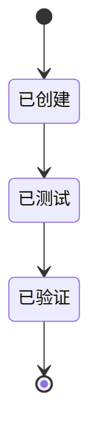

# CYCLE-CUR-RECENT-01: 快照脚本与契约

结论：为当前状态文件创建最近 5 个同项目会话快照脚本、契约和测试，并接入项目记忆规则。影响：项目记忆规则新增脚本和契约，快照托管区开始落地。范围：脚本、契约、测试、规则文件。非范围：bootstrap 模板、规则文件同步、真实迁移。变化：新增托管区和脚本，不改变任务投影注册表。完成标准：26 个测试通过、CLI 联调通过、投影验证通过。验证状态：已完成。术语说明：快照指脱敏的会话元数据；同项目指 Git 根目录精确匹配。
## 依赖图

图形目的：展示 CYCLE-01 内部任务依赖关系。关联 ID：CYCLE-CUR-RECENT-01。

图片资产决策：N/A + 原因：纯规则与文档变更，无视觉产物 + 证据：本文 Mermaid 图覆盖关系。

## 领域匹配图

本周期覆盖 project-memory-rules 的脚本层（新增）、契约层（新增）、SKILL.md（修改）和测试层（新增）。

## 当前周期目标、边界与进入条件

- 目标：创建快照脚本 `sync_recent_project_sessions.py`、契约文件 `recent-project-session-snapshot-contract.md`、并修改 `project-memory-rules/SKILL.md` 接入最近会话快照职责。
- 边界：不修改 task-plan-rehydration-rules 的锁协议、registry schema 和原子写入逻辑。
- 进入条件：需求文档已冻结、实施总览已创建。
- 收口条件：26 个测试通过、CLI 联调通过、投影验证通过、字典刷新退出码 0。

## 当前代码/文档基线

- Git 基线提交：ac6e5ccec5be9550ce36e1ed61cc966f025f086a
- 相关文件：`PROJECT_CURRENT.md`（现有）、`project-memory-rules/SKILL.md`（待修改）

## 文件/符号操作契约

| 文件 | 操作 | 符号 | 说明 |
|---|---|---|---|
| `project-memory-rules/SKILL.md` | 修改 | description、最近会话快照章节 | 添加快照职责 |
| `project-memory-rules/scripts/sync_recent_project_sessions.py` | 新建 | `sync_recent_sessions`、`build_session_line` | 快照同步脚本 |
| `project-memory-rules/references/recent-project-session-snapshot-contract.md` | 新建 | 完整契约 | 字段白名单、锁协议、脱敏规则 |
| `test/project-memory-rules/sync_recent_project_sessions_test.py` | 新建 | 26 个测试用例 | 全部通过 |

## 周期内最小任务执行顺序

1. TASK-CUR-RECENT-01：创建需求文档（已完成）
2. TASK-CUR-RECENT-02：创建实施总览（已完成）
3. TASK-CUR-RECENT-03：创建周期01文档（已完成）
4. TASK-CUR-RECENT-04：修改 SKILL.md（已完成）
5. TASK-CUR-RECENT-05：创建快照脚本（已完成）
6. TASK-CUR-RECENT-06：创建契约文件（已完成）
7. TASK-CUR-RECENT-07：测试与验证（已完成）

## 最小任务闭环

每个最小任务严格按"实现 -> 真实测试 -> 6-review 风格回归"闭环后才进入下一个任务。具体任务定义见下表。

## 真实测试与断言

- 快照脚本测试：`python3 -X utf8 -B test/project-memory-rules/sync_recent_project_sessions_test.py`
- 断言：26 个测试全部通过
- 投影验证：`python3 -X utf8 -B task-plan-rehydration-rules/scripts/task_plan_projection.py validate`
- 断言：投影 registry 完整、当前会话 projection 正确

## 回滚与停止条件

- 回滚：`git checkout` 受影响的文件（当前改动停在已改动未提交状态）
- 停止条件：测试失败、锁失败、原子写入失败、全文超限

## 当前周期验证矩阵

| AC ID | 验证方法 | 通过条件 | 实际结果 |
|---|---|---|---|
| AC-CUR-RECENT-01 | 单元测试 | 7 条输入只保留 5 条 | 通过 |
| AC-CUR-RECENT-02 | 单元测试 | 当前会话出现 | 通过 |
| AC-CUR-RECENT-03 | 单元测试 | 新记录替换旧第 5 条 | 通过 |
| AC-CUR-RECENT-04 | 单元测试 | 不同项目根被过滤 | 通过 |
| AC-CUR-RECENT-05 | 单元测试 | 状态映射和北京时间正确 | 通过 |
| AC-CUR-RECENT-06 | 单元测试 | 空摘要回退 | 通过 |
| AC-CUR-RECENT-07 | 单元测试 | 注入清洗、脱敏 | 通过 |
| AC-CUR-RECENT-08 | 单元测试 | 首次插入 marker、二次幂等 | 通过 |
| AC-CUR-RECENT-09 | 单元测试 | 半 marker 拒绝 | 通过 |
| AC-CUR-RECENT-10 | 单元测试 | 锁内重读 | 通过 |
| AC-CUR-RECENT-11 | 单元测试 | 投影区不变 | 通过 |
| AC-CUR-RECENT-12 | 单元测试 | 非宿主跳过 | 通过 |
| AC-CUR-RECENT-13 | 单元测试 | 51200 上限 | 通过 |
| AC-CUR-RECENT-14 | 单元测试 | 4096 上限 | 通过 |

## 自审结论

- 实现完整性：全部 7 个任务已完成

## 周期追踪矩阵

| 来源 ID | 决策 ID | 需求 ID | 验收 ID | 任务 ID | 测试文件 | 状态 |
|---|---|---|---|---|---|---|
| SRC-CUR-RECENT-001 | DEC-CUR-RECENT-001 | REQ-CUR-RECENT-001 | AC-CUR-RECENT-01 | TASK-CUR-RECENT-03 | sync_recent_project_sessions_test.py | 通过 |
| SRC-CUR-RECENT-001 | DEC-CUR-RECENT-002 | REQ-CUR-RECENT-001 | AC-CUR-RECENT-02 | TASK-CUR-RECENT-03 | 同上 | 通过 |
| SRC-CUR-RECENT-001 | DEC-CUR-RECENT-003 | REQ-CUR-RECENT-001 | AC-CUR-RECENT-03 | TASK-CUR-RECENT-03 | 同上 | 通过 |
| SRC-CUR-RECENT-001 | DEC-CUR-RECENT-009 | REQ-CUR-RECENT-001 | AC-CUR-RECENT-04 | TASK-CUR-RECENT-03 | 同上 | 通过 |
| SRC-CUR-RECENT-001 | DEC-CUR-RECENT-005 | REQ-CUR-RECENT-001 | AC-CUR-RECENT-05 | TASK-CUR-RECENT-03 | 同上 | 通过 |
| SRC-CUR-RECENT-001 | DEC-CUR-RECENT-005 | REQ-CUR-RECENT-001 | AC-CUR-RECENT-06 | TASK-CUR-RECENT-03 | 同上 | 通过 |
| SRC-CUR-RECENT-001 | DEC-CUR-RECENT-006 | REQ-CUR-RECENT-001 | AC-CUR-RECENT-07 | TASK-CUR-RECENT-05 | 同上 | 通过 |
| SRC-CUR-RECENT-001 | DEC-CUR-RECENT-007 | REQ-CUR-RECENT-001 | AC-CUR-RECENT-08 | TASK-CUR-RECENT-05 | 同上 | 通过 |
| SRC-CUR-RECENT-001 | DEC-CUR-RECENT-007 | REQ-CUR-RECENT-001 | AC-CUR-RECENT-09 | TASK-CUR-RECENT-05 | 同上 | 通过 |
| SRC-CUR-RECENT-001 | DEC-CUR-RECENT-007 | REQ-CUR-RECENT-001 | AC-CUR-RECENT-10 | TASK-CUR-RECENT-05 | 同上 | 通过 |
| SRC-CUR-RECENT-001 | DEC-CUR-RECENT-007 | REQ-CUR-RECENT-001 | AC-CUR-RECENT-11 | TASK-CUR-RECENT-05 | 同上 | 通过 |
| SRC-CUR-RECENT-001 | DEC-CUR-RECENT-008 | REQ-CUR-RECENT-001 | AC-CUR-RECENT-12 | TASK-CUR-RECENT-05 | 同上 | 通过 |
| SRC-CUR-RECENT-001 | DEC-CUR-RECENT-007 | REQ-CUR-RECENT-001 | AC-CUR-RECENT-13 | TASK-CUR-RECENT-05 | 同上 | 通过 |
| SRC-CUR-RECENT-001 | DEC-CUR-RECENT-007 | REQ-CUR-RECENT-001 | AC-CUR-RECENT-14 | TASK-CUR-RECENT-05 | 同上 | 通过 |

图形目的：展示 CYCLE-01 任务状态流转。关联 ID：CYCLE-CUR-RECENT-01。

，26 个测试通过，CLI 联调验证通过。
- 文档门禁：需求文档 PASS。
- 字典刷新：exit code 0。
- 结论：CYCLE-01 自审通过。

## 任务列表

### TASK-CUR-RECENT-01: 创建需求文档
- 完成：已创建 `doc/2-需求/2026-08-10_PROJECT_CURRENT最近会话记忆需求.md`
- 完成条件：文档包含来源、决策、普通模型契约、追踪矩阵、流程图和时序图
- 停止条件：文档校验失败
- 最大推进边界：1 个文件，纯文档，不涉及代码

### TASK-CUR-RECENT-02: 创建实施总览文档
- 完成：已创建 `doc/3-实施/2026-08-10_PROJECT_CURRENT最近会话记忆_实施总览.md`
- 完成条件：包含边界图、周期依赖图、端到端图、追踪矩阵
- 停止条件：文档校验失败
- 最大推进边界：1 个文件，纯文档

### TASK-CUR-RECENT-03: 创建实施周期01文档
- 状态：进行中
- 文件：`doc/3-实施/2026-08-10_PROJECT_CURRENT最近会话记忆_实施周期01_快照脚本与契约.md`
- 完成条件：包含依赖图、领域匹配图、全部任务定义、完成条件、停止条件、测试映射
- 停止条件：文档校验失败
- 最大推进边界：1 个文件，纯文档

### TASK-CUR-RECENT-04: 修改 project-memory-rules SKILL.md
- 状态：待完成
- 文件：`project-memory-rules/SKILL.md`
- 改动：在写入规则和默认流程中增加最近会话快照职责
- 完成条件：SKILL.md 描述准确反映最近会话快照的归属和触发时机
- 停止条件：SKILL.md 校验失败或与现有职责冲突
- 最大推进边界：1 个文件，只修改 SKILL.md

### TASK-CUR-RECENT-05: 创建 sync_recent_project_sessions.py 脚本
- 状态：待完成
- 文件：`project-memory-rules/scripts/sync_recent_project_sessions.py`
- 完成条件：CLI 可运行，支持所有必需参数，通过本地测试
- 停止条件：测试失败、锁协议不兼容、或与投影脚本冲突
- 最大推进边界：1 个 Python 脚本文件

### TASK-CUR-RECENT-06: 创建 recent-project-session-snapshot-contract.md
- 状态：待完成
- 文件：`project-memory-rules/references/recent-project-session-snapshot-contract.md`
- 完成条件：完整定义 marker 格式、字段白名单、大小限制、脱敏规则、锁协议
- 停止条件：契约与脚本实现不一致
- 最大推进边界：1 个 Markdown 文件

### TASK-CUR-RECENT-07: 测试与验证 CYCLE-01
- 状态：待完成
- 文件：`test/project-memory-rules/sync_recent_project_sessions_test.py`
- 完成条件：所有 AC 有对应测试用例，本地可运行，通过
- 停止条件：测试失败，或文档门禁失败
- 最大推进边界：1 个测试文件

## 测试映射

| AC ID | 测试方法 | 测试文件 | 断言 |
|---|---|---|---|
| AC-CUR-RECENT-01 | 单元测试 | sync_recent_project_sessions_test.py | 7 条输入只保留最近 5 条 |
| AC-CUR-RECENT-02 | 单元测试 | 同上 | 当前会话出现在快照中 |
| AC-CUR-RECENT-03 | 单元测试 | 同上 | 新记录进入后旧第 5 条被替换 |
| AC-CUR-RECENT-04 | 单元测试 | 同上 | 不同项目根的会话被过滤 |
| AC-CUR-RECENT-05 | 单元测试 | 同上 | 状态映射和北京时间正确 |
| AC-CUR-RECENT-06 | 单元测试 | 同上 | 空摘要返回固定说明 |
| AC-CUR-RECENT-07 | 单元测试 | 同上 | 注入字符被清洗，敏感字段被脱敏 |
| AC-CUR-RECENT-08 | 单元测试 | 同上 | 无 marker 时追加，已有 marker 时替换 |
| AC-CUR-RECENT-09 | 单元测试 | 同上 | 半 marker/重复 marker 失败保护 |
| AC-CUR-RECENT-10 | 单元测试 | 同上 | 锁内重新读取最新文件 |
| AC-CUR-RECENT-11 | 集成测试 | 同上 | 最近会话托管区与投影 registry 互不干扰 |
| AC-CUR-RECENT-12 | 单元测试 | 同上 | 非 Codex App 宿主跳过刷新 |
| AC-CUR-RECENT-13 | 单元测试 | 同上 | 恰好 51,200 允许，51,201 拒绝 |
| AC-CUR-RECENT-14 | 单元测试 | 同上 | 托管区超限 4,096 拒绝 |