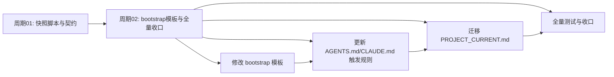
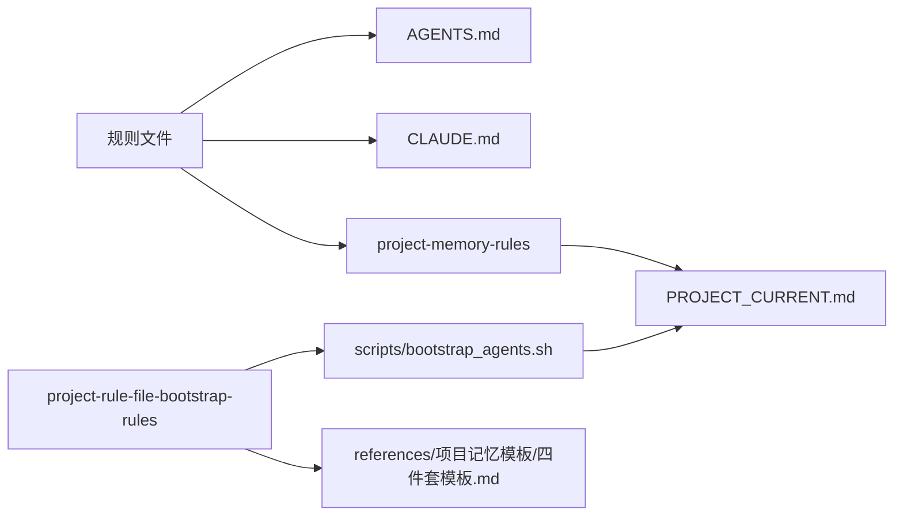
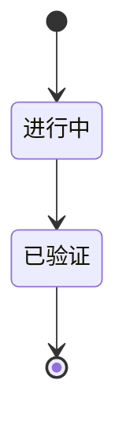

# CYCLE-CUR-RECENT-02: bootstrap 模板与全量收口

结论：为项目四件套模板和规则文件补齐最近会话快照托管区，并把真实 PROJECT_CURRENT.md 迁移到新结构。影响：新项目 bootstrap 后自带最近会话空托管区，规则文件明确最近会话的只读回忆索引属性。范围：bootstrap 脚本、四件套模板、AGENTS.md、CLAUDE.md、PROJECT_CURRENT.md。非范围：快照脚本与契约（周期01已完成）、任务投影 registry schema、Git 历史写入。变化：新项目模板增加空托管区，真实 PROJECT_CURRENT.md 在任务投影之前插入最近会话托管区。完成标准：bootstrap 测试 1/1 通过、快照脚本 26/26 通过、投影验证通过、字典刷新退出码 0、周期05 验证矩阵全部通过。验证状态：进行中。术语说明：类似周期01，最近会话指同一 Git 根目录下的会话快照；bootstrap 指新项目初始化时创建四件套模板。

## 依赖图

图形目的：展示周期02 内部任务依赖关系。关联 ID：CYCLE-CUR-RECENT-02。

## 领域匹配图

图形目的：展示周期02 覆盖的领域 Skill 与文件映射。关联 ID：CYCLE-CUR-RECENT-02。

本周期覆盖 project-rule-file-bootstrap-rules 的模板层（修改）、AGENTS.md/CLAUDE.md 触发规则（修改）、PROJECT_CURRENT.md 真实迁移（修改）和全量测试与收口。

## 当前周期目标、边界与进入条件

- 目标：完成 bootstrap 模板中的最近会话空托管区，更新 AGENTS.md/CLAUDE.md 触发规则，并把真实 PROJECT_CURRENT.md 迁移到新结构。
- 边界：不修改 task-plan-rehydration-rules 的锁协议、registry schema 和原子写入逻辑；不创建独立 Skill；不执行 Git 历史写入。
- 进入条件：周期01 已通过其验证矩阵；需求文档已冻结；实施总览已确认。
- 收口条件：bootstrap 测试 1/1 通过、快照脚本 26/26 通过、投影验证通过、字典刷新退出码 0、周期05 验证矩阵全部通过。

## 当前代码/文档基线

- Git 基线提交：ac6e5ccec5be9550ce36e1ed61cc966f025f086a
- 相关文件：`project-rule-file-bootstrap-rules/scripts/bootstrap_agents.sh`（待修改）、`project-rule-file-bootstrap-rules/references/项目记忆模板/四件套模板.md`（待修改）、`AGENTS.md`（待修改）、`CLAUDE.md`（待修改）、`PROJECT_CURRENT.md`（待修改）

## 文件/符号操作契约

| 文件 | 操作 | 符号 | 说明 |
|---|---|---|---|
| `project-rule-file-bootstrap-rules/scripts/bootstrap_agents.sh` | 修改 | 四件套模板文件路径 | 在 PROJECT_CURRENT.md 骨架中添加最近会话空托管区 |
| `project-rule-file-bootstrap-rules/references/项目记忆模板/四件套模板.md` | 修改 | 最近会话托管区 | 添加空托管区 |
| `AGENTS.md` | 修改 | project-memory-rules 相关触发规则 | 说明最近会话快照的只读回忆索引属性 |
| `CLAUDE.md` | 修改 | 同上 | 同上 |
| `PROJECT_CURRENT.md` | 修改 | 最近会话托管区 | 在任务投影托管区之前插入最近会话快照托管区 |

## 任务执行状态表

| 任务 ID | 文件 | 状态 | 测试 |
|---|---|---|---|
| TASK-CUR-RECENT-08 | bootstrap_agents.sh、四件套模板.md、bootstrap_agents_test.py | 已完成 | bootstrap_agents_test.py 1/1 |
| TASK-CUR-RECENT-09 | AGENTS.md、CLAUDE.md | 进行中 | 规则文件检查 |
| TASK-CUR-RECENT-10 | PROJECT_CURRENT.md | 已完成 | 投影验证、大小检查 |
| TASK-CUR-RECENT-11 | 全量测试与收口 | 待完成 | 全量测试套件 |

## 周期内最小任务执行顺序

1. TASK-CUR-RECENT-08：修改 bootstrap 模板与测试（已完成）
2. TASK-CUR-RECENT-09：更新 AGENTS.md/CLAUDE.md 触发规则（进行中）
3. TASK-CUR-RECENT-10：迁移 PROJECT_CURRENT.md（已完成）
4. TASK-CUR-RECENT-11：全量测试与收口（待完成）

## 最小任务闭环

每个最小任务严格按"实现 -> 真实测试 -> 6-review 风格回归"闭环后才进入下一个任务。具体任务定义见下表。

## 真实测试与断言

- bootstrap 测试：`python3 -X utf8 -B test/project-rule-file-bootstrap-rules/bootstrap_agents_test.py`
- 断言：1/1 测试通过
- 快照脚本测试：`python3 -X utf8 -B test/project-memory-rules/sync_recent_project_sessions_test.py`
- 断言：26/26 测试通过
- 投影验证：`python3 -X utf8 -B task-plan-rehydration-rules/scripts/task_plan_projection.py validate`
- 断言：投影 registry 完整、当前会话 projection 正确
- 字典刷新：`python3 -X utf8 -B skill-dictionary/generate_dictionary.py`
- 断言：退出码 0

## 回滚与停止条件

- 回滚：`git checkout` 受影响的文件（当前改动停在已改动未提交状态）。
- 停止条件：测试失败、锁失败、原子写入失败、全文超限、projection 校验失败。

## 当前周期验证矩阵

| AC ID | 验证方法 | 通过条件 | 实际结果 |
|---|---|---|---|
| AC-CUR-RECENT-15 | bootstrap 测试 | 新项目模板包含空托管区 | 进行中 |
| AC-CUR-RECENT-16 | 规则文件检查 | AGENTS.md/CLAUDE.md 反映只读回忆索引属性 | 进行中 |
| AC-CUR-RECENT-17 | PROJECT_CURRENT 检查 | 10 迁移正确、投影区不变、全文不超限 | 已完成 |
| AC-CUR-RECENT-18 | 全量测试 | 所有测试通过、字典刷新退出码 0 | 进行中 |

## 自审结论

- 实现完整性：TASK-08、TASK-10 已完成；TASK-09、TASK-11 进行中。

## 周期追踪矩阵

| 来源 ID | 决策 ID | 需求 ID | 验收 ID | 任务 ID | 测试文件 | 状态 |
|---|---|---|---|---|---|---|
| SRC-CUR-RECENT-001 | DEC-CUR-RECENT-007 | REQ-CUR-RECENT-001 | AC-CUR-RECENT-15 | TASK-CUR-RECENT-08 | bootstrap_agents_test.py | 进行中 |
| SRC-CUR-RECENT-001 | DEC-CUR-RECENT-008 | REQ-CUR-RECENT-001 | AC-CUR-RECENT-16 | TASK-CUR-RECENT-09 | 规则文件检查 | 进行中 |
| SRC-CUR-RECENT-001 | DEC-CUR-RECENT-007 | REQ-CUR-RECENT-001 | AC-CUR-RECENT-17 | TASK-CUR-RECENT-10 | PROJECT_CURRENT 检查 | 已完成 |
| SRC-CUR-RECENT-001 | DEC-CUR-RECENT-008 | REQ-CUR-RECENT-001 | AC-CUR-RECENT-18 | TASK-CUR-RECENT-11 | 全量测试 | 进行中 |

图形目的：展示周期02 任务状态流转。关联 ID：CYCLE-CUR-RECENT-02。

图片资产决策：N/A + 原因：纯规则与文档变更，无视觉产物 + 证据：本文 Mermaid 图覆盖关系。
