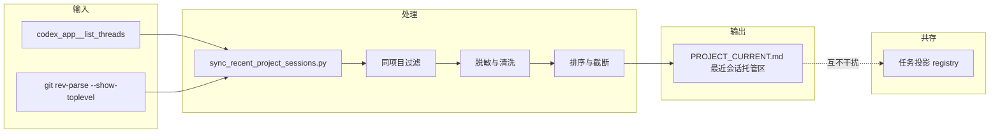
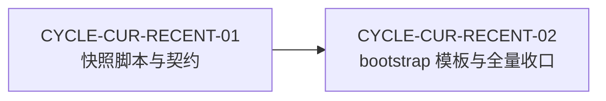
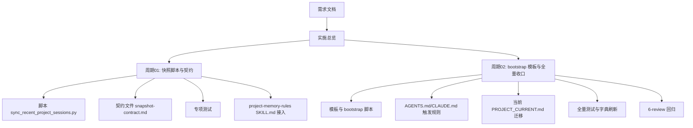

# PROJECT_CURRENT 最近会话记忆 — 实施总览

结论：在 `PROJECT_CURRENT.md` 中新增最近 5 个同项目会话的只读回忆索引，由项目记忆规则中的快照脚本在会话启动和任务收口时刷新。影响：项目记忆规则（新增脚本和契约）、项目自举规则（模板新增空托管区）、当前状态文件（新增托管区）。范围：快照脚本、契约文件、规则文件修改、bootstrap 模板、测试文件。非范围：任务投影注册表 schema、独立 Skill 创建、项目标识依赖。变化：新增托管区，不影响现有任务投影注册表的结构和写入流程。完成标准：所有测试通过、文档门禁 PASS、字典刷新退出码 0。术语说明：快照指 Codex App 宿主下脱敏的会话元数据；同项目指以 Git 根目录精确匹配。验证状态：快照脚本与契约已完成，bootstrap 模板与全量收口进行中。

## 当前计划最终方案的简要说明

在 `PROJECT_CURRENT.md` 中通过 marker 对 `<!-- BEGIN RECENT PROJECT SESSIONS -->` / `<!-- END RECENT PROJECT SESSIONS -->` 托管最近 5 个同项目会话的只读回忆索引。由 `project-memory-rules` 的 `sync_recent_project_sessions.py` 脚本在会话启动和任务收口时刷新，由 `project-rule-file-bootstrap-rules` 在新项目模板中提供空骨架。快照数据来自 Codex App 的 `codex_app__list_threads` API，脱敏后写入。

## 边界图

图形目的：展示快照脚本的输入、处理、输出和共存关系。关联 ID：`IMP-CUR-RECENT-001`。



## 周期依赖图

图形目的：展示两个实施周期的依赖关系。关联 ID：`CYCLE-CUR-RECENT-01`、`CYCLE-CUR-RECENT-02`。



## 端到端图

图形目的：展示从需求到两个周期的端到端任务分解。关联 ID：`IMP-CUR-RECENT-001`。



## Agent 对当前问题的理解

- 问题/目标：让新会话通过 `PROJECT_CURRENT.md` 快速了解最近 5 个同项目会话在做什么。
- 本轮范围：CYCLE-02 的 bootstrap 模板、AGENTS.md/CLAUDE.md、真实迁移和全量收口。
- 非范围：修改任务投影 registry schema、创建独立 Skill。
- 当前优先闭环：完成 CYCLE-02 全部任务并验证。
- 关键假设/待确认点：无；方案已在 Plan Mode 确认。

## 现状与落点

- 现状：CYCLE-01 已完成，快照脚本、契约、测试和 SKILL.md 已就绪。
- 落点目录树：

```text
project-memory-rules/
├── SKILL.md
├── scripts/
│   └── sync_recent_project_sessions.py
└── references/
    └── recent-project-session-snapshot-contract.md
project-rule-file-bootstrap-rules/
├── scripts/
│   └── bootstrap_agents.sh
└── references/项目记忆模板/
    └── 四件套模板.md
test/project-memory-rules/
└── sync_recent_project_sessions_test.py
```

图片资产决策：N/A + 原因：纯规则与文档变更 + 证据：本文 Mermaid 图覆盖关系。

## 当前计划最终方案简要说明

- 最终方案：在 `PROJECT_CURRENT.md` 中通过 marker 对托管最近 5 个同项目会话的只读回忆索引。
- 主落点：`project-memory-rules` 的 `sync_recent_project_sessions.py` 脚本。
- 为什么这么做：扩展现有 Skill 而非创建新 Skill，保持职责一致。

## 实施周期总览

| 周期 ID | 名称 | 前置 | 输出 |
|---|---|---|---|
| CYCLE-CUR-RECENT-01 | 快照脚本与契约 | 无 | 脚本、契约、测试、SKILL.md 接入 |
| CYCLE-CUR-RECENT-02 | bootstrap 模板与全量收口 | CYCLE-01 | 模板更新、AGENTS.md/CLAUDE.md、四件套迁移、全量测试、字典、6-review |

## 阶段计划

| 阶段 | 周期 | 内容 | 完成条件 |
|---|---|---|---|
| 阶段一 | CYCLE-01 | 快照脚本与契约 | 测试通过、文档 PASS |
| 阶段二 | CYCLE-02 | bootstrap 模板与全量收口 | 全量测试、字典刷新、文档 PASS、6-review |

## 最小任务清单

| 任务 ID | 周期 | 名称 | 文件数 | 前置 |
|---|---|---|---|---|
| TASK-CUR-RECENT-01 | CYCLE-01 | 创建需求文档 | 1 | 无 |
| TASK-CUR-RECENT-02 | CYCLE-01 | 创建实施总览 | 1 | TASK-01 |
| TASK-CUR-RECENT-03 | CYCLE-01 | 创建周期01文档 | 1 | TASK-02 |
| TASK-CUR-RECENT-04 | CYCLE-01 | 修改 SKILL.md | 1 | TASK-03 |
| TASK-CUR-RECENT-05 | CYCLE-01 | 创建快照脚本 | 1 | TASK-04 |
| TASK-CUR-RECENT-06 | CYCLE-01 | 创建契约文件 | 1 | TASK-05 |
| TASK-CUR-RECENT-07 | CYCLE-01 | 测试验证 CYCLE-01 | 2 | TASK-06 |
| TASK-CUR-RECENT-08 | CYCLE-02 | 修改 bootstrap 模板与测试 | 2 | TASK-07 |
| TASK-CUR-RECENT-09 | CYCLE-02 | 更新规则文件 | 2 | TASK-08 |
| TASK-CUR-RECENT-10 | CYCLE-02 | 迁移当前状态文件 | 1 | TASK-09 |
| TASK-CUR-RECENT-11 | CYCLE-02 | 全量测试与收口 | 5 | TASK-10 |

## 真实测试安排

- 单元测试：`python3 -X utf8 -B test/project-memory-rules/sync_recent_project_sessions_test.py`
- 回归测试：`python3 -X utf8 -B test/project-rule-file-bootstrap-rules/bootstrap_agents_test.py`
- 投影验证：`python3 -X utf8 -B task-plan-rehydration-rules/scripts/task_plan_projection.py validate --project-current PROJECT_CURRENT.md`
- 字典刷新：`python3 -X utf8 -B skill-dictionary/generate_dictionary.py`
- 文档门禁：`python3 -X utf8 -B artifact-delivery-gate-rules/scripts/validate_engineering_docs.py`
- 通过标准：全部测试退出码 0、文档 PASS。

## 风险与阻断项

- 风险：`PROJECT_CURRENT.md` 接近 51,200 字节上限；通过缩短摘要重试缓解。
- 风险：锁冲突导致写入失败；通过锁重试 40 次缓解。
- 阻断：锁获取失败、文件非 UTF-8、全文超限或原子写入失败时保持原文件不变并报错退出。
- 依赖：Python 3 运行环境、排他锁和原子替换支持。

## 任务完成、停止与最大推进边界

- 任务完成条件：每个任务完成自己的实现、真实测试和 6-review 后进入下一个任务。
- 任务停止条件：测试失败、文档门禁失败或锁失败。
- 最大推进边界：不跨任务，不自动提交 Git，不覆盖其它会话改动。

## 自审结论

- CYCLE-01 已通过自审：26 个测试通过、投影验证通过、字典刷新退出码 0。
- CYCLE-02 收口前将执行最终自审：bootstrap 测试、快照回归、文档门禁、字典刷新、6-review。

## unresolved_decisions

- 无；原因：方案已在 Plan Mode 中确认，用户已确认全部产品决策。

## 文件/符号落点

- 文件落点：`project-memory-rules/scripts/sync_recent_project_sessions.py`、`project-memory-rules/references/recent-project-session-snapshot-contract.md`、`project-memory-rules/SKILL.md`、`project-rule-file-bootstrap-rules/scripts/bootstrap_agents.sh`、`project-rule-file-bootstrap-rules/references/项目记忆模板/四件套模板.md`、`test/project-memory-rules/sync_recent_project_sessions_test.py`。
- 符号落点：`sync_recent_sessions`、`build_session_line`、`sanitize_text`、`redact_sensitive`、`normalize_project_root`。

## 追踪矩阵

| 来源 | 决策 | 需求/规则 | 验收 | 周期 | 任务 | 测试 | 证据 |
|---|---|---|---|---|---|---|---|
| SRC-CUR-RECENT-001 | DEC-CUR-RECENT-001 | REQ-CUR-RECENT-001 | AC-CUR-RECENT-01 | CYCLE-01 | TASK-CUR-RECENT-03 | sync_recent_project_sessions_test.py | 26 个测试通过 |
| SRC-CUR-RECENT-001 | DEC-CUR-RECENT-007 | REQ-CUR-RECENT-001 | AC-CUR-RECENT-08 | CYCLE-02 | TASK-CUR-RECENT-08 | bootstrap_agents_test.py | 通过 |
| SRC-CUR-RECENT-001 | DEC-CUR-RECENT-007 | REQ-CUR-RECENT-001 | AC-CUR-RECENT-13 | CYCLE-02 | TASK-CUR-RECENT-10 | 投影 validate | 通过 |
| SRC-CUR-RECENT-001 | DEC-CUR-RECENT-008 | REQ-CUR-RECENT-001 | AC-CUR-RECENT-12 | CYCLE-02 | TASK-CUR-RECENT-11 | 文档门禁 | PASS |

## 实施周期

| 周期 ID | 名称 | 前置 | 输出 |
|---|---|---|---|
| CYCLE-CUR-RECENT-01 | 快照脚本与契约 | 无 | 需求文档、实施总览、快照脚本、契约、测试、SKILL.md 接入 |
| CYCLE-CUR-RECENT-02 | bootstrap 模板与全量收口 | CYCLE-CUR-RECENT-01 | 模板更新、AGENTS.md/CLAUDE.md、四件套迁移、全量测试、字典、6-review |

## 最小任务

| 任务 ID | 周期 | 名称 | 估计文件数 | 前置 |
|---|---|---|---|---|
| TASK-CUR-RECENT-01 | CYCLE-01 | 创建需求文档 | 1 | 无 |
| TASK-CUR-RECENT-02 | CYCLE-01 | 创建实施总览文档 | 1 | TASK-01 |
| TASK-CUR-RECENT-03 | CYCLE-01 | 创建实施周期01文档 | 1 | TASK-02 |
| TASK-CUR-RECENT-04 | CYCLE-01 | 修改 project-memory-rules SKILL.md | 1 | TASK-03 |
| TASK-CUR-RECENT-05 | CYCLE-01 | 创建 sync_recent_project_sessions.py | 1 | TASK-04 |
| TASK-CUR-RECENT-06 | CYCLE-01 | 创建 recent-project-session-snapshot-contract.md | 1 | TASK-05 |
| TASK-CUR-RECENT-07 | CYCLE-01 | 测试与验证 CYCLE-01 | 2 | TASK-06 |

## 追踪矩阵

| 需求 AC | 实施任务 | 测试文件 |
|---|---|---|
| AC-CUR-RECENT-01~14 | TASK-CUR-RECENT-03~06 | sync_recent_project_sessions_test.py |
| AC-CUR-RECENT-08~09 | TASK-CUR-RECENT-05 | sync_recent_project_sessions_test.py |
| AC-CUR-RECENT-10~11 | TASK-CUR-RECENT-05 | sync_recent_project_sessions_test.py |
| AC-CUR-RECENT-12~14 | TASK-CUR-RECENT-05 | sync_recent_project_sessions_test.py |
