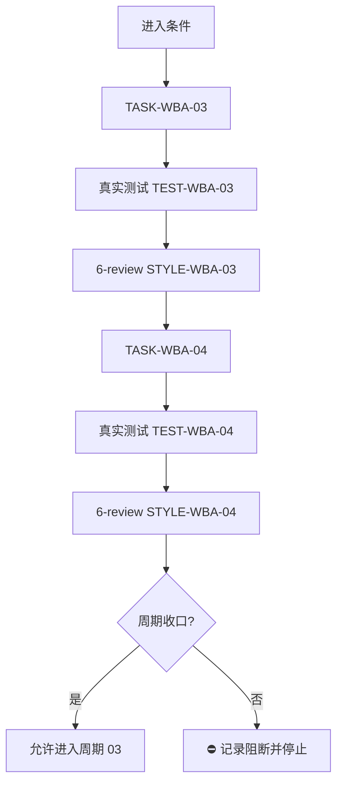
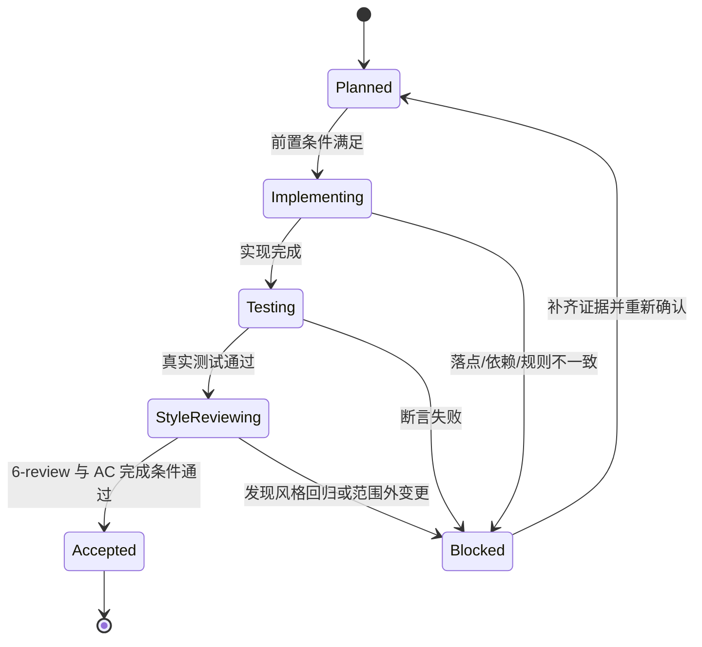

# 实施周期 02：实施域与 Bug 域整理

结论：本周期把“实施前代码库探索与显式批准”并入实施域，把“Bug 修复风险分级决策表”并入 Bug 域。影响：实施前不再直接进入编码，Bug 修复按风险高低决定等不等确认。范围：实施域与 Bug 域 skill。非范围：不动需求域、测试域。变化：实施规划多一个只读探索门，Bug 修复多一个风险分级决策。完成标准：两个任务完成实现、真实测试、6-review，周期收口。术语说明：无技术术语需要解释。验证状态：计划阶段，真实测试随后执行。

## 1. 当前周期目标

- 周期 ID / 期次定位：`CYCLE-ABS-02` / 第二期
- 只做这一件事：实施域代码库探索与 Bug 域风险分级
- 对应需求、验收和实施总览：`REQ-WBA-20260813-001`、`AC-WBA-002`、`AC-WBA-003`、`2026-08-13_110000_WorkBuddy官方市场规则吸收整理补充_实施总览.md`
- 本周期不做：需求域质量门、测试域分层结论

## 2. 周期图片资产决策与边界

- 图片资产决策：`N/A + 原因 + 证据`。原因：本周期只修改 Markdown 规则文档，不涉及 UI、截图或位图。证据：流程与时序由 Mermaid 表达。

## 3. 进入条件与收口条件

| 类型 | 条件 | 证据/命令 | 状态 |
| --- | --- | --- | --- |
| 进入 | 周期一已收口 | 周期一两个任务证据齐全 | 待执行 |
| 收口 | 两个任务实现、真实测试、6-review 全部闭环 | 见各任务证据 | 待执行 |

图形目的与关联 ID：此图为周期 02 单任务闭环流程图，关联 `CYCLE-ABS-02`、`TASK-WBA-03`、`TASK-WBA-04`。

图形目的：说明周期内单任务闭环和收口门禁。关联 ID：`CYCLE-ABS-02`、`TASK-WBA-03`、`TASK-WBA-04`。

图形目的：说明本周期任务状态迁移与阻断回流。关联 ID：`TASK-WBA-03`、`TASK-WBA-04`。

## 4. 当前代码/文档基线

- 分支 / 提交：未读取 git commit；以 skill 文件内容为基线。
- 已核实文件和符号：`implementation-planning-rules/SKILL.md`、`bug-fix-proposal-rules/SKILL.md` 存在。
- 依赖版本与 local 配置：Python 3 可用，无需安装依赖。
- 与计划不一致时的停止规则：发现符号不存在或规则冲突，立即停止并回写 `GAP-*`。

## 5. 跨会话执行入口与外部项目代码引用

- 新会话接手第一步：核对 `PROJECT_CURRENT.md` 投影，再读本周期文档。
- 主项目名称与项目根：`D:\luode\luode-skills`
- 当前周期 / 任务标识与中断点核验顺序：`CYCLE-ABS-02` / `TASK-WBA-03`；先核验代码库探索参考是否已落盘。
- local 环境与依赖入口：Python 3。
- 外部项目代码引用：`N/A + 原因 + 证据`。原因：WorkBuddy 官方市场缓存仅作只读参考，不复制其代码或目录。证据：需求文档 `SRC-WBA-002` 至 `SRC-WBA-007`。

## 6. 周期内最小任务执行顺序

| 顺序 | 任务 ID | 唯一目标 | 前置依赖 | 允许文件 | 禁止触碰区 | 状态 |
| ---: | --- | --- | --- | --- | --- | --- |
| 1 | `TASK-WBA-03` | 实施域代码库探索 | 无 | `implementation-planning-rules/SKILL.md`、`implementation-planning-rules/references/pre-implementation-code-exploration.md` | 其它 skill 目录 | planned |
| 2 | `TASK-WBA-04` | Bug 域风险分级 | 无 | `bug-fix-proposal-rules/SKILL.md`、`bug-fix-proposal-rules/references/fix-risk-grading-and-confirmation.md` | 其它 skill 目录 | planned |

## 6.1 最小任务闭环

| 任务 | 实现动作 | 真实测试 | 6-review | 完成条件 | 停止条件 |
| --- | --- | --- | --- | --- | --- |
| `TASK-WBA-03` | 新增 `pre-implementation-code-exploration.md` 并在 `implementation-planning-rules/SKILL.md` 引用 | `TEST-WBA-03` | `STYLE-WBA-03` | 探索与批准规则存在 | 实施域规则冲突 |
| `TASK-WBA-04` | 新增 `fix-risk-grading-and-confirmation.md` 并在 `bug-fix-proposal-rules/SKILL.md` 引用 | `TEST-WBA-04` | `STYLE-WBA-04` | 风险分级决策表存在 | Bug 域规则冲突 |

## 6.2 当前周期验证矩阵

| 验证点 | 验证方式 | 通过标准 | 证据 |
| --- | --- | --- | --- |
| 代码库探索参考 | 文件读取 | 存在先探索、总结发现、批准后编码规则 | `EVD-TASK-WBA-03-IMPL` |
| Bug 风险分级参考 | 文件读取 | 存在高风险必须确认、低风险可直接编码规则 | `EVD-TASK-WBA-04-IMPL` |
| 参考文件存在性 | PowerShell `Test-Path` | 两个文件均存在且非空 | `EVD-TASK-WBA-03-TEST` / `EVD-TASK-WBA-04-TEST` |

## 7. 文件与符号操作契约

| 任务 | 文件路径 | 符号/区段 | 操作 | 修改前职责 | 修改后职责 | 调用方影响 | 兼容要求 |
| --- | --- | --- | --- | --- | --- | --- | --- |
| `TASK-WBA-03` | `implementation-planning-rules/SKILL.md` | `References` 区段 | 修改 | 未引用代码库探索 | 引用代码库探索参考 | 无 | 保留原职责 |
| `TASK-WBA-03` | `implementation-planning-rules/references/pre-implementation-code-exploration.md` | 全文 | 新增 | 不存在 | 定义先探索、总结发现、批准后编码 | 无 | UTF-8 |
| `TASK-WBA-04` | `bug-fix-proposal-rules/SKILL.md` | `References` 区段 | 修改 | 未引用风险分级决策表 | 引用风险分级决策表 | 无 | 保留原职责 |
| `TASK-WBA-04` | `bug-fix-proposal-rules/references/fix-risk-grading-and-confirmation.md` | 全文 | 新增 | 不存在 | 定义高风险必须确认、低风险可直接编码 | 无 | UTF-8 |

## 8. 任务图片资产执行契约

| 任务 | 图片决策 | 生成输入与 imagegen 命令 | 目标资产路径 | Markdown 相对引用 | `IMG-*` / 版本 | 资产清单与引用章节 | Mermaid 不替代说明 |
| --- | --- | --- | --- | --- | --- | --- | --- |
| `TASK-WBA-03` | `N/A + 原因 + 证据`：纯 Markdown 规则文档 | 无 | 无 | 无 | 无 | 无 | 流程图已由周期图表达 |
| `TASK-WBA-04` | `N/A + 原因 + 证据`：纯 Markdown 规则文档 | 无 | 无 | 无 | 无 | 无 | 流程图已由周期图表达 |

## 9. 真实测试与断言

| 测试 ID | 对应任务 | 精确命令 | local 依赖 | fixture/数据 | 断言 | 失败预期 | 清理 |
| --- | --- | --- | --- | --- | --- | --- | --- |
| `TEST-WBA-03` | `TASK-WBA-03` | `Test-Path implementation-planning-rules/references/pre-implementation-code-exploration.md` | Windows PowerShell | 无 | 文件存在且非空 | 文件缺失 | 无 |
| `TEST-WBA-04` | `TASK-WBA-04` | `Test-Path bug-fix-proposal-rules/references/fix-risk-grading-and-confirmation.md` | Windows PowerShell | 无 | 文件存在且非空 | 文件缺失 | 无 |

## 10. 回滚与停止条件

- `ROLLBACK-WBA-003`：删除 `pre-implementation-code-exploration.md`，还原 `implementation-planning-rules/SKILL.md` 引用。
- `ROLLBACK-WBA-004`：删除 `fix-risk-grading-and-confirmation.md`，还原 `bug-fix-proposal-rules/SKILL.md` 引用。
- 停止条件：命令失败、断言失败、规则冲突、官方缓存不可读。
- 恢复路径：回到 `TASK-WBA-03` 或 `TASK-WBA-04` 重跑。
- 当前 agent 最大推进边界：本周期完成后不自动进入周期 03。

## 11. 周期追踪矩阵

| `REQ-*` / `RULE-*` | `AC-*` | `TASK-*` | 文件/符号 | `TEST-*` | `STYLE-*` | `EVIDENCE-*` | 闭环状态 |
| --- | --- | --- | --- | --- | --- | --- | --- |
| `REQ-WBA-002` | `AC-WBA-002` | `TASK-WBA-03` | `implementation-planning-rules/SKILL.md`、`implementation-planning-rules/references/pre-implementation-code-exploration.md` | `TEST-WBA-03` | `STYLE-WBA-03` | `EVD-TASK-WBA-03-IMPL` / `EVD-TASK-WBA-03-TEST` / `EVD-TASK-WBA-03-STYLE` | pending |
| `REQ-WBA-003` | `AC-WBA-003` | `TASK-WBA-04` | `bug-fix-proposal-rules/SKILL.md`、`bug-fix-proposal-rules/references/fix-risk-grading-and-confirmation.md` | `TEST-WBA-04` | `STYLE-WBA-04` | `EVD-TASK-WBA-04-IMPL` / `EVD-TASK-WBA-04-TEST` / `EVD-TASK-WBA-04-STYLE` | pending |

## 12. 周期自审

- 每个任务是否只承载一个目标：是。
- 是否按实现 -> 真实测试 -> 6-review 风格回归逐个闭环：是。
- 是否存在未决决策或模糊落点：否。
- 图形、表格和正文是否一致：是。

## 12.1 自审结论

- 周期目标单一：通过。
- 最小任务闭环：通过，每个任务都有实现、真实测试、6-review。
- 文件落点：通过，目录树已给出。
- 无未决决策：通过。
- 图文一致性：通过。

## 13. 执行附录

- local 环境：Windows PowerShell / Python 3。
- 执行顺序：先 `TASK-WBA-03`，后 `TASK-WBA-04`。
- 精确命令：见第 9 章。
- 清理与回滚：见第 10 章。

## 14. 追踪附录

- 稳定 ID、需求来源、验收依据、证据、追踪矩阵：见第 11 章。
- 附录维护规则：执行附录在前、追踪附录在后，连续位于文档末尾。
