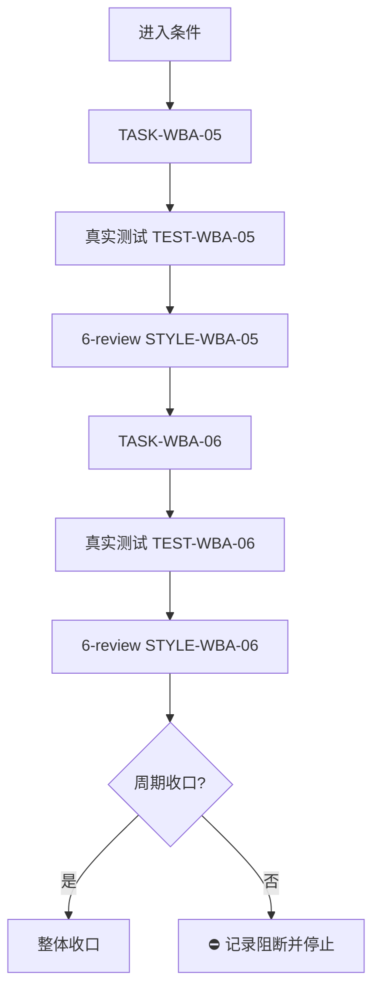
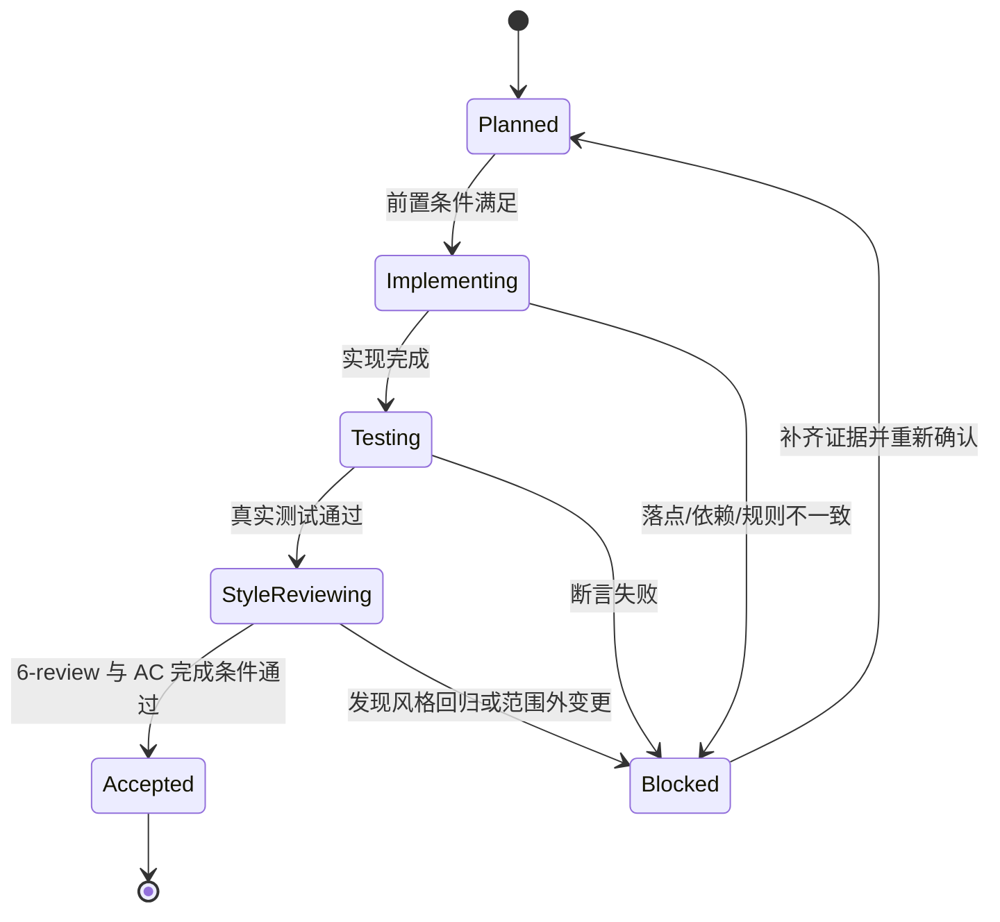

# 实施周期 03：测试域与收口

结论：本周期把“测试风险优先级与分层结论”并入测试域，再完成全量测试、6-review、字典刷新与项目记忆同步。影响：测试结论统一为通过 / 待确认 / 驳回，收口证据完整可追溯。范围：测试域 skill 与整体收口。非范围：不动需求、实施、Bug 域规则。变化：测试策略多一个分层结论，项目记忆记录本轮吸收事实。完成标准：两个任务完成实现、真实测试、6-review，字典与记忆同步完成。术语说明：无技术术语需要解释。验证状态：计划阶段，真实测试随后执行。

## 1. 当前周期目标

- 周期 ID / 期次定位：`CYCLE-ABS-03` / 第三期
- 只做这一件事：测试域分层结论与整体收口
- 对应需求、验收和实施总览：`REQ-WBA-20260813-001`、`AC-WBA-004`、`AC-WBA-006`、`2026-08-13_110000_WorkBuddy官方市场规则吸收整理补充_实施总览.md`
- 本周期不做：需求域、实施域、Bug 域规则整理

## 2. 周期图片资产决策与边界

- 图片资产决策：`N/A + 原因 + 证据`。原因：本周期只修改 Markdown 规则文档与收口证据，不涉及 UI、截图或位图。证据：流程与时序由 Mermaid 表达。

## 3. 进入条件与收口条件

| 类型 | 条件 | 证据/命令 | 状态 |
| --- | --- | --- | --- |
| 进入 | 周期二已收口 | 周期二两个任务证据齐全 | 待执行 |
| 收口 | 两个任务实现、真实测试、6-review、字典、记忆全部闭环 | 见各任务证据 | 待执行 |

图形目的与关联 ID：此图为周期 03 单任务闭环与整体收口流程图，关联 `CYCLE-ABS-03`、`TASK-WBA-05`、`TASK-WBA-06`。

图形目的：说明周期内单任务闭环和整体收口门禁。关联 ID：`CYCLE-ABS-03`、`TASK-WBA-05`、`TASK-WBA-06`。

图形目的：说明本周期任务状态迁移与阻断回流。关联 ID：`TASK-WBA-05`、`TASK-WBA-06`。

## 4. 当前代码/文档基线

- 分支 / 提交：未读取 git commit；以 skill 文件内容为基线。
- 已核实文件和符号：`test-strategy-rules/SKILL.md`、`test/run_python_tests.py`、`skill-dictionary/generate_dictionary.py` 存在。
- 依赖版本与 local 配置：Python 3 可用，无需安装依赖。
- 与计划不一致时的停止规则：发现符号不存在或规则冲突，立即停止并回写 `GAP-*`。

## 5. 跨会话执行入口与外部项目代码引用

- 新会话接手第一步：核对 `PROJECT_CURRENT.md` 投影，再读本周期文档。
- 主项目名称与项目根：`D:\luode\luode-skills`
- 当前周期 / 任务标识与中断点核验顺序：`CYCLE-ABS-03` / `TASK-WBA-05`；先核验测试分层结论参考是否已落盘。
- local 环境与依赖入口：Python 3。
- 外部项目代码引用：`N/A + 原因 + 证据`。原因：WorkBuddy 官方市场缓存仅作只读参考，不复制其代码或目录。证据：需求文档 `SRC-WBA-002` 至 `SRC-WBA-007`。

## 6. 周期内最小任务执行顺序

| 顺序 | 任务 ID | 唯一目标 | 前置依赖 | 允许文件 | 禁止触碰区 | 状态 |
| ---: | --- | --- | --- | --- | --- | --- |
| 1 | `TASK-WBA-05` | 测试域分层结论 | 无 | `test-strategy-rules/SKILL.md`、`test-strategy-rules/references/risk-based-test-conclusion.md` | 其它 skill 目录 | planned |
| 2 | `TASK-WBA-06` | 全量测试、6-review、字典与记忆 | `TASK-WBA-05` | `doc/5-tests/`、`doc/6-review/`、`skill-dictionary/data.js`、`字典.md`、`PROJECT_MEMORY.md` | 其它 skill 目录 | planned |

## 6.1 最小任务闭环

| 任务 | 实现动作 | 真实测试 | 6-review | 完成条件 | 停止条件 |
| --- | --- | --- | --- | --- | --- |
| `TASK-WBA-05` | 新增 `risk-based-test-conclusion.md` 并在 `test-strategy-rules/SKILL.md` 引用 | `TEST-WBA-05` | `STYLE-WBA-05` | 分层结论与优先级模型存在 | 测试域规则冲突 |
| `TASK-WBA-06` | 落盘测试主文档、6-review、刷新字典、同步项目记忆 | `TEST-WBA-06` | `STYLE-WBA-06` | 全量测试通过、字典刷新成功、记忆同步 | 测试失败或字典失败 |

## 6.2 当前周期验证矩阵

| 验证点 | 验证方式 | 通过标准 | 证据 |
| --- | --- | --- | --- |
| 测试分层结论参考 | 文件读取 | 存在通过 / 待确认 / 驳回分层结论 | `EVD-TASK-WBA-05-IMPL` |
| 全量测试 | `python -B test/run_python_tests.py` | 退出码 0 | `EVD-TASK-WBA-06-TEST` |
| 6-review | `doc/6-review/` 文档 | STYLE: PASS | `EVD-TASK-WBA-06-STYLE` |
| 字典刷新 | `python skill-dictionary/generate_dictionary.py` | 退出码 0 | `EVD-TASK-WBA-06-IMPL` |

## 7. 文件与符号操作契约

| 任务 | 文件路径 | 符号/区段 | 操作 | 修改前职责 | 修改后职责 | 调用方影响 | 兼容要求 |
| --- | --- | --- | --- | --- | --- | --- | --- |
| `TASK-WBA-05` | `test-strategy-rules/SKILL.md` | `References` 区段 | 修改 | 未引用分层结论 | 引用分层结论参考 | 无 | 保留原职责 |
| `TASK-WBA-05` | `test-strategy-rules/references/risk-based-test-conclusion.md` | 全文 | 新增 | 不存在 | 定义通过 / 待确认 / 驳回分层结论 | 无 | UTF-8 |
| `TASK-WBA-06` | `doc/5-tests/` | 本轮测试主文档 | 新增 | 不存在 | 记录全量测试证据 | 无 | UTF-8 |
| `TASK-WBA-06` | `doc/6-review/` | 本轮 6-review 文档 | 新增 | 不存在 | 记录 STYLE 结论 | 无 | UTF-8 |
| `TASK-WBA-06` | `skill-dictionary/data.js`、`字典.md` | 生成产物 | 修改 | 旧字典 | 刷新后的字典 | 无 | UTF-8 |
| `TASK-WBA-06` | `PROJECT_MEMORY.md` | 本轮吸收事实 | 修改 | 旧记忆 | 追加吸收裁决与规则事实 | 无 | UTF-8 |

## 8. 任务图片资产执行契约

| 任务 | 图片决策 | 生成输入与 imagegen 命令 | 目标资产路径 | Markdown 相对引用 | `IMG-*` / 版本 | 资产清单与引用章节 | Mermaid 不替代说明 |
| --- | --- | --- | --- | --- | --- | --- | --- |
| `TASK-WBA-05` | `N/A + 原因 + 证据`：纯 Markdown 规则文档 | 无 | 无 | 无 | 无 | 无 | 流程图已由周期图表达 |
| `TASK-WBA-06` | `N/A + 原因 + 证据`：本轮测试与收口不需要位图 | 无 | 无 | 无 | 无 | 无 | 流程图已由周期图表达 |

## 9. 真实测试与断言

| 测试 ID | 对应任务 | 精确命令 | local 依赖 | fixture/数据 | 断言 | 失败预期 | 清理 |
| --- | --- | --- | --- | --- | --- | --- | --- |
| `TEST-WBA-05` | `TASK-WBA-05` | `Test-Path test-strategy-rules/references/risk-based-test-conclusion.md` | Windows PowerShell | 无 | 文件存在且非空 | 文件缺失 | 无 |
| `TEST-WBA-06` | `TASK-WBA-06` | `python -B test/run_python_tests.py` | Python 3 | 全量测试 | 退出码 0 | 测试失败 | 无 |

## 10. 回滚与停止条件

- `ROLLBACK-WBA-005`：删除 `risk-based-test-conclusion.md`，还原 `test-strategy-rules/SKILL.md` 引用。
- `ROLLBACK-WBA-006`：重跑 `skill-dictionary/generate_dictionary.py` 或回退字典产物；还原 `PROJECT_MEMORY.md`。
- 停止条件：命令失败、断言失败、规则冲突、官方缓存不可读。
- 恢复路径：回到 `TASK-WBA-05` 或 `TASK-WBA-06` 重跑。
- 当前 agent 最大推进边界：本周期收口后停止，不执行 Git 提交。

## 11. 周期追踪矩阵

| `REQ-*` / `RULE-*` | `AC-*` | `TASK-*` | 文件/符号 | `TEST-*` | `STYLE-*` | `EVIDENCE-*` | 闭环状态 |
| --- | --- | --- | --- | --- | --- | --- | --- |
| `REQ-WBA-004` | `AC-WBA-004` | `TASK-WBA-05` | `test-strategy-rules/SKILL.md`、`test-strategy-rules/references/risk-based-test-conclusion.md` | `TEST-WBA-05` | `STYLE-WBA-05` | `EVD-TASK-WBA-05-IMPL` / `EVD-TASK-WBA-05-TEST` / `EVD-TASK-WBA-05-STYLE` | pending |
| `REQ-WBA-006` | `AC-WBA-006` | `TASK-WBA-06` | 测试主文档、6-review、字典、`PROJECT_MEMORY.md` | `TEST-WBA-06` | `STYLE-WBA-06` | `EVD-TASK-WBA-06-IMPL` / `EVD-TASK-WBA-06-TEST` / `EVD-TASK-WBA-06-STYLE` | pending |

## 12. 周期自审

- 每个任务是否只承载一个目标：是。
- 是否按实现 -> 真实测试 -> 6-review 风格回归逐个闭环：是。
- 是否存在未决决策或模糊落点：否。
- 图形、表格和正文是否一致：是。

## 12.1 自审结论

- 周期目标单一：通过。
- 最小任务闭环：通过，每个任务都有实现、真实测试、6-review。
- 文件落点：通过，目录树已给出。
- 无未决决策：通过。
- 图文一致性：通过。

## 13. 执行附录

- local 环境：Windows PowerShell / Python 3。
- 执行顺序：先 `TASK-WBA-05`，后 `TASK-WBA-06`。
- 精确命令：见第 9 章。
- 清理与回滚：见第 10 章。

## 14. 追踪附录

- 稳定 ID、需求来源、验收依据、证据、追踪矩阵：见第 11 章。
- 附录维护规则：执行附录在前、追踪附录在后，连续位于文档末尾。
