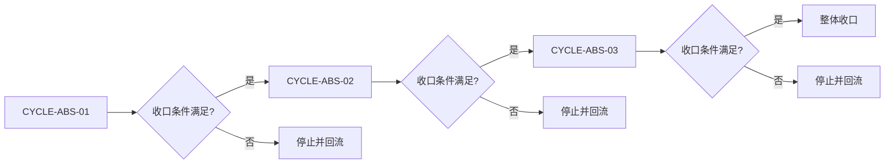
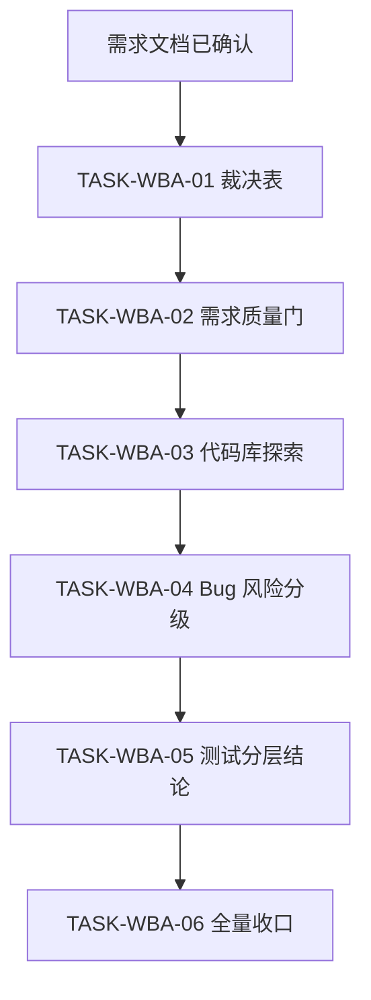
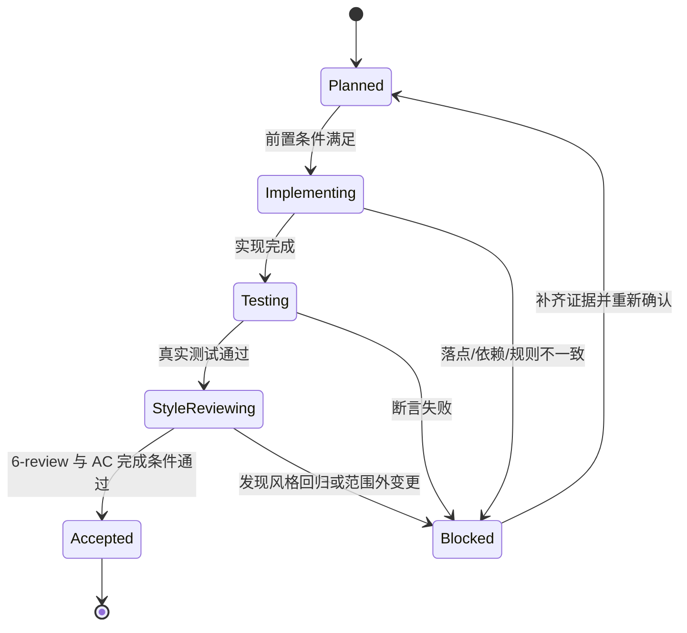

# 实施总览：WorkBuddy 官方市场规则吸收整理补充

结论：本次实施把官方精华按“保留 / 替换 / 合并 / 不吸收”整理进四类 skill，分三个周期、六个最小任务闭环。影响：需求、实施、Bug、测试规则会更强、更可量化，同时不新增同类 skill。范围：只动四类 skill 的 references / 正文、吸收裁决表、文档证据、字典与项目记忆。非范围：不引入官方插件目录、不新建同类 skill、不改无关 skill。变化：四类规则多了 90 分门禁、代码库探索、风险分级、测试分层结论。完成标准：六个任务全部完成实现、真实测试和 6-review，文档机器校验通过。术语说明：无技术术语需要解释。验证状态：计划阶段，真实测试随后执行。

## 1. 当前计划最终方案简要说明

推荐方案：把官方精华作为 references 补充进现有四类 skill，并新增一份吸收裁决表。主落点：`implementation-planning-rules/references/workbuddy-absorption-map.md`、需求域 `requirement-intake-rules`、实施域 `implementation-planning-rules`、Bug 域 `bug-fix-proposal-rules`、测试域 `test-strategy-rules`。为什么先走这条路线：本地已有一套完整流程，只补量化门禁和风险分级，比复制整套流程更符合“不冗余累加”。

## 2. Agent 对当前问题的理解

- 问题 / 目标：让四类 skill 吸收官方精华后更强、更可量化，同时不膨胀 skill 数量。
- 本轮范围：六个最小任务，三个实施周期，全部落盘并验证。
- 非范围：不引入官方插件目录、不新建同类 skill、不执行 Git 提交。
- 当前优先闭环：周期一先完成吸收裁决表与需求域质量门，周期二完成实施域与 Bug 域，周期三完成测试域与收口。
- 关键假设 / 待确认点：用户已授权吸收方向与并行执行；本地 skill 文件是基线。

## 3. 系统边界与现状基线

- 已核实目录：需求域、实施域、Bug 域、测试域四个 skill 目录均存在。
- 已核实文件：`implementation-planning-rules/references/`、`bug-fix-proposal-rules/references/`、`test-strategy-rules/references/`、`requirement-intake-rules/` 均存在。
- 图片资产决策：`N/A + 原因 + 证据`。原因：本实施总览只修改 Markdown 规则文档，不涉及 UI、截图或位图资产。证据：流程与时序已由 Mermaid 表达。
- `unresolved_decisions`：无。所有真实不确定且影响大的方向已由用户确认：吸收不是累加、不新建同类 skill、允许多 agent 并行。
- 代码落点目录树：

```text
implementation-planning-rules/
├── references/
│   └── workbuddy-absorption-map.md        # 新增吸收裁决表
requirement-intake-rules/
├── SKILL.md                               # 需求质量门引用
└── references/
    └── workbuddy-quality-gate.md          # 新增 100 分质量门参考
implementation-planning-rules/
├── SKILL.md                               # 代码库探索引用
└── references/
    └── pre-implementation-code-exploration.md  # 新增代码库探索参考
bug-fix-proposal-rules/
├── SKILL.md                               # 风险分级引用
└── references/
    └── fix-risk-grading-and-confirmation.md    # 新增风险分级决策表
test-strategy-rules/
├── SKILL.md                               # 测试分层结论引用
└── references/
    └── risk-based-test-conclusion.md      # 新增测试分层结论参考
```

## 4. 跨会话独立执行与外部项目代码引用清单

- 新会话接手第一步：读取本实施总览与当前周期文档，核对 `CYCLE-ABS-01` / `TASK-WBA-01` 状态，再继续。
- 主项目名称与项目根：`D:\luode\luode-skills`
- 主项目仓库类型与代码基线：本地 skill 仓库，未读取 git commit；以 skill 文件内容为基线。
- 计划源文件与版本：本实施总览 v1.0。
- 依赖安装、local 配置和服务启动入口：Python 3 可用，无需安装依赖。
- 中断点核验顺序：先核对 `PROJECT_CURRENT.md` 投影，再核对已落盘文档与测试证据。
- 外部项目代码引用：`N/A + 原因 + 证据`。原因：WorkBuddy 官方市场缓存仅作只读参考，不复制其代码或目录。证据：任务范围明确为本地 skill 整理，官方缓存只读路径已记录在需求文档 `SRC-WBA-002` 至 `SRC-WBA-007`。

## 5. 实施周期总览

| 顺序 | 周期 ID | 期次定位 | 单一周期目标 | 进入条件 | 收口条件 | 依赖 | 文档 |
| --- | --- | --- | --- | --- | --- | --- | --- |
| 1 | `CYCLE-ABS-01` | 第一期 | 吸收裁决表与需求域质量门 | 需求文档已落盘并通过校验 | 两个任务实现、真实测试、6-review 全部闭环 | 无 | `./2026-08-13_110000_WorkBuddy官方市场规则吸收整理补充_实施周期01_吸收裁决表与需求域质量门.md` |
| 2 | `CYCLE-ABS-02` | 第二期 | 实施域代码库探索与 Bug 域风险分级 | 周期一收口 | 两个任务实现、真实测试、6-review 全部闭环 | 周期一 | `./2026-08-13_110000_WorkBuddy官方市场规则吸收整理补充_实施周期02_实施域与Bug域整理.md` |
| 3 | `CYCLE-ABS-03` | 第三期 | 测试域分层结论与整体收口 | 周期二收口 | 两个任务实现、真实测试、6-review、字典、记忆全部闭环 | 周期二 | `./2026-08-13_110000_WorkBuddy官方市场规则吸收整理补充_实施周期03_测试域与收口.md` |

图形目的与关联 ID：此图为周期门禁流程图，关联 `CYCLE-ABS-01`、`CYCLE-ABS-02`、`CYCLE-ABS-03`。



图形目的与关联 ID：此图为六个最小任务依赖图，关联 `TASK-WBA-01`、`TASK-WBA-02`、`TASK-WBA-03`、`TASK-WBA-04`、`TASK-WBA-05`、`TASK-WBA-06`。



图形目的与关联 ID：此图为任务状态迁移与阻断回流图，关联 `TASK-WBA-01`、`TASK-WBA-02`、`TASK-WBA-03`、`TASK-WBA-04`、`TASK-WBA-05`、`TASK-WBA-06`。



## 6. 阶段计划

| 阶段 | 周期 | 唯一目标 | 输入 | 输出 | 验证门槛 |
| --- | --- | --- | --- | --- | --- |
| `PHASE-ABS-01` | `CYCLE-ABS-01` | 落盘吸收裁决表 | 需求文档与官方缓存 | `workbuddy-absorption-map.md` | 文件存在且每条官方精华有裁决 |
| `PHASE-ABS-02` | `CYCLE-ABS-01` | 需求域质量门 | 裁决表 | `workbuddy-quality-gate.md` 与 skill 引用 | 文档校验通过 |
| `PHASE-ABS-03` | `CYCLE-ABS-02` | 实施域代码库探索 | 裁决表 | `pre-implementation-code-exploration.md` 与 skill 引用 | 文档校验通过 |
| `PHASE-ABS-04` | `CYCLE-ABS-02` | Bug 域风险分级 | 裁决表 | `fix-risk-grading-and-confirmation.md` 与 skill 引用 | 文档校验通过 |
| `PHASE-ABS-05` | `CYCLE-ABS-03` | 测试域分层结论 | 裁决表 | `risk-based-test-conclusion.md` 与 skill 引用 | 文档校验通过 |
| `PHASE-ABS-06` | `CYCLE-ABS-03` | 全量测试、6-review、字典与记忆 | 全部任务证据 | 测试主文档、6-review、字典、`PROJECT_MEMORY.md` | 全量测试通过、字典刷新成功 |

## 7. 最小任务清单

| 周期内顺序 | 任务 ID | 垂直切片目标 | 预计文件数 | 文件/符号契约 | 真实测试 | 完成条件 | 停止条件 |
| --- | --- | --- | ---: | --- | --- | --- | --- |
| 1 | `TASK-WBA-01` | 落盘吸收裁决表 | 1 | `implementation-planning-rules/references/workbuddy-absorption-map.md` | `TEST-WBA-01` | 裁决表存在且每条官方精华有裁决 | 官方缓存不可读或裁决冲突 |
| 2 | `TASK-WBA-02` | 需求域 100 分质量门 | 3 | `requirement-intake-rules/SKILL.md`、`references/workbuddy-quality-gate.md` | `TEST-WBA-02` | 质量门与 90 分门禁存在 | 需求域规则冲突 |
| 3 | `TASK-WBA-03` | 实施域代码库探索 | 3 | `implementation-planning-rules/SKILL.md`、`references/pre-implementation-code-exploration.md` | `TEST-WBA-03` | 探索与批准规则存在 | 实施域规则冲突 |
| 4 | `TASK-WBA-04` | Bug 域风险分级 | 3 | `bug-fix-proposal-rules/SKILL.md`、`references/fix-risk-grading-and-confirmation.md` | `TEST-WBA-04` | 风险分级决策表存在 | Bug 域规则冲突 |
| 5 | `TASK-WBA-05` | 测试域分层结论 | 3 | `test-strategy-rules/SKILL.md`、`references/risk-based-test-conclusion.md` | `TEST-WBA-05` | 分层结论与优先级模型存在 | 测试域规则冲突 |
| 6 | `TASK-WBA-06` | 全量测试、6-review、字典与记忆 | 6 | 测试主文档、6-review、字典、`PROJECT_MEMORY.md` | `TEST-WBA-06` | 全量测试通过、字典刷新成功、记忆同步 | 测试失败或字典失败 |

| 来源/完成条件 | 周期 | 任务 | 文件/符号 | 测试 | 风格回归 | 证据 | 状态 |
| --- | --- | --- | --- | --- | --- | --- | --- |
| `REQ-WBA-005` / `AC-WBA-005` | `CYCLE-ABS-01` | `TASK-WBA-01` | `implementation-planning-rules/references/workbuddy-absorption-map.md` | `TEST-WBA-01` | `STYLE-WBA-01` | `EVD-TASK-WBA-01-IMPL` / `EVD-TASK-WBA-01-TEST` / `EVD-TASK-WBA-01-STYLE` | planned |
| `REQ-WBA-001` / `AC-WBA-001` | `CYCLE-ABS-01` | `TASK-WBA-02` | `requirement-intake-rules/SKILL.md`、`references/workbuddy-quality-gate.md` | `TEST-WBA-02` | `STYLE-WBA-02` | `EVD-TASK-WBA-02-IMPL` / `EVD-TASK-WBA-02-TEST` / `EVD-TASK-WBA-02-STYLE` | planned |
| `REQ-WBA-002` / `AC-WBA-002` | `CYCLE-ABS-02` | `TASK-WBA-03` | `implementation-planning-rules/SKILL.md`、`references/pre-implementation-code-exploration.md` | `TEST-WBA-03` | `STYLE-WBA-03` | `EVD-TASK-WBA-03-IMPL` / `EVD-TASK-WBA-03-TEST` / `EVD-TASK-WBA-03-STYLE` | planned |
| `REQ-WBA-003` / `AC-WBA-003` | `CYCLE-ABS-02` | `TASK-WBA-04` | `bug-fix-proposal-rules/SKILL.md`、`references/fix-risk-grading-and-confirmation.md` | `TEST-WBA-04` | `STYLE-WBA-04` | `EVD-TASK-WBA-04-IMPL` / `EVD-TASK-WBA-04-TEST` / `EVD-TASK-WBA-04-STYLE` | planned |
| `REQ-WBA-004` / `AC-WBA-004` | `CYCLE-ABS-03` | `TASK-WBA-05` | `test-strategy-rules/SKILL.md`、`references/risk-based-test-conclusion.md` | `TEST-WBA-05` | `STYLE-WBA-05` | `EVD-TASK-WBA-05-IMPL` / `EVD-TASK-WBA-05-TEST` / `EVD-TASK-WBA-05-STYLE` | planned |
| `REQ-WBA-006` / `AC-WBA-006` | `CYCLE-ABS-03` | `TASK-WBA-06` | 测试主文档、6-review、字典、`PROJECT_MEMORY.md` | `TEST-WBA-06` | `STYLE-WBA-06` | `EVD-TASK-WBA-06-IMPL` / `EVD-TASK-WBA-06-TEST` / `EVD-TASK-WBA-06-STYLE` | planned |

## 8. 现状与落点

- 涉及目录：`implementation-planning-rules/`、`requirement-intake-rules/`、`bug-fix-proposal-rules/`、`test-strategy-rules/`、`doc/`、`skill-dictionary/`。
- 涉及文件 / 模块：见第 3 章目录树。
- 复用点：现有 skill 的 `references/` 目录、`artifact-delivery-gate-rules/scripts/validate_engineering_docs.py`、`skill-dictionary/generate_dictionary.py`。
- 需要新增的内容：吸收裁决表、质量门、代码库探索、风险分级、测试分层结论五份 reference。
- 代码落点目录树：见第 3 章。

## 9. 真实测试安排

| 测试对象 | 真实测试命令 | 断言 / 通过标准 |
| --- | --- | --- |
| 吸收裁决表 | `Test-Path implementation-planning-rules/references/workbuddy-absorption-map.md` | 文件存在且非空 |
| 需求质量门 | `python -B artifact-delivery-gate-rules/scripts/validate_engineering_docs.py --profile requirement --doc doc/2-需求/2026-08-13_110000_WorkBuddy官方市场规则吸收整理补充.md --root D:\luode\luode-skills` | 校验通过 |
| 全量 Python 测试 | `python -B test/run_python_tests.py` | 退出码 0 |

## 10. 风险与阻断项

| 风险 / 阻断 | 级别 | 影响 | 缓解 / 恢复 |
| --- | --- | --- | --- |
| 需求文档未通过机器校验 | P0 | 无法进入实施 | 修复文档结构与图注后再进入周期一 |
| 官方缓存不可读 | P1 | 吸收裁决表证据不足 | 记录 `GAP-WBA-001`，暂停吸收 |
| 规则冲突 | P1 | 四域 skill 口径不一致 | 回写 `GAP-WBA-002`，按周期停止并回流 |
| 全量测试失败 | P1 | 收口不成立 | 修复后重跑，测试失败不跳闸 |

## 11. 任务完成、停止与最大推进边界

- 最大推进边界：本轮只推进六个最小任务与三份周期文档、五份 references、测试与字典、项目记忆；不新增 skill、不引入官方插件目录。
- 任务完成条件：六个任务全部通过真实测试与 6-review，文档校验通过，字典刷新成功。
- 停止条件：任一步骤真实测试失败、文档校验失败、规则冲突或超出范围时停止并回流。

## 12. 自审结论

- 自审结论：实施总览覆盖当前计划最终方案、实施周期总览、阶段计划、最小任务清单、现状与落点、真实测试安排、风险与阻断项、任务完成、停止与最大推进边界。
