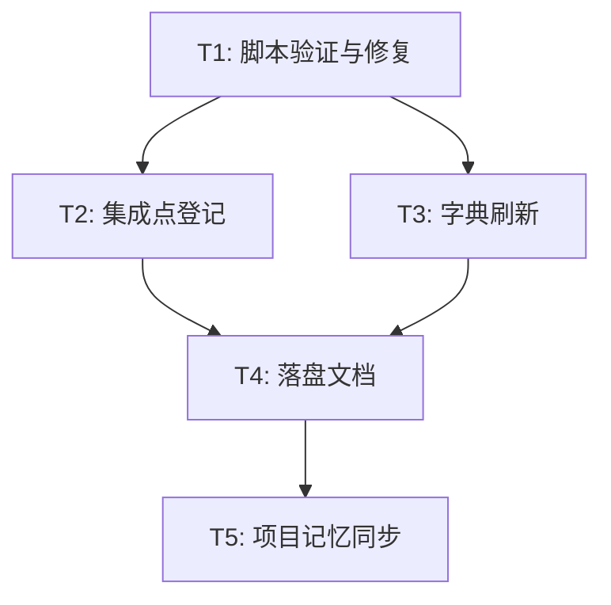

# 实施总览：长任务自动循环 skill 创建

结论：新建 `long-run-loop-rules` skill 并完成脚本验证、集成登记与字典刷新。影响：新增 1 个 skill 目录（1 个 SKILL.md、3 个 references、3 个 scripts），修改 deferred-gate-registry.md、skill-dictionary/data.js、字典.md。范围：上述文件与目录。非范围：不改动 autonomous-execution-rules、parallel-task-dispatch-rules、continuous-code-quality-supervisor-rules 的既有语义。变化：新增控制器模式与完成标记验证机制；修复 `loop_controller.py` start 命令未传参数被 None 覆盖默认值的缺陷。完成标准：5 个最小任务全部完成，脚本 smoke test 通过，字典生成退出码 0。术语说明：控制器模式 = 主 agent 只做管理决策不写业务代码。验证状态：5 个任务全部完成，脚本验证与门禁通过。

## 当前计划最终方案简要说明

前一会话已创建 SKILL.md、3 个 references 与 3 个 scripts；本会话负责收尾：验证并修复脚本缺陷、登记集成点、刷新字典、落盘文档并同步项目记忆。

## Agent 对当前问题的理解

- 问题/目标：把用户提供的控制器模式设计落成可用的 `long-run-loop-rules` skill，并完成与既有体系的集成。
- 本轮范围：脚本验证 + 修复、deferred-gate-registry 登记、字典刷新、落盘文档、记忆同步。
- 非范围：不新增 create_thread / wait_threads 之外的平台依赖，不执行 Git 历史写入。
- 当前优先闭环：T1 脚本验证与修复 -> T2 集成登记 -> T3 字典刷新 -> T4 落盘文档 -> T5 记忆同步。
- 关键假设：完成标记默认 XML 包裹式、max_iterations 默认 50、状态文件走 `$CODEX_HOME/state/`。

## 图片资产决策

N/A + 原因：本次为 skill 与脚本创建，无界面、截图或视觉产物 + 证据：改动范围只有 Markdown、Python 与 JSON/JS。

## 已冻结决策与方案比较

| ID | 决策问题 | 选定方案 | 排除原因 | 影响面 |
| --- | --- | --- | --- | --- |
| DEC-01 | 字典归属 | 以「扩展种子」入库 | 不并入主规划总控层，与 autonomous-execution-rules 的 L1 递进保持一致 | 字典 seed_total 34 -> 35 |
| DEC-02 | 脚本默认值覆盖 | 仅显式传入参数才覆盖默认值 | 原实现把未传参数覆盖成 None，丢失 checkpoint_interval 与 max_runtime_minutes 默认值 | loop_controller.py start 命令 |

## 系统边界与现状基线

- 工作树：本轮改动前，long-run-loop-rules 目录已由前会话创建（SKILL.md + 3 references + 3 scripts）。
- 涉及目录：long-run-loop-rules、skill-hit-check-rules、skill-dictionary。
- 共改 4 个文件 + 2 个新文档 + 1 个新 skill 目录。

## 实施周期总览

| 周期 | 目标 | 进入条件 | 收口条件 | 依赖 |
| --- | --- | --- | --- | --- |
| CYCLE-LRL-01 | 长任务自动循环 skill 收尾 | 需求已落盘 | 5 个任务完成，脚本 smoke test 通过，字典退出码 0 | 无 |

## 阶段计划

| 阶段 | 内容 |
| --- | --- |
| 需求冻结 | 落盘 `doc/2-需求/2026-08-13_REQ-LRL-001_长任务自动循环skill创建.md` |
| 实施 | T1 至 T5 逐个闭环 |
| 验证 | 脚本 smoke test + 字典生成器退出码 |
| 收口 | 落盘本总览与周期文档，同步项目记忆四件套 |

## 最小任务清单

| 任务 | 目标 | 验证方式 | 状态 |
| --- | --- | --- | --- |
| TASK-LRL-01 | 验证并修复三个脚本 | py_compile + smoke test，含标记/不含标记/regex、状态机、死循环检测 | 完成 |
| TASK-LRL-02 | 修复 loop_controller 默认值覆盖缺陷 | start 传单参数复测，断言默认值保留 | 完成 |
| TASK-LRL-03 | deferred-gate-registry 登记 | 表内存在 long-run-loop-rules 行 | 完成 |
| TASK-LRL-04 | 刷新字典 | 生成器退出码 0，seed_total 34 -> 35 | 完成 |
| TASK-LRL-05 | 落盘文档与记忆同步 | 需求 + 总览文档落盘，四件套与日志更新 | 完成 |

## 测试映射

| 任务 | 测试 | 结果 |
| --- | --- | --- |
| TASK-LRL-01 | check_completion_marker 三输入、loop_controller 全流程、detect_dead_loop 正反例 | 通过 |
| TASK-LRL-02 | 默认值保留断言（max_iterations=50、checkpoint_interval=10、max_runtime_minutes=480） | 通过 |
| TASK-LRL-04 | generate_dictionary.py 退出码 0 | 通过 |

## 风险与回退

| 类型 | 内容 | 处理 |
| --- | --- | --- |
| 风险 | 控制器运行时行为无法在无 Goal 环境验证 | 脚本级 smoke test 覆盖可验证部分，运行时行为留待真实 Goal 环境 |
| 回退 | 若字典生成异常 | 保留原 data.js 与字典.md，回退改动 |

## 收口结论

5 个最小任务全部完成，三个脚本语法与功能验证通过，默认值覆盖缺陷已修复，集成登记与字典刷新到位，需求与实施文档落盘，项目记忆同步。改动停在已改动未提交状态。
