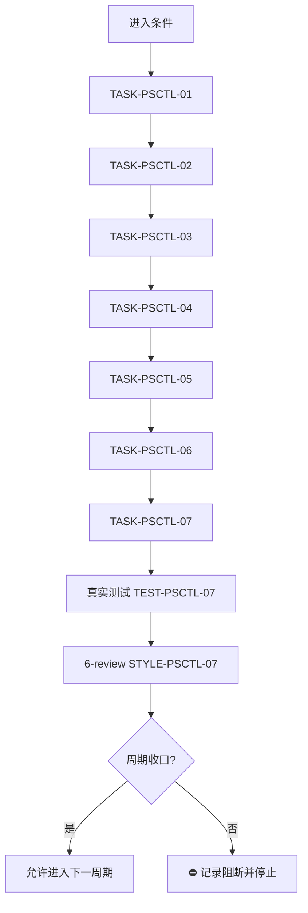
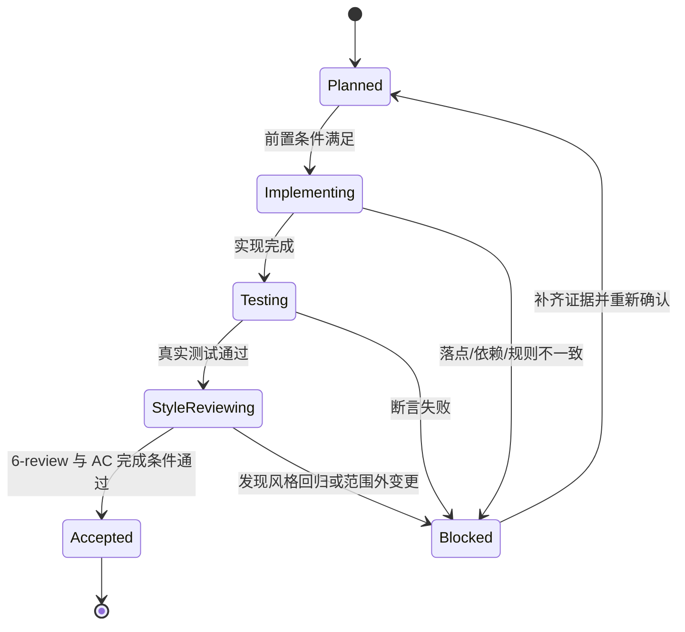

# 实施周期 01：标准调用前缀与三 skill 衔接

结论：本周期只做两件事：把 PowerShell 命令调用前缀模板写入 reference，并把三份 skill 的交叉引用补齐。影响：后续 agent 在 Windows 上运行 PowerShell 专项命令时，会先按统一前缀执行并保持中文不乱码。范围：reference、三份 SKILL.md、项目记忆与字典。非范围：不修改 PowerShell 脚本实现、不安装软件、不修改 `tool-manifest.yaml`。变化：5.1 路径必须设置 UTF-8 输出编码，7 路径继续优先 `pwsh`。完成标准：七个任务完成实现、真实测试、6-review，周期收口。术语说明：无技术术语需要解释。验证状态：计划阶段，真实测试随后执行。

## 1. 当前周期目标

- 周期 ID / 期次定位：`CYCLE-PSCTL-01` / 第一期
- 只做这一件事：标准调用前缀与三 skill 衔接
- 对应需求、验收和实施总览：`REQ-PSCTL-20260814-001`、`AC-PSCTL-001` 至 `AC-PSCTL-005`、`2026-08-14_223800_PowerShell控制继续优化_实施总览.md`
- 本周期不做：不修改 PowerShell 脚本实现、不安装软件、不新增 manifest 工具

## 2. 周期图片资产决策与边界

- 图片资产决策：`N/A + 原因 + 证据`。原因：本周期只修改 Markdown 规则文档，不涉及 UI、截图或位图。证据：流程与时序由 Mermaid 表达。

## 3. 进入条件与收口条件

| 类型 | 条件 | 证据/命令 | 状态 |
| --- | --- | --- | --- |
| 进入 | 需求文档已落盘并通过校验 | `python -B artifact-delivery-gate-rules/scripts/validate_engineering_docs.py --profile requirement --doc doc/2-需求/2026-08-14_223800_PowerShell控制继续优化.md --root F:\luode-skills` | 已完成 |
| 收口 | 七个任务实现、真实测试、6-review 全部闭环 | 见各任务证据 | 待执行 |

图形目的与关联 ID：此图为周期 01 单任务闭环流程图，关联 `CYCLE-PSCTL-01`、`TASK-PSCTL-01` 至 `TASK-PSCTL-07`。

图形目的：说明本周期任务状态迁移与阻断回流。关联 ID：`TASK-PSCTL-01` 至 `TASK-PSCTL-07`。

## 4. 当前代码/文档基线

- 分支 / 提交：git commit `e589f58`。
- 已核实文件和符号：`wsl-windows-bridge/references/powershell-fallback-patterns.md`、`wsl-windows-bridge/SKILL.md`、`windows-encoding-rules/SKILL.md`、`windows-powershell-environment-rules/SKILL.md` 均存在。
- 依赖版本与 local 配置：Python 3 可用，无需安装依赖。
- 与计划不一致时的停止规则：发现符号不存在、文件内容漂移或规则冲突，立即停止并回写 `GAP-*`，不得猜测替代落点。

## 5. 跨会话执行入口与外部项目代码引用

- 新会话接手第一步：核对 `PROJECT_CURRENT.md` 投影，再读本周期文档。
- 主项目名称与项目根：`F:\luode-skills`
- 主项目仓库类型与代码基线：本地 skill 仓库，git commit `e589f58`。
- 当前周期 / 任务标识与中断点核验顺序：`CYCLE-PSCTL-01` / `TASK-PSCTL-01`；先核验实施文档是否已落盘。
- local 环境与依赖入口：Python 3。
- 外部项目代码引用：`N/A + 原因 + 证据`。原因：workbuddy 端 skill 只读参考且与本地同一份内容，不复制其代码或目录。证据：`SRC-PSCTL-006`。

## 6. 周期内最小任务执行顺序

| 顺序 | 任务 ID | 唯一目标 | 前置依赖 | 允许文件 | 禁止触碰区 | 状态 |
| ---: | --- | --- | --- | --- | --- | --- |
| 1 | `TASK-PSCTL-01` | 落盘需求、实施总览、实施周期 | 无 | 需求与实施文档 | 其它 skill 目录 | completed |
| 2 | `TASK-PSCTL-02` | 新增标准调用前缀模板 | `TASK-PSCTL-01` | `wsl-windows-bridge/references/powershell-fallback-patterns.md` | 其它 skill 目录 | completed |
| 3 | `TASK-PSCTL-03` | wsl SKILL 暴露前缀引用 | `TASK-PSCTL-02` | `wsl-windows-bridge/SKILL.md` | 其它 skill 目录 | completed |
| 4 | `TASK-PSCTL-04` | encoding SKILL 补充调用前缀与交叉引用 | `TASK-PSCTL-02` | `windows-encoding-rules/SKILL.md` | 其它 skill 目录 | completed |
| 5 | `TASK-PSCTL-05` | env SKILL 补充入口拦截指针 | `TASK-PSCTL-02` | `windows-powershell-environment-rules/SKILL.md` | 其它 skill 目录 | completed |
| 6 | `TASK-PSCTL-06` | 同步 `PROJECT_MEMORY.md` 与 skill 字典 | `TASK-PSCTL-03`、`TASK-PSCTL-04`、`TASK-PSCTL-05` | `PROJECT_MEMORY.md`、`skill-dictionary/data.js`、`字典.md` | 其它 skill 目录 | completed |
| 7 | `TASK-PSCTL-07` | 落盘测试主文档、6-review 并收口 | `TASK-PSCTL-06` | `doc/5-tests/`、`doc/6-review/`、`PROJECT_CURRENT.md` | 其它 skill 目录 | completed |

## 6.1 最小任务闭环

| 任务 | 实现动作 | 真实测试 | 6-review | 完成条件 | 停止条件 |
| --- | --- | --- | --- | --- | --- |
| `TASK-PSCTL-01` | 落盘需求、实施总览、实施周期文档 | `TEST-PSCTL-01` | `STYLE-PSCTL-01` | 三份文档存在且校验通过 | 校验失败 |
| `TASK-PSCTL-02` | 在 `powershell-fallback-patterns.md` 新增标准调用前缀模板 | `TEST-PSCTL-02` | `STYLE-PSCTL-02` | 新章节含 5.1 / 7 双轨片段 | 5.1 前缀缺编码初始化 |
| `TASK-PSCTL-03` | 在 `wsl-windows-bridge/SKILL.md` 暴露前缀引用 | `TEST-PSCTL-03` | `STYLE-PSCTL-03` | 保底模式章节新增引用 | 引用断链 |
| `TASK-PSCTL-04` | 在 `windows-encoding-rules/SKILL.md` 补充调用前缀与交叉引用 | `TEST-PSCTL-04` | `STYLE-PSCTL-04` | 新增调用前缀章节并交叉引用 | 与 reference 不一致 |
| `TASK-PSCTL-05` | 在 `windows-powershell-environment-rules/SKILL.md` 补充入口拦截指针 | `TEST-PSCTL-05` | `STYLE-PSCTL-05` | 默认边界后新增 inline 调用指针 | 指针缺失 |
| `TASK-PSCTL-06` | 同步 `PROJECT_MEMORY.md` 与 skill 字典 | `TEST-PSCTL-06` | `STYLE-PSCTL-06` | 记忆与字典同步成功 | 字典刷新失败 |
| `TASK-PSCTL-07` | 落盘测试主文档、6-review 并收口 | `TEST-PSCTL-07` | `STYLE-PSCTL-07` | 全量测试通过、6-review PASS | 测试失败或 6-review FIX_REQUIRED |

## 6.2 当前周期验证矩阵

| 验证点 | 验证方式 | 通过标准 | 证据 |
| --- | --- | --- | --- |
| 三份实施文档 | 机器校验 | 校验通过 | `EVD-TASK-PSCTL-01-TEST` |
| 前缀模板 | `Select-String` | 5.1 / 7 双轨片段存在 | `EVD-TASK-PSCTL-02-TEST` |
| 三份 skill 引用 | `Select-String` | 三份引用存在 | `EVD-TASK-PSCTL-03-TEST` / `EVD-TASK-PSCTL-04-TEST` / `EVD-TASK-PSCTL-05-TEST` |
| 记忆与字典 | 脚本运行 | 字典刷新成功 | `EVD-TASK-PSCTL-06-TEST` |
| 全量测试与 6-review | 测试脚本与风格回归 | 本次相关断言通过；全量结果 `Ran 386 tests`，`FAILED (failures=4, errors=1, skipped=1)`（5 项既有基线问题与本次无关）、STYLE PASS | `EVD-TASK-PSCTL-07-TEST` / `EVD-TASK-PSCTL-07-STYLE` |

## 7. 文件与符号操作契约

| 任务 | 文件路径 | 符号/区段 | 操作 | 修改前职责 | 修改后职责 | 调用方影响 | 兼容要求 |
| --- | --- | --- | --- | --- | --- | --- | --- |
| `TASK-PSCTL-01` | `doc/2-需求/2026-08-14_223800_PowerShell控制继续优化.md` | 全文 | 新增 | 不存在 | 记录需求 | 无 | UTF-8 |
| `TASK-PSCTL-01` | `doc/3-实施/2026-08-14_223800_PowerShell控制继续优化_实施总览.md` | 全文 | 新增 | 不存在 | 记录实施总览 | 无 | UTF-8 |
| `TASK-PSCTL-01` | `doc/3-实施/2026-08-14_223800_PowerShell控制继续优化_实施周期01_标准调用前缀与三skill衔接.md` | 全文 | 新增 | 不存在 | 记录周期与任务 | 无 | UTF-8 |
| `TASK-PSCTL-02` | `wsl-windows-bridge/references/powershell-fallback-patterns.md` | 新增“PowerShell 命令前缀模板”章节 | 新增 | 无前缀模板 | 提供 5.1 / 7 双轨模板 | 无 | UTF-8 |
| `TASK-PSCTL-03` | `wsl-windows-bridge/SKILL.md` | `## PowerShell 专项场景的保底模式` 章节 | 修改 | 未引用前缀模板 | 引用前缀模板 | 无 | 保留原职责 |
| `TASK-PSCTL-04` | `windows-encoding-rules/SKILL.md` | 新增“调用 PowerShell 命令时的标准化前缀”章节 | 修改 | 无前缀模板 | 提供前缀模板并交叉引用 | 无 | 保留原职责 |
| `TASK-PSCTL-05` | `windows-powershell-environment-rules/SKILL.md` | `## 默认边界` 章节 | 修改 | 未引用前缀模板 | 追加 inline 调用指针 | 无 | 保留原职责 |
| `TASK-PSCTL-06` | `PROJECT_MEMORY.md` | Windows PowerShell 环境可靠性规则 | 修改 | 未记录前缀模板 | 记录前缀模板决策 | 无 | 保留稳定规则 |
| `TASK-PSCTL-06` | `skill-dictionary/data.js`、`字典.md` | 字典条目 | 修改 | 旧字典 | 新字典含三 skill | 无 | 字典脚本可重跑 |

## 8. 任务图片资产执行契约

| 任务 | 图片决策 | 生成输入与 imagegen 命令 | 目标资产路径 | Markdown 相对引用 | `IMG-*` / 版本 | 资产清单与引用章节 | Mermaid 不替代说明 |
| --- | --- | --- | --- | --- | --- | --- | --- |
| 全部任务 | `N/A + 原因 + 证据`：纯 Markdown 规则文档 | 无 | 无 | 无 | 无 | 无 | 流程图已由周期图表达 |

## 9. 真实测试与断言

| 测试 ID | 对应任务 | 精确命令 | local 依赖 | fixture/数据 | 断言 | 失败预期 | 清理 |
| --- | --- | --- | --- | --- | --- | --- | --- |
| `TEST-PSCTL-01` | `TASK-PSCTL-01` | `python -B artifact-delivery-gate-rules/scripts/validate_engineering_docs.py --profile implementation_overview --doc doc/3-实施/2026-08-14_223800_PowerShell控制继续优化_实施总览.md --root F:\luode-skills` | Python 3 | 实施文档 | 校验通过 | 校验失败 | 无 |
| `TEST-PSCTL-02` | `TASK-PSCTL-02` | `Select-String -Path wsl-windows-bridge/references/powershell-fallback-patterns.md -Pattern 'powershell.exe -NoProfile -ExecutionPolicy Bypass -Command'` | Windows PowerShell | reference | 命中 | 未命中 | 无 |
| `TEST-PSCTL-03` | `TASK-PSCTL-03` | `Select-String -Path wsl-windows-bridge/SKILL.md -Pattern 'powershell-fallback-patterns.md'` | Windows PowerShell | SKILL.md | 命中 | 未命中 | 无 |
| `TEST-PSCTL-04` | `TASK-PSCTL-04` | `Select-String -Path windows-encoding-rules/SKILL.md -Pattern 'powershell-fallback-patterns.md'` | Windows PowerShell | SKILL.md | 命中 | 未命中 | 无 |
| `TEST-PSCTL-05` | `TASK-PSCTL-05` | `Select-String -Path windows-powershell-environment-rules/SKILL.md -Pattern 'powershell-fallback-patterns.md'` | Windows PowerShell | SKILL.md | 命中 | 未命中 | 无 |
| `TEST-PSCTL-06` | `TASK-PSCTL-06` | `python -B skill-dictionary/generate_dictionary.py` | Python 3 | skill 目录 | 退出码 0 | 退出码非 0 | 无 |
| `TEST-PSCTL-07` | `TASK-PSCTL-07` | `python -B test/run_python_tests.py` | Python 3 | 全量测试 | 退出码 0 | 退出码非 0 | 无 |

## 10. 回滚与停止条件

- `ROLLBACK-PSCTL-001`：删除新增需求、实施总览、实施周期文档。
- `ROLLBACK-PSCTL-002`：删除 `powershell-fallback-patterns.md` 新增章节。
- `ROLLBACK-PSCTL-003`：还原三份 SKILL.md 引用。
- `ROLLBACK-PSCTL-004`：还原 `PROJECT_MEMORY.md` 与字典改动。
- 停止条件：命令失败、断言失败、规则冲突、文件内容漂移、三份引用不一致。
- 恢复路径：回到对应任务重跑。
- 当前 agent 最大推进边界：本周期完成后不自动进入下一周期。

## 11. 周期追踪矩阵

| `REQ-*` / `RULE-*` | `AC-*` | `TASK-*` | 文件/符号 | `TEST-*` | `STYLE-*` | `EVIDENCE-*` | 闭环状态 |
| --- | --- | --- | --- | --- | --- | --- | --- |
| `REQ-PSCTL-001` | `AC-PSCTL-001` | `TASK-PSCTL-02` | `wsl-windows-bridge/references/powershell-fallback-patterns.md` | `TEST-PSCTL-02` | `STYLE-PSCTL-02` | `EVD-TASK-PSCTL-02-IMPL` / `EVD-TASK-PSCTL-02-TEST` / `EVD-TASK-PSCTL-02-STYLE` | completed |
| `REQ-PSCTL-002` | `AC-PSCTL-002` | `TASK-PSCTL-03` | `wsl-windows-bridge/SKILL.md` | `TEST-PSCTL-03` | `STYLE-PSCTL-03` | `EVD-TASK-PSCTL-03-IMPL` / `EVD-TASK-PSCTL-03-TEST` / `EVD-TASK-PSCTL-03-STYLE` | completed |
| `REQ-PSCTL-003` | `AC-PSCTL-003` | `TASK-PSCTL-04` | `windows-encoding-rules/SKILL.md` | `TEST-PSCTL-04` | `STYLE-PSCTL-04` | `EVD-TASK-PSCTL-04-IMPL` / `EVD-TASK-PSCTL-04-TEST` / `EVD-TASK-PSCTL-04-STYLE` | completed |
| `REQ-PSCTL-004` | `AC-PSCTL-004` | `TASK-PSCTL-05` | `windows-powershell-environment-rules/SKILL.md` | `TEST-PSCTL-05` | `STYLE-PSCTL-05` | `EVD-TASK-PSCTL-05-IMPL` / `EVD-TASK-PSCTL-05-TEST` / `EVD-TASK-PSCTL-05-STYLE` | completed |
| `REQ-PSCTL-005` | `AC-PSCTL-005` | `TASK-PSCTL-06` | `PROJECT_MEMORY.md`、`skill-dictionary/data.js`、`字典.md` | `TEST-PSCTL-06` | `STYLE-PSCTL-06` | `EVD-TASK-PSCTL-06-IMPL` / `EVD-TASK-PSCTL-06-TEST` / `EVD-TASK-PSCTL-06-STYLE` | completed |
| `REQ-PSCTL-005` | `AC-PSCTL-005` | `TASK-PSCTL-07` | `doc/5-tests/`、`doc/6-review/`、`PROJECT_CURRENT.md` | `TEST-PSCTL-07` | `STYLE-PSCTL-07` | `EVD-TASK-PSCTL-07-IMPL` / `EVD-TASK-PSCTL-07-TEST` / `EVD-TASK-PSCTL-07-STYLE` | completed |

## 12. 周期自审

- 每个任务是否只承载一个目标：是。
- 是否按实现 -> 真实测试 -> 6-review 风格回归逐个闭环：是。
- 是否存在未决决策或模糊落点：否。
- 图形、表格和正文是否一致：是。

## 12.1 自审结论

- 周期目标单一：通过。
- 最小任务闭环：通过，每个任务都有实现、真实测试、6-review。
- 文件落点：通过，目录树已给出。
- 无未决决策：通过。
- 图文一致性：通过。

## 13. 执行附录

- local 环境：Windows PowerShell / Python 3。
- 执行顺序：先 `TASK-PSCTL-01`，后 `TASK-PSCTL-02` 至 `TASK-PSCTL-07`。
- 精确命令：见第 9 章。
- 清理与回滚：见第 10 章。

## 14. 追踪附录

- 稳定 ID、需求来源、验收依据、证据、追踪矩阵：见第 11 章。
- 附录维护规则：执行附录在前、追踪附录在后，连续位于文档末尾。
