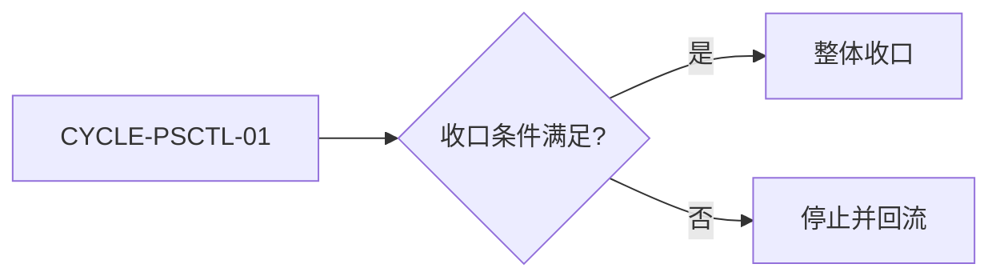
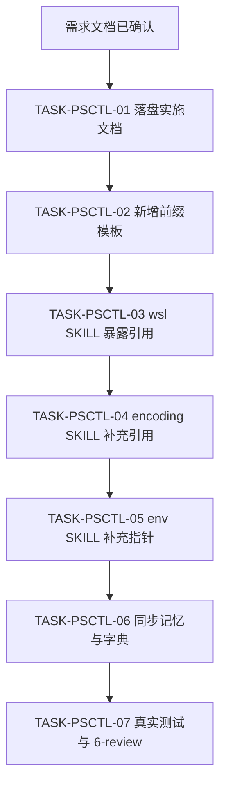
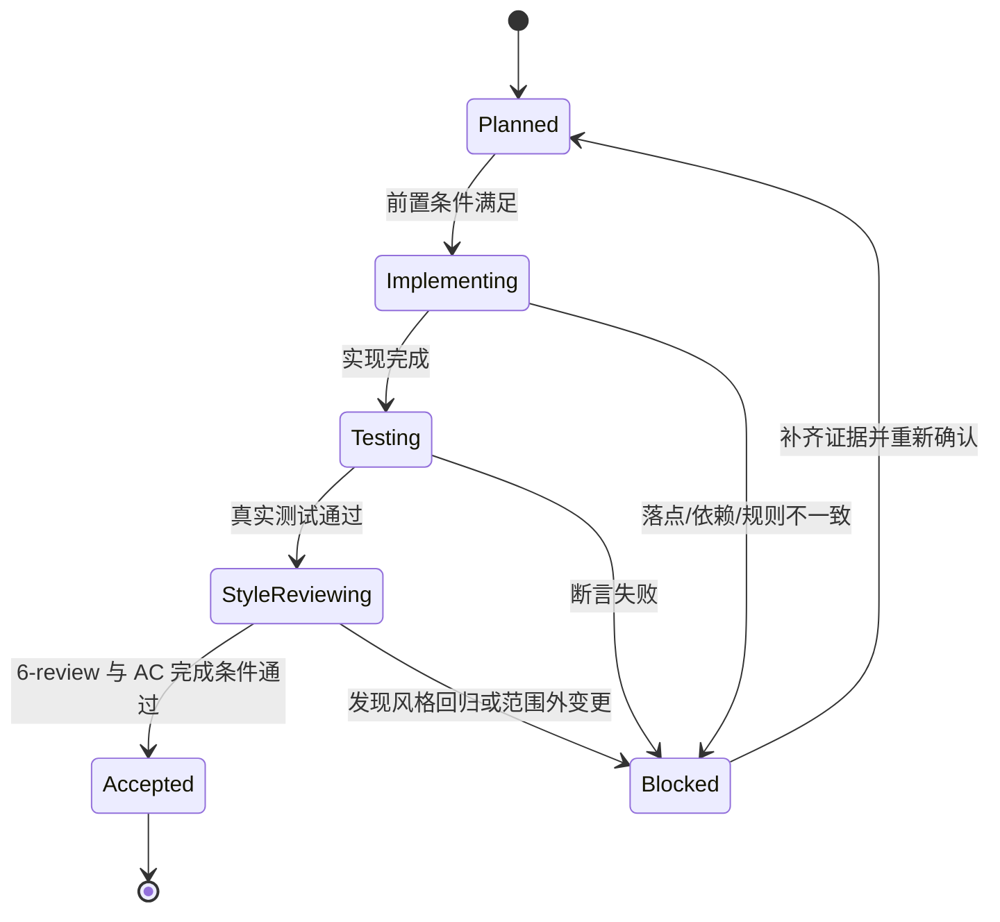

# 实施总览：PowerShell 控制继续优化

结论：本次把截图强调的 PowerShell 命令调用前缀沉淀为可复用模板，并在三个 Windows skill 中补齐引用。影响：后续 agent 在 Windows 上运行 PowerShell 专项命令时，会先按统一前缀执行并保持中文不乱码。范围：只修改 `windows-wsl-execution-rules`、`windows-encoding-rules`、`windows-powershell-environment-rules` 三个 skill 的规则文档，并落盘需求、实施、测试与风格回归证据。非范围：不修改任何 PowerShell 脚本实现、不安装软件、不修改 `tool-manifest.yaml`、不新增 skill、不执行 Git 提交。变化：三份 skill 都能引用同一份“PowerShell 命令调用前缀模板”，其中 5.1 路径必须设置 UTF-8 编码，7 路径继续优先 `pwsh`。完成标准：三份 skill 文档新增引用且互相闭环，需求、实施总览、实施周期、测试、6-review 全部落盘并通过机器校验。术语说明：无技术术语需要解释；“标准调用前缀”指运行 PowerShell 一次命令时固定带 `-NoProfile -ExecutionPolicy Bypass -Command` 并显式设置输出编码的写法。验证状态：当前为已确认需求，实施计划随后落盘，真实测试以文档机器校验与脚本回读为准。

## 1. 当前计划最终方案简要说明

推荐方案：以 `windows-wsl-execution-rules/references/powershell-fallback-patterns.md` 为唯一真源，新增“PowerShell 命令前缀模板”章节，并在 `windows-encoding-rules/SKILL.md` 与 `windows-powershell-environment-rules/SKILL.md` 各自补充交叉引用。主落点：三份 skill 文档与一份 reference。为什么先走这条路线：当前三份 skill 对“何时进 PowerShell”和“进入后语法保底”描述较全，唯独缺少可复制粘贴的命令调用前缀，导致 5.1 路径的中文输出仍可能乱码。

## 2. Agent 对当前问题的理解

- 问题 / 目标：截图强调“调用 PowerShell 命令时必须显式使用 `powershell.exe -NoProfile -ExecutionPolicy Bypass -Command` 并设置 `[Console]::OutputEncoding`”，但三份 skill 都没有把这条规则固化为可直接复用的模板。
- 本轮范围：三份 skill 规则文档、一份 reference、需求 / 实施 / 测试 / 6-review 文档、`PROJECT_MEMORY.md` 与 skill 字典。
- 非范围：不修改 PowerShell 脚本实现、不安装软件、不新增 manifest 工具、不修改 `tool-manifest.yaml`、不执行 Git 提交。
- 当前优先闭环：落盘需求与实施文档，再按周期完成三份 skill 文档修改与收口。
- 关键假设 / 待确认点：用户明确授权继续优化三份 skill，并已允许参考 workbuddy；当前仓库未读取 git commit，以本地 skill 文件内容为基线。

## 3. 系统边界与现状基线

- 已核实目录：`windows-wsl-execution-rules/`、`windows-encoding-rules/`、`windows-powershell-environment-rules/` 均存在。
- 已核实文件：`windows-wsl-execution-rules/references/powershell-fallback-patterns.md` 存在；`windows-wsl-execution-rules/SKILL.md`、`windows-encoding-rules/SKILL.md`、`windows-powershell-environment-rules/SKILL.md` 存在。
- 图片资产决策：`N/A + 原因 + 证据`。原因：本实施总览只修改 Markdown 规则文档，不涉及 UI、截图或位图资产。证据：流程与时序已由 Mermaid 表达。
- `unresolved_decisions`：无。所有真实不确定且影响大的方向已由用户确认：只沉淀三份 skill、不修改 workbuddy 端、不新增 skill。
- 代码落点目录树：

```text
windows-wsl-execution-rules/
├── SKILL.md                                   # 修改：PowerShell 专项保底模式追加模板引用
└── references/
    └── powershell-fallback-patterns.md        # 修改：新增 PowerShell 命令前缀模板章节
windows-encoding-rules/
└── SKILL.md                                   # 修改：新增调用前缀章节并交叉引用
windows-powershell-environment-rules/
└── SKILL.md                                   # 修改：默认边界后追加 inline 调用指针
```

## 4. 跨会话独立执行与外部项目代码引用清单

- 新会话接手第一步：读取本实施总览与当前周期文档，核对 `CYCLE-PSCTL-01` / `TASK-PSCTL-01` 状态，再继续。
- 主项目名称与项目根：`F:\luode-skills`
- 主项目仓库类型与代码基线：本地 skill 仓库，git commit `e589f58`。
- 计划源文件与版本：本实施总览 v1.0。
- 依赖安装、local 配置和服务启动入口：Python 3 可用，无需安装依赖。
- 中断点核验顺序：先核对 `PROJECT_CURRENT.md` 投影，再核对已落盘文档与测试证据。
- 外部项目代码引用：`N/A + 原因 + 证据`。原因：workbuddy 端 skill 只读参考且与本地同一份内容，不复制其代码或目录。证据：`SRC-PSCTL-006`。

## 5. 实施周期总览

| 顺序 | 周期 ID | 期次定位 | 单一周期目标 | 进入条件 | 收口条件 | 依赖 | 文档 |
| --- | --- | --- | --- | --- | --- | --- | --- |
| 1 | `CYCLE-PSCTL-01` | 第一期 | 落盘标准调用前缀并补齐三份 skill 引用 | 需求文档已落盘并通过校验 | 六个任务实现、真实测试、6-review 全部闭环 | 无 | `./2026-08-14_223800_PowerShell控制继续优化_实施周期01_标准调用前缀与三skill衔接.md` |

图形目的与关联 ID：此图为周期门禁流程图，关联 `CYCLE-PSCTL-01`。


图形目的与关联 ID：此图为六个最小任务依赖图，关联 `TASK-PSCTL-01`、`TASK-PSCTL-02`、`TASK-PSCTL-03`、`TASK-PSCTL-04`、`TASK-PSCTL-05`、`TASK-PSCTL-06`。


图形目的与关联 ID：此图为任务状态迁移与阻断回流图，关联 `TASK-PSCTL-01` 至 `TASK-PSCTL-07`。


## 6. 阶段计划

| 阶段 | 周期 | 唯一目标 | 输入 | 输出 | 验证门槛 |
| --- | --- | --- | --- | --- | --- |
| `PHASE-PSCTL-01` | `CYCLE-PSCTL-01` | 落盘需求与实施文档 | 需求已确认 | 需求、实施总览、实施周期文档 | 文档机器校验通过 |
| `PHASE-PSCTL-02` | `CYCLE-PSCTL-01` | 新增标准调用前缀模板 | 实施文档 | `powershell-fallback-patterns.md` 新章节 | 文件存在且片段可检索 |
| `PHASE-PSCTL-03` | `CYCLE-PSCTL-01` | 三份 skill 引用补齐 | 前缀模板 | 三份 SKILL.md 交叉引用 | 三份引用可互相解析 |
| `PHASE-PSCTL-04` | `CYCLE-PSCTL-01` | 同步记忆与字典 | 全部文档 | `PROJECT_MEMORY.md`、skill 字典 | 字典刷新成功 |
| `PHASE-PSCTL-05` | `CYCLE-PSCTL-01` | 真实测试与 6-review | 全部实现 | 测试主文档、6-review | 全量测试通过、6-review PASS |

## 7. 最小任务清单

| 周期内顺序 | 任务 ID | 垂直切片目标 | 预计文件数 | 文件/符号契约 | 真实测试 | 完成条件 | 停止条件 |
| --- | --- | --- | ---: | --- | --- | --- | --- |
| 1 | `TASK-PSCTL-01` | 落盘需求、实施总览、实施周期 | 3 | `doc/2-需求/...PowerShell控制继续优化.md`、`doc/3-实施/..._实施总览.md`、`doc/3-实施/..._实施周期01_....md` | `TEST-PSCTL-01` | 三份文档存在且校验通过 | 校验失败 |
| 2 | `TASK-PSCTL-02` | 在 `powershell-fallback-patterns.md` 新增标准调用前缀模板 | 1 | `windows-wsl-execution-rules/references/powershell-fallback-patterns.md` | `TEST-PSCTL-02` | 新增章节含 5.1 / 7 双轨片段 | 5.1 前缀缺编码初始化 |
| 3 | `TASK-PSCTL-03` | 在 `windows-wsl-execution-rules/SKILL.md` 暴露前缀引用 | 1 | `windows-wsl-execution-rules/SKILL.md` | `TEST-PSCTL-03` | 保底模式章节新增引用 | 引用断链 |
| 4 | `TASK-PSCTL-04` | 在 `windows-encoding-rules/SKILL.md` 补充调用前缀与交叉引用 | 1 | `windows-encoding-rules/SKILL.md` | `TEST-PSCTL-04` | 新增调用前缀章节并交叉引用 | 与 reference 不一致 |
| 5 | `TASK-PSCTL-05` | 在 `windows-powershell-environment-rules/SKILL.md` 补充入口拦截指针 | 1 | `windows-powershell-environment-rules/SKILL.md` | `TEST-PSCTL-05` | 默认边界后新增 inline 调用指针 | 指针缺失 |
| 6 | `TASK-PSCTL-06` | 同步 `PROJECT_MEMORY.md` 与 skill 字典 | 3 | `PROJECT_MEMORY.md`、`skill-dictionary/data.js`、`字典.md` | `TEST-PSCTL-06` | 记忆与字典同步成功 | 字典刷新失败 |
| 7 | `TASK-PSCTL-07` | 落盘测试主文档、6-review 并收口 | 3 | `doc/5-tests/...`、`doc/6-review/...`、`PROJECT_CURRENT.md` | `TEST-PSCTL-07` | 全量测试通过、6-review PASS | 测试失败或 6-review FIX_REQUIRED |

| 来源/完成条件 | 周期 | 任务 | 文件/符号 | 测试 | 风格回归 | 证据 | 状态 |
| --- | --- | --- | --- | --- | --- | --- | --- |
| `REQ-PSCTL-001` / `AC-PSCTL-001` | `CYCLE-PSCTL-01` | `TASK-PSCTL-02` | `windows-wsl-execution-rules/references/powershell-fallback-patterns.md` | `TEST-PSCTL-02` | `STYLE-PSCTL-02` | `EVD-TASK-PSCTL-02-IMPL` / `EVD-TASK-PSCTL-02-TEST` / `EVD-TASK-PSCTL-02-STYLE` | completed |
| `REQ-PSCTL-002` / `AC-PSCTL-002` | `CYCLE-PSCTL-01` | `TASK-PSCTL-03` | `windows-wsl-execution-rules/SKILL.md` | `TEST-PSCTL-03` | `STYLE-PSCTL-03` | `EVD-TASK-PSCTL-03-IMPL` / `EVD-TASK-PSCTL-03-TEST` / `EVD-TASK-PSCTL-03-STYLE` | completed |
| `REQ-PSCTL-003` / `AC-PSCTL-003` | `CYCLE-PSCTL-01` | `TASK-PSCTL-04` | `windows-encoding-rules/SKILL.md` | `TEST-PSCTL-04` | `STYLE-PSCTL-04` | `EVD-TASK-PSCTL-04-IMPL` / `EVD-TASK-PSCTL-04-TEST` / `EVD-TASK-PSCTL-04-STYLE` | completed |
| `REQ-PSCTL-004` / `AC-PSCTL-004` | `CYCLE-PSCTL-01` | `TASK-PSCTL-05` | `windows-powershell-environment-rules/SKILL.md` | `TEST-PSCTL-05` | `STYLE-PSCTL-05` | `EVD-TASK-PSCTL-05-IMPL` / `EVD-TASK-PSCTL-05-TEST` / `EVD-TASK-PSCTL-05-STYLE` | completed |
| `REQ-PSCTL-005` / `AC-PSCTL-005` | `CYCLE-PSCTL-01` | `TASK-PSCTL-06` | `PROJECT_MEMORY.md`、`skill-dictionary/data.js`、`字典.md` | `TEST-PSCTL-06` | `STYLE-PSCTL-06` | `EVD-TASK-PSCTL-06-IMPL` / `EVD-TASK-PSCTL-06-TEST` / `EVD-TASK-PSCTL-06-STYLE` | completed |

## 8. 现状与落点

- 涉及目录：`windows-wsl-execution-rules/`、`windows-encoding-rules/`、`windows-powershell-environment-rules/`、`doc/`、`skill-dictionary/`。
- 涉及文件 / 模块：见第 3 章目录树。
- 复用点：现有 skill 的 `references/` 目录、`artifact-delivery-gate-rules/scripts/validate_engineering_docs.py`、`skill-dictionary/generate_dictionary.py`。
- 需要新增的内容：`powershell-fallback-patterns.md` 新章节、三个 SKILL.md 交叉引用。
- 代码落点目录树：见第 3 章。

## 9. 真实测试安排

| 测试对象 | 真实测试命令 | 断言 / 通过标准 |
| --- | --- | --- |
| 需求文档 | `python -B artifact-delivery-gate-rules/scripts/validate_engineering_docs.py --profile requirement --doc doc/2-需求/2026-08-14_223800_PowerShell控制继续优化.md --root F:\luode-skills` | 校验通过 |
| 实施总览 | `python -B artifact-delivery-gate-rules/scripts/validate_engineering_docs.py --profile implementation_overview --doc doc/3-实施/2026-08-14_223800_PowerShell控制继续优化_实施总览.md --root F:\luode-skills` | 校验通过 |
| 前缀模板 | `Select-String -Path windows-wsl-execution-rules/references/powershell-fallback-patterns.md -Pattern 'powershell.exe -NoProfile -ExecutionPolicy Bypass -Command'` | 命中 |
| 三份 skill 引用 | `Select-String -Path windows-*-rules/SKILL.md -Pattern 'powershell-fallback-patterns.md'` | 三份引用都存在 |
| 全量 Python 测试 | `python -B test/run_python_tests.py` | 本次相关断言通过；全量结果 `Ran 386 tests`，`FAILED (failures=4, errors=1, skipped=1)`，5 项均为既有历史基线/知识库/CRLF 问题，与本次改动无关 |

## 10. 风险与阻断项

| 风险 / 阻断 | 级别 | 影响 | 缓解 / 恢复 |
| --- | --- | --- | --- |
| 文档未通过机器校验 | P0 | 无法进入实施 | 修复文档结构与图注后再进入周期一 |
| 三份 skill 内容不一致 | P1 | 引用无法互相解析 | 回到唯一真源统一后再收口 |
| 全量测试失败 | P1 | 收口不成立 | 修复后重跑，测试失败不跳闸 |

## 11. 任务完成、停止与最大推进边界

- 最大推进边界：本轮只推进七个最小任务、一份实施周期文档、三份 skill 文档、测试与 6-review、项目记忆；不新增 skill、不修改 PowerShell 脚本实现。
- 任务完成条件：七个任务全部通过真实测试与 6-review，文档校验通过，字典刷新成功。
- 停止条件：任一步骤真实测试失败、文档校验失败、规则冲突或超出范围时停止并回流。

## 12. 自审结论

- 自审结论：实施总览覆盖当前计划最终方案、实施周期总览、阶段计划、最小任务清单、现状与落点、真实测试安排、风险与阻断项、任务完成、停止与最大推进边界。
