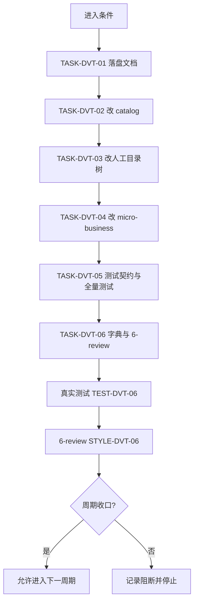
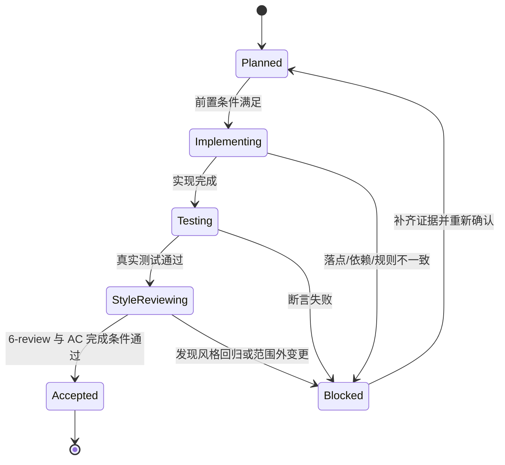

# 实施周期 01：目录树版本化与去 rpc 收口

结论：本周期把两个 skill 的目录规范从「`business/<domain>` 平铺 + `rpc/`」改造为「`<source-root>/<domain>` 直连源码根，`router/`/`controller/`/`entity/`/`service/` 各自内含版本目录 `<v?>` + 域间禁止直连」，并完成测试、字典与 6-review 收口。影响：业务相关逻辑通过四类版本化目录各自的 `<v?>` 隔离，域级通用目录为 `api/`/`base/`/`constant/`/`util/`（去掉域级 `crontask/`），`init/` 目录收敛为单文件 `init.<ext>`，`rpc/` 完全移除。范围：`package-structure-rules` 与 `micro-business-architecture-rules` 两个 skill 全部相关文件、文档、字典与项目记忆。非范围：不为 Go 单独立 `internal/` 树、不新增旧版本冻结检查、不迁移历史文档、不执行 Git 提交。变化：机器事实源 `router`/`controller`/`entity`/`service` 改版本级条目（`<source-root>/<domain>/<artifact>/<v?>`）并删 `business-rpc`，`micro_business.py` 改四类版本化骨架 + 单文件 init + `--detect-new`。完成标准：六个任务实现、真实测试、6-review 全部闭环。术语说明：`<source-root>` 指当前语言唯一源码根占位符，`<v?>` 解析为 `v[0-9]+`。验证状态：代码与测试已完成，本周期文档用于收口追踪。

## 1. 当前周期目标

- 周期 ID / 期次定位：`CYCLE-DVT-01` / 第一期
- 只做这一件事：目录树版本化 + 去 rpc + 测试与 6-review 收口
- 对应需求、验收和实施总览：`REQ-DVT-20260818-001`、`AC-DVT-001` 至 `AC-DVT-005`、`2026-08-18_目录树多版本改造_去除rpc_实施总览.md`
- 本周期不做：不新增旧版本冻结检查、不迁移历史 `doc/3-实施/` 文档、不执行 Git 提交

## 2. 周期图片资产决策与边界

- 图片资产决策：`N/A + 原因 + 证据`。原因：本周期只修改 Markdown 规则文档与 Python 脚本，不涉及 UI、截图或位图。证据：流程与时序由 Mermaid 表达。

## 3. 进入条件与收口条件

| 类型 | 条件 | 证据/命令 | 状态 |
| --- | --- | --- | --- |
| 进入 | 需求文档已落盘并通过校验 | `validate_engineering_docs.py --profile requirement --doc doc/2-需求/2026-08-18_目录树多版本改造_去除rpc.md` | 已完成 |
| 收口 | 六个任务实现、真实测试、6-review 全部闭环 | 见各任务证据 | 进行中 |

图形目的与关联 ID：此图为周期 01 单任务闭环流程图，关联 `CYCLE-DVT-01`、`TASK-DVT-01` 至 `TASK-DVT-06`。

图形目的：说明本周期任务状态迁移与阻断回流。关联 ID：`TASK-DVT-01` 至 `TASK-DVT-06`。

## 4. 当前代码/文档基线

- 基线 commit：`3f9d38f`（2026-08-18 13:39:42 +0800）。
- 已改动文件（工作树，未提交）：`package-structure-rules`（`SKILL.md`、`references/placement-catalog.yaml`、`placement-catalog.schema.json`、`project-layout-v2.md`、`go-package-layout.md`、`java-layer-layout.md`、`node-python-module-layout.md`、`structure-general.md`、`lookup-and-reference-contract.md`、`backend-util-layout.md`、`scripts/placement_catalog.py`）；`micro-business-architecture-rules`（`SKILL.md`、`references/directory-layout.md`、`isolation-and-communication.md`、`boundaries.md`、`trigger-and-marker.md`、`md-convention.md`、`scripts/micro_business.py`、`templates/business-readme-template.md`、`business-index-template.md`）。
- 只读历史：`doc/3-实施/2026-08-11_171800_目录树规范开放扩展语义_*` 不迁移、不修改。

## 5. 周期内最小任务执行顺序

| 顺序 | 任务 ID | 目标 | 依赖 | 状态 |
| --- | --- | --- | --- | --- |
| 1 | `TASK-DVT-01` | 落盘需求、实施总览、实施周期 | 无 | completed |
| 2 | `TASK-DVT-02` | 改 catalog 机器事实源版本化并去 rpc | `TASK-DVT-01` | completed |
| 3 | `TASK-DVT-03` | 改人工目录树与 language reference | `TASK-DVT-02` | completed |
| 4 | `TASK-DVT-04` | 改 micro-business 全量 | `TASK-DVT-03` | completed |
| 5 | `TASK-DVT-05` | 更新测试契约并跑全量测试 | `TASK-DVT-04` | completed |
| 6 | `TASK-DVT-06` | 刷新字典、同步记忆、落 6-review | `TASK-DVT-05` | in_progress |

## 6. 文件与符号操作契约

| 任务 | 文件/符号 | 操作 |
| --- | --- | --- |
| `TASK-DVT-02` | `placement_catalog.yaml` 的 `backend.router`/`backend.controller`/`backend.entity`/`backend.service`/`backend.business-rpc` | `canonical_path` 改 `<source-root>/<domain>/<artifact>/<v?>/...` 并加 `requires_domain`；删 `business-rpc` 条目 |
| `TASK-DVT-02` | `placement_catalog.py` 的 `expand_init_path`/`deprecated_source_util_root` | `expand_init_path` 产出单文件 init；Java 分支保守识别 `src/main/java/util` |
| `TASK-DVT-03` | `project-layout-v2.md` 的 `<source-root>` 段、`SKILL.md` 第 6/11 条 | 替换为新树、去 rpc、改版本化口径 |
| `TASK-DVT-04` | `micro_business.py` 的 `DOMAIN_LEVEL_DIRS`/`VERSIONABLE_DIRS`/`INIT_FILENAME`/`BUSINESS_IMPORT_RE`/`detect_new_project`/`has_marker` | 改版本化目录常量、单文件 init、`internal/<域>` 正则、新增 `--detect-new` |
| `TASK-DVT-04` | `micro-business-architecture-rules` 的 `SKILL.md`、四个 references、两个 templates | 去 rpc、改版本目录语义 |
| `TASK-DVT-06` | `skill-dictionary/data.js`、`PROJECT_MEMORY.md`、`编码skill.md`、`README.md` | 刷新字典、同步稳定规则与仓库级口径 |

## 7. 最小任务闭环

| 任务 | 实现证据 | 真实测试 | 风格回归 | 状态 |
| --- | --- | --- | --- | --- |
| `TASK-DVT-02` | `placement_catalog.py` 编译通过、`business-rpc` 查询失败关闭（exit 2）、`router`/`controller`/`entity`/`service` 返回版本级条目 | `TEST-DVT-02` | `STYLE-DVT-02` | completed |
| `TASK-DVT-03` | `project-layout-v2.md` 与各 reference 无残留 `business/`/`rpc` 口径 | `TEST-DVT-03` | `STYLE-DVT-03` | completed |
| `TASK-DVT-04` | `micro_business.py` 编译通过、scaffold 产出 12 项（4 域级目录 + 4 类版本化目录各含 v1 + init.go + README.md，无 crontask）、check 拒绝跨域、`--detect-new` 三态 | `TEST-DVT-04` | `STYLE-DVT-04` | completed |
| `TASK-DVT-05` | 专项测试 38 个全通过；全量 386 tests 中 failures=4 + errors=12 均为环境/历史基线，与改动无关 | `TEST-DVT-05` | `STYLE-DVT-05` | completed |
| `TASK-DVT-06` | 字典刷新成功、6-review PASS、机器校验通过 | `TEST-DVT-06` | `STYLE-DVT-06` | in_progress |

## 8. 真实测试与断言

| 测试 | 命令 | 断言 / 通过标准 |
| --- | --- | --- |
| `TEST-DVT-02` | `placement_catalog.py query --artifact business-rpc` | 非 0 退出码 |
| `TEST-DVT-02` | `placement_catalog.py query --artifact router` | 返回版本级条目（`<source-root>/<domain>/router/<v?>`） |
| `TEST-DVT-04` | `micro_business.py scaffold order --root <tmp>` | 产出 `internal/order/{entity,router,controller,service}/v1` + 域级 api/base/constant/util + `internal/order/init.go`，无 crontask |
| `TEST-DVT-04` | `micro_business.py check --root <tmp>` | 跨域 import 报违规非 0 |
| `TEST-DVT-04` | `micro_business.py check --detect-new --root <tmp>` | candidate_new/guard/skip 三态 |
| `TEST-DVT-05` | `python -B test/run_python_tests.py` | `Ran 386 tests`，`FAILED (failures=4, errors=12, skipped=2)`，均与改动无关 |

## 9. 当前周期验证矩阵

| 来源/完成条件 | 任务 | 文件/符号 | 测试 | 状态 |
| --- | --- | --- | --- | --- |
| `REQ-DVT-001` / `AC-DVT-001` | `TASK-DVT-02` | `placement-catalog.yaml/.py/.schema.json` | `TEST-DVT-02` | completed |
| `REQ-DVT-002` / `AC-DVT-002` | `TASK-DVT-03` | `project-layout-v2.md` 与各 reference、`SKILL.md` | `TEST-DVT-03` | completed |
| `REQ-DVT-003` / `AC-DVT-003` | `TASK-DVT-04` | `micro_business.py` 与 references/templates | `TEST-DVT-04` | completed |
| `REQ-DVT-005` / `AC-DVT-005` | `TASK-DVT-05` | `test/package-structure-rules/*` | `TEST-DVT-05` | completed |
| `REQ-DVT-005` / `AC-DVT-005` | `TASK-DVT-06` | `skill-dictionary/data.js`、`PROJECT_MEMORY.md` | `TEST-DVT-06` | in_progress |

## 10. 回滚与停止条件

- 回滚：`ROLLBACK-DVT-001` 至 `ROLLBACK-DVT-006` 分别对应六个决策，可据 `git diff` 逐文件回退；`micro_business.py` 的 `--detect-new`/`--version` 为新增参数，回退不破坏既有 `scaffold`/`check`/`init` 子命令。
- 停止条件：任一步骤真实测试失败、文档机器校验失败、规则冲突或超出范围时停止并回流；字典刷新失败或 6-review FIX_REQUIRED 时不得收口。

## 11. 周期追踪矩阵

| `SRC-*` | `DEC-*` | `REQ/RULE-*` | `AC-*` | `CYCLE-*` | `TASK-*` | `TEST-*` | `EVIDENCE-*` |
| --- | --- | --- | --- | --- | --- | --- | --- |
| `SRC-DVT-001` | `DEC-DVT-001` | `REQ-DVT-001` | `AC-DVT-001` | `CYCLE-DVT-01` | `TASK-DVT-02` | `TEST-DVT-02` | `EVD-TASK-DVT-02-IMPL` / `EVD-TASK-DVT-02-TEST` |
| `SRC-DVT-002` | `DEC-DVT-003` | `REQ-DVT-002` | `AC-DVT-002` | `CYCLE-DVT-01` | `TASK-DVT-03` | `TEST-DVT-03` | `EVD-TASK-DVT-03-IMPL` / `EVD-TASK-DVT-03-TEST` |
| `SRC-DVT-003` | `DEC-DVT-004` | `REQ-DVT-003` | `AC-DVT-003` | `CYCLE-DVT-01` | `TASK-DVT-04` | `TEST-DVT-04` | `EVD-TASK-DVT-04-IMPL` / `EVD-TASK-DVT-04-TEST` |
| `SRC-DVT-004` | `DEC-DVT-005` | `REQ-DVT-004` | `AC-DVT-004` | `CYCLE-DVT-01` | `TASK-DVT-04` | `TEST-DVT-04` | `EVD-TASK-DVT-04-IMPL` / `EVD-TASK-DVT-04-TEST` |
| `SRC-DVT-005` | `DEC-DVT-002` | `REQ-DVT-005` | `AC-DVT-005` | `CYCLE-DVT-01` | `TASK-DVT-05` | `TEST-DVT-05` | `EVD-TASK-DVT-05-IMPL` / `EVD-TASK-DVT-05-TEST` |
| `SRC-DVT-006` | `DEC-DVT-006` | `RULE-DVT-005` | `AC-DVT-005` | `CYCLE-DVT-01` | `TASK-DVT-06` | `TEST-DVT-06` | `EVD-TASK-DVT-06-IMPL` / `EVD-TASK-DVT-06-TEST` |

## 12. 自审结论

- 自审结论：本周期覆盖当前周期目标、进入与收口条件、当前代码/文档基线、周期内最小任务执行顺序、文件/符号操作契约、最小任务闭环、真实测试与断言、当前周期验证矩阵、回滚与停止条件、周期追踪矩阵；两个 Mermaid 图与四个以上表格已落盘，`停止条件`、`回滚`、`文件/符号`、`真实测试` 均已覆盖。
