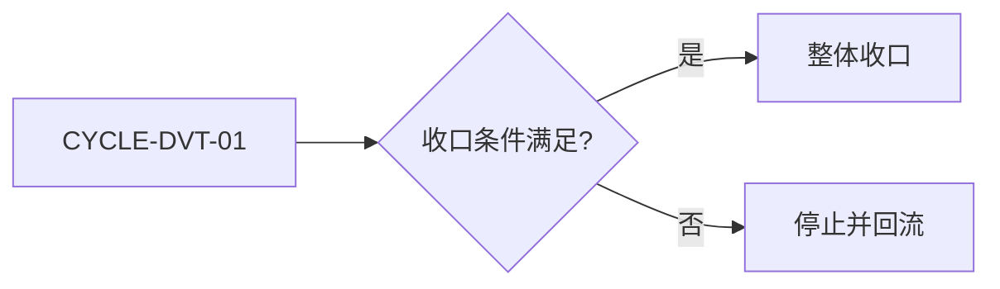
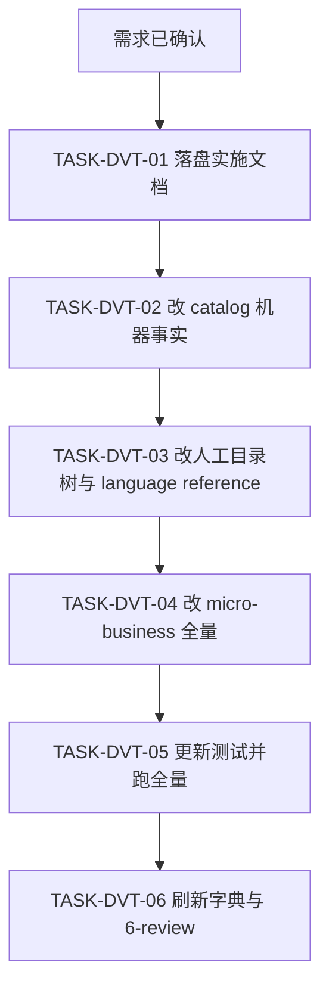
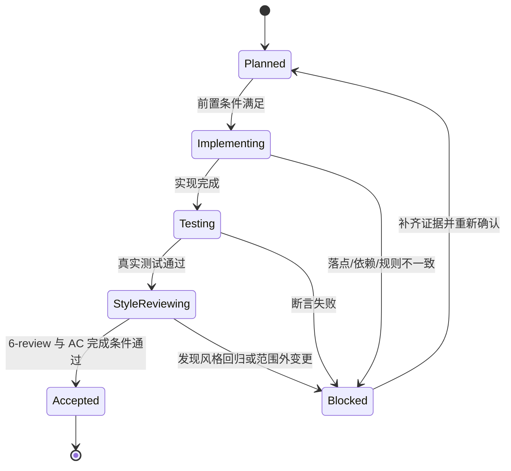

# 实施总览：目录树多版本改造 · 去除 rpc

结论：本次把 `package-structure-rules`（目录唯一 Owner）与 `micro-business-architecture-rules`（业务隔离 + 版本语义 Owner）两个 skill 的目录规范从「`business/<domain>` 平铺 + `rpc/` 跨业务入口」改造为「`<source-root>/<domain>` 直连源码根，`router/`/`controller/`/`entity/`/`service/` 各自内含版本目录 `<v?>` + 域间禁止直连」。影响：业务相关逻辑通过四类版本化目录各自的 `<v?>` 隔离（包名 `v?router`/`v?controller`/`v?entity`/`v?service`），域级通用目录为 `api/`/`base/`/`constant/`/`util/`（去掉域级 `crontask/`），`init/` 目录收敛为单文件 `init.<ext>`（全量注册本域所有版本路由），`rpc/` 完全移除。范围：只修改两个 skill 的全部相关文件（约 15 个），并落盘需求、实施、测试与 6-review。非范围：不为 Go 单独立 `internal/` 树、不新增旧版本冻结检查、不迁移历史 `doc/3-实施/` 文档、不执行 Git 提交。变化：机器事实源 `placement-catalog.yaml` 的 `router`/`controller`/`entity`/`service` 改版本级条目（`<source-root>/<domain>/<artifact>/<v?>`）并删 `business-rpc`，`micro_business.py` 改四类版本化骨架 + 单文件 init + `--detect-new`、移除 `--with-rpc`。完成标准：`placement_catalog.py query --artifact business-rpc` 失败关闭、`query --artifact router` 返回版本级条目，`micro_business.py scaffold` 产出 `entity/v1`/`router/v1`/`controller/v1`/`service/v1` + 单文件 `init.go`、`check --detect-new` 三态判定可用，需求、实施总览、测试、6-review 全部落盘并通过机器校验。术语说明：`<source-root>` 指当前语言唯一源码根占位符，`<v?>` 解析为 `v[0-9]+`。验证状态：代码与测试已完成，本文档用于冻结验收与追踪。

## 1. 当前计划最终方案简要说明

推荐方案：先改 `package-structure-rules/references/placement-catalog.yaml` 与 `scripts/placement_catalog.py`（机器事实与检查先行），再同步 `project-layout-v2.md`、各 language reference 与 `SKILL.md`；随后全量改 `micro-business-architecture-rules` 的 `scripts/micro_business.py` 与全部 reference/templates。主落点：两个 skill 共约 15 个文件。为什么先走这条路线：机器事实源与脚本先行可让后续人工文档与脚本行为以机器输出为锚，避免口径漂移；业务隔离脚本是版本语义的落地者，需与目录 Owner 同步收口。

## 2. Agent 对当前问题的理解

- 问题 / 目标：旧目录树 `business/<domain>` 平铺九类目录，`router`/`controller` 挂在源码根、`rpc/` 承担跨业务唯一公开入口；需改造为版本目录隔离并彻底去掉 rpc。
- 本轮范围：两个 skill 全部相关文件、需求/实施/测试/6-review 文档、`PROJECT_MEMORY.md`、skill 字典、仓库级同步（`编码skill.md`/`README.md`）。
- 非范围：不为 Go 单独立 `internal/` 树、不新增旧版本冻结检查、不迁移历史 `doc/3-实施/` 文档、不执行 Git 提交、不改动其他兄弟 skill。
- 当前优先闭环：机器事实源与脚本、人工目录树、业务隔离脚本三线收口，再落测试与 6-review。
- 关键假设 / 待确认点：版本路由采用「版本并存·全量注册」已由用户确认；`init.<ext>` 的 `<ext>` 按当前语言扩展名取值。

## 3. 系统边界与现状基线

- 已核实目录：`package-structure-rules/`、`micro-business-architecture-rules/` 均存在。
- 已核实文件：`placement-catalog.yaml`、`placement_catalog.py`、`placement-catalog.schema.json`、`project-layout-v2.md`、`SKILL.md`、六个 language reference；`micro_business.py`、`SKILL.md`、四个 reference、两个 templates。
- 图片资产决策：`N/A + 原因 + 证据`。原因：本实施只修改 Markdown 规则文档与 Python 脚本，不涉及 UI、截图或位图资产。证据：流程已由 Mermaid 表达。
- `unresolved_decisions`：无。所有真实不确定且影响大的方向已由用户确认（版本路由策略、init 形态、多语言统一口径）。
- 代码落点目录树：

```text
package-structure-rules/
├── SKILL.md                                     # 修改：第 6/11 条改版本化口径、去 rpc
├── references/
│   ├── placement-catalog.yaml                   # 修改：router/controller/entity/service 版本级 + 删 business-rpc
│   ├── placement-catalog.schema.json            # 修改：删 business-rpc 的 allOf 约束
│   ├── project-layout-v2.md                     # 修改：替换 <source-root> 段为新树
│   ├── go-package-layout.md                     # 修改：去 rpc、版本化
│   ├── java-layer-layout.md                     # 修改：去 rpc、版本化
│   ├── node-python-module-layout.md             # 修改：去 rpc、版本化
│   ├── structure-general.md                     # 修改：同步口径
│   ├── lookup-and-reference-contract.md         # 修改：去 rpc、版本化
│   └── backend-util-layout.md                   # 修改：去 rpc
└── scripts/
    └── placement_catalog.py                     # 修改：删 business_rpc 函数、init 单文件化
micro-business-architecture-rules/
├── SKILL.md                                     # 重写：去 rpc、版本目录语义
├── references/
│   ├── directory-layout.md                      # 重写：版本化目录树（entity/router/controller/service 各自含 <v?>/）
│   ├── isolation-and-communication.md           # 重写：域间禁止直连
│   ├── boundaries.md                            # 重写：去 rpc 边界
│   ├── trigger-and-marker.md                    # 修改：新仓库判定 + --detect-new
│   └── md-convention.md                         # 重写：版本目录说明
├── scripts/
│   └── micro_business.py                        # 修改：版本骨架 + init.go + --detect-new
└── templates/
    ├── business-readme-template.md              # 重写：去 rpc 字段、加版本目录
    └── business-index-template.md               # 重写：去 rpc 关系表
```

## 4. 跨会话独立执行与外部项目代码引用清单

- 新会话接手第一步：读取本实施总览与需求主文档，核对 `CYCLE-DVT-01` / `TASK-DVT-*` 状态，再继续。
- 主项目名称与项目根：`D:\谷歌云盘\luode-skills`
- 主项目仓库类型与代码基线：本地 skill 仓库，git commit `3f9d38f`。
- 计划源文件与版本：本实施总览 v1.0。
- 依赖安装、local 配置和服务启动入口：Python 3 可用，`placement_catalog.py`/`micro_business.py` 仅用标准库，无需安装依赖。
- 中断点核验顺序：先核对 `PROJECT_CURRENT.md` 投影，再核对已落盘文档与测试证据。
- 外部项目代码引用：`N/A + 原因 + 证据`。原因：本改造只改本仓库两个 skill，不复制任何外部项目代码或目录。证据：`SRC-DVT-001` 至 `SRC-DVT-006`。

## 5. 实施周期总览

| 顺序 | 周期 ID | 期次定位 | 单一周期目标 | 进入条件 | 收口条件 | 依赖 | 文档 |
| --- | --- | --- | --- | --- | --- | --- | --- |
| 1 | `CYCLE-DVT-01` | 第一期 | 两个 skill 版本化 + 去 rpc + 测试收口 | 需求文档已落盘并通过校验 | 六个任务实现、真实测试、6-review 全部闭环 | 无 | `./2026-08-18_目录树多版本改造_去除rpc_实施周期01_版本化与去rpc收口.md` |

图形目的与关联 ID：此图为周期门禁流程图，关联 `CYCLE-DVT-01`。


图形目的与关联 ID：此图为六个最小任务依赖图，关联 `TASK-DVT-01` 至 `TASK-DVT-06`。


图形目的与关联 ID：此图为任务状态迁移与阻断回流图，关联 `TASK-DVT-01` 至 `TASK-DVT-06`。


## 6. 阶段计划

| 阶段 | 周期 | 唯一目标 | 输入 | 输出 | 验证门槛 |
| --- | --- | --- | --- | --- | --- |
| `PHASE-DVT-01` | `CYCLE-DVT-01` | 落盘需求与实施文档 | 需求已确认 | 需求、实施总览、实施周期文档 | 文档机器校验通过 |
| `PHASE-DVT-02` | `CYCLE-DVT-01` | 改 catalog 机器事实源 | 实施文档 | `placement-catalog.yaml/.py/.schema.json` | business-rpc 查询失败、router 返回版本级条目 |
| `PHASE-DVT-03` | `CYCLE-DVT-01` | 改人工目录树与 language reference | catalog | `project-layout-v2.md` 与各 reference、`SKILL.md` | 无残留 business/rpc 口径 |
| `PHASE-DVT-04` | `CYCLE-DVT-01` | 改 micro-business 全量 | 人工目录树 | `micro_business.py` 与 references/templates | scaffold 产出版本骨架、check 拒绝跨域 |
| `PHASE-DVT-05` | `CYCLE-DVT-01` | 更新测试并跑全量 | 全部实现 | 测试契约复核、全量测试 | 相关断言通过 |
| `PHASE-DVT-06` | `CYCLE-DVT-01` | 刷新字典与 6-review | 全部实现 | 字典、测试主文档、6-review | 字典刷新成功、6-review PASS |

## 7. 最小任务清单

| 周期内顺序 | 任务 ID | 垂直切片目标 | 预计文件数 | 文件/符号契约 | 真实测试 | 完成条件 | 停止条件 |
| --- | --- | --- | ---: | --- | --- | --- | --- |
| 1 | `TASK-DVT-01` | 落盘需求、实施总览、实施周期 | 3 | `doc/2-需求/...目录树多版本改造_去除rpc.md`、`doc/3-实施/..._实施总览.md`、`doc/3-实施/..._实施周期01_....md` | `TEST-DVT-01` | 三份文档存在且校验通过 | 校验失败 |
| 2 | `TASK-DVT-02` | 改 `placement-catalog.yaml/.py/.schema.json` 版本化并去 rpc | 3 | `placement_catalog.py` 的 `expand_init_path`、`deprecated_source_util_root`、四类版本化条目 | `TEST-DVT-02` | business-rpc 查询失败关闭、router/controller/entity/service 返回版本级条目 | 查询行为不符 |
| 3 | `TASK-DVT-03` | 改 `project-layout-v2.md`、各 language reference、`SKILL.md` | 8 | `project-layout-v2.md` 的 `<source-root>` 段、`SKILL.md` 第 6/11 条 | `TEST-DVT-03` | 目录树与各 reference 一致无 rpc | 残留 business/rpc 口径 |
| 4 | `TASK-DVT-04` | 改 `micro-business-architecture-rules` 全量 | 7 | `micro_business.py` 的 `DOMAIN_LEVEL_DIRS`/`VERSIONABLE_DIRS`/`INIT_FILENAME`/`BUSINESS_IMPORT_RE`/`detect_new_project`、`SKILL.md`、references、templates | `TEST-DVT-04` | scaffold 产出四类版本化骨架 + init.go、check 拒绝跨域、--detect-new 三态 | 跨域未拒绝或三态不符 |
| 5 | `TASK-DVT-05` | 更新测试契约并跑全量测试 | 2 | `test/package-structure-rules/*` 复核 | `TEST-DVT-05` | 专项测试通过、全量失败项与改动无关 | 出现改动相关失败 |
| 6 | `TASK-DVT-06` | 刷新字典、同步记忆与仓库级文档、落 6-review | 5 | `skill-dictionary/data.js`、`PROJECT_MEMORY.md`、`编码skill.md`、`README.md`、`doc/6-review/...` | `TEST-DVT-06` | 字典刷新成功、6-review PASS | 字典刷新失败或 6-review FIX_REQUIRED |

| 来源/完成条件 | 周期 | 任务 | 文件/符号 | 测试 | 风格回归 | 证据 | 状态 |
| --- | --- | --- | --- | --- | --- | --- | --- |
| `REQ-DVT-001` / `AC-DVT-001` | `CYCLE-DVT-01` | `TASK-DVT-02` | `placement-catalog.yaml/.py/.schema.json` | `TEST-DVT-02` | `STYLE-DVT-02` | `EVD-TASK-DVT-02-IMPL` / `EVD-TASK-DVT-02-TEST` | completed |
| `REQ-DVT-002` / `AC-DVT-002` | `CYCLE-DVT-01` | `TASK-DVT-03` | `project-layout-v2.md` 与各 reference、`SKILL.md` | `TEST-DVT-03` | `STYLE-DVT-03` | `EVD-TASK-DVT-03-IMPL` / `EVD-TASK-DVT-03-TEST` | completed |
| `REQ-DVT-003` / `AC-DVT-003` | `CYCLE-DVT-01` | `TASK-DVT-04` | `micro_business.py` 与 references/templates | `TEST-DVT-04` | `STYLE-DVT-04` | `EVD-TASK-DVT-04-IMPL` / `EVD-TASK-DVT-04-TEST` | completed |
| `REQ-DVT-004` / `AC-DVT-004` | `CYCLE-DVT-01` | `TASK-DVT-04` | `micro-business-architecture-rules` references/templates | `TEST-DVT-04` | `STYLE-DVT-04` | `EVD-TASK-DVT-04-IMPL` / `EVD-TASK-DVT-04-TEST` | completed |
| `REQ-DVT-005` / `AC-DVT-005` | `CYCLE-DVT-01` | `TASK-DVT-05` | `test/package-structure-rules/*` | `TEST-DVT-05` | `STYLE-DVT-05` | `EVD-TASK-DVT-05-IMPL` / `EVD-TASK-DVT-05-TEST` | completed |
| `REQ-DVT-005` / `AC-DVT-005` | `CYCLE-DVT-01` | `TASK-DVT-06` | `skill-dictionary/data.js`、`PROJECT_MEMORY.md`、`编码skill.md`、`README.md` | `TEST-DVT-06` | `STYLE-DVT-06` | `EVD-TASK-DVT-06-IMPL` / `EVD-TASK-DVT-06-TEST` | in_progress |

## 8. 现状与落点

- 涉及目录：`package-structure-rules/`、`micro-business-architecture-rules/`、`doc/`、`skill-dictionary/`、`test/`。
- 涉及文件 / 模块：见第 3 章目录树。
- 复用点：`placement_catalog.py` 既有 `query`/`render`/`init`/`check` 子命令、`micro_business.py` 既有 `scaffold`/`check`/`init` 子命令、`skill-dictionary/generate_dictionary.py`、`artifact-delivery-gate-rules/scripts/validate_engineering_docs.py`。
- 需要新增的内容：`doc/2-需求` 与 `doc/3-实施`/`doc/5-tests`/`doc/6-review` 文档、`micro_business.py` 的 `detect_new_project` 与 `has_marker` 函数。
- 代码落点目录树：见第 3 章。

## 9. 真实测试安排

| 测试对象 | 真实测试命令 | 断言 / 通过标准 |
| --- | --- | --- |
| 需求文档 | `python -B artifact-delivery-gate-rules/scripts/validate_engineering_docs.py --profile requirement --doc doc/2-需求/2026-08-18_目录树多版本改造_去除rpc.md --root D:\谷歌云盘\luode-skills` | 校验通过 |
| 实施总览 | `python -B artifact-delivery-gate-rules/scripts/validate_engineering_docs.py --profile implementation_overview --doc doc/3-实施/2026-08-18_目录树多版本改造_去除rpc_实施总览.md --root D:\谷歌云盘\luode-skills` | 校验通过 |
| Catalog 去 rpc | `placement_catalog.py query --artifact business-rpc` | 返回非 0（条目已删） |
| Catalog 版本级 | `placement_catalog.py query --artifact router` / `--artifact controller` / `--artifact entity` / `--artifact service` | 返回版本级条目（`<source-root>/<domain>/<artifact>/<v?>`） |
| 脚手架 | `micro_business.py scaffold order --root <tmp>` | 产出 `internal/order/{entity,router,controller,service}/v1` + 域级 api/base/constant/util + `internal/order/init.go`，无 crontask |
| 跨域隔离 | `micro_business.py check --root <tmp>` | 跨域 import 报违规退出非 0 |
| 候选新项目判定 | `micro_business.py check --detect-new --root <tmp>` | 三态判定（candidate_new/guard/skip） |
| 全量 Python 测试 | `python -B test/run_python_tests.py` | `Ran 386 tests`，`FAILED (failures=4, errors=12, skipped=2)`，全部为环境/历史基线问题，与本次改动无关 |

## 10. 风险与阻断项

| 风险 / 阻断 | 级别 | 影响 | 缓解 / 恢复 |
| --- | --- | --- | --- |
| 文档未通过机器校验 | P0 | 无法进入实施 | 修复文档结构与图注后再进入周期一 |
| 全量测试出现改动相关失败 | P1 | 收口不成立 | 定位根因后修复重跑，确认与改动无关 |
| 脚本与文档口径不一致 | P1 | 查询/校验结果与 reference 冲突 | 以机器输出为锚，回到 catalog 统一后再收口 |

## 11. 任务完成、停止与最大推进边界

- 最大推进边界：本轮只推进六个最小任务、一份实施周期文档、两个 skill 的文件、测试与 6-review、项目记忆与字典；不新增 skill、不迁移历史文档、不执行 Git 提交。
- 任务完成条件：六个任务全部通过真实测试与 6-review，文档校验通过，字典刷新成功。
- 停止条件：任一步骤真实测试失败、文档校验失败、规则冲突或超出范围时停止并回流。

## 12. 自审结论

- 自审结论：实施总览覆盖当前计划最终方案、实施周期总览、阶段计划、最小任务清单、现状与落点、真实测试安排、风险与阻断项、任务完成、停止与最大推进边界；三个 Mermaid 图（周期门禁、任务依赖、状态迁移）与四个以上表格已落盘，`unresolved_decisions`、`文件/符号`、`最大推进边界`、`真实测试` 均已覆盖。
