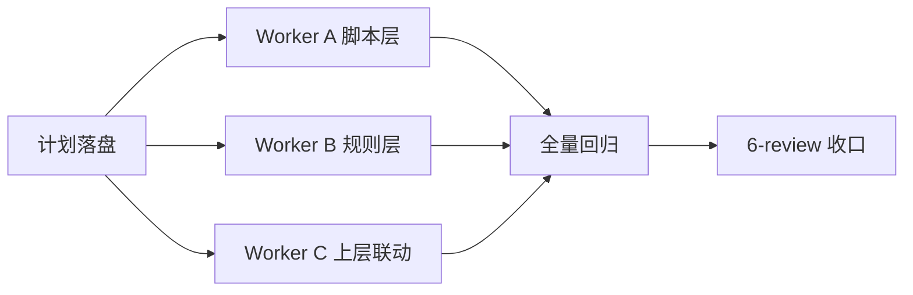
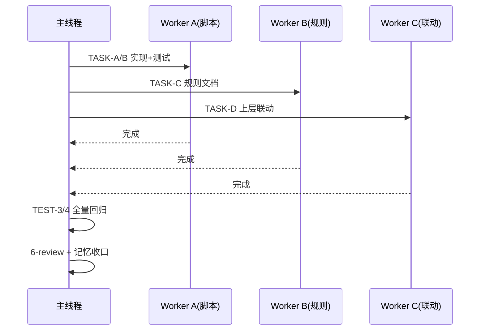

# 需求实施总览：任务投影跨宿主适配（BUG-TASK-PROJECTION-HOST-001）

结论：把任务投影协议从"Codex Desktop 专属硬闸门"改造成"跨宿主分级适配"，并修复 `ensure-start` 输入契约（缺 `trigger` 默认补 `start`），使 WorkBuddy 等宿主在 UI 同步通道不可用时不再错误阻断本地执行；影响：所有使用任务投影的宿主（Codex Desktop、WorkBuddy Desktop、无任务 UI 宿主）的执行流程与规则文档；范围：任务投影脚本（会话解析 + ensure-start 契约）、task-plan-rehydration-rules 规则文档、5 个上层联动规则文件、对应单元测试与回归记录；非范围：不改造 WorkBuddy 宿主任务列表工具本身、不修改 Goal 生命周期协议、不改变投影磁盘 schema（v4 registry 保持兼容）、不实现新 UI 通道；变化：`update_plan` 不可用从"禁止领域写入"降级为"保留磁盘投影 + 继续执行 + 下一检查点重试"，WorkBuddy 宿主可正常推进已授权任务；完成标准：AC-1~AC-5 全部满足（输入契约修复、会话回退、规则跨宿主声明、上层分级语义、全量测试与风格回归通过）；术语说明：`投影(projection)` 指 `PROJECT_CURRENT.md` 中为当前会话持久化的任务列表快照，`update_plan` 指 Codex Desktop 的整份计划覆盖 UI 工具，`UI_SYNC_BLOCKED` 指既有规则定义的 UI 同步失败阻断态；验证状态：静态根因已确认（诊断文档已落盘），本计划为正式实施计划，落盘后进入编码、真实测试与 6-review 闭环。

## 1. 当前计划最终方案简要说明

- 推荐方案一句话结论：按"投影核心层 + 宿主适配层 + 分级阻断"重构任务投影的跨宿主语义，脚本层修输入契约与会话回退，规则层把 UI 不可用从硬阻断改为降级继续。
- 主落点 / 主路径：`task-plan-rehydration-rules/scripts/task_plan_projection.py`（ensure-start 契约 + `resolve_session_id` 回退链）、`task-plan-rehydration-rules/SKILL.md` 与契约文档、`skill-hit-check-rules` / `autonomous-execution-rules` / `context-compression-rules` / `session-handoff-rules` / `agent-runtime-recovery-rules` 的阻断语义。
- 为什么先走这条路线：上轮诊断已确认"字段缺失直接触发 + Codex 专属协议被泛化为硬闸门"两层根因，先修契约后改语义，既能立即解除 WorkBuddy 下的错误阻断，又不破坏 Codex 既有路径与磁盘数据兼容性。

## 2. 基本信息

- 对应需求文档：Bug 主文档 `doc/4-bugs/2026-08-23_040049_任务投影跨宿主适配缺陷.md`（稳定 ID `BUG-TASK-PROJECTION-HOST-001`）
- 来源对象标识（需求或 Bug）：`BUG-TASK-PROJECTION-HOST-001`
- 当前实施文档命名主干：`2026-08-23_040049_BUG-TASK-PROJECTION-HOST-001`
- 对应需求与实施计划全量顺序实施方案：`N/A + 原因（单来源对象、单实施周期，无跨来源排序需求）+ 证据（本仓库 doc/3-实施/ 无该 Bug 的既有全量顺序总表）`
- 实施计划完成条件（`AC-*`）所在章节：本节 `AC-1`~`AC-5`
- 对应 `6-review` 风格回归记录：`doc/6-review/2026-08-23_<时间>_BUG-TASK-PROJECTION-HOST-001_6-review.md`（实施收口时生成）
- agent 理解的问题 / 目标：任务投影协议在 WorkBuddy 宿主下错误阻断已授权任务执行，需把 Codex 专属硬闸门改造为跨宿主分级适配，并修复 ensure-start 输入契约
- 当前计划范围：脚本输入契约与会话回退、task-plan-rehydration-rules 规则与契约文档、5 个上层联动规则文件、单元测试、回归与 6-review
- 明确不在范围：WorkBuddy 任务列表工具实现、Goal 生命周期协议、投影磁盘 schema 变更、新 UI 通道开发、其他宿主（IDE 插件等）专项适配
- 当前优先闭环：实施周期01（脚本层 → 规则层 → 上层联动 → 全量回归）
- 关键假设 / 待确认点：当前环境无 WorkBuddy 会话 ID 注入（探测 `absent`），回退链在注入宿主生效；无会话 ID 时按契约不猜测、不落盘
- 跨会话执行入口：`python -X utf8 -B test/task-plan-rehydration-rules/task_plan_projection_test.py`；`python -B .system/skill-creator/scripts/quick_validate.py task-plan-rehydration-rules`
- 主项目地址、仓库类型与代码基线：`D:\谷歌云盘\luode-skills`（本地 Git 仓库，含 88+ skill 目录）；基线为当前工作树，未提交
- local 环境与依赖入口：WorkBuddy managed Python 3.13.12（`C:\Users\luode\.workbuddy\binaries\python\versions\3.13.12\python.exe`）；脚本仅依赖标准库
- 外部项目代码引用：`N/A + 原因（全部改动在本仓库内部）+ 证据（无跨项目文件/符号引用）`
- 当前状态：计划落盘阶段
- 是否已获得开始实施授权：是（用户本轮 `/goal` 显式要求"将计划落盘"并"按计划开始执行"，授权并行执行）

### 2.1 决策维度覆盖表

说明：非 Plan Mode（用户已显式授权实施），全部决策点已在诊断轮确认，无未决项。

| 维度 | 状态 | 结论 / 依据 |
| --- | --- | --- |
| 架构 / 技术路线 | 已确定 | 分层适配：核心层不变 + 宿主适配层 + 分级阻断（诊断轮推荐方案） |
| 代码落点 | 已确定 | task_plan_projection.py（两处函数）+ 规则 md 文件（见第 6 节） |
| 实现方式 | 已确定 | trigger 默认补 start；会话解析扩展回退链；规则语义分级 |
| 命名 | 已确定 | 沿用现有 `trigger` / `session_id` / `UI_SYNC_BLOCKED` 语义，不引入新字段 |
| 注释 | 已确定 | 沿用脚本中文 docstring + 修改时间戳格式 |
| 日志 | 已确定 | 沿用稳定 JSON 输出，不新增日志通道 |
| 错误处理 / 异常 | 已确定 | 契约错误继续抛 `ProjectionContractError`，会话冲突失败关闭 |
| 数据模型 / 表 / 字段 | 已确定 | 不改变投影 schema 与字段 |
| 接口契约 | 已确定 | ensure-start 缺 trigger 默认 start；synthesize 严格必填；会话来源优先级显式 > CODEX_THREAD_ID > WorkBuddy 元数据 |
| 依赖与库 | 已确定 | 仅标准库 |
| 测试策略 / 样本 | 已确定 | unittest 扩展用例 + 全量回归（见第 9 节） |
| 其它相关维度 | N/A | 无 |

### 2.2 待用户选择清单

- 无（所有真实不确定决策点已在诊断轮由用户认可推荐方案后确定）。

### 2.3 跨会话独立执行与外部项目代码引用清单

- 新会话接手第一步：读取本文件 + 实施周期01，确认 AC 与任务顺序，运行全量测试确认基线。
- 主项目地址与项目根：`D:\谷歌云盘\luode-skills`
- 主项目代码基线：当前工作树（改动未提交，禁止在本轮执行任何 Git 写操作）
- 计划源文件与版本：本文件 + `2026-08-23_040049_BUG-TASK-PROJECTION-HOST-001_实施周期01_跨宿主适配与输入契约修复.md`
- 依赖安装、local 配置和服务启动入口：无需安装依赖；Python 3.13.12 直接运行
- 中断点核验顺序：TASK-RTP-C01-A → B → C → D → E 逐个核验；已完成的任务按其完成条件核验测试证据
- 外部项目代码引用：`N/A + 原因（无外部项目引用）+ 证据（全部改动位于本仓库）`

## 3. 实施周期总览

- 总周期说明：本 Bug 形成单一独立闭环，拆 1 个实施周期。
- 本次计划拆分的子任务周期数：1（实施周期01）
- 周期拆分原则：单个来源对象、改动面集中（脚本 2 处 + 规则文档 7 个 + 测试 1 个），无需多期
- 周期排序说明：实施周期01 为第一期也是唯一一期
- 周期 1：
  - 周期序号 / 期次定位：实施周期01 / 第一期
  - 周期目标：修复 ensure-start 输入契约、扩展会话解析 WorkBuddy 回退、落地跨宿主分级阻断语义并回归
  - 本周期包含的最小任务：TASK-RTP-C01-A ~ TASK-RTP-C01-E
  - 周期内最小任务执行顺序：A → B → C → D → E（A/B 为脚本层由 Worker A 顺序闭环；C 为规则层；D 为上层联动；E 为主线程全量回归与 6-review）
  - 进入条件：Bug 主文档与本实施总览已落盘；AC 冻结；用户已授权
  - 收口条件：AC-1~AC-5 全部满足；全量单元测试通过；quick_validate 通过；6-review 记录 `STYLE: PASS`
  - 完成标志：TASK-RTP-C01-E 完成，EVIDENCE 回填
  - 与前后周期衔接：无前序周期；本周期完成后本 Bug 闭环
- 总体真实测试安排：
  - 真实测试安排是否默认必需：是（脚本行为变更）
  - 覆盖哪些最小任务：TASK-RTP-C01-A、TASK-RTP-C01-B（脚本层）、TASK-RTP-C01-E（全量回归）；C/D 为规则文档变更（见免测理由）
  - 公共测试环境 / 依赖：managed Python 3.13.12，仅标准库
  - 公共样本 / 数据来源：`test/task-plan-rehydration-rules/task_plan_projection_test.py` 既有 fixture（`_sample`、临时目录）扩展
  - 总体通过标准：`task_plan_projection_test.py` 全量用例通过（0 失败）；`quick_validate.py task-plan-rehydration-rules` 退出码 0

## 4. 阶段计划

- 阶段 1：
  - 阶段名称：脚本层契约与会话修复
  - 阶段目标：修复 ensure-start trigger 契约 + 会话解析 WorkBuddy 回退，含新增单元测试
  - 只做这一件事：修改 `task_plan_projection.py` 与对应测试
  - 输入条件：实施周期01 已落盘；AC 冻结
  - 输出产物：脚本改动 + 新增/更新测试用例
  - 验证门槛：TASK-RTP-C01-A、TASK-RTP-C01-B 的测试通过
- 阶段 2：
  - 阶段名称：规则层跨宿主适配
  - 阶段目标：task-plan-rehydration-rules 规则与契约文档声明跨宿主作用域与分级阻断
  - 只做这一件事：更新 SKILL.md 与契约文档
  - 输入条件：阶段 1 的冻结口径（本文档第 1、6 节）可用
  - 输出产物：SKILL.md + contract md 更新
  - 验证门槛：quick_validate 通过；契约字段与冻结口径一致
- 阶段 3：
  - 阶段名称：上层规则联动
  - 阶段目标：5 个上层规则文件同步分级语义，消除"UI 不可用即禁止领域写入"硬闸门
  - 只做这一件事：更新 skill-hit-check-rules / autonomous-execution-rules / context-compression-rules / session-handoff-rules / agent-runtime-recovery-rules 相关段落
  - 输入条件：阶段 2 口径落盘
  - 输出产物：5 个规则文件更新
  - 验证门槛：全仓 Grep 确认无残留的"update_plan 不可用 → 禁止继续领域写入"绝对化表述
- 阶段 4：
  - 阶段名称：全量回归与风格收口
  - 阶段目标：全量测试、skill 校验、6-review 记录
  - 只做这一件事：主线程执行回归并生成 6-review 文档
  - 输入条件：阶段 1~3 全部完成
  - 输出产物：测试证据 + 6-review 文档 + 记忆更新
  - 验证门槛：TEST-3、TEST-4 通过；`STYLE: PASS`

## 5. 最小任务清单

### 最小任务 1：TASK-RTP-C01-A —— ensure-start 输入契约修复

- 任务名：ensure-start 合成上下文缺 `trigger` 时默认补 `start`
- 所属周期：实施周期01；周期内顺序：1
- 所属阶段：阶段 1
- 本任务只做这一件事：修改 `ensure_start_projection` 合成分支，使缺 `trigger` 的上下文默认按 `start` 处理；`synthesize` 直接入口保持严格必填
- 垂直切片目标：WorkBuddy 场景下首次投影调用不再因缺 `trigger` 被契约拒绝
- 输入条件：Bug 主文档第 6 节冻结口径
- 实现产出：`task_plan_projection.py` 中 `ensure_start_projection`（或 `_normalize_context` 的调用点）实现缺省注入；新增测试用例
- 真实测试是否必需：是
- 真实测试入口：`test/task-plan-rehydration-rules/task_plan_projection_test.py`
- 真实测试依赖环境：managed Python 3.13.12
- 真实测试样本 / 数据来源：构造无 `trigger` 的合成上下文（其余字段合法）与显式 `trigger=timeout` 上下文
- 真实测试通过标准：缺 trigger → ensure-start 成功返回 `action=created` 且投影为 start 语义；显式 timeout → 仍抛契约错误
- 测试点：TEST-1
- `6-review` 风格回归点：中文 docstring、修改时间戳、异常类型沿用既有风格（`code-style-consistency-rules`）
- 任务完成条件：脚本改动完成 + TEST-1 通过
- 任务停止 / 结束条件：TEST-1 失败且无法定位时停止，回退计划域复核口径
- 阻断条件：契约口径与 Bug 文档不一致（回退确认）
- 前置依赖：无
- 下一任务依赖：TASK-RTP-C01-B（同文件后续修改）
- 预计触达文件数：2（脚本 + 测试）

### 最小任务 2：TASK-RTP-C01-B —— 会话解析 WorkBuddy 回退链

- 任务名：`resolve_session_id` 扩展 WorkBuddy 会话来源回退
- 所属周期：实施周期01；周期内顺序：2
- 所属阶段：阶段 1
- 本任务只做这一件事：扩展会话解析来源链（显式 `--session-id` > `CODEX_THREAD_ID` > WorkBuddy 宿主元数据），多来源不一致拒绝、全缺失失败关闭
- 垂直切片目标：WorkBuddy 宿主注入会话元数据时投影可绑定当前会话
- 输入条件：冻结口径（第 6 节 + 2.1 表）
- 实现产出：`resolve_session_id` 增加 WorkBuddy 来源解析（`CODEBUDDY_MCP_CONFIG` headers `X-WorkBuddy-Session-Id` 唯一值 / `WORKBUDDY_SESSION_ID` 环境变量）；新增测试用例
- 真实测试是否必需：是
- 真实测试入口：`test/task-plan-rehydration-rules/task_plan_projection_test.py`
- 真实测试依赖环境：managed Python 3.13.12
- 真实测试样本 / 数据来源：mock 环境（CODEX_THREAD_ID 与 WORKBUDDY 来源组合、冲突、全缺失）
- 真实测试通过标准：WorkBuddy 来源可回退成功；显式值与 WorkBuddy 来源冲突 → 拒绝；全缺失 → 失败关闭
- 测试点：TEST-2
- `6-review` 风格回归点：异常信息中文/英文沿用既有风格、`_validate_session_id` 复用
- 任务完成条件：脚本改动完成 + TEST-2 通过
- 任务停止 / 结束条件：TEST-2 失败且无法定位时停止
- 阻断条件：会话解析优先级与 workbuddy-host-contract.md 冲突（以显式优先 + 冲突拒绝为准）
- 前置依赖：TASK-RTP-C01-A
- 下一任务依赖：TASK-RTP-C01-C
- 预计触达文件数：2（脚本 + 测试）

### 最小任务 3：TASK-RTP-C01-C —— 规则层跨宿主适配

- 任务名：task-plan-rehydration-rules 规则与契约文档跨宿主化
- 所属周期：实施周期01；周期内顺序：3
- 所属阶段：阶段 2
- 本任务只做这一件事：更新 SKILL.md 作用域与 UI_SYNC_BLOCKED 语义、更新契约文档字段说明
- 垂直切片目标：规则层面明确 Codex / WorkBuddy / 无 UI 宿主三档适配与分级阻断
- 输入条件：冻结口径（本文档第 6 节）
- 实现产出：`task-plan-rehydration-rules/SKILL.md`、`references/task-plan-projection-contract.md` 更新
- 真实测试是否必需：否 + 理由（纯规则文档变更，不改变可执行行为；由 quick_validate 结构校验兜底）
- 真实测试入口：`python -B .system/skill-creator/scripts/quick_validate.py task-plan-rehydration-rules`
- 真实测试依赖环境：managed Python 3.13.12
- 真实测试样本 / 数据来源：N/A（无运行样本）
- 真实测试通过标准：quick_validate 退出码 0
- 测试点：TEST-4
- `6-review` 风格回归点：中文正文、章节结构、稳定 ID 引用（`reasoning-summary-structure-rules` / `code-style-consistency-rules`）
- 任务完成条件：两文档更新完成且与冻结口径一致
- 任务停止 / 结束条件：与口径不一致时停止并回退确认
- 阻断条件：contract 中字段/状态规则与脚本行为矛盾
- 前置依赖：TASK-RTP-C01-A/B（脚本行为已定）
- 下一任务依赖：TASK-RTP-C01-D
- 预计触达文件数：2

### 最小任务 4：TASK-RTP-C01-D —— 上层规则联动

- 任务名：5 个上层规则文件同步分级阻断语义
- 所属周期：实施周期01；周期内顺序：4
- 所属阶段：阶段 3
- 本任务只做这一件事：把"`update_plan` 不可用 → 禁止继续领域写入"改为分级语义（持久化失败/会话冲突/状态不明硬阻断；仅 UI 不可用降级继续）
- 垂直切片目标：全仓规则口径一致，WorkBuddy 下不再错误阻断
- 输入条件：TASK-RTP-C01-C 口径落盘
- 实现产出：更新 `skill-hit-check-rules/SKILL.md`、`autonomous-execution-rules/SKILL.md`、`autonomous-execution-rules/references/continuation-and-pause.md`、`context-compression-rules/SKILL.md`、`session-handoff-rules/SKILL.md`、`agent-runtime-recovery-rules/references/platform-capability-matrix.md`（WorkBuddy 行）
- 真实测试是否必需：否 + 理由（规则文档变更，不改可执行行为；用 Grep 全仓校验残留绝对化表述）
- 真实测试入口：`Grep "UI_SYNC_BLOCKED|禁止继续领域写入" <仓库>`
- 真实测试依赖环境：N/A
- 真实测试样本 / 数据来源：N/A
- 真实测试通过标准：Grep 结果中无"仅 UI 不可用即禁止领域写入"的绝对化残留（保留分级语义表述）
- 测试点：TEST-4（辅助）
- `6-review` 风格回归点：跨文件语义一致、中文表述、`task-plan-rehydration-rules` 唯一 Owner 边界不被破坏
- 任务完成条件：6 个文件更新完成 + Grep 校验通过
- 任务停止 / 结束条件：口径漂移时停止回退
- 阻断条件：与其他 skill 的既有契约冲突
- 前置依赖：TASK-RTP-C01-C
- 下一任务依赖：TASK-RTP-C01-E
- 预计触达文件数：6

### 最小任务 5：TASK-RTP-C01-E —— 全量回归与风格收口

- 任务名：全量单元测试、skill 校验、6-review 与记忆收口
- 所属周期：实施周期01；周期内顺序：5
- 所属阶段：阶段 4
- 本任务只做这一件事：主线程统一回归并生成证据与收口记录
- 垂直切片目标：确认脚本层改动未破坏既有契约、规则层口径统一
- 输入条件：TASK-RTP-C01-A~D 全部完成
- 实现产出：测试运行记录、6-review 文档、项目记忆与工作日志更新
- 真实测试是否必需：是
- 真实测试入口：`python -X utf8 -B test/task-plan-rehydration-rules/task_plan_projection_test.py` + `quick_validate.py`
- 真实测试依赖环境：managed Python 3.13.12
- 真实测试样本 / 数据来源：既有全量用例 + 新增用例
- 真实测试通过标准：全量 0 失败；quick_validate 退出码 0
- 测试点：TEST-3、TEST-4
- `6-review` 风格回归点：按 `code-style-consistency-rules` 完成 STYLE 判定
- 任务完成条件：AC-1~AC-5 满足；6-review 记录 `STYLE: PASS`
- 任务停止 / 结束条件：任一测试失败且无法定位时停止，回退对应任务
- 阻断条件：测试失败（回退修复）
- 前置依赖：TASK-RTP-C01-A~D
- 下一任务依赖：无（周期收口）
- 预计触达文件数：4（测试记录 + 6-review + 记忆 + 日志）

## 6. 现状与落点

- 涉及目录：`task-plan-rehydration-rules/`、`test/task-plan-rehydration-rules/`、`skill-hit-check-rules/`、`autonomous-execution-rules/`、`context-compression-rules/`、`session-handoff-rules/`、`agent-runtime-recovery-rules/`、`doc/`
- 涉及文件 / 模块：见下方目录树
- 复用点：`_validate_session_id`、`_projection_file_lock`、`_write_text_atomic`、`_normalize_steps` 等既有函数；`workbuddy-host-contract.md` 的会话解析方案；`_sample` 测试 fixture
- 需要新增的内容：WorkBuddy 会话来源解析逻辑；ensure-start 缺省 trigger 注入；相应测试用例
- 代码落点目录树：

```text
task-plan-rehydration-rules/
├── SKILL.md                                        # 改：作用域跨宿主化 + UI_SYNC_BLOCKED 分级语义
├── references/
│   └── task-plan-projection-contract.md            # 改：会话来源与阻断分级契约说明
└── scripts/
    └── task_plan_projection.py                     # 改：ensure_start_projection 缺省 trigger；resolve_session_id 回退链
skill-hit-check-rules/
└── SKILL.md                                        # 改：UI_SYNC_BLOCKED 分级语义
autonomous-execution-rules/
├── SKILL.md                                        # 改：UI 不可用降级继续
└── references/
    └── continuation-and-pause.md                   # 改：暂停/继续条件分级
context-compression-rules/
└── SKILL.md                                        # 改：压缩恢复路径的 UI 同步降级
session-handoff-rules/
└── SKILL.md                                        # 改：会话交接时 UI 通道降级语义
agent-runtime-recovery-rules/
└── references/
    └── platform-capability-matrix.md               # 改：WorkBuddy 行补充任务列表通道
test/task-plan-rehydration-rules/
└── task_plan_projection_test.py                    # 改：新增 TEST-1 / TEST-2 用例
doc/4-bugs/2026-08-23_040049_任务投影跨宿主适配缺陷.md  # 已建（本轮）
doc/3-实施/2026-08-23_040049_..._实施总览.md            # 已建（本轮）
doc/3-实施/2026-08-23_040049_..._实施周期01_*.md        # 已建（本轮）
doc/6-review/2026-08-23_<时间>_BUG-TASK-PROJECTION-HOST-001_6-review.md  # 新建（收口时）
```

## 7. 方案选择

- 方案 A（推荐）：分层适配 —— 脚本修契约与会话回退，规则层分级阻断。优点：改动集中、兼容 Codex 既有路径、不碰 schema；缺点：需要多文件规则联动。
- 方案 B：仅修 ensure-start 契约，不动阻断规则。优点：最小改动；缺点：WorkBuddy 下 `UI_SYNC_BLOCKED` 硬阻断依然存在，系统性根因未除。
- 方案 C：为 WorkBuddy 新写整份 update_plan 等价工具。优点：语义完全对齐 Codex；缺点：WorkBuddy 平台无此接口模型，超出现有权限与能力边界，且破坏"不伪造 UI 同步"原则。
- 推荐方案与原因：方案 A。上轮诊断确认两层根因，方案 A 同时解除直接触发与系统性阻断，且保持磁盘 schema 与 Codex 路径兼容。

## 8. 实施步骤

1. 第一步：脚本层 —— `ensure_start_projection` 缺省 trigger 注入 + `resolve_session_id` WorkBuddy 回退链 + 新增测试（对应 TASK-RTP-C01-A/B，Worker A）
2. 第二步：规则层 —— `task-plan-rehydration-rules/SKILL.md` 与契约文档跨宿主化（对应 TASK-RTP-C01-C，Worker B）
3. 第三步：上层联动 —— 5 个上层规则文件分级语义（对应 TASK-RTP-C01-D，Worker C）
4. 第四步：主线程全量回归 + quick_validate + 6-review + 记忆收口（对应 TASK-RTP-C01-E）

## 9. 真实测试安排

- 真实测试总表：

| 测试点 | 内容 | 入口 | 通过标准 | 关联任务 |
| --- | --- | --- | --- | --- |
| TEST-1 | ensure-start 缺 trigger 默认 start；显式 timeout 拒绝；synthesize 严格必填 | 单元测试 | 断言通过 | A |
| TEST-2 | WorkBuddy 会话回退、冲突拒绝、全缺失失败 | 单元测试 | 断言通过 | B |
| TEST-3 | 全量单元测试回归 | `python -X utf8 -B test/task-plan-rehydration-rules/task_plan_projection_test.py` | 0 失败 | E |
| TEST-4 | skill 结构校验 + 全仓语义 Grep | `quick_validate.py` + Grep | 退出码 0；无绝对化残留 | C/D/E |

- 免测任务及理由：TASK-RTP-C01-C、TASK-RTP-C01-D 为规则文档变更（不改可执行行为），以 quick_validate + Grep 替代真实测试，理由已写入各任务卡。
- 步骤 1 真实测试 / 验证：Worker A 在实现后立即运行 TEST-1、TEST-2 对应用例。
- 步骤 2/3 真实测试 / 验证：Worker B/C 完成后由主线程统一执行 TEST-4。
- 步骤 4 真实测试 / 验证：主线程执行 TEST-3、TEST-4，结果写入测试证据与 6-review。

## 10. 图形化执行路径

- 流程图（Mermaid `flowchart`）：



- 时序图（Mermaid `sequenceDiagram`，按需）：



- 泳道表：`N/A + 原因（单线程分派三 worker，无多角色并行复杂度）+ 证据（见第 8 节实施步骤）`

### 10.1 图片资产决策、生成与引用

- 图片资产决策：`N/A + 原因（本计划为代码/规则文档变更，无需 UI 原型、截图或视觉对比）+ 证据（流程/依赖由 Mermaid 表达）`。

## 11. 风险与阻断项

- 风险：并行 worker 文案漂移 → 缓解：冻结口径表（第 6 节 + 2.1 表）写入计划，worker 严格照做；测试失败 → 回退对应任务；当前环境无 WorkBuddy 会话 ID → 回退链仅做机制，当前会话按契约不落盘（如实说明）。
- 依赖：无外部依赖；仅标准库。
- 任务停止 / 结束条件总表：任一任务完成条件不满足即停止该任务并回退；周期收口前任何 Git 写操作禁止（本轮无 Git 授权）。

## 13. 自审结论

- 覆盖度检查：AC-1~AC-5 均有对应任务与测试点；SRC→DEC→REQ→AC→CYCLE→TASK→TEST→EVIDENCE 双向追踪在 Bug 主文档与追踪附录齐备。
- 实施周期检查：单周期独立闭环，周期目标、进入/收口条件齐全。
- 最小任务闭环检查：5 个任务均含完成/停止/阻断条件；A/B 脚本层有真实测试，C/D 明确免测理由。
- 阶段单一目标检查：4 个阶段各承载单一目标。
- 占位词检查：无空泛占位（时间戳字段在执行期填充）。
- 可执行性检查：所有命令、路径、断言明确。
- 图文一致性检查：Mermaid 节点与实施步骤、任务顺序一致。
- 用户确认状态：用户 `/goal` 显式授权落盘并执行，允许并行。

## 执行附录

- local 环境：managed Python 3.13.12（`C:\Users\luode\.workbuddy\binaries\python\versions\3.13.12\python.exe`）。
- 执行命令：
  - 单元测试：`python -X utf8 -B test/task-plan-rehydration-rules/task_plan_projection_test.py`
  - skill 校验：`python -B .system/skill-creator/scripts/quick_validate.py task-plan-rehydration-rules`
  - 语义 Grep：`Grep "UI_SYNC_BLOCKED|禁止继续领域写入|update_plan.*不可用" --glob "**/*.md"`
- 清理 / 回滚：改动均未提交；回滚按文件 `git checkout -- <file>`（需用户显式授权）；测试临时目录由 unittest 自清理。
- 目录树、文件和符号定位：见第 6 节。

## 追踪附录

- `SRC -> DEC -> REQ/RULE -> AC -> CYCLE -> TASK -> TEST -> EVIDENCE`：

| SRC | DEC | REQ/RULE | AC | CYCLE | TASK | TEST | EVIDENCE |
| --- | --- | --- | --- | --- | --- | --- | --- |
| BUG-TASK-PROJECTION-HOST-001 | 缺省 trigger=start | ensure-start 契约 | AC-1 | 周期01 | TASK-RTP-C01-A | TEST-1 | doc/5-tests/ 回归记录 |
| BUG-TASK-PROJECTION-HOST-001 | 会话回退链 | resolve_session_id | AC-2 | 周期01 | TASK-RTP-C01-B | TEST-2 | doc/5-tests/ 回归记录 |
| BUG-TASK-PROJECTION-HOST-001 | 跨宿主作用域+分级阻断 | task-plan-rehydration-rules | AC-3 | 周期01 | TASK-RTP-C01-C | TEST-4 | quick_validate 记录 |
| BUG-TASK-PROJECTION-HOST-001 | 上层分级语义 | 5 个上层规则 | AC-4 | 周期01 | TASK-RTP-C01-D | TEST-4 | Grep 校验记录 |
| BUG-TASK-PROJECTION-HOST-001 | 全量回归 | 回归与风格 | AC-5 | 周期01 | TASK-RTP-C01-E | TEST-3/4 | doc/6-review/ 记录 |

- 图片资产清单：无（10.1 节 N/A）。
