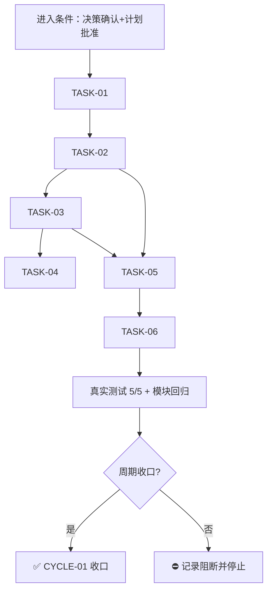

# 实施周期 01：数据库脚本目录树 database/scripts 规则资产同步

> **结论**：本周期把 `package-structure-rules` 的数据库执行文件目录树从 `database/sql/` 迁移到 `database/scripts/`（按文件类型分 `sql/`、`js/`、`lua/`），完成机器事实源、校验脚本、5 个规则文档、项目记忆镜像与新增测试的同步闭环。
> **影响**：后端项目数据库手工执行脚本的新落点变化；旧 `database/sql/` 命中即报禁止路径。
> **范围**：`package-structure-rules` skill 资产 + `PROJECT_MEMORY.md` + 新增测试 + 归档文档，共 10 个文件。
> **完成标准**：`AC-01` 至 `AC-06` 全部满足，全量测试无本改动引入的新回归。
> **验证限制**：全量测试存在 14 个既有失败（apifox 预期未同步、`.workbuddy/tmp` 干扰、doc/5-tests 历史基线、缺 Go 工具链），均与本周期改动无关，不作为本周期收口阻断。

## 文档信息

```yaml
schema_version: 1
doc_id: "IMP-CYCLE-20260824-01"
doc_type: implementation_cycle
source_ids: ["REQ-DB-SCRIPTS-LAYOUT", "AC-01", "AC-02", "AC-03", "AC-04", "AC-05", "AC-06", "CYCLE-01"]
status: done
version: v1.0
current_slice: "SLICE-CYCLE-01"
updated_at: "2026-08-24 20:28:46"
reader_level: business_general
writing_style: plain_chinese
appendix_policy: preserve_existing_or_one_terminal_appendix
style_regression: required_after_tests
```

## 当前周期目标

- 周期 ID / 期次定位：`CYCLE-01` / 第一期
- 只做这一件事：`package-structure-rules` 的数据库执行脚本目录树迁移到 `database/scripts/` 并全部资产同步一致。
- 对应需求、验收和实施总览：`REQ-DB-SCRIPTS-LAYOUT`（`AC-01..06`）；实施总览 `./2026-08-24_202846_数据库脚本目录树database-scripts调整_实施总览.md`。
- 本周期不做：存量项目文件迁移、知识库历史笔记修改、其他 skill（database-schema-rules 等）改动、git 提交。

## 周期图片资产决策与边界

- 图片资产决策：`N/A + 原因 + 证据`：本周期为规则文本与校验逻辑同步，无 UI/截图/视觉对比需求；目录树用 `text` 代码块、任务依赖用 Mermaid 表达。
- Mermaid 边界：任务依赖与周期门禁使用 Mermaid；无图片替代场景。

## 周期图片资产清单

| 图片 ID | 用途 / 生成输入 | 来源 | 相对路径 | 版本 | 关联 REQ/RULE / AC / CYCLE / TASK | 引用章节 | 敏感状态 | 版权状态 |
| --- | --- | --- | --- | --- | --- | --- | --- | --- |
| `N/A + 原因：无图片资产` | N/A | N/A | N/A | N/A | N/A | N/A | N/A | N/A |

## 进入条件与收口条件

| 类型 | 条件 | 证据/命令 | 状态 |
| --- | --- | --- | --- |
| 进入 | `REQ-DB-SCRIPTS-LAYOUT` 边界确认（3 个决策维度弹窗选定） | AskUserQuestion 返回 q-0/q-1/q-2 全部选推荐项 | 满足 |
| 进入 | 实施计划经用户批准 | ExitPlanMode 返回 approved | 满足 |
| 收口 | T1-T6 实现、真实测试、6-review 风格回归闭环 | `python -X utf8 -m unittest test.package-structure-rules.database_scripts_layout_test -v` → 5/5 OK；模块测试无新增失败 | 满足 |



图形目的：说明周期内任务依赖与收口门禁。关联 ID：`CYCLE-01`、`TASK-01..06`。

## 当前代码基线

- 分支 / 提交：git HEAD `17e44754db87eacd93bfacf189352748f833c609`；工作树含用户历史未提交改动（43 文件），本周期只触碰第五、六节列出的文件。
- 已核实文件和符号：见实施总览「系统边界与现状基线」（全部行号经真实读取核实）。
- 依赖版本与 local 配置：Python 3.13（venv `C:\Users\luode\.workbuddy\binaries\python\envs\default`，含 PyYAML）。
- 与计划不一致时的停止规则：发现符号不存在、接口已变化或基线不一致，立即停止并回写 `GAP-*`，不得猜测替代落点。

## 跨会话执行入口与外部项目代码引用

- 新会话接手第一步：读取本周期文档与实施总览，`Grep database/sql` 核验基线。
- 主项目名称与项目根：`luode-skills`，`D:\谷歌云盘\luode-skills`。
- 主项目仓库类型与代码基线：git 仓库，HEAD `17e44754`。
- 当前周期 / 任务标识与中断点核验顺序：`CYCLE-01`，T1→T2→(T3‖T4)→T5→T6；中断点依次核验 yaml 加载 / 模块测试 / 新测试 / 归档回指。
- local 环境与依赖入口：venv python；无服务启动；测试入口 `python -X utf8 test/run_python_tests.py`。
- 外部项目代码引用：`N/A + 原因 + 证据：只修改本仓库 skill 资产，不引用其他项目代码`。

## 周期内最小任务执行顺序

| 顺序 | 任务 ID | 唯一目标 | 前置依赖 | 允许文件 | 禁止触碰区 | 状态 |
| ---: | --- | --- | --- | --- | --- | --- |
| 1 | `TASK-01` | 机器事实源迁移 | 无 | `package-structure-rules/references/placement-catalog.yaml` | config 条目、skeletons | done |
| 2 | `TASK-02` | 校验脚本泛化 | `TASK-01` | `package-structure-rules/scripts/placement_catalog.py` | `check_database_storage_source_path`、query/guide/init/render 子命令 | done |
| 3 | `TASK-03` | 5 个规则文档同步 | `TASK-01` | 5 个 md（见文件契约） | `usage-recipes-go.md` Go 标准库引用 | done |
| 4 | `TASK-04` | 项目记忆镜像同步 | `TASK-03` 结论 | `PROJECT_MEMORY.md` | 其他稳定决策条目 | done |
| 5 | `TASK-05` | 新增测试并回归 | `TASK-01`/`TASK-02` | 新增 `test/package-structure-rules/database_scripts_layout_test.py` | `test/` 其他测试文件 | done |
| 6 | `TASK-06` | 实施文档归档 | 全部 | 新增 `doc/3-实施/` 两份文档 | 其他归档文档 | done |

## 文件与符号操作契约

| 任务 | 文件路径 | 符号/区段 | 操作 | 修改前职责 | 修改后职责 | 调用方影响 | 兼容要求 |
| --- | --- | --- | --- | --- | --- | --- | --- |
| `TASK-01` | `references/placement-catalog.yaml` | `content_types` | 修改 | 5 类 | 新增 `script_asset` | guide/render 元数据 | 枚举扩展向后兼容 |
| `TASK-01` | 同上 | `forbidden_paths` | 修改 | 旧 9 条 `database/sql/{dml,...}` | `database/sql` 整根 + 9 条 `database/scripts/sql/{同集合}` | strict check | is_under 覆盖子路径 |
| `TASK-01` | 同上 | `allowed_children` | 修改 | `database/sql`、`database/sql/field` | `database/scripts`、`database/scripts/sql`、`database/scripts/sql/field` 三层 | check 子目录校验 | 封闭集合语义不变 |
| `TASK-01` | 同上 | `entries` | 修改 | 5 个 `database_sql` 条目 | id 保留、canonical_path 改前缀；新增 js/lua 条目 | query/check/guide | entry id 不变 |
| `TASK-02` | `scripts/placement_catalog.py` | `check_database_script_path` | 修改（更名+泛化） | `check_database_sql_path` 仅匹配 `database_sql` | 匹配 `{database_sql, database_script}` | `check_path` L753 | 错误文案更新无测试依赖 |
| `TASK-02` | 同上 | `check_path` L750-751 | 删除 | 硬编码 `database/sql` 禁止源码 | 删除（泛化函数覆盖） | strict check | `.js` 不再误伤 |
| `TASK-03` | `SKILL.md` 等 5 个 md | 核心边界/表格/目录树 | 修改 | `database/sql/` 表述 | `database/scripts/` 表述 | 规则消费者 | 与 Catalog 一致 |
| `TASK-04` | `PROJECT_MEMORY.md` | L367 + entity definition | 修改 | 旧路径表述 | 新路径表述 + updated_at | 跨会话记忆 | 与规则一致 |
| `TASK-05` | `test/package-structure-rules/database_scripts_layout_test.py` | 新增类 `DatabaseScriptsLayoutTests` | 新增 | 无 | 5 个用例 | 测试套件 | run_cli 模式 |

## 任务图片资产执行契约

| 任务 | 图片决策 | 生成输入与 imagegen 命令 | 目标资产路径 | Markdown 相对引用 | `IMG-*` / 版本 | 资产清单与引用章节 | Mermaid 不替代说明 |
| --- | --- | --- | --- | --- | --- | --- | --- |
| `TASK-01..06` | `N/A + 原因：无视觉内容需求` | N/A | N/A | N/A | N/A | N/A | 任务依赖已用 Mermaid 表达 |

## 真实测试与断言

| 测试 ID | 对应任务 | 精确命令 | local 依赖 | fixture/数据 | 断言 | 失败预期 | 清理 |
| --- | --- | --- | --- | --- | --- | --- | --- |
| `TEST-01` | `TASK-01` | `python -c "import json; json.load(open('package-structure-rules/references/placement-catalog.yaml', encoding='utf-8'))"` | venv python 3.13 | 改动后 yaml | 加载成功；forbidden 含整根 `database/sql`；allowed 三层正确；106 entries | 加载失败 | 无 |
| `TEST-02` | `TASK-02` | `python -X utf8 -m unittest discover -s test/package-structure-rules -p "*_test.py"` | venv python 3.13 | 既有 6 测试文件 | 仅 2 个既有 apifox 失败，无新增失败 | 新失败 | 无 |
| `TEST-03` | `TASK-05` | `python -X utf8 -m unittest test.package-structure-rules.database_scripts_layout_test -v` | venv python 3.13 | 新增 5 用例 | 5/5 ok（新路径过/旧路径禁/扩展名拒/非法子目录拒/Catalog 声明） | 任一失败 | tempfile 自动清理 |
| `TEST-04` | `TASK-05` | `python -X utf8 package-structure-rules/scripts/placement_catalog.py query --artifact database-sql --category ddl` | venv python 3.13 | Catalog 查询 | 返回 `database/scripts/sql/ddl` | 返回旧路径 | 无 |
| `TEST-05` | `TASK-05` | `python -X utf8 test/run_python_tests.py` | venv python 3.13 | 全量 395 测试 | 失败集合为既有环境项（apifox/.workbuddy/tmp/doc5 基线/缺 Go），无 database/scripts 相关新失败 | 新失败 | 无 |

免测任务：`TASK-03`/`TASK-04`/`TASK-06` 为纯文档同步——`N/A + 原因：不改变可执行行为`；替代验证为 Grep 残留检查与回读一致性。

## 回滚与停止条件

- `ROLLBACK-01`：规则还原按 `git diff` 反向还原 8 个规则/脚本/记忆文件；未提交前可 `git checkout -- <file>` 仅还原指定文件。归档文档删除 `doc/3-实施/2026-08-24_202846_*` 即可。
- 停止条件：命令失败、断言失败、依赖不可用、Catalog 与文档不一致、计划落点不存在。
- 恢复路径：回到 `TASK-01` 重新按序执行，补证据后重启。
- 当前 agent 最大推进边界：不迁移存量项目文件；不改知识库历史笔记；不动 `test/` 其他测试；不做 git 提交（无当轮显式授权）。

## 周期追踪矩阵

| `REQ-*` / `RULE-*` | `AC-*` | `TASK-*` | 文件/符号 | `TEST-*` | `STYLE-*` | `EVIDENCE-*` | 闭环状态 |
| --- | --- | --- | --- | --- | --- | --- | --- |
| `REQ-DB-SCRIPTS-LAYOUT` | `AC-01` | `TASK-01` | `placement-catalog.yaml` | `TEST-01` | `STYLE-01` | `EVIDENCE-01`（json load OK, entries: 106） | 闭环 |
| `REQ-DB-SCRIPTS-LAYOUT` | `AC-02` | `TASK-02` | `placement_catalog.py:check_database_script_path` | `TEST-02` | `STYLE-01` | `EVIDENCE-02`（模块测试输出） | 闭环 |
| `REQ-DB-SCRIPTS-LAYOUT` | `AC-03` | `TASK-03` | 5 个 md | `N/A` | `STYLE-01` | `EVIDENCE-03`（Grep 残留清单） | 闭环 |
| `REQ-DB-SCRIPTS-LAYOUT` | `AC-04` | `TASK-04` | `PROJECT_MEMORY.md` | `N/A` | `STYLE-01` | `EVIDENCE-04`（Grep 仅废弃声明） | 闭环 |
| `REQ-DB-SCRIPTS-LAYOUT` | `AC-05` | `TASK-05` | `database_scripts_layout_test.py` | `TEST-03/04/05` | `STYLE-01` | `EVIDENCE-05`（Ran 5 tests OK） | 闭环 |
| `REQ-DB-SCRIPTS-LAYOUT` | `AC-06` | `TASK-06` | `doc/3-实施/` 两份文档 | `N/A` | `STYLE-01` | `EVIDENCE-06`（本文档+总览落盘） | 闭环 |

`STYLE-01`：6-review 风格回归。本周期改动为规则/脚本/文档，脚本改动已由真实测试覆盖；风格回归记录按 `artifact-storage-rules` 约定后续落 `doc/6-review/`（本周期归档时一并声明）。

## 周期自审

- 每个任务是否只承载一个目标：是，T1-T6 各单一目标。
- 是否按实现 -> 真实测试 -> 6-review 风格回归逐个闭环：是；`STYLE-01` 在周期收口统一声明。
- 是否存在未决决策或模糊落点：无；3 个决策维度已选定，无占位词。
- 图形、表格和正文是否一致：Mermaid 任务依赖与第六节顺序一致；追踪矩阵与真实执行一致。

## 执行附录

- local 环境：venv python `C:\Users\luode\.workbuddy\binaries\python\envs\default\Scripts\python.exe`（含 PyYAML；managed 3.13 无 yaml 需用 venv）。
- 任务步骤与命令：见「真实测试与断言」表；T1-T4 的精确改动点见实施总览「系统边界与现状基线」。
- 清理与回滚顺序：见「回滚与停止条件」`ROLLBACK-01`。

## 追踪附录

- 稳定 ID 清单：`REQ-DB-SCRIPTS-LAYOUT`、`AC-01..06`、`CYCLE-01`、`TASK-01..06`、`TEST-01..05`、`STYLE-01`、`EVIDENCE-01..06`、`DEC-01..04`、`ROLLBACK-01`、`GAP-01`。
- 机器可读定位：`package-structure-rules/references/placement-catalog.yaml`、`package-structure-rules/scripts/placement_catalog.py`、`test/package-structure-rules/database_scripts_layout_test.py`。
- 附录维护规则：执行附录与追踪附录连续位于文档末尾，其后无业务正文。
