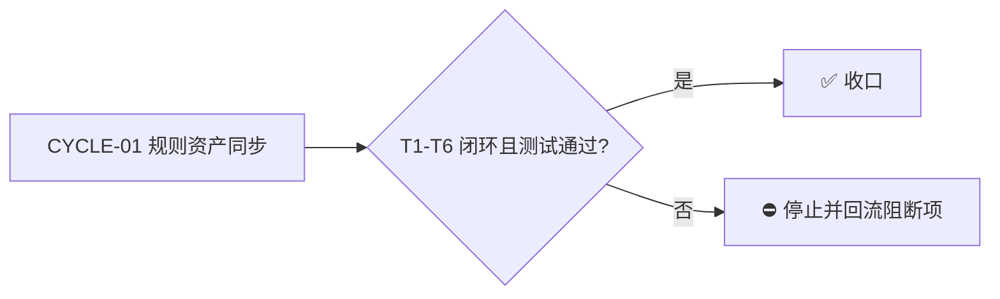

# 数据库脚本目录树 database/scripts 调整 - 实施总览

> **结论**：将 `package-structure-rules` skill 的独立数据库执行文件目录树从 `database/sql/{ddl,index,field/*}` 迁移为更通用的 `database/scripts/` 结构，按执行文件类型分子目录（`sql/`、`js/`、`lua/`），`database/scripts/sql/` 内部完整保留 `ddl/index/field/{create,update,delete}` 三级分类，旧 `database/sql/` 整根废弃并加入禁止路径。
> **影响**：所有后端项目的数据库手工执行脚本落点变化；存量项目不自动迁移，走目录规则收敛清单登记旧路径快照。
> **范围**：仅修改 `package-structure-rules` skill 资产与项目记忆镜像，共 10 个文件（含新增测试与归档文档）。
> **周期目标**：规则事实源 → 校验脚本 → 文档 → 测试全部对齐 `database/scripts/` 结构并闭环。
> **完成结果**：机器事实源（placement-catalog.yaml）、校验脚本（placement_catalog.py）、5 个规则文档、项目记忆镜像、新增布局测试全部一致；全量测试无本改动引入的新回归。

## 文档信息

```yaml
schema_version: 1
doc_id: "IMP-OVERVIEW-20260824-001"
doc_type: implementation_overview
source_ids: ["REQ-DB-SCRIPTS-LAYOUT"]
status: done
version: v1.0
complexity: L2
current_slice: "SLICE-CYCLE-01"
baseline_commit: "17e44754db87eacd93bfacf189352748f833c609"
template_version: "implementation-overview-v1"
updated_at: "2026-08-24 20:28:46"
reader_level: business_general
writing_style: plain_chinese
appendix_policy: preserve_existing_or_one_terminal_appendix
style_regression: required_after_tests
```

## 当前计划最终方案简要说明

推荐方案：`database/` 下以 `database/scripts/` 作为数据库执行脚本唯一根，按**执行文件类型**分子目录（`sql/`、`js/`、`lua/`），`sql/` 内完整保留 `ddl/index/field/{create,update,delete}` 三级分类；旧 `database/sql/` 整根加入 `forbidden_paths` 废弃。主落点是 `placement-catalog.yaml`（机器事实源）与 `placement_catalog.py`（校验脚本）——二者解耦后路径变化自动适配；其余 5 个 md 文档与 `PROJECT_MEMORY.md` 镜像同步，并补真实测试。选择原因：`database/sql/` 命名暗示"数据库只有 SQL"，无法承载 Mongo（.js）、Redis（.lua）等执行资产；按文件类型分目录与用户对 `database/scripts/js` 的原始描述一致，且保留 SQL 内部既有分类以最小化存量语义损失。

## Agent 对当前问题的理解

- 问题 / 目标：`database/sql/` 命名与结构只覆盖 SQL 文件，Mongo shell 脚本（.js）、Redis 执行脚本（.lua）等数据库执行资产无处安放；需要统一的 `database/scripts/` 结构并按文件类型分目录。
- 本轮范围：修改 `package-structure-rules` skill 资产（SKILL.md、database-layout.md、project-layout-v2.md、lookup-and-reference-contract.md、directory-usage-routing.md、placement-catalog.yaml、placement_catalog.py）、`PROJECT_MEMORY.md` 镜像、新增 `test/package-structure-rules/database_scripts_layout_test.py`、归档 `doc/3-实施/` 两份文档。
- 非范围：不迁移任何存量项目（如 ellipal_stat 的 `database/sql/index/` 真实路径）；不改 knowledge-flow 知识库历史快照笔记；不改 database-schema-rules / database-query-rules / micro-business-architecture-rules / artifact-storage-rules（已确认无目录树定义）；不改 `usage-recipes-go.md` 的 Go 标准库 `"database/sql/driver"` 引用。
- 当前优先闭环：`REQ-DB-SCRIPTS-LAYOUT` 的规则资产同步闭环（CYCLE-01）。
- 关键假设 / 待确认点：`lua/` 作为 Redis 脚本类型预置（用户表达"等等子目录"）；entry id 保留以避免破坏 `init --enable` 与 adoption manifest 的 catalog_id——两项均已按推荐纳入并经用户确认。
- `unresolved_decisions`：无。

## 图片资产决策与实施边界

- 图片资产决策：`N/A + 原因 + 证据`：本任务为目录树规则文本与校验逻辑同步，无 UI、原型、截图、空间布局或视觉对比需求；目录树用 `text` 代码块、任务依赖用 Mermaid 已足够表达。
- Mermaid 边界：周期门禁与任务依赖使用 Mermaid；不涉及图片替代。

## 图片资产清单

| 图片 ID | 用途 / 生成输入 | 来源 | 相对路径 | 版本 | 关联 REQ/RULE / AC / CYCLE / TASK | 引用章节 | 敏感状态 | 版权状态 |
| --- | --- | --- | --- | --- | --- | --- | --- | --- |
| `N/A + 原因：无图片资产` | N/A | N/A | N/A | N/A | N/A | N/A | N/A | N/A |

## 已冻结决策与方案比较

| ID | 决策问题 | 候选方案 | 选定方案 | 排除原因 | 影响面 | 回滚 | 证据 |
| --- | --- | --- | --- | --- | --- | --- | --- |
| `DEC-01` | 旧 `database/sql/` 处理 | 迁移废弃 / 保留并行 / 软废弃 | **迁移并废弃**：整根进 forbidden_paths，存量走收敛清单 | 保留并行造成双路径分叉；软废弃无强制校验 | 全部后端项目落点 | `ROLLBACK-01`：还原 yaml forbidden/allowed_children/entries 与 py 校验函数 | 用户弹窗选择 |
| `DEC-02` | `database/scripts/` 子目录维度 | 按文件类型 / 按数据库类型 / 两级组合 | **按执行文件类型**：`sql/`、`js/`、`lua/` | 按数据库类型无法区分同类脚本；两级组合过深 | 子目录命名与校验扩展名 | 同 `ROLLBACK-01` | 用户弹窗选择 |
| `DEC-03` | `sql/` 内部结构 | 完整保留 / 完全平铺 / 只留一层 | **完整保留** `ddl/index/field/{create,update,delete}` | 平铺丢失语义；只留一层破坏既有分类 | SQL 目录层级 | 同 `ROLLBACK-01` | 用户弹窗选择 |
| `DEC-04` | entry id 是否改名 | 保留 id / 按新路径改名 | **保留 id**（`backend.database.sql.ddl` 等），仅改 canonical_path | `init --enable` 按 id 匹配、adoption manifest 引用 catalog_id，改名即破坏 | Catalog 查询与存量清单 | 同 `ROLLBACK-01` | `placement_catalog.py` init/check 调用链核实 |

## 系统边界与现状基线

已核实基线（改动前，git HEAD `17e44754`）：

```text
package-structure-rules/
├── SKILL.md                                    # L31 核心边界第 7 条：database/sql 旧表述
├── references/
│   ├── placement-catalog.yaml                  # forbidden_paths L28-36 旧9条；allowed_children L98-107；entries L546-657 五个 database_sql 条目
│   ├── database-layout.md                      # 全表：database/sql/{ddl,index,field/*} 5 行
│   ├── project-layout-v2.md                    # L12 封闭清单；L125-152 后端目录树 database/sql 分支
│   ├── lookup-and-reference-contract.md        # L31 独立字段 SQL 落点
│   └── directory-usage-routing.md              # L64 database/sql/ddl/ owner 映射
├── scripts/placement_catalog.py                # L701 check_database_sql_path；L750 硬编码 database/sql；L753 调用点
PROJECT_MEMORY.md                               # L367 稳定决策镜像；L899-915 机器索引 entity
test/package-structure-rules/                   # 6 个既有测试，run_cli + tempfile 模式
doc/3-实施/                                     # 无数据库相关既有文档
```

改动后新增/变化文件：

```text
package-structure-rules/
├── SKILL.md                                    # L31 改为 database/scripts 表述 + 旧路径废弃声明
├── references/placement-catalog.yaml           # content_types 增 script_asset；forbidden 增整根 database/sql + 9 条新位置；allowed_children 三层；5 条目 canonical_path 迁移 + 新增 js/lua 条目
├── references/database-layout.md               # 全表改写：scripts 根 + sql 5 叶 + js/lua 2 叶
├── references/project-layout-v2.md             # L12 与目录树同步
├── references/lookup-and-reference-contract.md # L31 前缀更新
├── references/directory-usage-routing.md       # L64 前缀更新
├── scripts/placement_catalog.py                # check_database_script_path 泛化；删除 L750 硬编码
PROJECT_MEMORY.md                               # L367 与 entity definition 同步
test/package-structure-rules/database_scripts_layout_test.py   # 新增 5 用例
doc/3-实施/2026-08-24_202846_数据库脚本目录树database-scripts调整_实施总览.md    # 本文档
doc/3-实施/2026-08-24_202846_数据库脚本目录树database-scripts调整_实施周期01_规则资产同步.md
```

## 跨会话独立执行与外部项目代码引用清单

- 新会话接手第一步：读取本实施总览与周期文档，重新跑 `git status` 与 `Grep database/sql` 核验基线，若与本节不符先按 `code-context-resync-rules` 对齐。
- 主项目名称与项目根：`luode-skills`，`D:\谷歌云盘\luode-skills`。
- 主项目仓库类型与代码基线：git 仓库，HEAD `17e44754db87eacd93bfacf189352748f833c609`。
- 计划源文件与版本：`C:\Users\luode\.workbuddy\plans\quantum-pulse-babbage.md`（v1.0，已批准）。
- 依赖安装、local 配置和服务启动入口：Python managed 3.13 / venv `C:\Users\luode\.workbuddy\binaries\python\envs\default`（含 PyYAML）；无服务启动；测试入口 `python -X utf8 test/run_python_tests.py`。
- 中断点核验顺序：T1 后核验 yaml 加载 → T2 后核验既有测试 → T5 后核验全量回归 → T6 后核验归档文档回指。
- 外部项目代码引用：`N/A + 原因 + 证据：本任务只修改本仓库 skill 资产，不引用其他项目代码`。

## 实施周期总览

| 顺序 | 周期 ID | 期次定位 | 单一周期目标 | 进入条件 | 收口条件 | 依赖 | 文档 |
| --- | --- | --- | --- | --- | --- | --- | --- |
| 1 | `CYCLE-01` | 第一期 | 规则资产同步：事实源 → 脚本 → 文档 → 测试全部对齐 `database/scripts/` | 用户确认本计划 | T1-T6 全部闭环且全量测试无本改动新回归 | 无 | `./2026-08-24_202846_数据库脚本目录树database-scripts调整_实施周期01_规则资产同步.md` |



图形目的：说明周期门禁与不可跳期规则。关联 ID：`CYCLE-01`。

## 阶段计划

| 阶段 | 周期 | 唯一目标 | 输入 | 输出 | 验证门槛 |
| --- | --- | --- | --- | --- | --- |
| `PHASE-01` | `CYCLE-01` | 机器事实源先行 | 基线 yaml | 新结构 yaml | `json.load` 通过且新旧路径声明完整 |
| `PHASE-02` | `CYCLE-01` | 校验脚本泛化 | T1 yaml | 新 py | 既有测试 0 回归 |
| `PHASE-03` | `CYCLE-01` | 规则文档与记忆镜像同步 | T1/T2 结论 | 5 md + PROJECT_MEMORY | Grep 无残留旧路径 |
| `PHASE-04` | `CYCLE-01` | 测试闭环与归档 | 全部改动 | 新测试 + 归档文档 | 新测试 5/5 通过；归档可回指 |

## 最小任务清单与追踪矩阵

| 周期内顺序 | 任务 ID | 垂直切片目标 | 预计文件数 | 文件/符号契约 | 真实测试 | 完成条件 | 停止条件 |
| --- | --- | --- | ---: | --- | --- | --- | --- |
| 1 | `TASK-01` | 机器事实源先行 | 1 | `placement-catalog.yaml`: content_types/forbidden_paths/allowed_children/entries | `TEST-01` | yaml 加载成功且新旧路径声明完整 | 加载失败或声明缺失即停 |
| 2 | `TASK-02` | 校验逻辑与事实源解耦 | 1 | `placement_catalog.py`: `check_database_script_path` 泛化、删除 L750 硬编码、L753 调用点 | `TEST-02` | 更名/删硬编码完成且既有测试无新回归 | 任何既有测试新失败即停 |
| 3 | `TASK-03` | 人工文档与 Catalog 一致 | 5 | `SKILL.md` L31、`database-layout.md`、`project-layout-v2.md` L12+L125-152、`lookup-and-reference-contract.md` L31、`directory-usage-routing.md` L64 | `N/A`（纯文档，见测试安排） | Grep 规则文档无残留旧路径（允许例外除外） | 发现残留即停 |
| 4 | `TASK-04` | 长期记忆镜像一致 | 1 | `PROJECT_MEMORY.md` L367 + entity `rule.backend-database-storage-layout` | `N/A`（纯文档） | 两处镜像更新且回读一致 | 回读不一致即停 |
| 5 | `TASK-05` | 新旧路径正反例被 CLI 校验 | 2 | 新增 `test/package-structure-rules/database_scripts_layout_test.py` | `TEST-03`/`TEST-04`/`TEST-05` | 断言表全部通过 | 任一断言失败即停并记录 |
| 6 | `TASK-06` | 本周期决策可追溯 | 2 | 新增 `doc/3-实施/` 总览 + 周期文档 | `N/A`（纯文档） | 归档文档含追踪回指 | 缺追踪字段即停 |

| 来源/完成条件 | 周期 | 任务 | 文件/符号 | 测试 | 风格回归 | 证据 | 状态 |
| --- | --- | --- | --- | --- | --- | --- | --- |
| `REQ-DB-SCRIPTS-LAYOUT` / `AC-01` | `CYCLE-01` | `TASK-01` | `placement-catalog.yaml` | `TEST-01` | `STYLE-01` | `EVIDENCE-01` | 完成 |
| `REQ-DB-SCRIPTS-LAYOUT` / `AC-02` | `CYCLE-01` | `TASK-02` | `placement_catalog.py` | `TEST-02` | `STYLE-01` | `EVIDENCE-02` | 完成 |
| `REQ-DB-SCRIPTS-LAYOUT` / `AC-03` | `CYCLE-01` | `TASK-03` | 5 个 md | `N/A` | `STYLE-01` | `EVIDENCE-03` | 完成 |
| `REQ-DB-SCRIPTS-LAYOUT` / `AC-04` | `CYCLE-01` | `TASK-04` | `PROJECT_MEMORY.md` | `N/A` | `STYLE-01` | `EVIDENCE-04` | 完成 |
| `REQ-DB-SCRIPTS-LAYOUT` / `AC-05` | `CYCLE-01` | `TASK-05` | `database_scripts_layout_test.py` | `TEST-03/04/05` | `STYLE-01` | `EVIDENCE-05` | 完成 |
| `REQ-DB-SCRIPTS-LAYOUT` / `AC-06` | `CYCLE-01` | `TASK-06` | `doc/3-实施/` 两份文档 | `N/A` | `STYLE-01` | `EVIDENCE-06` | 完成 |

`AC-*` 完成条件冻结：`AC-01` yaml 声明完整可加载；`AC-02` 校验泛化且无新回归；`AC-03` 规则文档无残留旧路径；`AC-04` 记忆镜像一致；`AC-05` 新增测试全过；`AC-06` 归档回指完整。

## 真实测试安排

| 测试 ID | 任务 | 命令/入口 | local 环境 | 样本 | 断言 | 失败预期 | 清理 | 证据 |
| --- | --- | --- | --- | --- | --- | --- | --- | --- |
| `TEST-01` | `TASK-01` | `python -c "import json; json.load(open('package-structure-rules/references/placement-catalog.yaml', encoding='utf-8'))"` | venv python 3.13 | 改动后 yaml | 加载成功；forbidden 含 `database/sql` 与 `database/scripts/sql/dml`；allowed_children 三层正确 | 加载失败即停 | `EVIDENCE-01`：CLI 输出（json load OK, entries: 106） |
| `TEST-02` | `TASK-02` | `python -X utf8 -m unittest discover -s test/package-structure-rules -p "*_test.py"` | venv python 3.13 | 既有 6 个测试文件 | 仅存 2 个既有失败（configuration apifox 预期未同步，与本次无关）；无新增失败 | 出现 database/scripts 相关新失败即停 | `EVIDENCE-02`：模块测试输出 |
| `TEST-03` | `TASK-05` | `python -X utf8 -m unittest test.package-structure-rules.database_scripts_layout_test -v` | venv python 3.13 | 新增 5 用例 | 5/5 ok：新路径通过、旧路径禁止、扩展名拒绝、非法子目录拒绝、Catalog 声明 | 任一失败即停 | `EVIDENCE-05`：Ran 5 tests OK |
| `TEST-04` | `TASK-05` | `python -X utf8 package-structure-rules/scripts/placement_catalog.py query --artifact database-sql --category ddl` | venv python 3.13 | Catalog 查询 | 返回 `database/scripts/sql/ddl` | 返回旧路径即停 | `EVIDENCE-05` |
| `TEST-05` | `TASK-05` | `python -X utf8 test/run_python_tests.py` | venv python 3.13 | 全量 395 测试 | 失败集合与改动前一致（环境/基线既有项），无 database/scripts 相关新失败 | 出现本改动相关新失败即停 | `EVIDENCE-05`：全量输出（14 fail/13 err 均为既有环境项） |

免测理由：`TASK-03`/`TASK-04`/`TASK-06` 为纯文档/记忆镜像同步，不改变可执行行为——`N/A + 原因：纯文档同步`；替代验证为 Grep 残留检查与回读一致性核对。

## 风险、阻断、回滚与最大推进边界

| ID | 风险/阻断 | 触发证据 | 当前措施 | 恢复路径 | 禁止动作 |
| --- | --- | --- | --- | --- | --- |
| `GAP-01` | 全量测试存在既有失败（apifox 预期未同步、`.workbuddy/tmp` 干扰、doc/5-tests 历史基线、缺 Go） | `run_python_tests.py` 输出 14 fail/13 err | 已确认失败项均不引用 database/sql，属改动前既有 | 不在本任务修复，单独开任务跟进 | 不得为通过测试而改动无关断言 |
| `ROLLBACK-01` | 规则回滚 | 用户要求还原 | 记录全部改动文件清单 | 按 git diff 反向还原 yaml/py/md | 无 git 提交授权前不 commit |

- 任务完成条件：`AC-01` 至 `AC-06` 全部满足。
- 任务停止 / 结束条件：任一校验/测试失败即停并记录 GAP。
- 当前 agent 最大推进边界：不迁移存量项目文件；不改知识库历史笔记；不动 `test/` 其他测试；不做 git 提交（无当轮显式授权）。
- 是否已获得用户开始实施授权：`是`（用户批准 ExitPlanMode 计划）。

## 自审结论

- 零决策交接：TASK 均含文件/符号、操作、禁止触碰区、测试、断言、完成/停止条件，无占位词。
- 文件/符号落点：与第五、六节一致，全部经真实读取核实。
- 需求/验收/任务/测试覆盖率：`REQ-DB-SCRIPTS-LAYOUT` → `AC-01..06` → `TASK-01..06` → 文件 → `TEST-01..05` → `EVIDENCE-01..06` 双向可回指。
- 周期顺序与闭环：单周期 `CYCLE-01`，TASK 按序逐个闭环。
- 图形语义与 Mermaid 解析：周期门禁图可解析，术语与正文一致。
- 占位词和 N/A 证据：图片资产、外部引用、免测理由均写 `N/A + 原因 + 证据`。
- 用户确认状态：3 个决策维度弹窗选定；计划经 ExitPlanMode 批准后开工。

## 执行附录

- 执行顺序：T1(yaml) → T2(py) → T3(5 md)‖T4(PROJECT_MEMORY) → T5(测试) → T6(归档)。
- 关键命令：
  - yaml 校验：`python -c "import json; json.load(open('package-structure-rules/references/placement-catalog.yaml', encoding='utf-8'))"`
  - 模块测试：`python -X utf8 -m unittest discover -s test/package-structure-rules -p "*_test.py"`
  - 新增测试：`python -X utf8 -m unittest test.package-structure-rules.database_scripts_layout_test -v`
  - 全量回归：`python -X utf8 test/run_python_tests.py`
- 清理与回滚：删除 `doc/3-实施/2026-08-24_202846_*` 两份归档即可回滚归档；规则还原见 `ROLLBACK-01`（按 git diff 反向还原，未提交前可用 `git checkout -- <file>` 仅还原指定文件）。

## 追踪附录

- 稳定 ID 清单：`REQ-DB-SCRIPTS-LAYOUT`、`AC-01..06`、`CYCLE-01`、`TASK-01..06`、`TEST-01..05`、`EVIDENCE-01..06`、`DEC-01..04`、`GAP-01`、`ROLLBACK-01`。
- 机器可读定位：`package-structure-rules/references/placement-catalog.yaml`（facts）、`package-structure-rules/scripts/placement_catalog.py`（校验）、`test/package-structure-rules/database_scripts_layout_test.py`（测试）。
- 附录维护规则：执行附录与追踪附录连续位于文档末尾，其后无业务正文。
