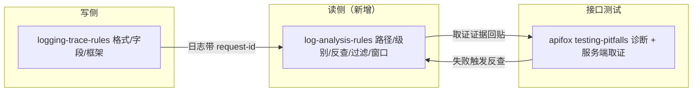

# 日志使用链路打通：写入 → 取证 → 定位 - 实施总览

结论：新建 `log-analysis-rules` 作为读日志侧唯一权威，并给写日志、bug 定位、接口测试三处既有规则补联动，使"写入 → 取证 → 定位"成为一条显式闭合的链路。影响：凡涉及查日志、日志分析、接口测试失败后取证的动作，今后统一按新规则执行，写侧日志必须带可反查标识。范围：新建 1 个 skill、修改 5 处既有 skill 资产、落盘需求/实施/6-review 文档、刷新字典、同步项目记忆与知识库。非范围：不改日志框架接入、不建监控告警策略、不改错误处理机制、不做 Git 提交。变化：新增读日志权威规则，写侧补可反查字段，接口测试失败后必须去服务端日志取证，测试脚本过程日志从可选项升级为默认要求。完成标准：新 skill 通过结构校验，三处联动引用语义可查，字典/记忆/知识库/6-review 齐备，全量测试无本改动新回归。术语说明：读侧指怎么取日志、怎么过滤、怎么定位；写侧指代码里怎么写日志；request-id 指一次请求的唯一编号，用于从日志反查该请求经过的每一步。验证状态：本文档为已确认需求下的实施总览，真实测试以机器校验与语义检查为准。

## 文档信息

- 实施总览标题：日志使用链路打通：写入 → 取证 → 定位 - 实施总览
- 版本与状态：v1.0 / 实施中
- 来源对象标识：`REQ-LOG-20260825-001`
- 复杂度等级：L2
- 当前优先闭环：周期 01 新建读侧 skill + 周期 03 apifox 取证打通（用户痛点的两个核心）。

## 当前计划最终方案简要说明

推荐方案：新建 `log-analysis-rules`（SKILL.md + 5 个 reference：日志文件位置、级别切换、request-id 反查、日志取证过滤、调试窗口纪律）作为读日志侧唯一权威；随后给 `logging-trace-rules` 补「日志必须含可反查稳定标识」字段、给 `bug-root-cause-rules`/`bug-intake-rules` 补「查日志显式指向读侧」、给 apifox `testing-pitfalls.md` 补「第 5 步服务端取证」、给 `test-program-rules` 把测试脚本过程日志从自查项升级为默认放行项。选择原因：仓库已有"单一权威 owner + 联动引用"的成熟模式（如 test-strategy-rules），读日志侧照此办理最一致；不与 runtime-diagnostics 抢职责——它管"临时调试日志怎么加"，读侧归 log-analysis-rules。

## Agent 对当前问题的理解

- 问题 / 目标：规则体系只约束「怎么写日志」（格式、字段、框架、trace 原则），不约束「怎么读日志」——日志文件路径无约定、无按 request-id 反查的读取规范、DEBUG 级别切换无纪律、调试窗口打印无规定；apifox 失败诊断止于响应体；测试脚本过程日志只是软性自查项。需要靠日志分析推进的步骤实际无规则可依。
- 本轮范围：新建 `log-analysis-rules`；修改 `logging-trace-rules`、`bug-root-cause-rules`、`bug-intake-rules`、`test-program-rules`、`apifox-cli__skillhub/modules/testing-pitfalls.md`；落盘需求/实施/6-review 文档；重跑字典；同步 `PROJECT_MEMORY.md` 与知识库。
- 非范围：不动日志框架接入与配置、不引入监控告警平台策略、不改错误处理机制、不重写既有 skill 主体结构、不做 Git 提交。
- 当前优先闭环：周期 01 新建读侧 skill + 周期 03 apifox 取证打通（用户痛点的两个核心）。
- 关键假设 / 待确认点：`[DEBUG-xxxx]` 前缀沿用 bug 域既有约定；request-id 反查以 trace-propagation 原则为基础落地为可操作步骤。
- `unresolved_decisions`：无。

## 图片资产决策与实施边界

- 图片资产决策：`N/A + 原因 + 证据`：本任务为规则文本与文档同步，无 UI、原型、截图、空间布局或视觉对比需求；流程与时序用 Mermaid 已足够表达。
- Mermaid 边界：边界、依赖与端到端使用 Mermaid；不涉及图片替代。

## 图片资产清单

| 图片 ID | 用途 / 生成输入 | 来源 | 相对路径 | 版本 | 关联 REQ/RULE / AC / CYCLE / TASK | 引用章节 | 敏感状态 | 版权状态 |
| --- | --- | --- | --- | --- | --- | --- | --- | --- |
| `N/A + 原因：无图片资产` | `N/A` | `N/A` | `N/A` | `N/A` | `N/A` | `N/A` | `N/A` | `N/A` |

## 已冻结决策与方案比较

| ID | 决策问题 | 候选方案 | 选定方案 | 排除原因 | 影响面 | 回滚 | 证据 |
| --- | --- | --- | --- | --- | --- | --- | --- |
| `DEC-LOG-001` | 读日志规则如何落地 | 纯补丁 / 只新建 / 新建 + 联动 | **新建 + 联动**：log-analysis-rules 作唯一权威，四处既有资产补引用 | 纯补丁无唯一权威；只新建无人引用 | 6 处 skill 资产 | `ROLLBACK-LOG-001`：删除新 skill 并还原补丁 | 用户确认落盘推进 |
| `DEC-LOG-002` | 测试脚本过程日志升级力度 | 保持自查 / 默认放行 / 硬阻断 | **默认放行项**，保留计划冻结硬判出口 | 硬阻断误伤简单脚本；自查太软 | `test-program-rules` | 同 `ROLLBACK-LOG-001` | 推荐方案经用户确认 |
| `DEC-LOG-003` | 调试窗口纪律范围 | 使用与回收纪律 / 延伸到前端代码规范 | **只规定使用与回收纪律** | 生产 console.log 禁令属写侧职责，跨职责重叠 | `debug-window-discipline.md` | 同 `ROLLBACK-LOG-001` | 推荐方案经用户确认 |

## 现状与落点

已核实基线（改动前，git HEAD `78fb774f`）：

```text
logging-trace-rules/                      # 写侧：格式/字段/框架/trace-propagation 原则（无读取反查约定）
bug-intake-rules/references/runtime-diagnostics*.md   # 临时调试日志 [DEBUG-xxxx] 放置与清理；discovery 只说"查日志"没说怎么查
bug-root-cause-rules/SKILL.md             # 根因分析主规则
test-program-rules/SKILL.md               # 7 项最小过程日志，明示"默认自查项、非硬阻断"
apifox-cli__skillhub/modules/testing-pitfalls.md      # 四层诊断止于响应体，无服务端取证
skill-dictionary/                         # 字典生成脚本与 seed
doc/2-需求/2026-08-25_REQ-LOG-20260825-001_日志链路打通.md  # 已落盘需求（valid: true）
```

图形目的：说明本任务的系统边界——读侧、写侧、接口测试三个域的归属与联动关系。关联 ID：`REQ-LOG-20260825-001`、`CYCLE-LOG-01`。


改动后新增/变化文件：

```text
log-analysis-rules/                       # 新增：SKILL.md + references/{log-file-location,log-level-switching,request-id-traceback,log-fetch-and-filter,debug-window-discipline}.md
logging-trace-rules/SKILL.md              # 补：日志字段必须含可反查稳定标识
bug-root-cause-rules/SKILL.md             # 补：查日志显式指向 log-analysis-rules
bug-intake-rules/SKILL.md                 # 补：查日志显式指向 log-analysis-rules
apifox-cli__skillhub/modules/testing-pitfalls.md  # 四层诊断 → 五步（补服务端取证）
test-program-rules/SKILL.md               # 过程日志自查项 → 默认放行项
doc/3-实施/2026-08-25_164000_REQ-LOG-20260825-001_日志链路打通_实施总览.md   # 本文档
doc/3-实施/2026-08-25_*_REQ-LOG-20260825-001_*_实施周期0N_*.md              # 4 份周期文档
doc/6-review/2026-08-25_*_REQ-LOG-20260825-001_6-review.md                 # 收口风格回归
```

## 跨会话独立执行与外部项目代码引用清单

- 新会话接手第一步：读取本实施总览与需求文档，重新跑 `git status` 与 `Grep log-analysis-rules` 核验基线，若与本节不符先按 `code-context-resync-rules` 对齐。
- 主项目名称与项目根：`luode-skills`，`D:\谷歌云盘\luode-skills`。
- 主项目仓库类型与代码基线：git 仓库，HEAD `78fb774fef93ecb58a65774c92e0928c4f88793e`。
- 计划源文件与版本：`doc/2-需求/2026-08-25_REQ-LOG-20260825-001_日志链路打通.md`（v1.0，已确认）。
- 依赖安装、local 配置和服务启动入口：Python managed 3.13 venv `C:\Users\luode\.workbuddy\binaries\python\envs\default`（已装 PyYAML）；无服务启动；测试入口 `python -X utf8 test/run_python_tests.py`。
- 中断点核验顺序：周期 01 后核验 quick_validate → 周期 02 后核验语义 grep → 周期 03 后核验取证步骤 → 周期 04 后核验字典与全量回归。
- 外部项目代码引用：`N/A + 原因 + 证据`：本任务只修改本仓库 skill 资产与文档，不引用其他项目代码。

## 实施周期总览

| 顺序 | 周期 ID | 期次定位 | 单一周期目标 | 进入条件 | 收口条件 | 依赖 | 文档 |
| --- | --- | --- | --- | --- | --- | --- | --- |
| 1 | `CYCLE-LOG-01` | 第一期 | 新建 `log-analysis-rules` 读侧权威（SKILL.md + 5 references） | 需求文档落盘且校验通过 | `quick_validate.py log-analysis-rules` 退出码 0；无控制台打印豁免 | 无 | `2026-08-25_*_REQ-LOG-20260825-001_实施周期01_新建读侧权威.md` |
| 2 | `CYCLE-LOG-02` | 第二期 | 写读闭环：写侧补可反查字段 + bug 域引用读侧入口 | 周期 01 收口 | 语义 grep 两处引用到位；字段规则可查 | `CYCLE-LOG-01` | `2026-08-25_*_REQ-LOG-20260825-001_实施周期02_写读闭环.md` |
| 3 | `CYCLE-LOG-03` | 第三期 | apifox 四层诊断补「第 5 步服务端取证」 | 周期 02 收口 | 取证步骤在 testing-pitfalls 中可查 | `CYCLE-LOG-02` | `2026-08-25_*_REQ-LOG-20260825-001_实施周期03_接口取证.md` |
| 4 | `CYCLE-LOG-04` | 第四期 | 测试脚本过程日志升级 + 字典/记忆/知识库/6-review 收口 | 周期 03 收口 | 字典重跑 0；全量测试无新回归；6-review `STYLE: PASS` | `CYCLE-LOG-03` | `2026-08-25_*_REQ-LOG-20260825-001_实施周期04_升级与收口.md` |

图形目的：说明 4 个周期的先后依赖与不可跳期顺序。关联 ID：`CYCLE-LOG-01`、`CYCLE-LOG-02`、`CYCLE-LOG-03`、`CYCLE-LOG-04`。


## 阶段计划

| 阶段 | 周期 | 唯一目标 | 输入 | 输出 | 验证门槛 |
| --- | --- | --- | --- | --- | --- |
| `PHASE-LOG-01` | `CYCLE-LOG-01` | 读侧权威骨架 | 需求文档 | `log-analysis-rules/SKILL.md` | quick_validate 退出码 0 |
| `PHASE-LOG-02` | `CYCLE-LOG-01` | 5 个读侧 reference | SKILL.md | `references/*.md` 五件 | 5 文件存在且被 SKILL.md 引用 |
| `PHASE-LOG-03` | `CYCLE-LOG-02` | 写侧可反查字段 | 周期 01 产物 | `logging-trace-rules/SKILL.md` 字段规则 | grep 可查字段规则 |
| `PHASE-LOG-04` | `CYCLE-LOG-02` | bug 域引用读侧 | 周期 01 产物 | 两处 bug skill 引用 | 语义 grep 引用到位 |
| `PHASE-LOG-05` | `CYCLE-LOG-03` | apifox 服务端取证 | 周期 02 产物 | `testing-pitfalls.md` 第 5 步 | 取证步骤可查 |
| `PHASE-LOG-06` | `CYCLE-LOG-04` | 过程日志升级 | 周期 03 产物 | `test-program-rules/SKILL.md` | 状态表述为默认放行 |
| `PHASE-LOG-07` | `CYCLE-LOG-04` | 收口资产 | 全部改动 | 字典/记忆/知识库/6-review | 字典 0、全量测试无新回归、`STYLE: PASS` |

图形目的：说明从"写日志带标识"到"取证定位"的端到端数据流，关联全部四周期。关联 ID：`REQ-LOG-001`、`REQ-LOG-002`、`REQ-LOG-003`、`REQ-LOG-004`、`REQ-LOG-005`。


## 最小任务清单

| 周期内顺序 | 任务 ID | 垂直切片目标 | 预计文件数 | 文件/符号契约 | 真实测试 | 完成条件 | 停止条件 |
| --- | --- | --- | ---: | --- | --- | --- | --- |
| 1 | `TASK-LOG-01` | 新建读侧权威 skill | 6 | `log-analysis-rules/SKILL.md` + `references/{log-file-location,log-level-switching,request-id-traceback,log-fetch-and-filter,debug-window-discipline}.md` | `TEST-LOG-01` | quick_validate 退出码 0；5 reference 均被引用 | 校验失败即停 |
| 2 | `TASK-LOG-02` | 写侧补可反查字段 | 1 | `logging-trace-rules/SKILL.md` | `TEST-LOG-02` | 字段规则落地且 grep 可查 | grep 缺失即停 |
| 3 | `TASK-LOG-03` | bug 域引用读侧入口 | 2 | `bug-root-cause-rules/SKILL.md`、`bug-intake-rules/SKILL.md` | `TEST-LOG-03` | 两处显式引用 `log-analysis-rules` | 任一处缺失即停 |
| 4 | `TASK-LOG-04` | apifox 服务端取证第 5 步 | 1 | `apifox-cli__skillhub/modules/testing-pitfalls.md` | `TEST-LOG-04` | 四层诊断含第 5 步取证动作 | 取证步骤缺失即停 |
| 5 | `TASK-LOG-05` | 测试脚本过程日志升级 | 1 | `test-program-rules/SKILL.md` | `TEST-LOG-05` | 状态改为默认放行并指向读侧 | 表述未升级即停 |
| 6 | `TASK-LOG-06` | 字典/记忆/知识库/6-review 收口 | 5+ | `skill-dictionary/`、`PROJECT_MEMORY.md`、知识库笔记、`doc/6-review/`、`PROJECT_CURRENT.md` | `TEST-LOG-06` | 字典退出码 0；全量测试无新回归；`STYLE: PASS` | 任一失败即停并记录 |

## 追踪矩阵

| 来源/完成条件 | 周期 | 任务 | 文件/符号 | 测试 | 风格回归 | 证据 | 状态 |
| --- | --- | --- | --- | --- | --- | --- | --- |
| `REQ-LOG-20260825-001` / `AC-LOG-001` | `CYCLE-LOG-01` | `TASK-LOG-01` | `log-analysis-rules/` 6 文件 | `TEST-LOG-01` | `STYLE-LOG-01` | `EVIDENCE-LOG-01` | 完成 |
| `REQ-LOG-20260825-001` / `AC-LOG-002` | `CYCLE-LOG-02` | `TASK-LOG-02` | `logging-trace-rules/SKILL.md` | `TEST-LOG-02` | `STYLE-LOG-01` | `EVIDENCE-LOG-02` | 完成 |
| `REQ-LOG-20260825-001` / `AC-LOG-003` | `CYCLE-LOG-02` | `TASK-LOG-03` | 两处 bug skill SKILL.md | `TEST-LOG-03` | `STYLE-LOG-01` | `EVIDENCE-LOG-03` | 完成 |
| `REQ-LOG-20260825-001` / `AC-LOG-004` | `CYCLE-LOG-03` | `TASK-LOG-04` | `testing-pitfalls.md` | `TEST-LOG-04` | `STYLE-LOG-01` | `EVIDENCE-LOG-04` | 完成 |
| `REQ-LOG-20260825-001` / `AC-LOG-005` | `CYCLE-LOG-04` | `TASK-LOG-05` | `test-program-rules/SKILL.md` | `TEST-LOG-05` | `STYLE-LOG-01` | `EVIDENCE-LOG-05` | 完成 |
| `BOUND-LOG-001` | `CYCLE-LOG-04` | `TASK-LOG-06` | 字典/记忆/知识库/6-review | `TEST-LOG-06` | `STYLE-LOG-01` | `EVIDENCE-LOG-06` | 完成 |

`AC-*` 完成条件冻结：`AC-LOG-001` 新 skill 通过 quick_validate；`AC-LOG-002` 写侧字段落地可查；`AC-LOG-003` bug 域两处显式引用；`AC-LOG-004` 取证第 5 步可查；`AC-LOG-005` 过程日志默认放行 + 收口资产齐备。

## 真实测试安排

| 测试 ID | 任务 | 命令/入口 | local 环境 | 样本 | 断言 | 失败预期 | 清理 | 证据 |
| --- | --- | --- | --- | --- | --- | --- | --- | --- |
| `TEST-LOG-01` | `TASK-LOG-01` | `python -B .system/skill-creator/scripts/quick_validate.py log-analysis-rules` | venv python 3.13 | 新 skill 目录 | 退出码 0、`Skill is valid!` | 结构或必填字段缺失即停 | 修复后重跑 | `EVIDENCE-LOG-01`：CLI 输出 |
| `TEST-LOG-02` | `TASK-LOG-02` | `Grep "可反查" logging-trace-rules/SKILL.md` | Grep 工具 | 改动后 SKILL.md | 命中字段规则 | 无命中即停 | 无需清理 | `EVIDENCE-LOG-02`：grep 行号 |
| `TEST-LOG-03` | `TASK-LOG-03` | `Grep "log-analysis-rules" bug-root-cause-rules/SKILL.md bug-intake-rules/SKILL.md` | Grep 工具 | 两处 SKILL.md | 两文件均命中引用 | 任一缺失即停 | 无需清理 | `EVIDENCE-LOG-03`：grep 行号 |
| `TEST-LOG-04` | `TASK-LOG-04` | `Grep "服务端取证" apifox-cli__skillhub/modules/testing-pitfalls.md` | Grep 工具 | testing-pitfalls.md | 命中第 5 步取证 | 无命中即停 | 无需清理 | `EVIDENCE-LOG-04`：grep 行号 |
| `TEST-LOG-05` | `TASK-LOG-05` | `Grep "默认放行" test-program-rules/SKILL.md` | Grep 工具 | SKILL.md | 命中默认放行表述 | 无命中即停 | 无需清理 | `EVIDENCE-LOG-05`：grep 行号 |
| `TEST-LOG-06` | `TASK-LOG-06` | `python -X utf8 skill-dictionary/generate_dictionary.py && python -X utf8 test/run_python_tests.py` | venv python 3.13 | 字典 seed 与全量测试 | 字典退出码 0；失败集合与改动前一致（无新回归） | 新增失败即停并记录 | 修复后重跑 | `EVIDENCE-LOG-06`：CLI 输出 |

免测理由：`TASK-LOG-02` 至 `TASK-LOG-05` 为规则文本/引用同步，不改变可执行行为——`N/A + 原因：纯规则文档同步`；替代验证为语义 grep 命中与回读一致性核对。

## 风险与阻断项

| ID | 风险/阻断 | 触发证据 | 当前措施 | 恢复路径 | 禁止动作 |
| --- | --- | --- | --- | --- | --- |
| `GAP-LOG-001` | 文档机器校验失败 | 校验脚本退出码非 0 | 修复结构后再进入实施 | 按 error_codes 逐项修复 | 不得口头放行 |
| `GAP-LOG-002` | 新 skill 与 runtime-diagnostics 职责重叠 | 语义 grep 发现重复定义 | 读侧只做取/读/定位，调试日志放置清理归 bug 域 | 修订边界描述 | 不得把写侧规则搬进读侧 |
| `GAP-LOG-003` | 全量测试既有失败干扰 | `run_python_tests.py` 输出既有 fail/err | 对比改动前基线，确认无本改动新失败 | 单独记录，不在本任务修 | 不得为通过测试而改动无关断言 |
| `ROLLBACK-LOG-001` | 规则回滚 | 用户要求还原 | 记录全部改动文件清单 | 删除 `log-analysis-rules/` 并还原四处补丁 | 无 git 提交授权前不 commit |

- 任务完成条件：`AC-LOG-001` 至 `AC-LOG-005` 全部满足。
- 任务停止 / 结束条件：任一校验/测试失败即停并记录 GAP。
- 当前 agent 最大推进边界：不迁移存量项目文件；不改知识库历史笔记；不动 `test/` 其他测试；不做 git 提交（无当轮显式授权）。
- 是否已获得用户开始实施授权：`是`（用户回复「开始落盘推进」确认方案）。

## 自审结论

- 零决策交接：TASK 均含文件/符号、操作、禁止触碰区、测试、断言、完成/停止条件，无占位词。
- 文件/符号落点：与第五、六节一致，全部经真实读取核实。
- 需求/验收/任务/测试覆盖率：`REQ-LOG-20260825-001` → `AC-LOG-001..005` → `TASK-LOG-01..06` → 文件 → `TEST-LOG-01..06` → `EVIDENCE-LOG-01..06` 双向可回指。
- 周期顺序与闭环：四周期 `CYCLE-LOG-01..04` 依依赖串行，TASK 按序逐个闭环。
- 图形语义与 Mermaid 解析：边界、依赖、端到端三图可解析，术语与正文一致。
- 占位词和 N/A 证据：图片资产、外部引用、免测理由均写 `N/A + 原因 + 证据`。
- 用户确认状态：方案形态与两个力度决策经用户确认（「开始落盘推进」）。

## 执行附录

- 执行顺序：需求落盘（已完成）→ 实施总览（本文档）→ T1（周期 01）→ T2/T3（周期 02）→ T4（周期 03）→ T5/T6（周期 04）→ 收口校验。
- 关键命令：
  - skill 校验：`python -B .system/skill-creator/scripts/quick_validate.py log-analysis-rules`
  - 文档校验：`python artifact-delivery-gate-rules/scripts/validate_engineering_docs.py --profile <profile> --doc <path> --root .`
  - 字典刷新：`python -X utf8 skill-dictionary/generate_dictionary.py`
  - 全量测试：`python -X utf8 test/run_python_tests.py`
  - 知识库检查：`python knowledge-flow/scripts/knowledge_index.py check`
- 清理与回滚：删除 `log-analysis-rules/` 目录并还原四处补丁即可回滚（`ROLLBACK-LOG-001`）；未提交前可用 `git checkout -- <file>` 仅还原指定文件。

## 追踪附录

- 稳定 ID 清单：`REQ-LOG-20260825-001`、`AC-LOG-001..005`、`CYCLE-LOG-01..04`、`TASK-LOG-01..06`、`TEST-LOG-01..06`、`EVIDENCE-LOG-01..06`、`DEC-LOG-001..003`、`GAP-LOG-001..003`、`ROLLBACK-LOG-001`、`PHASE-LOG-01..07`、`STYLE-LOG-01`。
- 机器可读定位：`log-analysis-rules/`（读侧权威）、`logging-trace-rules/SKILL.md`（写侧字段）、`apifox-cli__skillhub/modules/testing-pitfalls.md`（取证）、`test-program-rules/SKILL.md`（过程日志）、`skill-dictionary/`（字典）。
- 附录维护规则：执行附录与追踪附录连续位于文档末尾，其后无业务正文。
