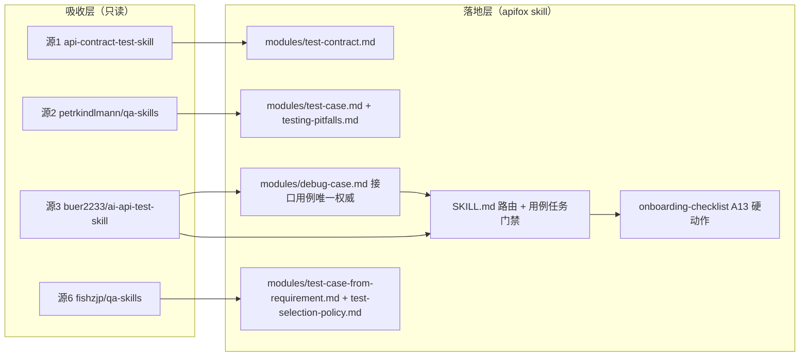
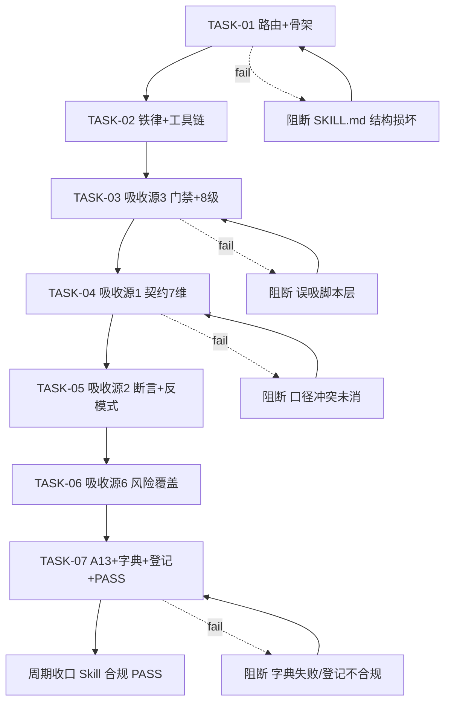

# 从 GitHub 吸收接口用例类 skill 精华补强 apifox「接口用例」覆盖 - 实施总览

结论：从 GitHub 吸收 4 个 MIT 合规源的接口专项用例精华，新增 apifox 独立模块 `modules/debug-case.md` 作为接口用例（DEBUG_CASE）唯一权威，并把「每个有 body 接口 ≥1 非空 DEBUG_CASE」纳入项目接入硬动作 A13，从路由入口解决「接口用例太少」。影响：凡 apifox 接口用例相关任务今后先命中 `debug-case.md`；范围：新增 1 个模块、增强 6 个既有模块、补 SKILL.md 路由与门禁、onboarding-checklist 新增 A13、刷新字典、登记吸收映射与来源、落盘实施与 6-review 文档；非范围：不吸收脚本层 / pytest / mitmproxy / Pact 工具链、不引入源4 naodeng 非商业许可原文、不新增依赖、不改 test-strategy-rules 用例设计方法权威、不动 `.workbuddy/skills` junction、不做 Git 提交；变化：接口用例从只有 test-case.md 规则 T-3 一处专属规则，升级为独立路由可命中、有覆盖度铁律、有创建/维护/批量工具链、有契约专项维度的完整权威；完成标准：7 任务全闭环、路由可从「调试用例/接口用例」命中 debug-case、A13 已入 onboarding-checklist、4 源吸收已登记、字典 exit 0、`skill-execution-compliance-gate-rules` 输出 `Skill 合规:PASS`；术语说明：接口用例指接口树下的调试用例（`api.cases[]` type=DEBUG_CASE），自动化测试用例是另一套资源（`apiTestCaseCollection`），两者在本 skill 内严格区分；验证状态：纯文档资产改造，真实测试以结构断言 + 字典脚本运行 + 内容自检为准，apifox export 抽查因无凭据记为环境阻断退化结构断言。

## 文档信息

- 实施总览标题：从 GitHub 吸收接口用例类 skill 精华补强 apifox「接口用例」覆盖 - 实施总览
- 版本与状态：v1.0 / 实施中
- 来源对象标识：`SKILL-ABSORB-INTERFACE-CASES-20260901`
- 复杂度等级：L2
- 当前优先闭环：CYCLE-01 TASK-01 至 TASK-07 垂直切片（新增 debug-case.md + 落地 A13 是用户痛点的核心）。

## 当前计划最终方案简要说明

方案一句话：吸收 4 个 MIT 源（api-contract-test-skill、petrkindlmann/qa-skills、buer2233/ai-api-test-skill、fishzjp/qa-skills）的接口专项用例精华，新增 `modules/debug-case.md` 作接口用例唯一权威，并把覆盖度铁律纳入项目接入硬动作 A13。主落点 `apifox-cli__skillhub/`；选择原因：接口用例现状只有 T-3 一处专属规则、无独立路由、无覆盖度铁律、无批量工具链，单点补丁无法从入口解决「接口用例太少」；且用户已确认「新增独立模块」与「纳入铁律+检查」；走 skill-absorption-rules 外部吸收通道（2026-08-19 / 2026-08-30 同型先例）。

## Agent 对当前问题的理解

- 问题 / 目标：用户反馈 apifox 测试用例、接口用例比单元测试少，尤其接口用例只有 1 条专属规则，要求从 GitHub 与 WorkBuddy 两个 skill 市场吸收补强。探索确认：接口用例（DEBUG_CASE）确实只有 test-case.md 规则 T-3 一处专属规则；workbuddy 市场侧本环境不可查（本地 `.workbuddy/skills` 是指向本仓库的 junction，skillhub.workbuddy.cn 不可达），可吸收源实际全在 GitHub。
- 本轮范围：8 源逐一审（已完成，4 吸收 + 3 参考 + 1 拒绝）→ 新增 `modules/debug-case.md` → 增强 `test-contract.md` / `test-case.md` / `testing-pitfalls.md` / `test-case-from-requirement.md` / `test-selection-policy.md` → SKILL.md 路由与用例任务门禁 → onboarding-checklist 新增 A13 → 字典刷新 → absorption-map / source-notes 登记 → `Skill 合规:PASS/FAIL`。
- 非范围：不吸收脚本层 / pytest / mitmproxy / Pact；不引入源4 非商业许可原文；不新增依赖；不改 test-strategy-rules 用例设计方法权威；不实现 apifox CLI；不动 `.workbuddy/skills` junction；不做 Git 提交（须用户当轮显式授权）。
- 当前优先闭环：新增 debug-case.md + 落地 A13，让「接口用例」从路由可命中、有独立权威、有覆盖度铁律。
- 关键假设 / 待确认点：apifox CLI `export --format apifox` 可读 `api.cases[]`、match-name 重导可写 DEBUG_CASE 处理器——已由 `references/case-debug-case-vs-test-case.md` 第八/九节实测支撑，非新假设；吸收精华改写为通用形态、不绑定任何 agent。
- `unresolved_decisions`：无（3 个真实决策点已全部选定）。

## 图片资产决策与实施边界

- 图片资产决策：`N/A + 原因 + 证据`：本任务为规则文档资产改造，无 UI、原型、截图、空间布局或视觉对比需求；流程与边界用 Mermaid 已足够表达，不触发 imagegen。
- Mermaid 边界：边界、周期依赖与端到端执行路径均使用 Mermaid；不涉及图片替代。

## 图片资产清单

| 图片 ID | 用途 / 生成输入 | 来源 | 相对路径 | 版本 | 关联 REQ/RULE / AC / CYCLE / TASK | 引用章节 | 敏感状态 | 版权状态 |
| --- | --- | --- | --- | --- | --- | --- | --- | --- |
| `N/A + 原因：无图片资产` | `N/A` | `N/A` | `N/A` | `N/A` | `N/A` | `N/A` | `N/A` | `N/A` |

## 已冻结决策与方案比较

| ID | 决策问题 | 候选方案 | 选定方案 | 排除原因 | 影响面 | 回滚 | 证据 |
| --- | --- | --- | --- | --- | --- | --- | --- |
| `DEC-ABSORB-001` | 吸收源范围 | 只取推荐 MIT 源 / **全部候选逐一审** | 全部候选逐一审 → 4 吸收 + 3 参考 + 1 拒绝 | 只取推荐会漏掉其他源真增量 | 8 源裁决表 | `ROLLBACK-ABSORB-001`：撤销 4 源登记与 6 模块改动 | 用户选定「全部候选逐一审」 |
| `DEC-ABSORB-002` | 接口用例精华落点形态 | 只补既有模块 / **新增独立模块** | 新增 `modules/debug-case.md` 作唯一权威 | 补丁式无独立路由，痛点不从入口解决 | 1 新模块 + SKILL.md 路由 | 同 `ROLLBACK-ABSORB-001`：删模块并还原路由 | 用户选定「新增独立模块」 |
| `DEC-ABSORB-003` | 覆盖度铁律是否纳入检查 | 只写规则 / **纳入铁律+检查** | onboarding-checklist 节点 2 新增 A13 | 只写规则无硬动作保障 | onboarding-checklist + 不可违反规则 | 同 `ROLLBACK-ABSORB-001`：撤销 A13 | 用户选定「纳入铁律+检查」 |

## 现状与落点

已核实基线（改动前，git HEAD `00b905b0`）：

```text
apifox-cli__skillhub/
├── SKILL.md                                  # 233 行，模块按需加载路由表 + 核心共享规则（无「调试用例/接口用例」入口行，无用例任务门禁）
├── modules/
│   ├── test-case.md                          # 443 行，两类用例两套资源节 + 规则 T-3（调试用例请求示例，MediaType 层级 example 关键）
│   ├── test-contract.md                      # 91 行，契约测试三能力 + 6 条概要检查清单（缺 IDOR/BOLA/幂等/分页越界/版本漂移细节）
│   ├── testing-pitfalls.md                   # 陷阱知识库（无「条件性断言永不执行」反模式清单）
│   ├── test-case-from-requirement.md         # 需求→用例 + RTM（无可执行性硬标准、无跨路径校验）
│   ├── test-selection-policy.md              # P0/P1/P2 风险分级（无风险反向覆盖门禁）
│   └── ...（共 23 个模块）
├── references/
│   ├── case-debug-case-vs-test-case.md       # 第八/九节：match-name 重导批量通道 + ordering 归零副作用 + 豁免清单 + 接口层级联
│   ├── source-notes.md                       # 吸收来源记录（追加式）
│   └── workbuddy-absorption-map.md           # 吸收登记（追加式，9 次历史登记）
skill-dictionary/                             # 字典生成脚本与 data.js / 字典.md
doc/6-review/                                 # 6-review 记录目录（STYLE: PASS / FIX_REQUIRED）
```

复用点：`references/case-debug-case-vs-test-case.md`（第八/九节批量通道 + 级联副作用 + 豁免清单）；`test-case.md` 规则 T-3；`test-case-generation.md` 覆盖度铁律表述；onboarding-checklist 既有 A1-A12 硬动作格式。

图形目的：说明本任务在 apifox skill 内的系统边界——接口用例（DEBUG_CASE）权威、既有相关模块、外部吸收源的归属与引用关系。关联 ID：`SKILL-ABSORB-INTERFACE-CASES-20260901`、`CYCLE-ABSORB-01`。



## 实施周期总览

- 单周期 CYCLE-01「接口用例专项吸收与落地」，7 个最小任务，按「路由入口 → 权威模块 → 落地动作 → 合规收口」垂直切片。
- CYCLE-01 执行顺序：TASK-01 → TASK-02 → TASK-03 → TASK-04 → TASK-05 → TASK-06 → TASK-07，每任务「实现 → 真实测试 → 6-review」闭环后才推进下一任务。
- 进入条件：本计划获用户开工授权（已批准）；`modules/debug-case.md` 不存在（已确认）。
- 收口条件：7 任务全闭环；`python skill-dictionary/generate_dictionary.py` 重跑成功（exit 0）；absorption-map + source-notes 登记完成；`skill-execution-compliance-gate-rules` 输出 `Skill 合规:PASS`。
- 完成标志：路由表可从「调试用例/接口用例」命中 debug-case；A13 已入 onboarding-checklist 并补不可违反规则第 7 条；4 源吸收已登记；字典 data.js / 字典.md 已刷新。
- 总体真实测试：结构断言（grep 关键词 + 内容自检）+ 字典脚本 exit 0 + 可选 `apifox export --format apifox` 抽查 `api.cases[].requestBody.data` 非空（无凭据记环境阻断，用结构断言替代）；纯文档无运行时代码，不触发测试污染红线（`scan_test_pollution.py --root . --diff-only` 无 diff 可扫）。

图形目的：说明 7 个最小任务的先后依赖与不可跳序执行关系。关联 ID：`CYCLE-ABSORB-01`、`TASK-01` ~ `TASK-07`。



## 阶段计划

| 阶段 | 周期 | 唯一目标 | 输入 | 输出 | 验证门槛 |
| --- | --- | --- | --- | --- | --- |
| `PHASE-ABSORB-01` | `CYCLE-ABSORB-01` | 路由入口与 debug-case 骨架 | SKILL.md 路由表 | `modules/debug-case.md` 骨架 | grep debug-case 命中路由+模块 |
| `PHASE-ABSORB-02` | `CYCLE-ABSORB-01` | 覆盖度铁律与维护流程 | 铁律 + case study 第八/九节 | debug-case.md 三节 | 铁律/工具链/字段规范可查 |
| `PHASE-ABSORB-03` | `CYCLE-ABSORB-01` | 用例任务门禁 | 源3 五元组门禁 | SKILL.md + debug-case.md | 门禁+8级排查可查、无脚本层 |
| `PHASE-ABSORB-04` | `CYCLE-ABSORB-01` | 契约专项维度 | 源1 契约 7 维 | `test-contract.md` | 7维+四态+基线齐、与 test-auth 去重 |
| `PHASE-ABSORB-05` | `CYCLE-ABSORB-01` | 断言与反模式 | 源2 无条件断言头 | `test-case.md` + `testing-pitfalls.md` | 响应头断言+反模式齐、去重 |
| `PHASE-ABSORB-06` | `CYCLE-ABSORB-01` | 风险覆盖与可执行性 | 源6 可执行性硬标准 | 两模块 | 硬标准+跨路径+风险反向覆盖齐、F7 跳过登记 |
| `PHASE-ABSORB-07` | `CYCLE-ABSORB-01` | A13 硬动作与合规收口 | 覆盖度铁律 | onboarding-checklist + 字典 + 登记 | A13 可定位、字典 exit 0、PASS |

## 最小任务清单

| 任务 ID | 唯一目标 | 预计文件数 | 文件/符号契约 | 真实测试 | 完成条件 | 停止条件 |
| --- | --- | --- | --- | --- | --- | --- |
| `TASK-01` | 路由入口与 debug-case 骨架 | 2 | `apifox-cli__skillhub/SKILL.md`（路由表补「调试用例/接口用例」行）+ `apifox-cli__skillhub/modules/debug-case.md`（骨架：owner/何时加载/与 test-case.md 边界/引用 case study） | `TEST-ABSORB-01`：grep `debug-case` 命中路由+模块；内容自检骨架无占位 | debug-case 在 SKILL.md ≥1 处；debug-case.md 存在且头部字段齐 | SKILL.md 结构损坏即停并修复 |
| `TASK-02` | debug-case 覆盖度铁律与维护流程 | 1 | `modules/debug-case.md`（覆盖度铁律「每个有 body 接口 ≥1 非空 DEBUG_CASE」+ 创建/维护/批量工具链 + 字段规范 categoryId=0/type=DEBUG_CASE/ordering 副作用） | `TEST-ABSORB-02`：grep 铁律/工具链/字段规范三节；内容自检引用 case study 第八/九节 | 三节齐且无占位 | 与 test-case.md 规则 T-3 口径冲突即停 |
| `TASK-03` | 吸收源3 用例任务门禁 | 2 | `SKILL.md`「核心共享规则」新增「用例任务门禁」（五元组前置门禁 + 新增/维护二分）+ `debug-case.md` 新增「失败排查 8 级」节；不吸 pytest/mitmproxy 脚本层 | `TEST-ABSORB-03`：grep 门禁/8级排查；确认无脚本层混入 | SKILL.md 含「用例任务门禁」；debug-case.md 含「失败排查 8 级」；无脚本层 | 误吸脚本层即停并移除 |
| `TASK-04` | 吸收源1 契约专项维度 | 1 | `modules/test-contract.md`（契约 7 专项维度：Schema 一致性/状态码错误契约/IDOR-BOLA 越权/幂等副作用/分页越界/输入边界/版本漂移 + 四态判定 pass-drift-break + 基线只作比较不作证明 + evidence 规则） | `TEST-ABSORB-04`：grep 7维/四态/基线；与 `test-auth.md` 越权/幂等去重 | 三项齐且无重复 | 口径冲突未消即停 |
| `TASK-05` | 吸收源2 契约分离与断言增强 | 2 | `modules/test-case.md`（无条件断言响应头 content-type/cache/rate-limit）+ `modules/testing-pitfalls.md`（反模式清单：条件性断言永不执行、不 mock DB 边界） | `TEST-ABSORB-05`：grep 响应头断言/反模式；与既有陷阱去重 | 两落点齐且无重复 | 与既有断言速查冲突即停 |
| `TASK-06` | 吸收源6 风险覆盖与可执行性 | 2 | `modules/test-case-from-requirement.md`（可执行性硬标准：禁占位符/具体数据/异步判定时限 + 跨路径校验：编辑/重提绕过校验）+ `modules/test-selection-policy.md`（风险反向覆盖门禁：Critical/High 风险被 ≥1 用例 risk_ref 覆盖）；F7 设计方法选型与黑盒五法重叠跳过并登记 | `TEST-ABSORB-06`：grep 风险反向覆盖/异步时限/跨路径；与 test-case-design-methods 去重 | 两落点齐且 F7 跳过已登记 | 与既有方法权威冲突即停 |
| `TASK-07` | 覆盖度铁律硬动作 A13 与合规收口 | 5 | `modules/project-onboarding-checklist.md`（节点 2 新增 A13 + 不可违反规则第 7 条）+ `doc/6-review/2026-09-01_000000_SKILL-ABSORB-INTERFACE-CASES-20260901_6-review.md` + `skill-dictionary/data.js` + `字典.md` + `apifox-cli__skillhub/workbuddy-absorption-map.md` / `references/source-notes.md` | `TEST-ABSORB-07`：grep A13；`python skill-dictionary/generate_dictionary.py` exit 0；有凭据时 `apifox export --format apifox` 抽查 `api.cases[].requestBody.data` 非空（无凭据记环境阻断用结构断言替代） | A13 可定位；字典 exit 0；登记 4 吸收 + 4 参考/拒绝；`Skill 合规:PASS` | 字典失败/登记不合规即停并修复 |

## AC 任务完成条件总表

| 来源对象 / AC | 周期 | 任务 | 落点（文件/节） | 真实测试 | 6-review | 证据 | 状态 |
| --- | --- | --- | --- | --- | --- | --- | --- |
| `SKILL-ABSORB-INTERFACE-CASES-20260901` / `AC-01` | `CYCLE-ABSORB-01` | `TASK-01` | SKILL.md 路由表 + `modules/debug-case.md` | `TEST-ABSORB-01` | `STYLE-ABSORB-01` | `EVIDENCE-ABSORB-01` | 待执行 |
| `SKILL-ABSORB-INTERFACE-CASES-20260901` / `AC-02` | `CYCLE-ABSORB-01` | `TASK-02` | `modules/debug-case.md` 三节 | `TEST-ABSORB-02` | `STYLE-ABSORB-01` | `EVIDENCE-ABSORB-02` | 待执行 |
| `SKILL-ABSORB-INTERFACE-CASES-20260901` / `AC-03` | `CYCLE-ABSORB-01` | `TASK-03` | SKILL.md 用例任务门禁 + debug-case.md 失败排查 8 级 | `TEST-ABSORB-03` | `STYLE-ABSORB-01` | `EVIDENCE-ABSORB-03` | 待执行 |
| `SKILL-ABSORB-INTERFACE-CASES-20260901` / `AC-04` | `CYCLE-ABSORB-01` | `TASK-04` | `modules/test-contract.md` 契约 7 维 | `TEST-ABSORB-04` | `STYLE-ABSORB-01` | `EVIDENCE-ABSORB-04` | 待执行 |
| `SKILL-ABSORB-INTERFACE-CASES-20260901` / `AC-05` | `CYCLE-ABSORB-01` | `TASK-05` | `modules/test-case.md` + `modules/testing-pitfalls.md` | `TEST-ABSORB-05` | `STYLE-ABSORB-01` | `EVIDENCE-ABSORB-05` | 待执行 |
| `SKILL-ABSORB-INTERFACE-CASES-20260901` / `AC-06` | `CYCLE-ABSORB-01` | `TASK-06` | `test-case-from-requirement.md` + `test-selection-policy.md` | `TEST-ABSORB-06` | `STYLE-ABSORB-01` | `EVIDENCE-ABSORB-06` | 待执行 |
| `SKILL-ABSORB-INTERFACE-CASES-20260901` / `AC-07` | `CYCLE-ABSORB-01` | `TASK-07` | onboarding-checklist A13 + 字典 + 登记 | `TEST-ABSORB-07` | `STYLE-ABSORB-01` | `EVIDENCE-ABSORB-07` | 待执行 |

## 风险与阻断项

- 风险1：与既有权威重复 → 每任务带去重检查点（TASK-04 与 test-auth.md、TASK-05 与既有断言速查、TASK-06 与 test-case-design-methods），重叠条目显式跳过/登记。
- 风险2：非商业许可 → 源4 naodeng 只参考不原文搬运，只改写思路。
- 风险3：脚本层污染 → 源3/5/7 脚本层只登记不吸收，符合「接口测试必须 apifox 落地」红线。
- 风险4：apifox CLI 无凭据 → A13 的 export 抽查退化结构断言并记环境阻断，不强行登录（本地连接红线）。
- 依赖：Python 3（字典脚本）；无其他。
- 阻断项：SKILL.md 结构损坏（TASK-01）、误吸脚本层（TASK-03）、口径冲突未消（TASK-04）、字典失败/登记不合规（TASK-07）——命中即停并修复后重跑该任务。

## 数据库变更 SQL

`N/A + 原因：skill 文档资产改造，无数据库变更`。

## 自审结论

- 覆盖度：8 源逐一审、14 条原子条目逐条裁决；AC-01~07 覆盖全部 7 任务。
- 周期：单周期 CYCLE-01，7 任务归属唯一，顺序明确，每任务「实现 → 真实测试 → 6-review」闭环。
- 闭环：无「先连续实现再统一测试」；每任务完成条件与停止条件均已填写。
- 占位词：无 TBD/TODO；落点均到文件/节。
- 图文一致性：Mermaid 节点与任务/阻断一一对应；图片资产 N/A 已写原因 + 证据。
- 用户确认：3 决策点已选定（全部候选逐一审 / 新增独立模块 / 纳入铁律+检查）；本计划已获开工授权。

## 执行附录

- 关键命令：结构断言 `grep -n "debug-case\|覆盖度铁律\|契约专项维度\|用例任务门禁\|失败排查 8 级\|风险反向覆盖\|A13" apifox-cli__skillhub/SKILL.md apifox-cli__skillhub/modules/*.md`；字典刷新 `python skill-dictionary/generate_dictionary.py`；可选抽查 `apifox export --project <id> --format apifox --output x.json`（需已有凭据）。
- 清理/回滚：文档追加式修改，回滚 = `git checkout -- <改动文件>`（实施阶段仅在用户明确授权下执行）；新增文件可删重建。
- 最大推进边界：实施阶段只完成 CYCLE-01 的 7 任务闭环即收口；不额外优化、不扩散其他 skill、不自动 commit（提交须用户当轮显式授权）。

## 追踪附录

- 追踪链：`SRC（8 源抓取）→ DEC（裁决表）→ AC-01~07 → CYCLE-ABSORB-01 → TASK-01~07 → 文件/节 → TEST（结构断言+字典）→ EVIDENCE-ABSORB-01~07`。
- 每任务证据写入 `doc/6-review/2026-09-01_000000_SKILL-ABSORB-INTERFACE-CASES-20260901_6-review.md`。
- 吸收登记落点：`apifox-cli__skillhub/workbuddy-absorption-map.md` + `apifox-cli__skillhub/references/source-notes.md`。
