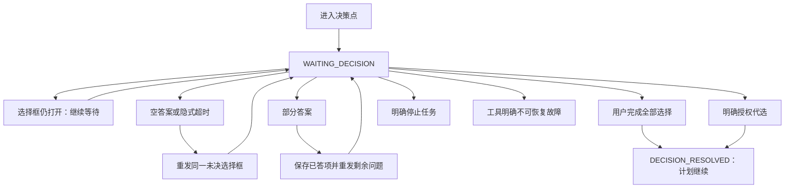
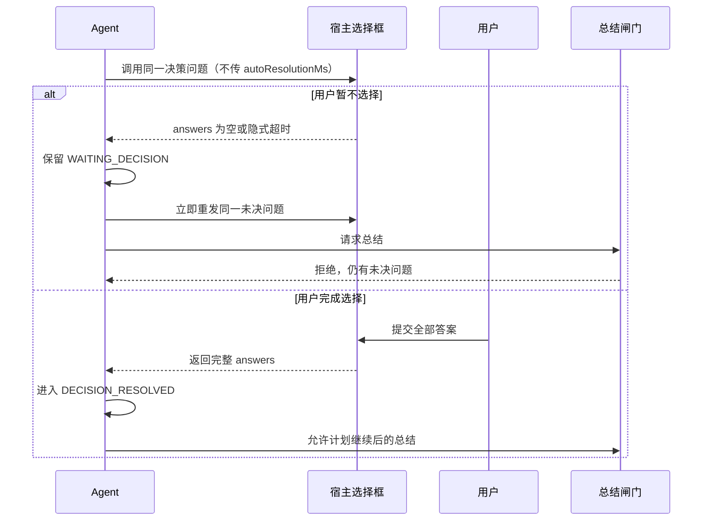

# Bug：Plan Mode 选择框自动关闭后错误输出总结

结论：用户未选择时宿主返回空答案，当前会话错误地把它当作任务结束并输出总结；影响：离开会话数分钟或更久的用户会失去原来的决策入口，计划可能在没有授权的情况下收敛；范围：本记录确认 Plan Mode 决策选择框的空答案、部分答案、延迟选择和总结闸门行为；非范围：Codex Desktop 产品源码、Browser Use、Goal、任务投影和其它交互工具；变化：修复后空答案只会触发同一选择框重发，未决期间不会出现其它消息；完成标准：空答案可无限次重发、部分答案可保留、明确选择或明确授权后才离开等待状态，并有自动与真实宿主证据；术语说明：空答案是选择框关闭但没有提交任何选项，等待状态是 Agent 保留未决问题并暂停其它输出的状态；验证状态：会话 JSONL 已证明原问题，修复后的自动回归和真实 Desktop 验证待实施完成。

## 文档信息

| 项目 | 内容 |
| --- | --- |
| 来源对象 | `BUG-PLAN-WAIT-20260726-001` |
| 影响会话 | `019f9a43-800a-73b0-80bb-2a79bf2abd67` |
| 验收标准 | [Plan Mode 永久等待验收标准](../../7-验收/2026-07-26_040639_BUG-PLAN-WAIT-20260726-001_验收标准.md) |
| 实施总览 | [Plan Mode 永久等待实施总览](../../3-实施/2026-07-26_040639_BUG-PLAN-WAIT-20260726-001_实施总览.md) |
| 实施周期 | [CYCLE-PMW-01 周期文档](../../3-实施/2026-07-26_040639_BUG-PLAN-WAIT-20260726-001_实施周期01_永久等待与总结闸门.md) |
| 图片资产决策 | `N/A`。原因：本 Bug 的关键事实是工具返回顺序和文本输出顺序；证据：会话 JSONL、状态表和 Mermaid 足以复核，截图不需要复制进仓库。 |

图片资产决策：N/A + 原因 + 证据。本 Bug 不交付视觉资产，JSONL 时间线、状态表和 Mermaid 已能复核完整事实链。

## 问题现象

在 Plan Mode 需要用户决定实现路线时，Agent 调用 `request_user_input` 展示选择框。用户没有选择，宿主约 90 秒后返回 `{"answers":{}}`；Agent 没有重新发送选择框，而是继续输出“结果与结论”式总结并结束任务。

## 影响范围

- 受影响对象：需要用户确认多个实现层决策的 Plan Mode 任务。
- 受影响用户：离开会话、暂时没有操作选择框、稍后才回到任务的用户。
- 受影响结果：计划在没有用户选择、代选授权或停止指令的情况下被错误收敛；后续执行者可能无法知道原决策仍未完成。
- 不影响对象：普通执行模式、非决策型 `request_user_input`、其它工具的用户输入行为。

## 出现环境

- 宿主：Codex Desktop Plan Mode。
- 会话：`019f9a43-800a-73b0-80bb-2a79bf2abd67`。
- 输入工具：`request_user_input`，原调用未携带 `autoResolutionMs`。
- 证据来源：本地会话 JSONL；不连接数据库、缓存、消息队列或外部服务。

## 触发条件

1. Agent 进入 `WAITING_DECISION`，调用一个或多个决策问题。
2. 用户不点击任何选项，或只回答部分问题。
3. 宿主关闭选择框并返回空答案或缺少未决问题 ID 的结果。
4. Agent 将该结果解释为取消、授权或可总结信号。

## 期望结果

- 决策调用完全省略 `autoResolutionMs`，选择框关闭但没有答案时仍视为未决。
- `{"answers":{}}` 返回后，唯一下一动作是立即重新调用同一选择框。
- 部分答案被保存，只展示剩余未决问题；问题 ID、选项、推荐标记和文案保持不变。
- 未决期间不发送 commentary、总结、`final_answer`、`task_complete`，也不采用推荐项。
- 用户完成选择、明确授权代选、明确停止，或工具明确不可恢复故障时才离开等待状态。

## 实际结果

- 选择框调用后约 90.038 秒得到 `{"answers":{}}`。
- 下一步没有重发相同问题，而是输出了总结并结束任务。
- 用户没有授权 Agent 代选，也没有要求停止任务，因此该状态迁移没有合法依据。

## 当前根因判断

当前证据将根因收敛为 `RULE-PMW-001` 的状态消费缺口：规划 Owner 未把空答案、缺失答案和宿主隐式超时统一归入 `WAITING_DECISION`，总结 Owner 也没有在存在未决问题时拒绝最终输出。该判断只描述规则和交接缺口，不声称已发现 Codex Desktop 产品源码问题。

## 永久等待状态契约

| 当前状态 | 收到结果 | 必须执行 |
| --- | --- | --- |
| `WAITING_DECISION` | 选择框仍打开 | 继续等待，不发送其它消息 |
| `WAITING_DECISION` | `{"answers":{}}`、缺失答案或隐式超时 | 立即重发相同未决问题 |
| `WAITING_DECISION` | 只回答部分问题 | 保存已答项，只重发剩余问题 |
| `WAITING_DECISION` | 用户完成全部选择 | 进入 `DECISION_RESOLVED`，继续计划 |
| `WAITING_DECISION` | 明确说“你来定/按推荐” | 记录授权后进入 `USER_DELEGATED`，才可采用推荐项 |
| `WAITING_DECISION` | 明确要求停止任务 | 进入 `STOPPED`，不再重发 |
| `WAITING_DECISION` | 工具明确不可恢复故障 | 进入 `HOST_BLOCKED`，报告阻断，不输出方案总结 |

## 状态与重发流程

图形目的：确认所有未决输入都留在等待环路，只有合法终态才能进入计划继续；关联 ID：`RULE-PMW-001`、`REQ-PMW-001..007`、`AC-PMW-001..007`。

## 多角色时序

图形目的：说明宿主每次返回空答案就是下一轮重发触发点，且等待期间总结 Owner 被闸门拦截；关联 ID：`REQ-PMW-002`、`REQ-PMW-004`、`AC-PMW-002`、`AC-PMW-004`。

## 修复与验证边界

### 必须修复

- 在 `implementation-planning-rules` 中冻结决策调用和空答案重发规则。
- 在 `reasoning-summary-structure-rules` 中增加未决决策总结闸门。
- 增加自动行为回归，验证连续 2、10、100 次空答案仍处于等待状态。
- 在真实 Desktop 中跨越至少两个宿主空答案周期，确认用户最终选择后计划才继续。

### 明确不做

- 不替用户选择推荐项；只有用户明确授权才允许代选。
- 不把文本总结、普通 commentary 或后台提醒当作选择框替代品。
- 不创建后台定时器、Goal、任务投影或新的持久化 schema。
- 不修改 Codex Desktop 产品源码；若平台不允许再次调用选择工具，按 `HOST_BLOCKED` 停止并报告。

## 完成标准

- 完成标准：`AC-PMW-001..007` 全部通过；`TEST-PMW-001..010` 自动回归通过；实现审查确认无总结闸门绕过；真实 Desktop 证明确认空答案循环和最终选择恢复。

### 停止条件与交付物

- 停止条件：重发产生多个并存选择框、任意测试能产生“空答案后 final”、工具明确不可恢复、必须修改 Desktop 产品代码，或用户明确要求停止任务。
- 最大推进边界：只实现 Plan Mode 决策永久等待、循环重发和总结闸门；不扩散到其它交互工具、Goal、任务投影、Browser Use 或 Git 历史。
- 交付物：本 Bug README、前置验收标准、实施总览、CYCLE-PMW-01 周期文档、规则改动、总结闸门、自动回归和真实 Desktop 验证记录。

## 执行附录

### 证据与复现步骤

1. 打开会话 `019f9a43-800a-73b0-80bb-2a79bf2abd67` 的本地 JSONL。
2. 查看第 557 行的 `request_user_input` 调用，确认未传 `autoResolutionMs`。
3. 查看第 558 行的结果，确认 `{"answers":{}}`。
4. 查看第 583 行，确认后续错误总结而不是再次调用选择框。
5. 使用同类 Plan Mode 决策任务复现：不选择、等待宿主返回、记录下一动作必须是同一问题重发。

证据文件：`C:/Users/luode/.codex/sessions/2026/07/26/rollout-2026-07-26T01-12-22-019f9a43-800a-73b0-80bb-2a79bf2abd67.jsonl`。截图只作为用户观察线索，不复制到仓库；原因：JSONL 已包含调用、空答案和总结的完整顺序，证据足够且避免保留私人会话画面。

### 清理与回滚

- 自动回归使用临时 fixture，单个测试结束后删除；不写入数据库、缓存、消息队列或外部服务。
- 规则回滚只撤销本来源对象新增的等待状态、重发和总结闸门文字；保留其它 Skill 的既有语义。
- 真实 Desktop 验证若宿主阻断重发，保留 `HOST_BLOCKED` 证据，不以文本总结替代选择框。

## 追踪附录

### 来源、决策、规则与验收追踪

| 来源 | 决策 | 规则/需求 | 验收 | 实施承接 | 测试/证据 |
| --- | --- | --- | --- | --- | --- |
| `SRC-PMW-001` 会话时间线 | `DEC-PMW-001` 空答案不是取消 | `RULE-PMW-001`、`REQ-PMW-001/002` | `AC-PMW-001/002` | `CYCLE-PMW-01`、`TASK-PMW-01/02` | `TEST-PMW-001/002`、`EVIDENCE-PMW-001/002` |
| `SRC-PMW-002` 用户冻结方案 | `DEC-PMW-002` 保留问题身份与部分答案 | `REQ-PMW-003/006` | `AC-PMW-003/006` | `CYCLE-PMW-01`、`TASK-PMW-01/02` | `TEST-PMW-003/006`、`EVIDENCE-PMW-003/006` |
| `SRC-PMW-001` 错误总结行 | `DEC-PMW-003` 未决时禁止总结 | `REQ-PMW-004/007` | `AC-PMW-004/007` | `CYCLE-PMW-01`、`TASK-PMW-03/04` | `TEST-PMW-004/007..010`、`EVIDENCE-PMW-004/007..010` |
| `SRC-PMW-002` 用户目标 | `DEC-PMW-004` 明确授权或停止才离开等待 | `REQ-PMW-005` | `AC-PMW-005` | `CYCLE-PMW-01`、`TASK-PMW-02/04` | `TEST-PMW-005`、`EVIDENCE-PMW-005` |

### 反向追踪与当前状态

- 每个 `REQ-PMW-*` 均有对应 `AC-PMW-*`，每个验收项均承接到 `CYCLE-PMW-01` 的至少一个 `TASK-PMW-*`。
- 每个任务的文件、测试、证据和回滚入口写入实施总览与周期文档；本 Bug 文档只保留上游事实和边界。
- 当前 Bug 状态为已确认、待修复验证；`unresolved_decisions` 为零，真实宿主验证在修复后执行。
