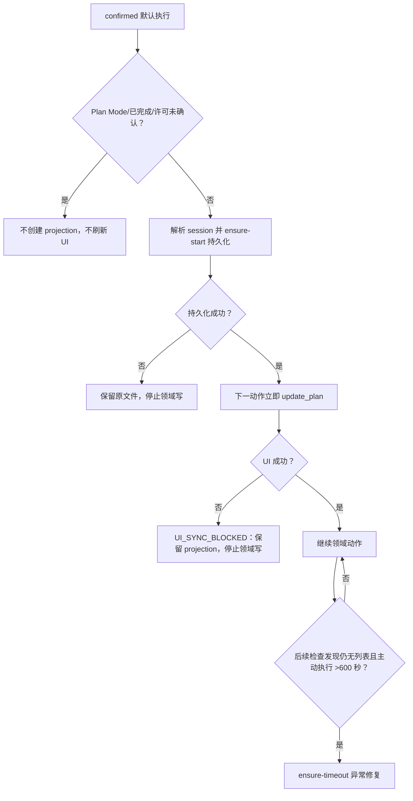

# Bug：任务已持久化但没有立即出现任务悬浮窗

结论：默认执行任务在 `PROJECT_CURRENT.md` 形成 projection 后，没有被强制立即调用 `update_plan`，因此会话即使持续执行约 29 分钟仍可能看不到任务悬浮窗；影响：用户失去当前步骤、恢复入口和阻断状态的可见证据；范围：首次 projection 持久化、UI 刷新顺序、会话解析、状态可见性和十分钟异常修复；非范围：Codex Desktop 产品源码、后台定时器、registry v4 schema、Goal 生命周期和子 Agent 主 UI 权限；变化：默认执行首次领域动作前先持久化，写入成功后的下一动作立即刷新，十分钟仅负责修复漏显示；完成标准：本地行为、失败关闭、文档追踪和真实 Desktop 首显证据均闭环；术语说明：`UI_SYNC_BLOCKED` 表示磁盘 projection 已保存但宿主 UI 调用失败；验证状态：问题已确认，周期 07 实施与真实宿主验收进行中。

## 文档信息

| 项目 | 内容 |
|---|---|
| Bug ID | `BUG-RTP-20260726-001` |
| 影响会话 | `019f9a43-800a-73b0-80bb-2a79bf2abd67` |
| 用户证据 | 用户反馈该会话已处理约 29 分钟仍未看到任务悬浮窗，并提供了本地截图作为观察线索；截图不复制进仓库。 |
| 需求 | [Codex Desktop 任务悬浮窗断点恢复需求](../../2-需求/2026-07-23_012302_CodexDesktop任务悬浮窗断点恢复.md) |
| 验收 | [首次持久化即悬浮窗验收标准](../../7-验收/2026-07-23_012302_CodexDesktop任务悬浮窗断点恢复_验收标准.md) |
| 实施周期 | [CYCLE-RTP-07](../../3-实施/2026-07-26_150000_CodexDesktop任务悬浮窗断点恢复_实施周期07_首次持久化即悬浮窗同步.md) |
| 图片资产决策 | `N/A`。原因：截图是用户观察证据，不是交付资产；投影 JSON、工具调用顺序和 Mermaid 已足以复核。 |

图片资产决策：N/A。原因：截图只作为用户观察证据，不作为交付资产；投影 JSON、工具调用顺序和 Mermaid 足以复核。

## 问题现象

会话已经进入持续执行，理论上任务状态会写入 `PROJECT_CURRENT.md`，但用户界面没有对应的任务悬浮列表。现有十分钟规则只在可执行检查点尝试补建，不能证明首次投影写入后立即刷新，因此长任务可能一直没有可见列表。

## 触发条件

1. 默认执行模式取得 `confirmed`，任务尚未完成。
2. Agent 在领域动作前或领域动作过程中持久化当前 session projection。
3. 持久化后没有把 `update_plan` 作为下一动作，或 UI 失败后继续了其它领域动作。
4. 任务被误判为“可暂不显示”，等待十分钟异常入口而非立即同步。

## 期望结果

- Plan Mode、等待用户、未确认许可和已完成任务不创建 projection，也不刷新主悬浮窗。
- 默认执行取得 `confirmed` 后，在首个领域动作前先为当前 session 原子持久化 `active` 或 `blocked` projection。
- 持久化成功后的下一动作必须立即调用 `update_plan`；两者之间不得代码、文档、测试、委派、服务启动或其它领域写。
- `update_plan` 失败时保留 projection，运行时进入 `UI_SYNC_BLOCKED`，不声称悬浮窗已显示，也不继续下一领域写。
- `active` 和 `blocked` 必须有列表，`inactive` 不创建新列表；显式 `--session-id` 优先于 `CODEX_THREAD_ID`，冲突或缺失失败关闭。
- 十分钟只作为首次列表缺失的异常修复闸门；主动执行严格大于 600 秒且到达检查点后才可调用 `ensure-timeout`。

## 实际结果

- 用户观察到会话处理约 29 分钟仍无任务悬浮窗。
- 现有规则存在“简单任务可以先不显示”的旧口径，默认首显没有硬性投影与 UI 紧邻顺序。
- 仅有脚本或静态规则证据不能证明 Desktop 用户真正看到了列表；真实宿主可见性仍需单独验证。

## 当前根因判断

根因收敛为默认执行路由缺少“持久化后立即同步”的强制顺序：投影 Owner 能够写盘，但调用 `update_plan` 不是写盘成功后的唯一下一动作；十分钟入口被错误地承担了默认首显职责。该判断仅描述 Skills 与宿主工具编排，不声称发现 Codex Desktop 产品源码缺陷。

## 冻结规则

| 规则 | 冻结内容 |
|---|---|
| 首次持久化 | 默认执行取得 `confirmed` 后，首个领域动作前先写当前 session 的 `active`/`blocked` projection。 |
| UI 顺序 | 写盘成功后下一动作只能是 `update_plan`，中间禁止任何领域写或委派。 |
| 失败状态 | UI 调用失败保留 projection，进入 `UI_SYNC_BLOCKED`，不虚报成功、不继续领域写。 |
| 状态可见性 | active/blocked 必须有悬浮列表；inactive 不新建列表；恢复时重新刷新。 |
| session 解析 | `--session-id` 显式值优先，`CODEX_THREAD_ID` 只作回退；冲突、缺失、非法值失败关闭。 |
| Plan Mode | Plan Mode 不创建 projection、不调用主悬浮窗 `update_plan`。 |
| 十分钟 | `ensure-timeout` 仅异常修复；严格 `>600` 秒、暂停扣除和可执行检查点语义不变。 |

## 状态流程

图形目的：说明默认首显、UI 失败和十分钟异常修复的边界；关联 ID：`RULE-RTP-016..022`、`AC-RTP-014..017`。

## 复现与验证边界

### 本地复现

1. 创建 local 临时 `PROJECT_CURRENT.md` 和未完成步骤 fixture，准备合法 session。
2. 以默认执行、`confirmed` 调用首次投影入口，记录文件写入时间和返回 payload。
3. 在宿主调用序列中确认下一动作是 `update_plan`，并注入成功、失败两类结果。
4. 重新运行 active/blocked/inactive、显式/环境/冲突/缺失 session 和 Plan Mode 负向样本。
5. 在首次列表缺失样本中分别构造主动执行 599、600、601 秒，确认仅 601 秒检查点允许异常修复。

### 可观察断言

| 场景 | 通过断言 | 失败断言 |
|---|---|---|
| 首次 active/blocked | 当前 session 原子写入且下一动作立即 `update_plan` | 先领域写、跨 session 写或 UI 调用缺失 |
| UI 失败 | 文件保留、状态 `UI_SYNC_BLOCKED`、停止下一领域写 | 删除 projection、虚报可见或继续写 |
| inactive | 不生成新列表 | 完成投影重新出现在悬浮窗 |
| session 冲突/缺失 | 非零退出、哈希不变、零 UI 调用 | 猜测、覆盖或回退其它 session |
| 十分钟修复 | 599/600 不修复，601 才在检查点修复 | 默认首显等待十分钟或后台唤醒承诺 |

## 修复范围与非范围

### 必须修复

- 在唯一投影 Owner 建立 `ensure-start` 或等价入口，保证首个领域动作前完成 projection 持久化。
- 在默认执行、恢复、自治和上下文压缩路由中声明“写盘成功后下一动作立即 `update_plan`”。
- 为 UI 失败定义 `UI_SYNC_BLOCKED` 停止边界，为 session 解析增加显式值优先和冲突失败关闭测试。
- 将十分钟入口标注为异常修复，更新需求、验收、实施周期和项目规则的旧口径引用。

### 明确不做

- 不修改 Codex Desktop 产品源码、UI 数据库或后台定时器。
- 不新增 registry v4 UI 字段、计时字段、平行状态文件或跨会话投影。
- 不允许子 Agent 调用主悬浮窗 `update_plan`，不把 Goal 当作默认首显替代品。
- 不连接 test/prod 数据库、缓存、消息队列或外部业务服务。

## 完成标准

- `AC-RTP-014..017` 自动行为、文档 profile、实现审查和当前改动总审查均通过；真实 Desktop 证明首个领域动作前写盘后立即显示，宿主阻断时保留 `LIMITED/HOST_BLOCKED`。

## 停止条件与交付物

- 停止条件：写盘与 UI 顺序破坏、session 冲突被猜测、active/blocked 无列表、inactive 复活、Plan Mode/子 Agent 调主 UI、跨会话覆盖、`UI_SYNC_BLOCKED` 被虚报成功或用户明确要求停止。
- 最大推进边界：只实现首次持久化与 UI 同步、异常修复闸门和相关文档/测试；不扩散到其它交互工具、Desktop 产品、Git 历史或外部环境。
- 交付物：本 Bug README、需求/验收增量、CYCLE-RTP-07、投影与顺序回归、session 失败关闭证据、字典与真实 Desktop 验收记录。

## 执行附录

所有测试使用 Windows local 工作区和临时目录，命令显式 UTF-8；不连接数据库、缓存、消息队列、HTTP/RPC 或 test/prod 服务。用户截图仅作现象线索，不复制或持久化私人画面；会话 ID 只作为路由测试标识，不写入步骤文案或长期记忆。

回滚只移除本 Bug 关联的首次持久化入口、路由和文档/测试增量，保留 v4 registry、原 `ensure-timeout` 和已有恢复/Goal 语义；不使用 reset/checkout，不覆盖其它 session。

## 追踪附录

| 来源 | 决策 | 需求/规则 | 验收 | 实施/测试 |
|---|---|---|---|---|
| `SRC-RTP-006` 用户体验证据 | `DEC-RTP-010` 首次持久化即 UI 闸门 | `REQ-RTP-010/011`、`RULE-RTP-016..018` | `AC-RTP-014/015` | `CYCLE-RTP-07/TASK-RTP-22..24`、`TEST-RTP-019..021` |
| `SRC-RTP-006` 用户规则确认 | `DEC-RTP-011/012` session 与异常修复边界 | `REQ-RTP-012/013`、`RULE-RTP-019..022` | `AC-RTP-016/017` | `CYCLE-RTP-07/TASK-RTP-25..28`、`TEST-RTP-022..025` |

当前 Bug 状态为已确认、实施中；真实 Desktop 证据缺失时保持受限，不以静态规则或编译结果替代用户可见性结论。
