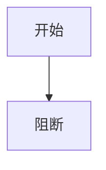

# 验收负例：缺少主场景章节

## 文档信息

该 fixture 故意省略“验收场景”章节。

## 完成条件、停止条件与交付物

通过标准：缺章节必须阻断。

## 前置条件

本 fixture 仅用于结构负例。

## 输入与预期结果

失败标准：校验器不得放行。

## 异常与边界条件

范围外：不执行外部连接。

## 范围外说明

本 fixture 不访问 local 之外的环境。

## REQ-AC 追踪矩阵

| 上游 | 下游 |
| --- | --- |
| `REQ-FIXTURE-001` | `AC-FIXTURE-001` |

