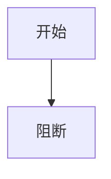

# 周期负例：N/A 无证据

## 当前代码/文档基线

基线已读取。

## 周期内最小任务执行顺序

## 最小任务闭环

| 任务 | 文件/符号 | 真实测试 |
| --- | --- | --- |
| `TASK-FIXTURE-001` | `fixture:run` | N/A |

## 当前周期验证矩阵

| 验证 | 结果 |
| --- | --- |
| `TEST-FIXTURE-001` | N/A |

## 回滚与停止条件

失败即停止并回滚。

## 自审结论

`AC-FIXTURE-001` 未通过。
