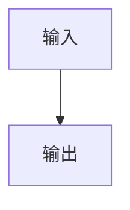
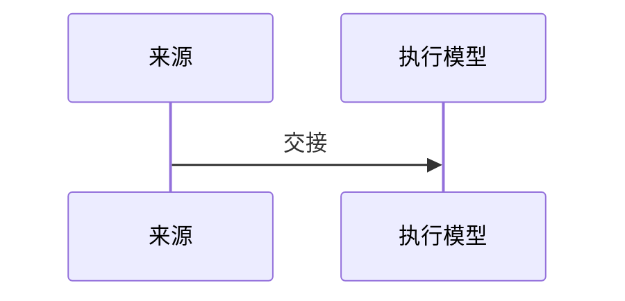

# 需求负例：占位词

## 文档信息

该 fixture 用于验证占位词会被阻断。

## 决策冻结

当前决策后续再补。

## 普通模型零决策执行契约

执行模型不得猜测。

## 需求来源与证据台账

| 来源 | 证据 |
| --- | --- |
| `SRC-FIXTURE-001` | fixture |

## 目标与非目标

范围已限定。

## 功能需求

行为已定义。

## 数据与外部契约

N/A；原因与证据：本 fixture 不涉及外部契约。

## 风险、假设、依赖与阻断

没有额外风险。

## 追踪矩阵

| 上游 | 下游 |
| --- | --- |
| `SRC-FIXTURE-001` | `REQ-FIXTURE-001` |

