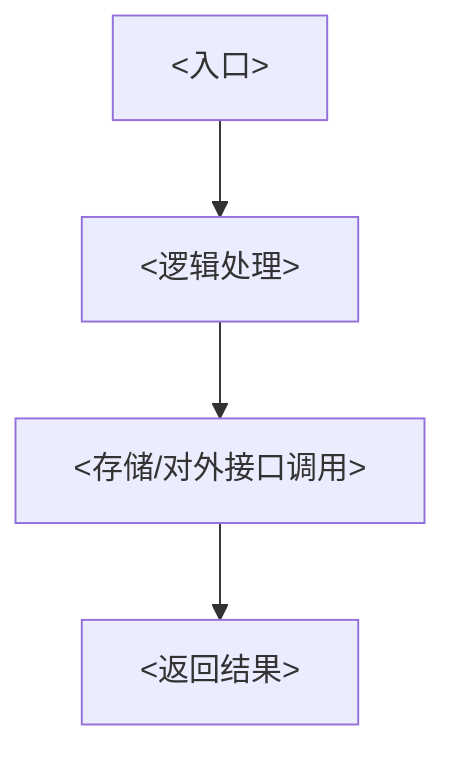

<!-- 本文件是模板：复制到 internal/business/<域>/README.md 后，按各处 <...> 占位符填空。 -->

# payment 业务包

## 业务职责

<一句话职责：这个业务包对内对外承担什么核心职责>

- <职责要点 1>
- <职责要点 2>
- <职责要点 3>

## 边界

本包**做什么**：

- <本包负责的事 1>
- <本包负责的事 2>

本包**不做什么**：

- <明确不由本包承担的事 1，指出应由哪个业务/公共包承担>
- <明确不由本包承担的事 2>

## 目录结构

> 层内落点（handler/logic/model/store 等）沿用 `package-structure-rules` 分层规则，本包只在其上补「业务横向隔离」这一层。

```text
internal/business/<域>/
├── README.md         # 本文件：业务包统一说明
├── handler/          # <业务入口层：接收请求/触发点>
├── logic/            # <业务领域逻辑>
├── model/            # <业务私有数据结构（仅本包内部使用）>
└── store/            # <业务私有存储访问>
```

## 对外接口

本业务在 `contract/<self>` 暴露、供其他业务调用的接口：

<!-- 若本业务没有任何跨业务调用者，删除下表并保留下面这行标注 -->
<!-- 暂无对外接口（服从 code-readability-rules，不预建） -->

| 接口名 | 用途 | 调用方业务 |
|---|---|---|
| <接口名> | <该接口对外提供的能力> | <哪个业务会调用它> |

## 依赖的其他业务接口

本业务依赖、从 `contract/<other>` 引入的其他业务接口：

<!-- 若本业务不依赖任何其他业务接口，写「无」即可。 -->

| 依赖接口 | 来自业务 | 用途 |
|---|---|---|
| <依赖的接口名> | <该接口所属业务> | <本业务为什么需要它> |

## 私有数据模型入口

<指向本包 model 的说明：本业务的私有数据结构集中在 `internal/business/<域>/model/`，仅供本包内部使用，不对外暴露；外部只能经上面的对外接口获取数据。列出关键模型入口文件或类型，如 `model/<主实体>.go`。>

## 关键链路

<用一句话描述本业务主流程，例如「<入口触发> → <逻辑处理> → <存储/接口交互> → <结果返回>」。>

<!-- 可选：主流程复杂时补一张 Mermaid 时序/流程图，示例：

-->
