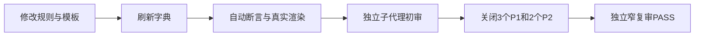

# 当前改动总审查：最终总结图形化优先升级

结论：本轮改动通过审查，可以作为已完成但未提交的仓库改动保留；影响：最终总结会在复杂内容中先展示流程、状态、依赖或执行图，再展示文字证据；范围：目标 Skill、模板、条件规则、示例、OpenAI 默认提示、规划表和生成字典；非范围：不审查仓库内其他任务的业务改动，也不执行 Git 提交；变化：复杂总结具备图形优先规则，简单单点任务仍保持简洁；完成标准：保护语义完整、初审问题全部关闭、结构校验和 Mermaid 真实渲染通过；术语说明：Mermaid 是 Markdown 中用于表达流程图、时序图和状态图的文本图形语法；验证状态：主线程审查与独立子代理复审均已完成，结论为通过。

## 审查结论

- 审查结论: 通过
- 审查范围: `reasoning-summary-structure-rules` 五个资产文件、`编码skill.md` 目标行、`skill-dictionary/data.js`、`字典.md`、项目当前状态和稳定记忆更新。
- 是否允许提交: 否。目标改动质量门禁已通过，但当前轮没有 Git 提交授权，且全仓库仍包含其他任务的未提交改动。
- 阻断问题: 无。
- 问题分级: P0=0、P1=0、P2=0、P3=0。

## 图形化审查链

图形目的：展示本轮从规则修改到独立复审的审查闭环。
关联 ID：`REVIEW-SUMMARY-VISUAL-001`、`AC-SUMMARY-VISUAL-001`

## 变更完整性

| 检查项 | 结论 | 证据 |
|---|---|---|
| 图形触发与选择 | 通过 | 流程、时序、状态、执行依赖和量化回退均有明确路由 |
| 先图后文顺序 | 通过 | 图形化总览位于一句话结论之后、执行证据之前 |
| 简单任务免图 | 通过 | 简单单点正例保留所有必填文字结构但不强制造图 |
| 图形追踪 | 通过 | 每张图要求图形目的和关联 ID |
| 量化回退 | 通过 | 图表不可靠时先写 N/A、原因和证据，再使用表格 |
| 阻断与后续保护语义 | 通过 | 阻断区块唯一 owner、合法后续和无下一步规则均保留 |
| 既有条件规则 | 通过 | 验证降级、注释闸门、Obsidian 和后续内容改动均保留 |
| 字典同步 | 通过 | 目标 Skill 的触发说明和核心职责已同步；其他累计差异来自本轮前已存在的工作树改动，不回滚 |

## 初审问题关闭情况

| 初审发现 | 原级别 | 最终状态 |
|---|---|---|
| 字典包含其他工作树累计差异 | P1 | 已确认是生成器按全工作树生成的既有改动反映，不构成本轮阻断 |
| 多步骤正例缺少图形 | P1 | 已补流程图、图形目的和关联 ID |
| 简单任务正例缺必填结构 | P1 | 已补“要解决的问题”和“方案与根因” |
| 量化表格回退不闭合 | P2 | 已明确 N/A 后使用表格且不得伪称图形 |
| 改动点末尾措辞冲突 | P2 | 已区分无阻断与真实阻断两种位置 |

## 注释与代码收口

- `skill-dictionary/data.js` 是生成器输出的数据资产，本轮没有手写函数、方法或控制流，函数位点为 0。
- `comment-placement-granularity-rules`: not_applicable，原因是没有本轮手写代码位点可放置业务注释。
- `comment-completion-gate-rules`: PASS，生成资产不注入手工注释，目标 Markdown/YAML 说明已经完整。
- `code-change-finalization-gate-rules`: PASS，生成物已完成字典同步、结构解析、UTF-8 和差异检查；没有测试文件、router 或运行时业务入口变更。
- `implementation-review-rules`: not_applicable，原因是本轮没有功能代码、Bug 修复代码或重构代码；规则行为由专项断言和 Mermaid 渲染验证覆盖。

## 未覆盖与剩余风险

- Obsidian bridge 返回 `VAULT_NOT_REGISTERED`，仅阻断跨项目知识库沉淀，不影响本地 Skill 改动、审查或验收。
- 生成字典包含工作树中其他已存在 Skill 改动的累计结果；该内容属于用户已有改动，审查未回滚也未将其归为本轮新业务范围。
- 全仓库另有 `PROJECT_HISTORY.md:97` 末尾空行问题；不影响本轮目标文件验收，但使当前工作树不具备整体提交放行结论。

## 执行附录

- `python -X utf8 .system/skill-creator/scripts/quick_validate.py reasoning-summary-structure-rules`：PASS。
- 规则断言：19 / 19 PASS。
- `npx.cmd --offline --yes @mermaid-js/mermaid-cli`：8 个 Mermaid 图全部解析成功并生成非空 SVG。
- `agents/openai.yaml`：PyYAML 解析 PASS。
- 目标范围 `git diff --check`：PASS。
- 全仓库 `git diff --check`：未通过，原因是本轮范围外的 `PROJECT_HISTORY.md:97` 存在末尾空行；按用户手改保护和范围边界未修改该文件。
- 独立子代理：初审发现 3 个 P1、2 个 P2；修复后窄复审全部 CLOSED，最终 PASS。

## 追踪附录

| 追踪 ID | 落点 | 证据 |
|---|---|---|
| `REQ-SUMMARY-VISUAL-001` | `reasoning-summary-structure-rules/SKILL.md` | 图形适用性与选择规则 |
| `RULE-SUMMARY-ORDER-001` | `references/summary-structure-template.md` | 图形位于执行证据之前 |
| `AC-SUMMARY-VISUAL-001` | `references/output-examples.md` | 正例、反例与 N/A 回退 |
| `EVIDENCE-SUMMARY-RENDER-001` | local 临时 SVG | 8 个 Mermaid 图真实解析成功 |
| `EVIDENCE-SUMMARY-REVIEW-001` | 本审查文档 | P0/P1/P2/P3 与独立复审结论 |
