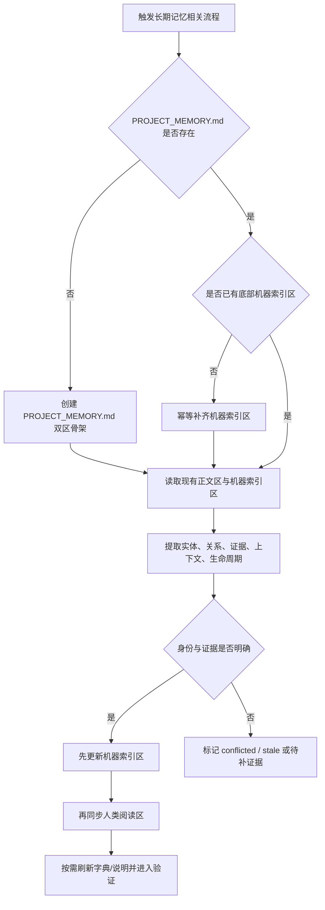

# 验收标准：project-memory-rules 双层知识库升级

## 1. 文档信息

- 对应需求文档: `doc/2-需求/2026-07-03_162802_project-memory-rules双层知识库升级.md`
- 对应实施总览: `doc/3-实施/2026-07-03_162802_project-memory-rules双层知识库升级_实施总览.md`
- 来源对象标识: `project-memory-rules双层知识库升级`
- 当前验收文档状态: `已创建 / 可用于实施与验证`
- 当前验收目标:
  - 保持 `PROJECT_MEMORY.md` 作为唯一长期记忆主文件。
  - 将 `PROJECT_MEMORY.md` 升级为“人类阅读区 + 底部机器索引区”的单文件双区结构。
  - 让 `project-memory-rules`、`project-agents-bootstrap`、模板与提示词在该结构下行为一致。

## 2. 验收范围与范围外

### 2.1 本次纳入验收范围

1. `PROJECT_MEMORY.md` 仍然是唯一长期记忆主文件。
2. 底部机器索引区具备稳定、可解析、可扩展的结构。
3. `project-memory-rules` 明确采用“机器索引区优先更新，人类阅读区随后同步”的工作流。
4. `project-agents-bootstrap` 能检测、创建或补齐单文件双区结构。
5. 现有仅依赖 `PROJECT_MEMORY.md` 正文区的使用方式不被破坏。
6. 与 skill 字典、模板、说明文档的联动规则完整收口。

### 2.2 明确范围外

1. 不接入外部向量库、图数据库、远程 MCP 或跨仓库统一记忆中心。
2. 不将 `PROJECT_MEMORY.md` 拆分成多个长期记忆根文件。
3. 不要求本轮一次性把历史全部正文词条都转换成完整机器索引实体。

## 3. 验收场景

### 场景 1：唯一主文件约束仍然成立

- 场景名称: `唯一长期记忆主文件保持不变`
- 前置条件:
  - 已完成本轮 skill 资产改造。
  - 仓库根目录存在 `PROJECT_MEMORY.md`。
- 输入动作:
  - 触发 `project-memory-rules` 或 `project-agents-bootstrap` 的长期记忆相关流程。
- 预期结果:
  - 长期记忆主入口仍然只有 `PROJECT_MEMORY.md`。
  - 不会新增 `PROJECT_MEMORY_INDEX.yaml`、`PROJECT_MEMORY.log.md` 或等价平行主文件。
  - 规则、模板、提示词与自举文档都明确声明该约束。
- 异常分支:
  - 若实现中出现独立索引根文件依赖，则判定验收失败。
- 边界条件:
  - 允许在 `PROJECT_MEMORY.md` 内部新增底部机器索引区。
  - 不允许把底部机器索引区解释为第二个主文档。

### 场景 2：单文件双区结构可被稳定维护

- 场景名称: `PROJECT_MEMORY.md 双区结构落地`
- 前置条件:
  - `PROJECT_MEMORY.md` 已存在或由自举流程创建。
- 输入动作:
  - 使用模板初始化或刷新 `PROJECT_MEMORY.md`。
- 预期结果:
  - `PROJECT_MEMORY.md` 同时包含人类阅读区与底部机器索引区。
  - 底部机器索引区为固定受管区，且具备结构化字段骨架。
  - 人类阅读区仍保持中文可读。
- 异常分支:
  - 若只有正文区没有机器索引区，或只有机器区没有可读正文区，则判定验收失败。
- 边界条件:
  - 旧仓库已有正文内容时，不要求一次性全量迁移为机器实体。
  - 机器索引区允许先从最小骨架开始。

### 场景 3：新增或修订事实时先写机器索引区

- 场景名称: `机器索引区优先更新`
- 前置条件:
  - 已存在至少一条可复用事实，或存在待新增事实。
  - `project-memory-rules`、模板与提示词已升级。
- 输入动作:
  - 提供一条新事实，或修订一条旧事实。
- 预期结果:
  - agent 能先定位实体身份、证据、上下文和生命周期状态。
  - 先更新底部机器索引区，再同步更新人类阅读区。
  - 对同一事实重复更新时，优先回写原实体，而不是新增同义冲突词条。
- 异常分支:
  - 若证据冲突或身份无法确定，必须进入 `conflicted`、`stale` 或待补证据路径，不能直接伪造为正常启用。
- 边界条件:
  - 新事实与旧事实需共存时，必须通过适用范围或状态区分。
  - 仅有猜测、无证据的内容不得进入机器索引区。

### 场景 4：自举流程能补齐双区结构

- 场景名称: `project-agents-bootstrap 联动生效`
- 前置条件:
  - 命中新会话首轮自举，或命中“根据 skill 补充更新 md”等聚合编排指令。
- 输入动作:
  - 执行 `project-agents-bootstrap` 对 `PROJECT_MEMORY.md` 的检测与补齐。
- 预期结果:
  - 当 `PROJECT_MEMORY.md` 缺失时，能创建带双区骨架的主文档。
  - 当 `PROJECT_MEMORY.md` 已存在但缺少机器索引区时，能幂等补齐底部机器索引区。
  - 当 `PROJECT_MEMORY.md` 已存在且双区完整时，不会破坏既有正文内容。
- 异常分支:
  - 若 bootstrap 只补正文、不补机器索引区，判定验收失败。
  - 若 bootstrap 误新增第二个长期记忆主文件，判定验收失败。
- 边界条件:
  - 自举可以补最小骨架，但不能强制重写全部现有正文。

### 场景 5：历史正文内容保持兼容

- 场景名称: `旧仓库兼容与渐进迁移`
- 前置条件:
  - `PROJECT_MEMORY.md` 中存在升级前的历史 Markdown 词条。
- 输入动作:
  - 在升级后继续执行记忆更新流程。
- 预期结果:
  - 历史正文可继续被读取与保留。
  - 新能力允许逐步补齐机器索引区，不要求一次性清洗全部历史内容。
  - 迁移失败时有回退或保守策略，不破坏已有主文档可读性。
- 异常分支:
  - 若升级后旧正文无法继续作为长期记忆入口使用，则判定验收失败。
- 边界条件:
  - 允许短期出现“正文已存在但机器实体尚未全覆盖”的过渡状态。

### 场景 6：字典与说明联动完整

- 场景名称: `skill 元数据与说明同步`
- 前置条件:
  - 本轮改动涉及 `description`、`##` 级标题或新的 reference 结构。
- 输入动作:
  - 运行字典刷新与说明同步流程。
- 预期结果:
  - `skill-dictionary/data.js`、`字典.md` 与必要的说明文档反映“双层知识库 / 单文件双区”能力。
  - 生成产物无乱码，且与源 skill 文本一致。
- 异常分支:
  - 若改了描述或标题却未刷新字典，判定验收失败。
- 边界条件:
  - 只要源 skill 元数据未变化，可不强制刷新无关说明文件。

## 4. 验收流程图

## 5. 验收决策表

| 条件 | 期望结果 | 判定 |
| --- | --- | --- |
| 仅存在 `PROJECT_MEMORY.md`，且含双区结构 | 通过 | 满足主文件与结构要求 |
| 出现 `PROJECT_MEMORY_INDEX.yaml` 或其他平行主文件 | 失败 | 违反唯一主文件约束 |
| 事实更新时先写机器索引区，再同步正文区 | 通过 | 满足更新顺序要求 |
| 事实更新只改正文区，不改机器索引区 | 失败 | 违反机器优先顺序 |
| bootstrap 能为缺失主文档创建双区骨架 | 通过 | 满足自举创建要求 |
| bootstrap 只能创建正文区，不能补机器索引区 | 失败 | 自举联动不完整 |
| 历史正文可继续读取，机器实体逐步补齐 | 通过 | 满足兼容迁移要求 |
| 修改 `description` / `##` 标题后未刷新字典 | 失败 | 违反联动收口要求 |

## 6. 验收执行要求

- 验证样本至少覆盖:
  1. 新增事实
  2. 修订旧事实
  3. 旧正文兼容迁移
- 验证证据至少覆盖:
  1. 规则文本
  2. 提示词
  3. 模板
  4. bootstrap 行为
  5. 字典联动
- 若执行期发现以下任一情况，必须阻断后续收口:
  1. 出现新的长期记忆根文件依赖
  2. 机器索引区 schema 无法表达实体、关系、证据、上下文、生命周期
  3. 人类阅读区与机器索引区形成双重真相

## 7. 通过标准

满足以下条件即视为本次验收标准成立:

1. `PROJECT_MEMORY.md` 继续是唯一长期记忆主文件。
2. `PROJECT_MEMORY.md` 内部存在稳定的“人类阅读区 + 底部机器索引区”双区结构。
3. `project-memory-rules`、模板、提示词明确采用“机器索引区优先更新”的顺序。
4. `project-agents-bootstrap` 能幂等检测、创建和补齐双区结构。
5. 旧正文兼容、渐进迁移、冲突状态和字典联动都有明确规则。

## 8. 变更记录

| 日期 | 变更内容 | 原因 |
| --- | --- | --- |
| 2026-07-03 | 首次创建本验收标准文档 | 为正式实施提供独立验收口径，满足实施前置条件 |
