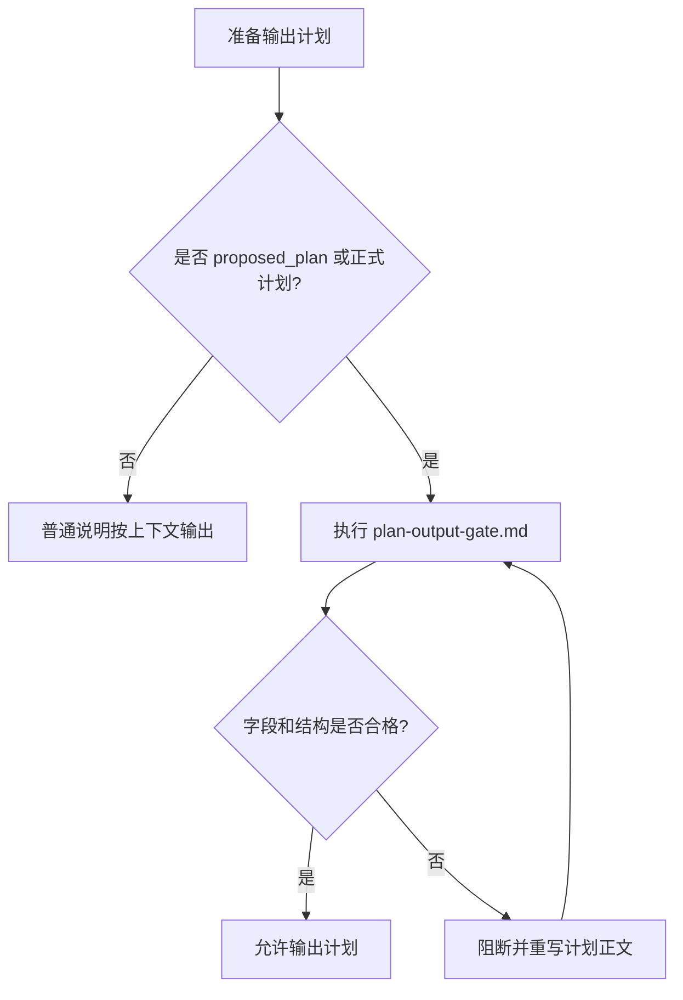

# 验收标准：实施计划 Skill 合规闸门优化

- 对应需求文档: `doc/2-需求/2026-07-04_023433_实施计划Skill合规闸门优化.md`
- 来源对象标识: `实施计划Skill合规闸门优化`
- 状态: `待验证`

## 1. 场景名称

Plan Mode 或 `<proposed_plan>` 输出实施计划时，`implementation-planning-rules` 必须阻止简化版计划直接收口。

## 2. 前置条件

- 当前任务命中 `implementation-planning-rules`。
- 输出内容属于正式计划、受限计划或阻断计划之一。
- 当前仓库存在 `implementation-planning-rules/references/plan-structure-template.md`。

## 3. 输入动作

1. 用户要求“给出计划”“怎么做”“按计划执行”或类似计划型动作。
2. Codex 准备输出 `<proposed_plan>`。
3. 计划正文可能使用完整模板，也可能误用通用工程计划壳。

## 4. 预期结果

| 编号 | 验收项 | 通过标准 |
| --- | --- | --- |
| AC-001 | 输出闸门入口 | `implementation-planning-rules/SKILL.md` 明确要求输出前读取并执行 `references/plan-output-gate.md`。 |
| AC-002 | 字段矩阵 | `plan-output-gate.md` 列出正式计划、受限计划、阻断计划的必填字段。 |
| AC-003 | 硬失败结构 | 通用工程计划壳被明确判定为硬失败，必须重写。 |
| AC-004 | 模板联动 | `plan-structure-template.md` 引用输出闸门，并说明 `<proposed_plan>` 只是外层协议。 |
| AC-005 | 自审联动 | `plan-review-checklist.md` 包含输出前闸门检查项。 |
| AC-006 | 字典刷新 | 修改 `description` 或 `##` 标题后，`skill-dictionary/data.js` 与 `字典.md` 已通过脚本刷新。 |
| AC-007 | 样例回归 | 测试记录能说明上一版 Obsidian skill 计划被识别为缺少阶段计划、每步验证点、自审结论等字段。 |

## 5. 异常分支

| 异常 | 预期处理 |
| --- | --- |
| 当前只能输出受限计划 | 必须写明前置缺口、禁止实施说明和升级条件。 |
| 计划缺少任一核心字段 | 不得输出为最终计划，必须补齐或重写。 |
| 字典生成失败 | 阻断收口，先修复字典生成问题。 |
| 样例回归不能识别缺口 | 判定闸门规则不达标，继续补强。 |

## 6. 边界条件

- 纯口头建议不是正式计划，不要求完整模板；一旦包进 `<proposed_plan>` 或声明为实施计划，就必须执行闸门。
- 简单任务仍可输出受限计划或小型正式计划，但不得缺少本 skill 要求的核心字段。
- 本需求不要求新增独立 skill。

## 7. 范围外说明

- 不验证 Obsidian skill 是否已经实现。
- 不验证所有历史计划文档是否合规。
- 不修改系统级 Plan Mode 协议。

## 8. 验收流程图

## 9. 验收决策表

| 条件 | 预期结果 |
| --- | --- |
| 使用 `Summary / Key Changes / Test Plan` 作为主结构 | 不通过，必须重写。 |
| 缺少阶段计划 | 不通过，必须补齐。 |
| 缺少最小任务的完成 / 停止条件 | 不通过，必须补齐。 |
| 缺少真实测试或免测理由 | 不通过，必须补齐。 |
| 受限计划缺少禁止实施说明 | 不通过，必须补齐。 |
| 字段齐全且自审通过 | 通过。 |
