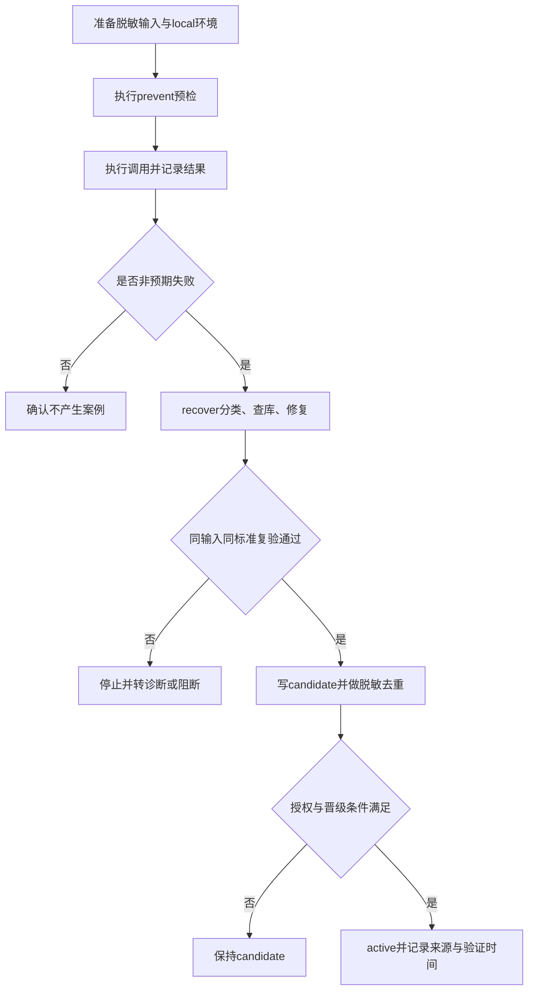

# 执行失败持续学习与主动预防_验收标准

## 1. 前置条件

- 运行在 local 配置和本地仓库镜像中。
- 已存在 `imagegen` 与 Windows/WSL 案例库；新增 owner 使用临时脱敏案例库验证。
- 已创建并加载 `execution-failure-learning-rules`，路由表能解析 owner 与案例路径。
- 测试不得连接 test/prod，不得保存凭据、私有 prompt 或完整响应。

## 2. 验收场景

| 编号 | 输入/动作 | 预期结果 | 异常分支 |
| --- | --- | --- | --- |
| AC-001 | 执行已注册高风险调用且存在精确 active 案例 | 执行前命中案例并采用已验证方案 | 版本或参数不匹配时不得套用 |
| AC-002 | 注入未知 CLI/API 失败，按修复方案恢复 | 触发 recover，使用同输入和同成功标准复验通过 | 无变化重试超过一次应停止并重新诊断 |
| AC-003 | 新问题根因确认且复验成功 | owner 案例库自动出现脱敏 candidate | 无 owner 时转 `skill-evolution-rules` |
| AC-004 | candidate 未获得 active 授权 | 保持 candidate，不得当作可执行规则 | 不能把一次性 workaround 标为 active |
| AC-005 | 业务功能返回错误 | 转交 `bug-*`，不写执行案例 | 不得将业务数据写入案例库 |
| AC-006 | 错误日志包含 secret、私有 prompt 或真实路径 | 脱敏后才允许候选生成 | 无法充分脱敏则拒绝写入 |
| AC-007 | active 与新 candidate 根因冲突 | 阻止当前复用并标记冲突关系 | 未授权不得直接删除或降级旧案例 |
| AC-008 | 预期负向测试或用户取消 | 不触发错误学习晋级 | 不得制造虚假候选 |

## 3. 验收流程

## 4. 边界条件

- 退出码为 0 但输出不可解析、产物错误或环境错误，仍视为失败。
- 瞬态网络错误、一次性机器特例和未复现错误不得直接晋级。
- 案例必须记录环境/版本；版本变化后需要重新验证，否则标记 stale。
- 真实验证失败、Obsidian CLI 不可用或 local 依赖缺失时，验收结论为阻断，不得假设通过。

## 5. 完成标准

- AC-001 至 AC-008 全部通过。
- 新增和修改 Skill 通过 `quick_validate.py`。
- 路由路径存在、案例 ID 无重复、敏感信息扫描无命中。
- 字典生成成功，项目记忆、当前状态、历史记录职责分离。
- 审查结论为 PASS；未授权的 candidate 不得进入 active。
