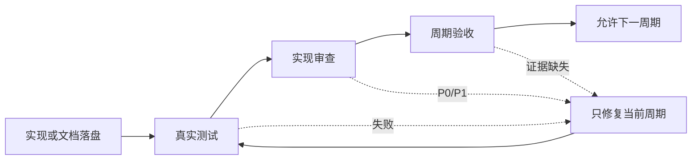

# 最终验收：需求与实施文档极致完备化

## 1. 验收结论

**最终结论：通过（C05-CLOSE）。**

本验收确认需求主文档、验收标准、全量顺序实施方案、实施总览、实施周期 01-05、测试记录、实现审查、当前改动总审查和阶段验收证据已经形成可回指、可验证、可交接的 Markdown 文档链。机器校验、回归测试、审查、真实 imagegen、图片引用/清单验证和孤儿扫描均通过，当前工作树保持未提交。

本结论只覆盖文档规则、Skill 规则、校验器、测试资产和交付证据，不宣称任何产品业务接口、页面、数据库或外部服务已经可用。

## 2. 验收输入与证据索引

| 领域 | 权威输入 | 当前证据 | 结论 |
| --- | --- | --- | --- |
| 需求 | `doc/2-需求/2026-07-12_033322_需求与实施文档极致完备化.md` | 需求 profile 通过；包含范围、非范围、角色、约束、追踪 ID 和图形语义 | 通过 |
| 前置验收 | `doc/7-验收/2026-07-12_033322_需求与实施文档极致完备化_验收标准.md` | acceptance profile 通过；包含二值场景、阻断、N/A 理由、回滚和覆盖矩阵 | 通过 |
| 全量顺序 | `doc/3-实施/2026-07-12_033322_需求与实施文档极致完备化_需求与实施计划全量顺序实施方案.md` | `T05-03` 已完成真实 imagegen、图片引用/清单验证和最终验收；周期 01-05 顺序和收口证据均已回指 | 通过 |
| 实施总览 | `doc/3-实施/2026-07-12_033322_需求与实施文档极致完备化_实施总览.md` | `status: accepted`、`current_slice: C05-CLOSE`；总览 profile 与真实 imagegen 均通过 | 通过 |
| 周期证据 | `doc/7-验收/2026-07-12_033322_需求与实施文档极致完备化_C01-CLOSE-验收证据.md`、`doc/7-验收/2026-07-12_042832_需求与实施文档极致完备化_C02-CLOSE-验收证据.md`、`doc/7-验收/2026-07-12_033322_需求与实施文档极致完备化_C03-CLOSE-验收证据.md`、`doc/7-验收/2026-07-12_045805_需求与实施文档极致完备化_C04-CLOSE-验收证据.md`、`doc/7-验收/2026-07-12_061500_需求与实施文档极致完备化_C05-CLOSE-验收证据.md` | 五个周期均有独立实现、测试、审查和验收证据 | 通过 |
| 审查 | `doc/6-审查/2026-07-12_033322_需求与实施文档极致完备化_当前改动总审查.md`、`doc/6-审查/2026-07-12_061500_需求与实施文档极致完备化_周期05_实现审查.md` | 当前审查和周期 05 审查均无 P0/P1 | 通过 |
| 测试 | `doc/5-tests/2026-07-12_061500/` 及周期 02/03/04 测试目录 | 周期 05 集成 6/6、校验器 21/21、周期 02/03/04 行为测试通过 | 通过 |

## 3. 周期与最小任务闭环

| 周期 | 目标 | 最小任务 | 真实测试与证据 | 审查 | 收口 |
| --- | --- | --- | --- | --- | --- |
| 01 | 契约、路径、质量 profile 和基础追踪矩阵 | `T01-01`、`T01-02` | 周期 01 实现证据、反例和 profile 校验 | 周期 01 审查 | `C01-CLOSE` 通过 |
| 02 | 需求入口、缺口、边界、拆分和验收契约 | `T02-01` 至 `T02-04` | `test_extreme_requirements.py`；正例、负例和六个 Skill validator | 周期 02 审查 | `C02-CLOSE` 通过 |
| 03 | 实施总览、周期模板、执行卡和输出门禁 | `T03-01` 至 `T03-03` | `test_cycle03_contract.py`，6 tests OK | 周期 03 审查 | `C03-CLOSE` 通过 |
| 04 | 文档 profile、追踪校验器和 Mermaid 真解析 | `T04-01`、`T04-02` | `test_cycle04_gate_and_mermaid.py`，3 tests OK；6 份文档、12 个非空 SVG | 周期 04 审查 | `C04-CLOSE` 通过 |
| 05 | 全局同步、字典/记忆/知识收口和最终验收 | `T05-01` 至 `T05-03` | `test_cycle05_global_sync.py`，6 tests OK；至少 2 个非空 SVG；真实 imagegen、图片引用和孤儿扫描通过 | 周期 05 审查 | `C05-CLOSE` 通过 |

每个周期均满足以下顺序，不允许跨周期提前宣称完成：

图形目的：展示每个最小任务必须独立完成实现、真实测试、审查和验收后才能进入下一周期。关联 ID：`CYCLE-01`、`TASK-01`、`TEST-01`、`EVD-C05-CLOSE-ACCEPT-01`。

## 4. 硬闸门判定

| 闸门 | 通过标准 | 证据 | 判定 |
| --- | --- | --- | --- |
| UTF-8 与 Markdown | 关键文件可按 UTF-8 回读，无乱码；front matter 可解析 | profile CLI、UTF-8 回读、`git diff --check` | 通过 |
| 极致完整性 | 条件字段齐全；不能填的字段使用 `N/A + 原因 + 证据`；无隐含默认决策 | requirement、acceptance、implementation profiles | 通过 |
| 双向追踪 | `SRC -> DEC -> REQ/RULE -> AC -> CYCLE -> TASK -> TEST -> EVIDENCE` 可正向和反向追溯 | profile、周期测试、最终验收证据 | 通过 |
| 图形化 | 需求/验收含流程与时序；总览含边界、依赖和端到端图；周期含任务 DAG；图中术语和 ID 与正文一致 | Mermaid CLI 真解析；C04 6 文档/12 SVG，C05 至少 2 SVG | 通过 |
| 普通模型交接 | 文件、符号、命令、样本、断言、失败处理、清理、回滚、停止边界明确 | 实施周期模板和最小任务执行卡 | 通过 |
| 机器校验 | 五类文档 profile 全部 `valid: true`；校验器单测 21/21；需求/验收 strict 报告 `status: PASS` | `validate_engineering_docs.py --root . --strict` 和 unittest | 通过 |
| Skill 入口 | `requirement-intake-rules`、`acceptance-criteria-rules`、`implementation-planning-rules`、`artifact-delivery-gate-rules` 均能被 quick validator 验证 | 各 Skill 目录内运行 `quick_validate.py` | 通过 |
| 记忆与知识 | `PROJECT_CURRENT.md`、`PROJECT_MEMORY.md`、`PROJECT_HISTORY.md` 职责分离；固定 vault 仅经 Obsidian CLI 读写 | 周期 05 集成测试、Obsidian CLI 1.12.7 | 通过 |
| Git 边界 | 未经本轮明确授权不得写入 Git 历史 | `git status`、审查记录 | 通过 |

## 5. 真实测试结果

### 5.1 文档和行为测试

| 命令入口 | 结果 |
| --- | --- |
| `python -X utf8 doc/5-tests/2026-07-12_061500/artifact_delivery_gate_rules/test_cycle05_global_sync.py` | `6 tests OK` |
| `python -X utf8 -m unittest artifact-delivery-gate-rules/tests/test_validate_engineering_docs.py -v` | `21/21 PASS` |
| `python -X utf8 artifact-delivery-gate-rules/scripts/validate_engineering_docs.py --profile requirement --doc doc/2-需求/2026-07-12_033322_需求与实施文档极致完备化.md --root . --strict --json-out .tmp/requirement-quality.json` | `status: PASS`、`unresolved_decisions=0`、14 个任务唯一归属 |
| `python -X utf8 artifact-delivery-gate-rules/scripts/validate_engineering_docs.py --profile acceptance --doc doc/7-验收/2026-07-12_033322_需求与实施文档极致完备化_验收标准.md --root . --strict --json-out .tmp/acceptance-quality.json` | `status: PASS`、`unresolved_decisions=0`、14 个任务唯一归属 |
| `python -X utf8 doc/5-tests/2026-07-12_042832/需求与验收Skill极致完整性行为测试/test_extreme_requirements.py` | 通过 |
| `python -X utf8 doc/5-tests/2026-07-12_042731/implementation_planning_cycle03/test_cycle03_contract.py` | `6 tests OK` |
| `python -X utf8 doc/5-tests/2026-07-12_045805/artifact_delivery_gate_rules/test_cycle04_gate_and_mermaid.py` | `3 tests OK` |

### 5.2 真实 imagegen 验证

| 调用 | 结果 |
| --- | --- |
| `imagegen` 使用 `gpt-image-2` | 通过：使用 `https://xm.aceapi.cc/v1` 生成真实 PNG，867168 bytes，1254x1254 |
| `imagegen` 回退 `gpt-image-1.5` | N/A：本轮无需降级，冻结模型为 `gpt-image-2` |
| `imagegen` 使用当前授权配置执行 `gpt-image-2`（2026-07-12 local） | 通过：PNG 签名、尺寸和非空文件验证通过 |
| 临时 Markdown fixture 与图片 validator（2026-07-12 local） | 通过：`IMG-DOC-REAL`、相对引用、九字段清单和 `check_images` 均合法 |
| `check_orphan_images`（2026-07-12 local） | 通过：`doc/data/images/` 零孤儿，共享引用规则保持有效 |
| `view_image`（2026-07-12 local） | 通过：真实 PNG 可视化检查完成；临时资产已清理 |

未生成或提交任何伪图、占位图；真实 PNG 已完成签名、`view_image`、图片引用、资产清单和孤儿校验，临时输出目录已清理。

### 5.3 Mermaid 真解析

Mermaid 通过本地锁定的 `npx --offline --yes @mermaid-js/mermaid-cli` 真实渲染。C04 已对 6 份文档产生 12 个非空 SVG；C05 产生至少 2 个非空 SVG；本最终验收文档自身产生 1 个 19,724 字节 SVG，所有入口退出码均为 0。该证据已替换旧验收中的过时静态门禁结论。

### 5.4 规则资产与字典

字典生成器完成刷新：`implemented_total=83`、`planned_missing=0`、`seed_total=25`。四个受影响 Skill 的 quick validator 均从对应 Skill 目录执行并返回 `Skill is valid!`；Skill 合规闸门结论：`PASS`。

## 6. 非范围、N/A 与停止条件

- 本轮不连接数据库、缓存、消息队列、HTTP/RPC 上游、test、staging、pre、release 或 production 环境。
- 本轮不验证业务接口、页面、数据库迁移、外部服务或产品运行时；这些项目均以 `N/A + 本轮未修改业务代码 + 当前工作树证据` 记录。
- 严格追踪 CLI 已支持 JSON 输出；执行全库扫描时应将历史 fixture 与当前来源文档分开指定根目录，避免把历史示例中的回指任务误判为当前任务归属。
- 若需求、验收口径、规则入口、Mermaid 依赖、记忆职责或项目边界发生变化，本验收立即失效，必须回开受影响的需求 -> 验收 -> 总览 -> 周期 -> 测试链。
- 若任一 profile、真实测试、审查或验收证据失效，停止后续执行，只修复对应 owner 文档并重新完成该周期四类闭环。
- 本文不授予 Git commit、push、rebase、merge 或任何其他历史写入权限。

## 7. 最终状态

`C05-CLOSE` 的机器校验、回归测试、审查、真实 imagegen、图片引用/清单验证、孤儿扫描和 `view_image` 均通过。依据图片规则，最终验收状态为 `accepted`；工作树保持未提交。
