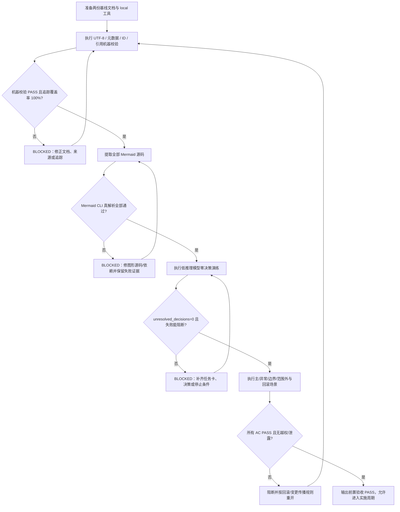

# 验收标准：需求与实施文档极致完备化

## 0. 文档信息

| 字段 | 内容 |
| --- | --- |
| `doc_id` | `AC-DOC-20260712-033322` |
| `doc_type` | `前置验收标准` |
| `schema_version` | `v1` |
| `status` | `待验证` |
| `version` | `v1.0` |
| `updated_at` | 2026-07-12 |
| 来源需求 | `doc/2-需求/2026-07-12_033322_需求与实施文档极致完备化.md` |
| 来源对象 | `REQ-DOC-20260712-033322` |
| 当前周期 | 周期 01 / 任务 01-01 |
| 验收环境 | 仅 local 本地仓库、本地 Python、锁定版本 Mermaid CLI；禁止 test/prod/staging |
| Git 约束 | 验收不执行 commit、push、merge、rebase 或其它历史写入 |

## 1. 验收目标与判定原则

本标准用于在进入需求规则实施前验证：两份基线文档已经共同冻结来源、目标、范围、职责、追踪、图形、零决策执行和失败处置规则；后续普通执行模型无需依赖聊天上下文自行补充关键决策。

验收采用二值判定：每条场景必须得到 `PASS` 或 `FAIL/BLOCKED`，不得使用“基本通过”“人工认为没问题”“后续补齐”作为中间结论。任何 P0/P1 失败、追踪覆盖率小于 100%、Mermaid 真解析失败、低推理模型出现关键未决、非 local 连接或敏感信息泄露，均使本轮总结果为 `BLOCKED`。

## 2. 前置条件

### 2.1 文档与来源

- 需求主文档存在且路径为 `doc/2-需求/2026-07-12_033322_需求与实施文档极致完备化.md`。
- 本验收标准存在且路径为 `doc/7-验收/2026-07-12_033322_需求与实施文档极致完备化_验收标准.md`。
- 需求文档已登记 `SRC-*`、`DEC-*`、`REQ-*`、`RULE-*`、`BOUND-*`、`SLICE-*`、`AC-*` 标识，且无重复 ID。
- 本验收文档与需求文档的来源主干、状态、版本和变更记录互相可回指。

### 2.2 工具与环境

- 当前工作目录为本地仓库 `C:\Users\luode\.codex\skills`。
- 文件读取和验证使用 UTF-8；写入工具不得依赖系统默认编码。
- 机器校验器使用计划中约定的入口；若尚未落地，必须记录为 `BLOCKED`，不得以人工浏览替代。
- Mermaid 解析使用锁定版本的 Mermaid CLI（例如 `mmdc`），必须真实编译每段适用 Mermaid 源码。
- 低推理模型演练使用 local 可用的普通执行模型或脱敏模拟入口；不能用高推理模型自评冒充。
- 所有命令、样本、数据、日志和证据均 local；禁止读取或写入 test、staging、pre、release、prod、production 配置。

## 3. 验收对象与通过门槛

| 对象 | 必须覆盖 | 通过门槛 |
| --- | --- | --- |
| 需求文档 | 来源、目标、范围/非范围、决策、术语、REQ/RULE/BOUND/SLICE/AC、图形、风险、变更记录 | 结构齐全、关键项可追踪、无 P0/P1 未决 |
| 验收标准 | 主、异常、边界、范围外、证据、流程图、决策表、机器/图形/模型验证、回滚和阻断 | 所有场景二值可判定，失败有明确路由 |
| 跨文档关系 | 需求 ↔ 验收标准双向链接和 ID 映射 | 上游至下游、下游至上游覆盖率均为 100% |
| 图形资产 | 需求 flowchart、sequenceDiagram，验收 flowchart，适用图形索引 | Mermaid CLI 真解析全部通过且图文一致 |
| 零决策契约 | 任务卡字段、禁止行为、缺口协议、停止条件 | 低推理模型 `unresolved_decisions=0` |

## 4. 验收场景

### 4.1 主流程场景

| AC ID | 关联需求 | 输入/动作 | 预期结果 | 证据 |
| --- | --- | --- | --- | --- |
| `AC-DOC-001` | `REQ-DOC-001` | 只向验收人员提供两份 Markdown，不提供聊天补充 | 读者可识别目标、范围、当前周期、状态和下一交接 | 独立阅读记录、章节定位 |
| `AC-DOC-002` | `REQ-DOC-001`、`RULE-DOC-002` | 解析两份文档元数据 | `doc_id/doc_type/schema_version/status/version/source_ids/updated_at` 均存在且格式合法 | 机器校验 JSON |
| `AC-DOC-003` | `REQ-DOC-001`、`RULE-DOC-001` | 读取文件字节并检查 UTF-8、末尾换行和换行策略 | 无乱码、无非法字节、无意外编码漂移 | 编码检测输出、文件指纹 |
| `AC-DOC-004` | `REQ-DOC-002`、`RULE-DOC-005` | 从结论回溯 `SRC-*` 和变更记录 | 每个关键结论有来源类型、事实、用途和版本变更记录 | 来源矩阵、变更记录 |
| `AC-DOC-005` | `REQ-DOC-003`、`DEC-001..010` | 检查决策冻结表 | 业务/技术决策、理由、影响和变更门槛均明确 | 决策表截图/JSON |
| `AC-DOC-006` | `REQ-DOC-003`、`REQ-DOC-008` | 检查 P0/P1 未决项和普通模型交接字段 | P0/P1 未决为 0；任务卡包含文件、符号、命令、样本、停止和回滚 | 未决扫描、任务卡字段报告 |
| `AC-DOC-007` | `REQ-DOC-004`、`RULE-DOC-007` | 汇总所有 `REQ/RULE/BOUND/SLICE/AC` ID 并去重 | ID 唯一、废弃 ID 不复用、追踪边完整 | ID 清单和重复检查 |
| `AC-DOC-008` | `REQ-DOC-004`、`REQ-DOC-012` | 正向和反向查询追踪矩阵 | 所有 P0/P1 `REQ/RULE/BOUND/SLICE` 均映射至少一个 `AC`，所有 `AC` 均回指上游 | 双向覆盖率报告 100% |
| `AC-DOC-009` | `REQ-DOC-005` | 执行一条需求主路径样例 | 触发、输入、前置、处理、输出和验收结果均可定位 | 主路径测试记录 |
| `AC-DOC-010` | `REQ-DOC-005` | 注入权限失败、输入非法、依赖失败或重复提交 | 异常结果、错误处理、日志/状态和恢复入口均明确 | 异常场景记录 |
| `AC-DOC-011` | `REQ-DOC-005` | 运行空值、极值、并发、历史数据、重复动作等边界样例 | 边界行为和拒绝/降级规则有二值结果 | 边界测试记录 |
| `AC-DOC-012` | `REQ-DOC-006` | 检查质量需求指标、口径、数据来源、阈值和测试入口 | 每个适用质量指标可实际测量，不以“性能好/安全”作结论 | 指标-测试映射 |
| `AC-DOC-013` | `REQ-DOC-007`、`RULE-DOC-006` | 扫描需求文档 flowchart、sequenceDiagram 和图形索引 | 必填图形存在，图中关键节点/参与者可回指正文 ID | Mermaid 源码清单、索引 |
| `AC-DOC-014` | `REQ-DOC-007` | 运行 Mermaid CLI 编译每段适用图形 | 全部真解析通过，生成产物可打开；失败不得标记通过 | CLI 日志、产物指纹 |
| `AC-DOC-015` | `REQ-DOC-008` | 让普通执行模型只读取实施任务字段并输出执行计划 | 不需要补充业务/技术口径，所有动作来自冻结字段 | 模型输入输出、未决扫描 |
| `AC-DOC-016` | `REQ-DOC-008`、`RULE-DOC-008/009` | 删除任务卡中的一个文件落点、命令或停止条件后重演练 | 模型必须输出 `BLOCKED`，不得猜测替代值 | 负向演练日志 |
| `AC-DOC-017` | `REQ-DOC-009` | 在需求文档和实施文档设置相互冲突的同名规则（测试夹具） | 审查器识别双重真相源并阻断，不能静默选择一侧 | 冲突夹具报告 |
| `AC-DOC-018` | `REQ-DOC-010` | 修改一个范围、默认值、图形分支或测试阈值 | 受影响文档回开，追踪和验收状态重新计算 | 变更传播矩阵、状态 diff |
| `AC-DOC-019` | `REQ-DOC-010` | 变更后保留旧的 `PASS` 验收状态，不执行重验（负向夹具） | 系统或审查规则判定状态失效待重验 | 负向报告 |
| `AC-DOC-020` | `REQ-DOC-011` | 检查每个周期/任务完成、停止、阻断和回滚字段 | 四类条件齐全且互不矛盾 | 任务闭环清单 |
| `AC-DOC-021` | `REQ-DOC-011` | 模拟测试失败、解析失败、环境越权和来源冲突 | 任务停止，证据保留，按阻断表路由，不进入下一周期 | 阻断演练记录 |
| `AC-DOC-022` | `REQ-DOC-012` | 按 AC 执行一次完整前置验收 | 环境、前置、动作、预期、证据、判定人和失败路由可复现 | 验收报告 |
| `AC-DOC-023` | `REQ-DOC-012` | 只提供自然语言“看起来完成”作为验收证据（负向夹具） | 判定为不通过，要求命令/报告/截图或其它可复现证据 | 证据不足报告 |

### 4.2 异常分支场景

| 场景 | 触发 | 必须结果 | 禁止结果 |
| --- | --- | --- | --- |
| `EX-DOC-001` | 元数据缺失或格式错误 | `BLOCKED`，列出缺失字段并回到文档修复 | 以标题或文件名猜测元数据 |
| `EX-DOC-002` | ID 重复、孤立或悬空 | `BLOCKED`，输出重复/孤立清单 | 只修一侧或忽略反向映射 |
| `EX-DOC-003` | Mermaid CLI 退出非 0 或产物为空 | `BLOCKED`，保留原始日志和图形 ID | 用正则检查或人工截图宣称通过 |
| `EX-DOC-004` | 低推理模型要求补充默认值 | `BLOCKED`，引用缺口和责任人 | 执行者自行决定 |
| `EX-DOC-005` | 发现 test/prod 连接信息或敏感值 | 立即停止，清理证据并回到 local | 继续调用或把敏感值写入文档 |
| `EX-DOC-006` | 需求、验收、实施文档冲突 | 所有受影响文档待重开，原验收失效 | 以最近文件或模型偏好静默裁决 |

### 4.3 边界条件场景

| 场景 | 处理要求 | 通过条件 |
| --- | --- | --- |
| 简单线性需求无分支 | 可不画额外复杂图，但必须在图形适用性矩阵记录“不适用原因 + 证据” | 机器与人工均认可不适用 |
| 历史文档未被本轮修改 | 不要求批量迁移到 schema v1 | 校验器仅检查本轮新建/修改文件 |
| 只有 P2 待确认项 | 允许暂缓，但必须有 owner、截止时间、影响和不升级条件 | P0/P1=0 且 P2 可追踪 |
| Mermaid 图中需要图标 | 图标只能辅助，必须同时有文字/形状表达语义 | 无障碍读取不依赖颜色或图标 |
| 需求与实施各有附录 | 允许重复解释，但业务事实和技术事实必须分别回指唯一主入口 | 不产生冲突或双重真相源 |
| 变更只改排版 | 不得改变 ID、行为、追踪或验收状态 | 静态 diff 证明无语义变化 |

### 4.4 范围外场景

| 范围外动作 | 预期处理 | 验收结论 |
| --- | --- | --- |
| 修改产品业务代码/API/数据库 | 本轮不执行，转后续实施周期 | 不因未执行而失败，但必须记录为范围外 |
| 批量改写所有历史文档 | 本轮不执行，只要求新建/被修改文档合规 | 不得扩大变更范围 |
| 调用非 local 服务或真实生产数据 | 明确禁止 | 一旦发生即 `BLOCKED` |
| Git commit/push/merge/rebase | 本轮无授权，不执行 | 不得以验收收口为由写入历史 |
| 使用高推理模型代替低推理演练 | 不接受 | 演练证据缺失即 `BLOCKED` |
| 用截图替代 Mermaid 源码和真解析 | 不接受 | 图形验收失败 |

## 5. 机器校验验收

### 5.1 必检项目

| 检查编号 | 检查内容 | 通过标准 | 失败路由 |
| --- | --- | --- | --- |
| `M-001` | UTF-8、非法字符、末尾换行、换行策略 | 两份文件可用 UTF-8 解码，内容无乱码，末尾有换行 | `BLOCK-DOC-006` |
| `M-002` | 元数据字段和枚举 | `doc_id/doc_type/schema_version/status/version/source_ids/updated_at` 完整且值合法 | `EX-DOC-001` |
| `M-003` | 标题和章节顺序 | 需求遵循 SRS 映射结构，验收遵循前置验收结构 | `EX-DOC-001` |
| `M-004` | 禁用占位词 | 不存在无理由的空字段、`待定`、`后续再看`、`按经验`等 | `EX-DOC-001` |
| `M-005` | ID 唯一性 | 当前两份文档内和跨文档关键 ID 均无重复 | `EX-DOC-002` |
| `M-006` | 引用存在性 | 来源文档、验收文档、目录和模板引用可定位 | `EX-DOC-002` |
| `M-007` | 追踪覆盖率 | 正向、反向覆盖率均为 100%，无孤立项 | `EX-DOC-002` |
| `M-008` | 图形代码块 | 需求含 flowchart 与 sequenceDiagram；验收含 flowchart | `M-DIAGRAM-001` |
| `M-009` | 变更记录 | 每份文档包含版本、日期、原因、影响 ID、责任人和状态 | `EX-DOC-001` |
| `M-010` | 敏感信息扫描 | 无 token、密码、私钥、连接串原值和真实敏感数据 | `EX-DOC-005` |

### 5.2 机器校验入口与证据

实施周期落地统一校验器后，必须使用以下等价命令（实际参数以实现文档冻结值为准）：

```powershell
python artifact-delivery-gate-rules/scripts/validate_engineering_docs.py `
  --profile requirement --doc doc/2-需求/2026-07-12_033322_需求与实施文档极致完备化.md `
  --strict --json-out .tmp/requirement-quality.json

python artifact-delivery-gate-rules/scripts/validate_engineering_docs.py `
  --profile acceptance --doc doc/7-验收/2026-07-12_033322_需求与实施文档极致完备化_验收标准.md `
  --strict --json-out .tmp/acceptance-quality.json
```

机器报告至少包含 `status`、`errors`、`warnings`、`ids`、`traceability`、`diagrams`、`unresolved_decisions` 和 `coverage`。命令不存在、退出码非 0、报告缺字段或 `status` 不是 `PASS`，均按 `BLOCKED` 处理。

## 6. Mermaid 真解析验收

### 6.1 目标图形清单

| 图形 ID | 文档位置 | 类型 | 通过条件 |
| --- | --- | --- | --- |
| `DIAG-REQ-FLOW-001` | 需求第 8.1 节 | `flowchart TD` | Mermaid CLI 编译成功，所有分支可读 |
| `DIAG-REQ-SEQ-001` | 需求第 8.2 节 | `sequenceDiagram` | 参与者、alt/else 分支和回传关系可编译 |
| `DIAG-AC-FLOW-001` | 本文第 8 节 | `flowchart TD` | 主、异常、阻断和回滚路径可编译 |
| `DIAG-MATRIX-001` | 需求第 7 节 | 适用性矩阵 | 每类语义有强制/不适用规则与证据 |

### 6.2 真解析步骤

1. 从 Markdown 结构化提取所有 Mermaid 代码块，保留文档路径、章节、图形 ID 和源码指纹。
2. 使用锁定版本 Mermaid CLI 对每个代码块单独编译为 local 临时产物。
3. 检查 CLI 退出码、产物存在、产物大小大于 0，并在需要时用图像查看器确认非空白。
4. 将解析失败绑定到图形 ID 和章节，禁止以“其它图已通过”抵销。
5. 对正文术语和 ID 做静态比对，发现图中新增未定义行为时回到 `REQ-DOC-007` 和 `RULE-DOC-006`。

## 7. 低推理模型演练

### 7.1 演练输入

向普通执行模型只提供：需求文档、验收标准、已冻结的实施总览/周期/任务卡以及明确的 local 环境说明，不提供本轮聊天记录、作者口头解释或隐藏提示。

### 7.2 演练动作

| 步骤 | 动作 | 通过标准 |
| --- | --- | --- |
| `LM-001` | 让模型列出当前任务目标、范围、非范围和所属周期 | 与文档完全一致，无新增目标 |
| `LM-002` | 让模型列出将修改的文件、模块、符号和禁止区域 | 全部来自任务卡，不能出现“自行选择” |
| `LM-003` | 让模型写出真实测试入口、local 依赖、样本、预期和证据 | 每字段有冻结值，不能用“适当测试” |
| `LM-004` | 删除一个必填字段后重新演练 | 模型输出 `BLOCKED`，引用缺口 ID，不猜测替代值 |
| `LM-005` | 注入需求/实施冲突后重新演练 | 模型停止并回报冲突，不能静默选边 |
| `LM-006` | 模拟测试失败或环境越权 | 模型执行冻结回滚/停止协议，不进入下一任务 |

### 7.3 演练通过条件

- `unresolved_decisions = 0`，其中 P0/P1 必须为 0；任何关键字段缺失都不得被归类为普通警告。
- 模型没有生成文档外的业务规则、技术方案、依赖、路径、错误码、默认值或优先级。
- 模型能在缺口、冲突、解析失败、测试失败和环境越权时输出结构化 `BLOCKED`，并引用 `REQ/RULE/BOUND/SLICE/AC`。
- 演练输出和证据已脱敏，不包含 token、私钥、真实连接串、私有 prompt 或业务敏感数据。

## 8. 验收流程图



## 9. 验收决策表

| 条件组合 | 机器校验 | Mermaid 真解析 | 低推理演练 | 场景验证 | 总结论 | 必须动作 |
| --- | --- | --- | --- | --- | --- | --- |
| A：全部通过 | PASS | PASS | PASS | PASS | `PASS` | 允许进入实施周期 |
| B：字段缺失 | FAIL | 不执行 | 不执行 | 不执行 | `BLOCKED` | 补字段后重验 |
| C：追踪覆盖率 <100% | FAIL | 可通过 | 不执行 | 不执行 | `BLOCKED` | 补齐上下游 ID 与 AC |
| D：图形源码存在但 CLI 失败 | PASS | FAIL | 不执行 | 不执行 | `BLOCKED` | 修源码/锁定依赖后重验 |
| E：高推理模型通过、低推理模型有未决 | PASS | PASS | FAIL | 不执行 | `BLOCKED` | 完善零决策契约，不接受高推理替代 |
| F：主路径通过、异常/边界失败 | PASS | PASS | PASS | FAIL | `BLOCKED` | 补异常/边界规则和 AC |
| G：范围外动作被执行 | 任意 | 任意 | 任意 | FAIL | `BLOCKED` | 停止、清理并记录范围越界 |
| H：发现非 local 连接或敏感值 | 任意 | 任意 | 任意 | FAIL | `BLOCKED` | 终止验证，清理证据，切回 local |
| I：需求/实施/验收冲突 | 可通过 | 可通过 | 可能通过 | FAIL | `BLOCKED` | 统一事实源，原状态失效待重验 |
| J：仅排版变化且语义 diff 为空 | PASS | PASS | PASS | PASS | `PASS` | 保留 ID，记录排版变更 |

## 10. 回滚与阻断验收

### 10.1 回滚场景

| 回滚 ID | 触发条件 | 回滚动作 | 成功标准 |
| --- | --- | --- | --- |
| `RB-DOC-001` | 新门禁误伤未修改历史文档 | 恢复本周期新增门禁配置/文档变更，保留失败报告，不回滚用户既有改动 | 历史文件无非预期变化，新文档仍可独立验证 |
| `RB-DOC-002` | 图形升级造成正文/验收冲突 | 回退冲突图形或标记文档待重开，不保留双重真相源 | 正文、图、表和 AC 再次一致 |
| `RB-DOC-003` | 低推理模型演练发现关键未决 | 停止当前周期，回滚未授权执行产物，补齐决策后从任务入口重演练 | 无猜测性代码/文档修改，`unresolved_decisions=0` |
| `RB-DOC-004` | 发生非 local 连接或敏感信息写入 | 立即终止并删除/隔离敏感证据，重新生成脱敏 local 证据 | 扫描无敏感命中，验证链可复现 |
| `RB-DOC-005` | 需求或实施变更未重算追踪 | 将原验收状态置为失效待重验，重建受影响矩阵 | 新旧状态、影响 ID 和重验记录完整 |

### 10.2 阻断证据要求

任何 `BLOCKED` 必须至少记录：触发时间、文档/图形/任务 ID、原始命令或输入、失败输出摘要、影响范围、已执行的停止/清理动作、责任人、恢复前置和下一次允许重试的成功标准。禁止把阻断压缩成一句“稍后处理”。

## 11. 完成条件、停止条件与交付物

### 11.1 总体完成条件

1. `AC-DOC-001` 至 `AC-DOC-023` 均为 `PASS`，或明确属于本轮范围外并有记录。
2. `M-001` 至 `M-010` 全部 `PASS`，机器报告完整可回读。
3. `DIAG-REQ-FLOW-001`、`DIAG-REQ-SEQ-001`、`DIAG-AC-FLOW-001` 全部 Mermaid 真解析通过。
4. 低推理模型演练满足 `unresolved_decisions=0`，负向缺口和冲突场景均能正确 `BLOCKED`。
5. 追踪正向和反向覆盖率均为 100%，不存在重复、孤立、悬空或未定义的关键 ID。
6. 主、异常、边界、范围外、回滚和阻断证据均已归档，并通过敏感信息扫描。
7. 需求文档和本验收标准的变更记录互相一致，当前状态为“可进入实施”或明确阻断。

### 11.2 停止条件

- 任一 P0/P1 需求、决策、边界或验收项没有来源或明确责任人。
- 任一机器校验、Mermaid 真解析或低推理模型演练失败，且尚未按失败学习规则改变诊断路径。
- 发现用户已有修改与本任务写集冲突，无法在不覆盖的前提下继续。
- 需要访问非 local 环境、真实敏感数据或执行未授权 Git 历史写入。

### 11.3 本轮交付物

```text
doc/
├── 2-需求/
│   └── 2026-07-12_033322_需求与实施文档极致完备化.md # 需求事实源
└── 7-验收/
    └── 2026-07-12_033322_需求与实施文档极致完备化_验收标准.md # 前置验收口径
```

本轮不要求交付产品代码、Skill 修改、测试脚本、实施总览或实施周期文件；这些属于后续周期，必须先以本验收标准通过为入口条件。

## 12. 验收记录与变更记录

### 12.1 验收记录表

| 日期 | 执行人 | 环境 | 机器校验 | Mermaid | 低推理演练 | 场景验收 | 总结论 | 证据位置 |
| --- | --- | --- | --- | --- | --- | --- | --- | --- |
| 2026-07-12 | Codex | local | 待执行 | 待执行 | 待执行 | 待执行 | 待验证 | 本文档与后续测试证据 |

### 12.2 变更记录

| 版本 | 日期 | 变更原因 | 影响 ID | 责任人 | 状态 |
| --- | --- | --- | --- | --- | --- |
| `v1.0` | 2026-07-12 | 周期 01 / 任务 01-01 建立需求与实施文档极致完备化的前置验收标准 | `AC-DOC-001..023`、`M-*`、`DIAG-*`、`RB-*` | Codex | 待验证 |
