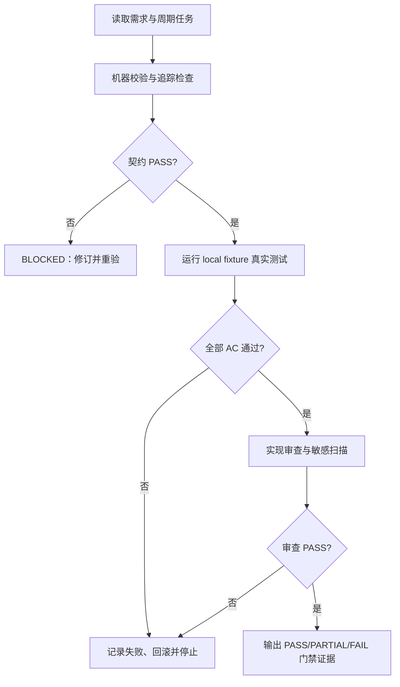

# 通用上线测试引擎前置验收标准

## 文档信息

| 字段 | 内容 |
| --- | --- |
| `doc_id` | `AC-RT-DOC-20260712-001` |
| 来源需求 | [通用上线测试引擎完善需求](../2-需求/2026-07-12_180240_通用上线测试引擎完善需求.md) |
| 实施入口 | [全量顺序方案](../3-实施/2026-07-12_180240_通用上线测试引擎完善需求_需求与实施计划全量顺序实施方案.md) |
| 状态 | 前置验收，代码实现前必须通过契约检查 |
| 图片资产决策 | N/A + 原因：验收路径用 Mermaid 表达；证据：本文件包含验收流程图。 |

## 验收场景

图片资产决策：N/A + 原因：验收路径用 Mermaid 表达；证据：本文件包含验收流程图。

### 前置条件

| 条件 ID | 条件 | 证据 |
| --- | --- | --- |
| `AC-RT-PRE-001` | 只提供 local 配置、脱敏 fixture 和锁定运行时 | local 配置清单 |
| `AC-RT-PRE-002` | 需求、实施总览、周期文档已建立稳定 ID 和相互链接 | 文档索引 |
| `AC-RT-PRE-003` | 测试样本覆盖支持矩阵中的所有入口类型 | fixture manifest |

### 验收目标与判定原则

| 验收 ID | 场景 | 通过标准 | 失败标准 |
| --- | --- | --- | --- |
| `AC-RT-001` | 入口发现 | fixture 入口召回率和精确率均为 100% | 漏报、误报或缺证据 |
| `AC-RT-002` | 参数解析 | 每个执行参数有唯一命名空间、来源和 trace | 参数串接口或无来源执行 |
| `AC-RT-003` | 依赖拓扑 | provider 先于 consumer；失败传播为 `BLOCKED_BY_DEPENDENCY` | 循环或顺序错误 |
| `AC-RT-004` | local 写入 | 允许业务写接口及真实第三方副作用并记录证据 | 非 local 或缺 run id |
| `AC-RT-005` | 安全边界 | 极端破坏性操作 100% 在发送前阻断 | 发生危险调用 |
| `AC-RT-006` | 判定器 | 相同输入产生相同结果，未知语义为 `PENDING` | 模型覆盖确定性结果 |
| `AC-RT-007` | 门禁聚合 | P0 非 PASS 为 FAIL；无 P0 而有 P1/P2 问题为 PARTIAL | 结论冲突或多值 |
| `AC-RT-008` | 基线复用 | 参数、依赖、场景、结论和历史按事件原子投影 | 崩溃后旧基线损坏 |
| `AC-RT-009` | 兼容入口 | 现有十个子命令继续工作，新 run 可完成全链路 | 旧命令失效 |

### 异常分支场景

| 异常 ID | 触发 | 必须结果 | 失败标准 |
| --- | --- | --- | --- |
| `AC-RT-EX-001` | adapter 依赖缺失 | 仅对应 adapter `UNSUPPORTED_ADAPTER` | 伪造支持或 PASS |
| `AC-RT-EX-002` | token/密码/连接串进入日志 | 停止、隔离并脱敏 | 继续执行或落盘 |
| `AC-RT-EX-003` | 进程中断或磁盘失败 | 旧 baseline 可读且事件可重放 | 半写或丢失历史 |
| `AC-RT-EX-004` | 需求与实施契约冲突 | 原验收失效，回到文档修订 | 静默选边 |

### 范围外场景

| 范围外 ID | 动作 | 处理 | 验收结论 |
| --- | --- | --- | --- |
| `AC-RT-OUT-001` | 连接 test/staging/pre/prod | 本轮禁止，记录 `ENV_BLOCKED` | 不纳入通过率 |
| `AC-RT-OUT-002` | 修改被测业务代码或 schema | 转实施后续任务 | 不纳入本轮 |
| `AC-RT-OUT-003` | Git commit/push/merge/rebase | 当前轮不授权 | 不纳入本轮 |

## 验收流程

图形目的：展示机器校验、真实测试、审查和最终门禁的顺序。关联 ID：`AC-RT-001` 至 `AC-RT-009`。

## 验收对象与通过门槛

| 对象 | 必查项 | 通过门槛 | 失败处理 |
| --- | --- | --- | --- |
| 发现 IR | 协议、入口、schema、证据、置信度 | 支持 fixture 100% 对齐 | `DISCOVERY_INCOMPLETE` |
| 依赖与参数 | 命名空间、来源、拓扑、循环 | 无未绑定参数且无低置信自动边 | `PARAM_UNRESOLVED` |
| 执行与安全 | local、denylist、写入、副作用 | 请求均有 run id，危险操作零发送 | `SAFETY_BLOCKED` |
| 判定与基线 | 状态机、门禁、原子投影、脱敏 | 重复执行结果一致且旧基线可恢复 | `BLOCKED` |

## 完成条件、停止条件与交付物

### 完成条件

1. `AC-RT-001` 至 `AC-RT-009` 均有真实测试证据且结论为 PASS。
2. 所有 P0 入口为 PASS，P1/P2 无未解释失败或阻断。
3. 追踪链覆盖 `REQ-RT-* -> AC-RT-* -> CYCLE-RT-* -> TASK-RT-* -> TEST-RT-* -> EVIDENCE-RT-*`。
4. validator、Mermaid 解析、单元/契约/E2E、实现审查全部通过。

### 停止条件

- 非 local 配置、敏感信息泄漏、极端操作命中或 P0 失败。
- 参数无来源、依赖循环未解决、baseline 迁移失败或证据不可复现。
- 任何任务缺少文件/符号、真实测试、停止或回滚契约。

### 交付物

| 交付物 | 路径 | 证据 |
| --- | --- | --- |
| 需求主文档 | `doc/2-需求/2026-07-12_180240_通用上线测试引擎完善需求.md` | `EVIDENCE-RT-001` |
| 实施总览和周期 | `doc/3-实施/2026-07-12_180240_通用上线测试引擎完善需求_*.md` | `EVIDENCE-RT-002` |
| 测试报告 | `doc/5-tests/<timestamp>/project-release-test-engine/` | `EVIDENCE-RT-003` |

## 追踪矩阵

| 需求 | 验收 | 周期 | 测试 | 证据 |
| --- | --- | --- | --- | --- |
| `REQ-RT-001`、`REQ-RT-002` | `AC-RT-001` | `CYCLE-RT-01`、`CYCLE-RT-03` | `TEST-RT-001` | `EVIDENCE-RT-001` |
| `REQ-RT-003`、`REQ-RT-004` | `AC-RT-002`、`AC-RT-003` | `CYCLE-RT-04`、`CYCLE-RT-05` | `TEST-RT-002` | `EVIDENCE-RT-002` |
| `REQ-RT-005`、`REQ-RT-006` | `AC-RT-004`、`AC-RT-005` | `CYCLE-RT-06` | `TEST-RT-003` | `EVIDENCE-RT-003` |
| `REQ-RT-007`、`REQ-RT-008` | `AC-RT-006`、`AC-RT-007`、`AC-RT-008` | `CYCLE-RT-07`、`CYCLE-RT-08` | `TEST-RT-004`、`TEST-RT-005` | `EVIDENCE-RT-004` |
