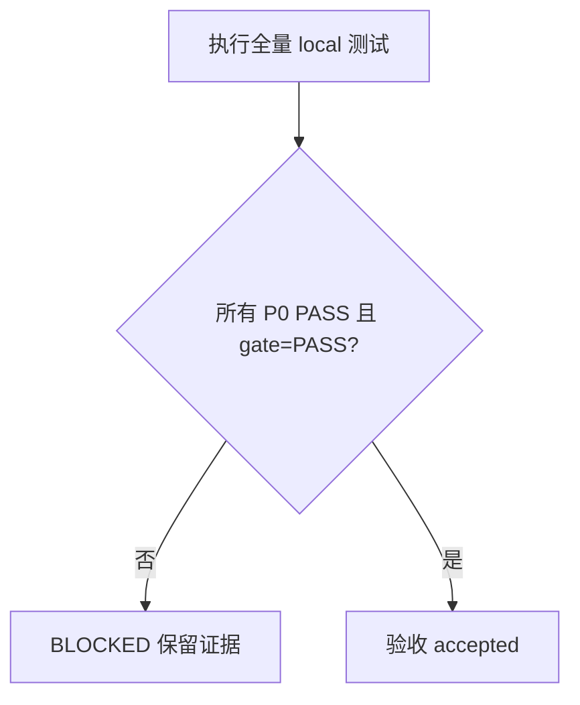

# 通用上线测试引擎最终验收

## 文档信息

| 字段 | 值 |
| --- | --- |
| 来源 | `REQ-RT-20260712-001`、`TASK-RT-C08-03` |
| 当前状态 | `BLOCKED` |
| 图片资产决策 | `N/A + 原因：本验收只记录代码、测试和 JSON/YAML 产物；证据：产物目录无图片引用` |

## 验收场景

图片资产决策：N/A + 原因：本验收只记录代码、测试和 JSON/YAML 产物；证据：产物目录无图片引用。

### 场景与前置条件

仅允许 local 配置、临时回环 fixture 和脱敏测试资产；test/staging/pre/release/prod 一律不得连接。

### 输入与预期结果

| 输入 | 预期结果 |
| --- | --- |
| R1、C02-C08 测试集 | 0 error、0 failure |
| local pipeline 产物 | 报告、依赖图、场景结果、脱敏响应和基线事件齐全 |
| 非 HTTP adapter 无 runtime | `PENDING/UNSUPPORTED_ADAPTER`，不得 PASS |

### 异常与边界条件

非 local provenance、secret 命中、P0 非 PASS、证据缺失或 validator 失败均立即阻断；不得以 PARTIAL 代替 PASS。

### 范围外说明

范围外：连接真实 test/staging/prod 服务、修改业务项目接口、为未提供 local runtime 的协议猜测成功语义。

## 完成条件、停止条件与交付物

### 通过标准

所有 P0 接口 PASS、报告门禁 PASS、全量 E2E 与 strict validator PASS、C08-03 四类 EVD 完整互链。

### 失败标准

任一测试 error/failure、P0 非 PASS、secret 泄漏、非 local 连接尝试或报告门禁为 PARTIAL/FAIL。

### 交付物

`doc/5-tests/2026-07-12_191712/project-release-test-rules/` 下的 README、报告、响应、依赖图、场景结果、对账与脱敏证据。

## 验收结论

当前结论：`BLOCKED`，不允许上线放行。

## 已通过条件

| 条件 | 结果 | 证据 |
| --- | --- | --- |
| R1 回归与 C02-C08 窄测试 | PASS | `doc/5-tests/2026-07-12_191712/上线测试引擎回归修复/README.md` |
| 旧轮全量测试 | PASS | `27/27 PASS` |
| 本轮新增测试 | PASS | `16/16 PASS`，含 C08 artifact replay `1/1 PASS` |
| strict implementation validator | PASS | 修订版实施计划报告 |
| skill quick validator | PASS | `Skill is valid!` |

## 未满足条件

- 非 HTTP adapter 尚无真实 local runtime 执行证据。
- C08-03 的持久化全量 E2E 尚未达到所有 P0/P1 PASS。
- 当前报告门禁为 `PARTIAL`，不能转换为上线允许。
- 报告与 baseline 契约专项已通过；该专项通过不替代真实协议 runtime 和最终门禁。

## 放行规则

只有补齐 local runtime、重新执行全量测试、报告门禁为 `PASS`、所有 P0 接口为 `PASS`、C08-03 四类 EVD 与当前改动审查均为 `PASS` 后，才能把本验收文档更新为 `accepted`。

## 验收对象与通过门槛

| 验收对象 | 当前结果 | 证据 | 门槛 |
| --- | --- | --- | --- |
| `TASK-RT-C08-03` 产物归档 | PASS | C08-03 TEST/IMPL | 文件齐全且脱敏 |
| 上线放行 | BLOCKED | C08-03 ACCEPT | 所有 P0 PASS 且 gate=PASS |

## 验收流程

图形目的：说明当前验收为何停在阻断，而不是把部分测试通过误判为放行。关联 ID：`TASK-RT-C08-03`、`ACCEPT-RT-20260712-191712`。

