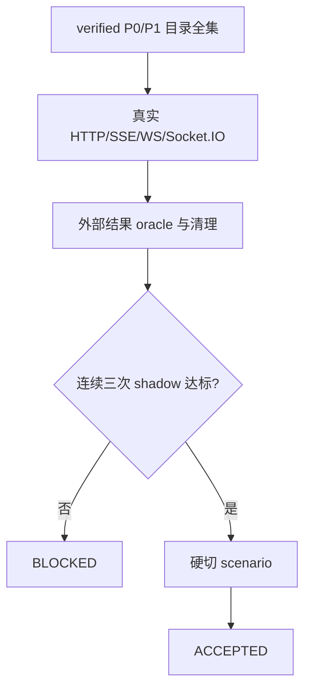

# 通用上线测试引擎最终验收

结论：本次最终验收通过，场景门禁可以作为唯一自动放行依据。影响：前端、SDK 或其它系统通过 HTTP、SSE、原生 WebSocket 和 Socket.IO 获取的数据、事件和最终状态已有完整消费者闭环证据。范围：C13-C18 的场景契约、协议运行、oracle、探针、清理、报告、双轨、硬切、兼容和工具环境。非范围：gRPC、MQ、性能、压力、安全扫描和浏览器 UI。变化：原需求变更阻断已按新增范围完成重验。完成标准：P0/P1 覆盖 100%、全部通过、清理 100%、连续三次双轨对账达标、历史兼容与 Skill 合规全部通过。术语说明：硬切表示切换后运行时不再回退旧门禁。验证状态：通过。

## 文档信息

| 字段 | 值 |
| --- | --- |
| 来源 | `REQ-RT-20260712-001`、`REQ-RT-009..014`、`CYCLE-RT-13..18` |
| 当前状态 | `ACCEPTED` |
| 唯一行为 Owner | `project-interface-release-execution-rules` |
| 自动放行依据 | verified P0/P1 场景目录全集与 scenario 硬门禁 |
| 图片资产决策 | `N/A + 原因：本验收只记录代码、测试和 JSON/YAML 产物；证据：产物目录无图片引用` |

## 验收场景

图片资产决策：N/A + 原因：本验收只记录代码、测试和 JSON/YAML 产物；证据：产物目录无图片引用。

### 场景与前置条件

仅允许 local 配置、随机回环 HTTP/SSE/RFC 6455/Socket.IO fixture、隔离 Python 工具环境和脱敏测试资产；test/staging/pre/release/prod 一律不得连接。P0/P1 以 verified 场景目录全集为真实分母。

### 输入与预期结果

| 输入 | 预期结果 | 当前结果 |
| --- | --- | --- |
| `external-scenario/1.0` 合法/非法目录 | 合法场景运行；candidate、来源漂移、未知动作和清理缺失被拒绝 | PASS |
| HTTP/SSE/WS/Socket.IO 真实 local fixture | 正向闭环 PASS，断流、乱序、重复、ack 错误稳定 FAIL | PASS |
| oracle、探针和清理 | 外部结果优先；探针越权 BLOCKED；清理失败 BLOCKED | PASS |
| 三次 shadow 全量运行 | P0/P1 覆盖 100%、全部 PASS、清理 100%、无未解释差异 | PASS |
| 旧 CLI/结果与隔离工具环境 | 兼容读取和迁移，不继承旧 PASS，不污染被测项目依赖 | PASS |
| 输出与脱敏证据边界 | 父级 symlink 在 mkdir 前阻断；敏感泄漏 BLOCKED/3；短值限制 PENDING/4 | PASS |

### 异常与边界条件

非 local 来源、敏感信息落盘、目录缺口、重复/意外场景、来源指纹漂移、P0/P1 任一 FAIL/BLOCKED/PENDING、清理失败、runtime 缺失、双轨差异未解释或 validator 失败均阻断自动放行；本轮负向样本全部按契约稳定失败。

### 范围外说明

范围外：连接 test/staging/pre/release/prod、修改业务项目生产语义、gRPC/MQ、性能/压力、安全扫描和浏览器 UI。范围外项目不得借用本验收结论声称已通过。

## 完成条件、停止条件与交付物

### 通过标准

P0/P1 verified 场景目录覆盖 100%、全部 PASS、清理 100%、连续三次唯一 local shadow 运行无未解释差异；新测试、历史回归、严格工程文档、Skill 合规、字典和当前改动审查均为 PASS；无残留进程、端口、数据和临时兼容路径。

### 失败标准

任一场景 FAIL/BLOCKED/PENDING、覆盖缺口、清理失败、非 local 或敏感信息问题、协议 runtime 缺失、历史兼容失败、严格文档失败或当前审查存在 P0/P1 时，结论必须回到 BLOCKED，不得以 PARTIAL 或旧门禁替代。

### 交付物

- `interface-results.json` 与真实 `scenario-results.json`。
- `consumer-coverage.json`、`protocol-capabilities.json`、`cleanup-report.json`、`dual-gate-diff.json`、`evidence-manifest.json`。
- `doc/5-tests/2026-07-25_133843/project-interface-release-execution-rules/` 下测试和 `EVD-RT-C13..18` 证据。
- 实现审查、最终验收、Skill references、隔离依赖清单与生成字典。

## 验收结论

当前结论：`ACCEPTED`，允许由 scenario 硬门禁自动放行。原阻断原因 `invalidated_by_requirement_change` 已关闭：`REQ-RT-009..014` 的契约、真实协议、oracle、清理、双轨、兼容和工具环境全部取得真实证据。硬切后不得运行时回退 legacy 或 shadow。

## 已通过条件

| 条件 | 结果 | 证据 |
| --- | --- | --- |
| 修复后最终代码基线连续三轮 | PASS | 57/57、57/57、57/57；13.500 秒、14.543 秒、17.855 秒 |
| manifest 真实进程码 | PASS | 敏感值泄漏 `BLOCKED/3`，短值验证受限 `PENDING/4` |
| 历史兼容回归 | PASS | 27/27、37/37 |
| P0/P1 verified 场景覆盖 | PASS | 100%，无 missing/unexpected/duplicate |
| 场景与清理 | PASS | 场景全部 PASS，cleanup 100% |
| 三次 shadow 切换条件 | PASS | 唯一 run_id、同目录指纹、evidence_digest、无未解释差异 |
| 隔离工具环境 | PASS | Python 3.11+，被测项目依赖零变更，doctor 不联网 |
| Skill 与字典 | PASS | quick validate、生成器、条件路由和职责边界 |
| 工程文档 strict | PASS | requirement、acceptance、implementation_overview、C13-C18、implementation_master |
| 当前改动总审查 | PASS | 多轮发现的 2 个 P0、12 个 P1 已修复；最终独立复审无残留 P0/P1 |

## 未满足条件

无。P2 风险已在实现审查中追踪，不影响冻结范围内的自动放行。

## 放行规则

只允许 `active_mode=scenario` 使用 verified P0/P1 目录全集计算自动放行；任何覆盖缺口、非 PASS、清理失败、来源漂移或未解释差异立即阻断。硬切后禁止请求 legacy/shadow，不得运行时回退。P2 结果继续可追踪但不进入自动门禁分母。

## 验收对象与通过门槛

| 验收对象 | 当前结果 | 证据 | 门槛 |
| --- | --- | --- | --- |
| `CYCLE-RT-13..18` | PASS | `EVD-RT-C13-*..C18-*` | 每任务实现、真实测试、审查、验收均 PASS |
| P0/P1 场景门禁 | PASS | scenario gate 与三次 shadow 历史 | 覆盖 100%、全部 PASS、清理 100% |
| 兼容与工具环境 | PASS | 27/27、37/37、doctor 测试 | 旧 PASS 不晋级、被测项目依赖零变更 |
| 最终上线放行 | ACCEPTED | `EVD-RT-C18-03-ACCEPT` | scenario 硬门禁为唯一自动依据 |

## 验收流程

图形目的：说明消费者场景证据如何关闭需求变更阻断并进入唯一自动放行。关联 ID：`REQ-RT-009..014`、`CYCLE-RT-13..18`、`ACCEPT-RT-20260712-191712`。

```mermaid
flowchart TD
    A[verified P0/P1 目录全集] --> B[真实 HTTP/SSE/WS/Socket.IO]
    B --> C[外部结果 oracle 与清理]
    C --> D{连续三次 shadow 达标?}
    D -->|否| X[BLOCKED]
    D -->|是| E[硬切 scenario]
    E --> F[ACCEPTED]
```

**任务阻断收口**

- 阻断记录 ID: `BLK-RT-001`
- 任务状态: `resolved`
- 阻断阶段: 最终验收需求变更重验
- 阻断依据与证据: 原根因 `invalidated_by_requirement_change` 要求补齐 `REQ-RT-009..014`；现由 `EVD-RT-C13-*..C18-03-*`、修复后三次 57/57、历史 27/27 与 37/37、总审查和 strict validator 关闭。
- 已尝试与停止边界: 未将旧逐接口 PASS 冒充整体性 PASS；按 C13-C18 完成真实协议、oracle、清理、门禁、兼容和工具环境后才重验。
- 影响: 原 BLOCKED 已解除；冻结范围可由 scenario 硬门禁放行，范围外能力仍不在结论内。
- 解决计划: 已完成。责任方为唯一执行 Owner；完成判据为 P0/P1 100% PASS、清理 100%、三次 shadow 达标、兼容与审查通过；所有判据均已满足。
- 恢复后重入点: 若未来任一门禁回归失败，从对应 verified 场景和失败 run_id 重入，不回退 legacy/shadow。
- 去重键: `invalidated_by_requirement_change + REQ-RT-009..014`
