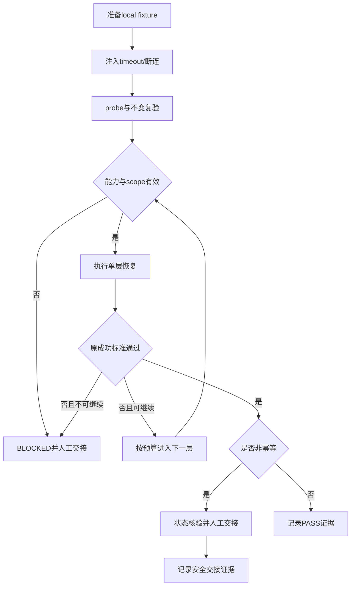

# 统一智能体运行期自恢复规则_验收标准

## 文档信息

- 来源对象：`REQDOC-ARR-001`，需求文档为 `doc/2-需求/2026-07-12_210000_统一智能体运行期自恢复规则.md`。
- 验收类型：前置验收标准；最终验收必须在所有测试与审查证据落盘后另行创建。
- 复杂度：L4；因为涉及宿主重启、权限、并发和非幂等写入保护。
- 环境：仅 local fixture、本地 adapter 和本地临时目录；禁止 test/prod 连接。
- 图片资产决策：N/A；原因是验收对象为协议、状态与证据，不需要视觉资产；证据为需求文档无截图输入。

## 验收目标与判定原则

验收确认统一规则能够识别运行期故障、按 adapter 能力分级恢复、保护非幂等调用、限制并发和预算，并在真实 L5 adapter 存在时完成检查点续接。任何工具恢复但原成功标准未通过的场景均不得判定任务已恢复。

通过标准：所有 `AC-ARR-001` 至 `AC-ARR-007` 的测试、审查和证据字段均为 PASS；失败标准：任一 P0 安全、幂等、scope、脱敏或 L5 续接条件失败即整体 BLOCKED。

## 前置条件

| 条件 | 证据 | 不满足时处理 |
| --- | --- | --- |
| local stub MCP/插件/宿主可启动 | `EVD-ARR-FIXTURE-READY` | 停止，不切换外部环境 |
| adapter registry 声明 capability 与版本 | `EVD-ARR-ADAPTER-REGISTRY` | 仅允许 L0，拒绝动作 |
| 检查点 schema 与脱敏扫描可用 | `EVD-ARR-CHECKPOINT-READY` | 禁止 L5，转人工 |
| 测试输入均为只读或显式幂等 | `EVD-ARR-IDEMPOTENCY-READY` | 非幂等样本只做状态核验 |

## 验收场景

| ID | 场景与输入 | 通过标准 | 失败标准 | 真实测试/证据 |
| --- | --- | --- | --- | --- |
| `AC-ARR-001` | 注入 timeout 或 EOF | 进入 `suspected`，完成一次 probe 和一次不变复验 | 无限重试、跳过诊断或改变原输入 | `TEST-ARR-01` / `EVD-TASK-ARR-01-TEST` |
| `AC-ARR-002` | adapter 声明 L2/L3/L4 | 按能力顺序执行一次 reconnect/reload/restart，并等待 ready | 执行未声明动作、跨组件操作或预算溢出 | `TEST-ARR-02` / `EVD-TASK-ARR-01-ACCEPT` |
| `AC-ARR-003` | 两个 agent 同时恢复同一组件 | 单飞锁只允许一个执行者，另一方读取结果 | 产生第二个重启或覆盖检查点 | `TEST-ARR-03` / `EVD-TASK-ARR-03-TEST` |
| `AC-ARR-004` | 检查点含敏感字段、过期 token 或损坏数据 | 脱敏拒绝、TTL 拒绝或损坏拒绝，状态为 blocked | 继续续接或输出敏感信息 | `TEST-ARR-04` / `EVD-TASK-ARR-03-ACCEPT` |
| `AC-ARR-005` | 外部平台提供真实 L5 lifecycle API | 重启后读取 checkpoint、验证 token、恢复上下文，并以原成功标准通过 | 仅进程重启即标记 resumed | `TEST-ARR-05` / `EVD-TASK-ARR-05-TEST` |
| `AC-ARR-006` | 非幂等或 unknown 操作发生断连 | 只查询目标状态并转 `manual_handoff` | 自动重放写入或猜测幂等 | `TEST-ARR-06` / `EVD-TASK-ARR-03-REVIEW` |
| `AC-ARR-007` | adapter 缺失、scope 越权、版本不兼容 | 状态为 `blocked`，保留脱敏证据，未执行生命周期动作 | 伪造 adapter、强杀任意进程或宣称完成 | `TEST-ARR-07` / `EVD-TASK-ARR-05-ACCEPT` |

## 验收流程

图形目的：展示从故障注入到通过/阻断的验收路径；关联 ID：`AC-ARR-001` 至 `AC-ARR-007`。

## 异常与边界条件

| 异常 | 判定 | 处理 | 证据 |
| --- | --- | --- | --- |
| 健康探针成功但原调用失败 | 失败仍成立 | 保留原成功标准，进入诊断 | `EVD-ARR-PROBE-MISMATCH` |
| adapter capability 过期 | 不可验证 | 进入 blocked，不调用动作 | `EVD-ARR-CAPABILITY-STALE` |
| L5 API 缺少 resume hook | 最高 L4 | 工具恢复后转人工，不能宣称续接 | `EVD-ARR-L5-BLOCKED` |
| local fixture 退出 | 环境阻断 | 清理进程和临时目录，不能切外部环境 | `EVD-ARR-FIXTURE-STOP` |

## 范围外说明

范围外场景包括 MCP/插件安装升级删除、test/prod 连接、没有 capability 的任意进程终止、非幂等写入自动重放和未提供 resume hook 的 L5 任务续接；原因是这些动作缺少本需求的授权与可验证成功标准，证据为 `BOUND-ARR-001` 至 `BOUND-ARR-003` 和 `GAP-ARR-L5-001`。

## REQ-AC 追踪矩阵

| 需求/规则 | 验收 | 真实测试 | 证据 |
| --- | --- | --- | --- |
| `REQ-ARR-001`,`RULE-ARR-001` | `AC-ARR-001`,`AC-ARR-002` | `TEST-ARR-01`,`TEST-ARR-02` | `EVD-TASK-ARR-01-IMPL`,`EVD-TASK-ARR-01-TEST`,`EVD-TASK-ARR-01-REVIEW`,`EVD-TASK-ARR-01-ACCEPT` |
| `REQ-ARR-002` | `AC-ARR-003`,`AC-ARR-004` | `TEST-ARR-03`,`TEST-ARR-04` | `EVD-TASK-ARR-03-IMPL`,`EVD-TASK-ARR-03-TEST`,`EVD-TASK-ARR-03-REVIEW`,`EVD-TASK-ARR-03-ACCEPT` |
| `REQ-ARR-003`,`REQ-ARR-NFR-003` | `AC-ARR-005`,`AC-ARR-006`,`AC-ARR-007` | `TEST-ARR-05`,`TEST-ARR-06`,`TEST-ARR-07` | `EVD-TASK-ARR-05-IMPL`,`EVD-TASK-ARR-05-TEST`,`EVD-TASK-ARR-05-REVIEW`,`EVD-TASK-ARR-05-ACCEPT` |

## 完成条件、停止条件与交付物

- 完成条件：所有场景通过；local 清理完成；每个 TASK 具备 IMPL、TEST、REVIEW、ACCEPT 四类证据；文档校验 PASS。
- 停止条件：出现敏感泄露、scope 越权、自动重放非幂等写入、无 adapter 却执行 restart、或 L5 续接未通过原成功标准。
- 交付物：需求主文档、实施总览、实施周期、测试结果、审查结果和本验收标准；最终验收文档仅在测试与审查完成后产生。
- 回滚：删除临时检查点和锁，停止 local fixture；不修改 MCP/插件安装配置和用户业务数据。

## 自审结论

- `REQ/RULE -> AC -> TEST -> EVIDENCE` 已逐条回指，异常和范围外均有负向判定。
- L5 外部平台依赖是明确阻断，不以平台重启成功替代任务续接成功。
- 图片资产 N/A 已给出原因和证据；Mermaid 图前已声明目的与关联 ID。
