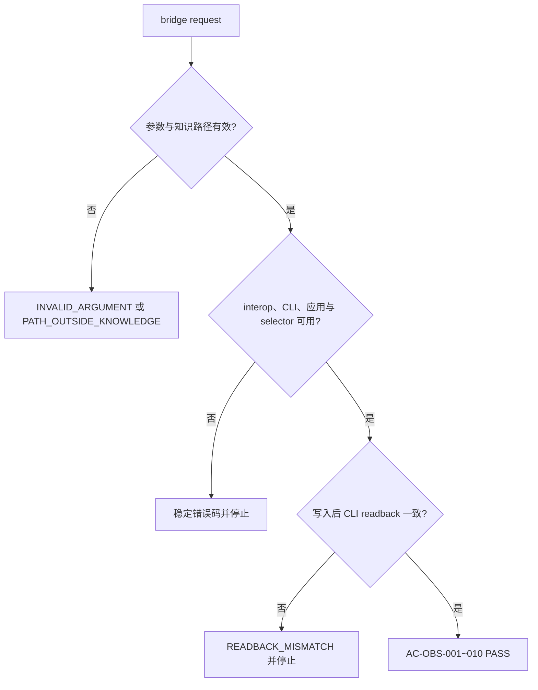

# Obsidian 知识流跨 Windows 与 WSL 桥接最终验收

图片资产决策：N/A + 原因：验收证据由 JSON、hash、Markdown 矩阵和 Mermaid 判定图表达 + 证据：AC-OBS-001 至 AC-OBS-010。

## 文档信息

| 字段 | 内容 |
| --- | --- |
| 来源需求 | `REQDOC-OBS-20260713` |
| 验收标准 | `ACCDOC-OBS-20260713` |
| 执行环境 | local Windows、local WSL interop；禁止 test/staging/production |

## 验收场景

| 场景 | 输入与动作 | 通过标准 | 失败标准 |
| --- | --- | --- | --- |
| 双端 retrieve | Windows/WSL search/read | JSON `ok=true`、`verified=true`、transport 正确 | interop/CLI/vault 错误未结构化 |
| 双端 capture/distill | WSL create、append，另一端 read | 内容、换行、hash 一致 | 任一写入无 CLI readback |
| 长正文 | 13321 字符中文 Markdown | 完整读回、无额外换行 | `READBACK_MISMATCH` |
| 失败矩阵 | timeout、path、selector、interop、应用恢复 | 稳定 code、有限重试 | 无限重试、跨 vault 或文件系统 fallback |

## 场景与前置条件

固定 vault 根为 `D:\obsidian_data`，知识路径以 `知识库/` 开头；Obsidian Windows CLI 已启用，WSL interop 可用，所有测试只使用 local 配置。

## 输入与预期结果

输入为计划时间戳目录中的中文 smoke/long fixture 与既有 `_system-tests` 测试笔记；预期结果以 bridge JSON、readback 文本、LF 数量和 UTF-8 MD5 为准，不由执行者补默认 selector 或重试次数。

## 异常与边界条件

应用未运行只允许隐藏启动一次并有限重试；零/多 vault、interop 缺失、path traversal、timeout、legacy nested root 和非法 prefix 必须稳定失败，失败时不写 vault。

## 范围外说明

范围外：macOS、原生 Linux Obsidian CLI、远程 vault、常驻 RPC、非 local 数据源和 Git 历史写入均为 N/A + 原因：实施计划明确冻结 + 证据：REQDOC-OBS-20260713。

## 验收输入

- 需求：`REQDOC-OBS-20260713`
- 验收标准：`ACCDOC-OBS-20260713`
- 实施周期：`CYCLEDOC-OBS-01/02/03-20260713`
- 当前改动审查：`REVIEW-OBS-20260713-TASK08`、`REVIEW-OBS-20260713-CYCLE03`

## AC-OBS-001 至 AC-OBS-010 判定

| AC | 证据 | 判定 |
| --- | --- | --- |
| AC-OBS-001 | Windows doctor/search/create/readback，selector=`obsidian_data` | PASS |
| AC-OBS-002 | WSL doctor/search/read，transport=`wsl-powershell-interop` | PASS |
| AC-OBS-003 | Windows 自动启动一次、有限等待与重试契约/实机证据 | PASS |
| AC-OBS-004 | 零/多 vault、legacy nested root 稳定错误码 | PASS |
| AC-OBS-005 | path allowlist、中文正文、10KB 分块、readback | PASS |
| AC-OBS-006 | Linux/UNC/Git Bash canonical project ID 单测 | PASS |
| AC-OBS-007 | 长正文双端 13321 chars、LF181、MD5 `C46A83642C092EF2185BD74572302FB0` | PASS |
| AC-OBS-008 | distill bridge-only、dry-run、legacy nested root 负向 | PASS |
| AC-OBS-009 | 35/35、py_compile、PowerShell parser、字典、strict validator、UTF-8/diff | PASS |
| AC-OBS-010 | timeout/interop/path/vault/应用失败矩阵与有限恢复 | PASS |

图形目的：固化最终验收从输入校验到双端 readback 的通过/停止路径。关联 ID：AC-OBS-001、AC-OBS-003、AC-OBS-005、AC-OBS-010。

## 交付边界核对

- 固定 vault 根：`D:\obsidian_data`；`知识库/` 仅为 vault 内路径前缀。
- Windows 与 WSL 均只经公开 bridge 调用官方 Windows CLI；不安装原生 Linux CLI。
- 不使用 vault 文件系统 fallback，不杀用户已有 Obsidian 进程，不连接 test/staging/production，不执行 Git 历史写入。
- 测试笔记保留于 `知识库/90-Archive/_system-tests/`；临时 request/response/debug 文件已清理。

## 完成条件、停止条件与交付物

| 类型 | 条件 |
| --- | --- |
| 完成条件 | AC-OBS-001 至 AC-OBS-010 全部 PASS；35/35 回归、strict validator、字典、UTF-8、diff 和双端实机 readback 均有证据 |
| 停止条件 | 通过标准任一失败、出现 P0/P1、需文件系统 fallback、需杀进程或出现非 local 连接 |
| 交付物 | bridge、PowerShell adapter、distill 迁移、Skill/references、测试资产、周期文档、审查文档和本最终验收文档 |
| 清理 | bridge finally 清理临时 JSON；不通过文件系统删除 vault 测试笔记 |

## REQ-AC 追踪矩阵

| AC | REQ/RULE | TEST | 证据 |
| --- | --- | --- | --- |
| AC-OBS-001/002 | REQ-OBS-001、RULE-OBS-001 | TEST-OBS-001/003/004 | CYCLE-OBS-01/02 实机 |
| AC-OBS-003/004 | REQ-OBS-002/003、RULE-OBS-003 | TEST-OBS-006/011/012 | adapter contract/autostart |
| AC-OBS-005/006 | RULE-OBS-002/004/005 | TEST-OBS-008/009/010/013/015 | bridge unit/双端 hash |
| AC-OBS-007/008 | REQ-OBS-007/008 | TEST-OBS-010/014 | 长正文/distill |
| AC-OBS-009/010 | REQ-OBS-009/010 | TASK-OBS-09~11 | 35/35、strict、有限恢复 |

## 最终结论

PASS。CYCLE-OBS-01、CYCLE-OBS-02、CYCLE-OBS-03 的计划内任务均完成“实现 -> 真实测试 -> 审查 -> 验收”闭环；原始目标已达成，工作树保持未提交。
