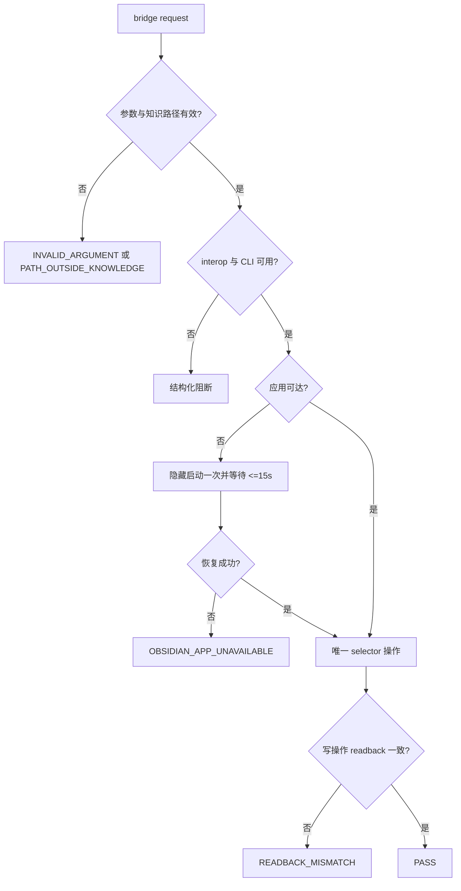

# Obsidian 知识流跨 Windows 与 WSL 桥接验收标准

## 文档信息

图片资产决策：N/A + 原因：验收分支可由 Mermaid 与判定表完整表达 + 证据：AC-OBS-001 至 AC-OBS-006。

| 字段 | 内容 |
| --- | --- |
| 来源需求 | `REQDOC-OBS-20260713` |
| 图片资产决策 | N/A + 原因：验收分支由 Mermaid 与表格完整表达 + 证据：REQ-OBS-001 至 REQ-OBS-005 |
| 执行环境 | local Windows 与 local WSL interop；禁止 test、staging、production 配置 |

## 验收场景

| AC | 前置与输入 | 执行动作 | 通过标准 | 失败标准与清理 |
| --- | --- | --- | --- | --- |
| AC-OBS-001 | Windows 项目或 UNC 项目，固定 vault 已注册 | `doctor --json` | 返回唯一 selector、`ok=true` | 根不唯一/未注册返回稳定 code；不写 vault |
| AC-OBS-002 | WSL 无原生 `obsidian`、interop 可用 | 从 WSL 运行 bridge doctor/read | `transport=wsl-powershell-interop` 且成功 | 无 interop 返回 `WSL_INTEROP_UNAVAILABLE`；删除临时 JSON |
| AC-OBS-003 | 应用未运行 | 调用 doctor | 最多启动一次，15 秒内成功或 `OBSIDIAN_APP_UNAVAILABLE` | 不杀已有进程、不无限重试 |
| AC-OBS-004 | `vaults verbose` fixture：零/一/多个根 | 调用 adapter selector | 仅一根通过；其余稳定阻断 | 无 CLI write |
| AC-OBS-005 | 非法 path、中文与 10KB 正文 | create/append/read、错误 path | 合法正文完整回读；非法 path 未执行 CLI | finally 清理临时文件，无正文日志 |
| AC-OBS-006 | Linux/UNC/Git Bash 同一 WSL 项目路径 | `project-context` | canonical ID 完全一致 | 不生成重复项目实体 |
| AC-OBS-007 | 中文长正文 fixture，Windows/WSL 双端 | bridge create/read | 13321 chars、LF 181、UTF-8 MD5 一致 | 任一字符、换行或 hash 不一致返回 `READBACK_MISMATCH` |
| AC-OBS-008 | `distill_vault.py` bridge 入口与 legacy nested root | dry-run、mock bridge、负向参数 | 无独立 target transport；旧 nested root 返回迁移错误 | 静默写入内层 vault |
| AC-OBS-009 | 全量测试、文档和 Skill 门禁 | 35/35、strict validator、字典生成、UTF-8/diff | 全部 PASS，证据可追溯 | 任一门禁失败不得放行 |
| AC-OBS-010 | 同一失败输入与有限恢复策略 | timeout、interop、vault、path、应用恢复 fixture | 只按既定预算重试，不重复笔记、不跨 vault | 无限重试或无 readback 写入 |

## 场景与前置条件

执行前必须使用 local Windows/WSL 环境、固定 vault 根和计划指定 UTF-8 fixture；不得连接 test、staging 或 production 配置。

## 输入与预期结果

每个 `AC-OBS-*` 的输入、动作、通过标准、失败标准、清理方式已经列于“验收场景”表，测试执行者不得自行补默认 selector、CLI 路径或重试次数。

## 异常与边界条件

应用不可达、interop 缺失、零/多个 vault、traversal 和长中文正文均按 AC-OBS-002 至 AC-OBS-005 的稳定错误码与清理动作验证。

## 范围外说明

范围外：macOS、原生 Linux CLI、远程 vault 和同步服务为 N/A + 原因：DEC-OBS-001 冻结为非范围 + 证据：REQDOC-OBS-20260713。

## 主路径、异常与范围外路径

| 路径 | 关联 AC/REQ | 判定 |
| --- | --- | --- |
| 主路径 | AC-OBS-001/002/005；REQ-OBS-001 | Windows 与 WSL 的 readback 内容、hash 和 `verified` 一致 |
| 异常路径 | AC-OBS-003/004；REQ-OBS-003 | 一次恢复后仍失败必须输出结构化 code |
| 边界路径 | AC-OBS-005/006；RULE-OBS-002/005 | traversal、绝对路径、Unicode、长正文、路径别名均受控 |
| 范围外 | REQ-OBS-004 | macOS、Linux 原生 CLI、远程 vault 为 N/A + 原因：明确冻结为非范围 + 证据：DEC-OBS-001 |

## 验收决策图

图形目的：把 `AC-OBS-001` 至 `AC-OBS-005` 的通过与停止判定固化为执行顺序。关联 ID：AC-OBS-001、AC-OBS-003、AC-OBS-005。

## 完成条件、停止条件与交付物

| 类型 | 条件 |
| --- | --- |
| 完成条件 | AC-OBS-001 至 AC-OBS-006 均有 local 自动化或实机证据；Windows/WSL 双端 smoke `verified=true`；无 vault 文件 API fallback |
| 停止条件 | selector 不唯一、interop 不可用、自动启动一次后仍不可达、中文/长正文读回不一致、需杀进程或文件 fallback |
| 交付物 | bridge、PowerShell adapter、测试 fixture/README、更新后的 skill 规则与 docs、`EVD-*` 四类证据 |
| 失败后的清理 | 删除临时请求/响应文件；smoke note 覆盖为不含会话正文的 `status: test-fixture` |

## 最终验收结论

- AC-OBS-001 至 AC-OBS-010：PASS。Windows/WSL doctor、search、create、append、readback、canonical identity、distill、失败矩阵和文档/Skill 门禁均有 local 证据。
- 核心实机证据：长正文双端 `13321 chars / LF 181 / MD5 C46A83642C092EF2185BD74572302FB0`；append 双端 `172 chars / LF 11 / MD5 27ec6c195d225b9d6f602d42394a0baa`。
- 交付边界：不直接读写 vault 文件、不杀用户已有 Obsidian 进程、不连接非 local 环境、不执行 Git 历史写入。
- 结论：PASS；CYCLE-OBS-03 TASK-OBS-12 验收完成，工作树保持未提交。

## REQ-AC 追踪矩阵

| AC | REQ/RULE | TEST | 证据类别 |
| --- | --- | --- | --- |
| AC-OBS-001/002 | REQ-OBS-001、RULE-OBS-001 | TEST-OBS-001~005 | IMPL、TEST、REVIEW、ACCEPT |
| AC-OBS-003/004 | REQ-OBS-002/003、RULE-OBS-003 | TEST-OBS-006、011、012 | IMPL、TEST、REVIEW、ACCEPT |
| AC-OBS-005/006 | RULE-OBS-002/004/005 | TEST-OBS-008~010、013、015 | IMPL、TEST、REVIEW、ACCEPT |
