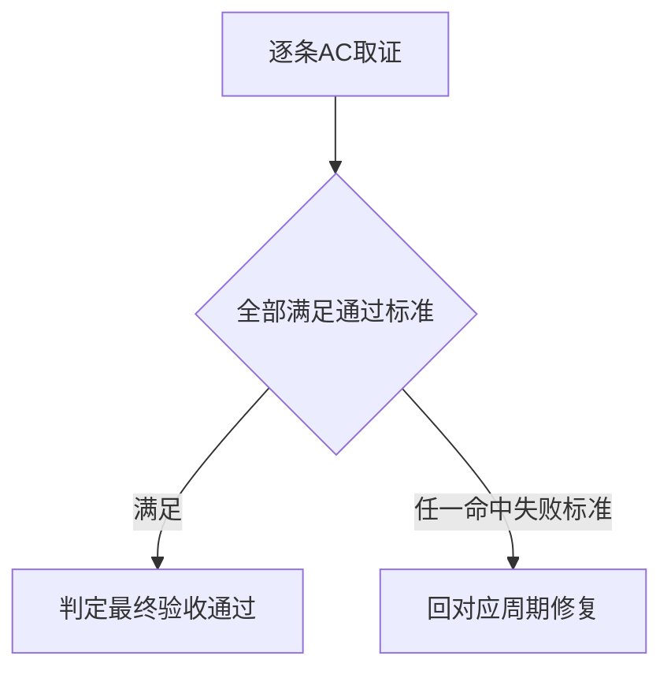

# 最终验收：代码风格体系反馈驱动持续迭代

## 1. 文档信息

- 来源对象标识：代码风格体系反馈驱动持续迭代
- 对应需求主文档：`doc/2-需求/2026-07-13_174006_代码风格体系反馈驱动持续迭代.md`
- 对应验收标准文档：`doc/7-验收/2026-07-13_174006_代码风格体系反馈驱动持续迭代_验收标准.md`
- 对应实施总览：`doc/3-实施/2026-07-13_174006_代码风格体系反馈驱动持续迭代_实施总览.md`
- 基线提交：214fdbd
- 图片资产决策：N/A —— 验收对象为 skill 规则行为，判定依据为演练证据与脚本退出码，无位图证据需求。

## 2. 验收场景

- 对验收标准 AC-01 至 AC-05 逐条给出最终验收结果，全部达到通过标准。
- 证据集位于 `doc/5-tests/2026-07-13_174006/`，含周期01/02/03三份演练证据。

## 3. 场景与前置条件

- 前置条件：三件套与 image-redbox 改动已落盘；全局反例库 `user-style-feedback-library.md` 已建立且含两条 active；字典已重跑；全部实施文档对应 profile 校验 PASS。

## 4. 验收目标与判定原则

| AC | 验收结果 | 通过标准 | 失败标准 | 证据 |
| --- | --- | --- | --- | --- |
| AC-01 | 通过 | 命中捕获并回显 candidate 未落盘 | 未命中或直接落盘 | 周期01证据 EVD-TASK-01-03-TEST |
| AC-02 | 通过 | active 条目字段齐全指纹通过 | 字段缺失或乱码 | 周期01证据 TEST-02 |
| AC-03 | 通过 | 契约含反例库且演练产出正例 | 未加载或未规避 | 周期02证据 TEST-03 |
| AC-04 | 通过 | 同键只增计数不新增正文 | 同键重复新增 | 周期01证据去重验证 |
| AC-05 | 通过 | 截图命中并路由到捕获流程 | 未路由或路由错误 | 周期03证据 TEST-04 |

- 判定原则：skill 规则行为以脚本级真实测试加受控行为演练留证组合判定，`build`、`lint`、纯人工阅读不计入。

## 5. 异常分支场景

- 用户否决 candidate：条目丢弃不落盘，符合 RULE-01。
- 反馈不足以提取正例：向用户追问，不凭空生成，符合流程文件约束。
- 脚本不可用：转 `execution-failure-learning-rules` 路由，本次未触发。

## 6. 范围外场景

- 截图 OCR 精度、项目级 PROJECT_STYLE.md 既有维护、字典脚本自身逻辑均在范围外，未纳入本次验收。

## 7. 验收对象与通过门槛

| 对象 | 通过门槛 | 结果 |
| --- | --- | --- |
| 全局反例库三文件 | 字段齐全 UTF-8 无乱码 | 通过 |
| 三件套 SKILL 改动 | 捕获、加载规避、边界到位 | 通过 |
| 截图路由 | image-redbox 转向 consistency | 通过 |
| 字典与文档 | 字典重跑成功 全 profile PASS | 通过 |

图形目的：描述最终验收的判定汇总路径。
关联 ID：AC-01、AC-05。

## 8. 完成条件、停止条件与交付物

- 完成条件：AC-01 至 AC-05 全部通过，证据齐备，无未决 P0/P1。当前已满足。
- 停止条件：任一 AC 命中失败标准即回对应周期修复；本次无触发。
- 交付物：全局反例库三文件、三件套改动、截图路由改动、字典刷新产物、需求/验收/实施/证据文档、最终验收结论。
