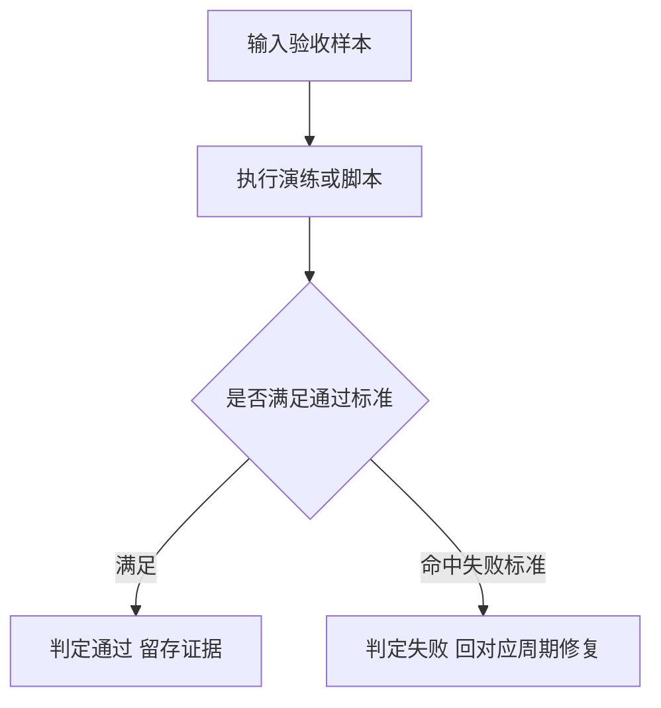

# 验收标准：代码风格体系反馈驱动持续迭代

结论：验收新增局部风格延续、接口实现参考和多余代码驳回；影响：代码生成风格契约及其写后检查；范围：新增验收场景与既有验收场景；非范围：业务运行接口和截图 OCR；变化：正例必须保持既有风格，负例必须被驳回；完成标准：全部验收场景有可复核证据；术语说明：参考实现指项目中已经实现同一接口的代码样例；验证状态：前置标准、测试、审查和最终验收均已通过。

## 1. 文档信息

- 来源对象标识：代码风格体系反馈驱动持续迭代
- 对应需求主文档：`doc/2-需求/2026-07-13_174006_代码风格体系反馈驱动持续迭代.md`
- 对应实施总览：`doc/3-实施/2026-07-13_174006_代码风格体系反馈驱动持续迭代_实施总览.md`
- 基线提交：214fdbd
- 图片资产决策：N/A —— 验收对象为 skill 规则行为，判定依据为文本演练证据与脚本退出码，无位图证据需求，故不涉及位图资产。

## 2. 验收场景

- 本文档冻结八条前置验收标准 AC-01 至 AC-08，新增局部统一风格、接口实现参考、无参考实现和多余代码驳回判定。
- 每条 AC 均给出通过标准与失败标准；范围外场景单列，避免把非目标误判为缺陷。

## 3. 场景与前置条件

- 前置条件 1：需求主文档与实施总览已落盘且对应 profile 校验 PASS。
- 前置条件 2：本机 Python 与 bash 可用，`validate_engineering_docs.py` 与 `generate_dictionary.py` 可执行。
- 前置条件 3：全局反例库文件 `code-style-consistency-rules/references/user-style-feedback-library.md` 已建立。

## 4. 输入与预期结果

- AC-01（对应 REQ-01、REQ-03）：输入一条文字风格否定信号加期望写法，预期 `code-style-consistency-rules` 命中捕获流程并回显 candidate（反例加正例加一句话规则），candidate 不落盘。
- AC-02（对应 REQ-04）：用户确认后，预期条目以 active 形态写入全局反例库，字段齐全、UTF-8 无乱码、去重键存在。
- AC-03（对应 REQ-05）：库中存在一条 active 反例时，预期 `code-generation-style-rules` 写码前契约来源含反例库，且该反例进入「禁用写法」，写码演练产出正例改写。
- AC-04（对应 REQ-06）：重复输入同一去重键反馈，预期只更新出现次数与确认时间，不新增正文条目。
- AC-05（对应 REQ-02）：输入圈红错误写法截图，预期 `image-redbox-focus-rules` 命中并路由到 `code-style-consistency-rules` 捕获流程。
- AC-06（对应 REQ-07）：输入已有多行同构注册区段和一个新增对象，预期新增内容只复制既有调用结构并替换目标名称/必要说明，不新增 helper、变量、循环、日志、校验或抽象。
- AC-07（对应 REQ-08）：输入已有接口和至少一个既有实现，预期写码前契约记录参考文件/符号，并沿用其方法顺序、字段组织、构造/注册、错误处理、注释和测试风格。
- AC-08（对应 REQ-07、REQ-08）：输入风格跳变、无参考实现或冲突实现，预期分别驳回风格跳变、记录无参考实现降级依据，或记录 GAP 停止，不得静默套用个人偏好。

| AC | 关联 REQ | 通过标准 | 失败标准 |
| --- | --- | --- | --- |
| AC-01 | REQ-01、REQ-03 | 命中捕获并回显 candidate，未落盘 | 未命中或 candidate 直接落盘 |
| AC-02 | REQ-04 | active 条目字段齐全且指纹校验通过 | 字段缺失或乱码 |
| AC-03 | REQ-05 | 契约含反例库且演练产出正例 | 契约未加载反例库或未规避 |
| AC-04 | REQ-06 | 同键只增计数不新增正文 | 同键重复新增条目 |
| AC-05 | REQ-02 | 截图命中并路由到捕获流程 | 未路由或路由错误主域 |
| AC-06 | REQ-07 | 新增代码与局部模板同构且无多余代码 | 引入额外抽象、变量、循环、日志、校验或风格跳变 |
| AC-07 | REQ-08 | 契约记录既有接口实现并沿用其风格 | 未查找实现或自行套用外部/个人模板 |
| AC-08 | REQ-07、REQ-08 | 无参考/冲突场景有明确降级或 GAP 停止 | 静默选择、删除必要代码或继续错误实现 |

## 5. 异常与边界条件

- 异常 1：用户否决 candidate 时，条目必须被丢弃且不留磁盘痕迹。
- 异常 2：反馈信息不足以提取正例时，捕获流程必须向用户追问期望写法，不得凭空生成正例。
- 边界 1：去重键相同但正例内容更新时，按合并计数处理并保留最新确认时间。
- 边界 2：脚本执行失败属阻断，转 `execution-failure-learning-rules` 路由。
- 边界 3：局部风格与安全、正确性、兼容、错误处理或接口契约冲突时，保留必要代码并要求在风格契约中记录例外原因。
- 边界 4：没有既有接口实现时，必须记录 `N/A + 原因 + 证据`，再采用当前文件/同目录稳定风格。
- 边界 5：多个接口实现冲突且无法按最近同模块和稳定多数原则收敛时，必须记录 `GAP-*` 并停止。

## 6. 范围外说明

- 范围外 1：不验收截图 OCR 精度，读图理解沿用模型原生能力。
- 范围外 2：不验收项目级 `PROJECT_STYLE.md` 的既有维护行为。
- 范围外 3：不验收 `generate_dictionary.py` 脚本自身逻辑，仅验收重跑后产物含新结构。

## 7. REQ-AC 追踪矩阵

| REQ | AC | 关联 RULE | 判定入口 |
| --- | --- | --- | --- |
| REQ-01 | AC-01 | RULE-01 | 文字反馈捕获演练 |
| REQ-02 | AC-05 | RULE-03 | 截图路由演练 |
| REQ-03 | AC-01 | RULE-01 | candidate 回显核对 |
| REQ-04 | AC-02 | RULE-02 | active 写入指纹校验 |
| REQ-05 | AC-03 | RULE-04 | 写码前契约核对 |
| REQ-06 | AC-04 | RULE-02 | 去重计数核对 |
| REQ-07 | AC-06、AC-08 | RULE-05 | 局部模板复制与负例驳回演练 |
| REQ-08 | AC-07、AC-08 | RULE-06 | 接口实现参考与冲突边界演练 |

图形目的：描述单条验收从输入到判定通过或失败的路径。
关联 ID：AC-01、AC-02、AC-03。

## 8. 完成条件、停止条件与交付物

- 完成条件：AC-01 至 AC-08 全部满足通过标准，演练证据与脚本退出码留存于 `doc/5-tests/`。
- 停止条件：任一 AC 命中失败标准即停止收口，回对应实施周期修复后重验。
- 交付物：全局反例库文件、三件套改动、局部风格与接口实现 reference、字典刷新产物、项目记忆同步和最终验收结论。
