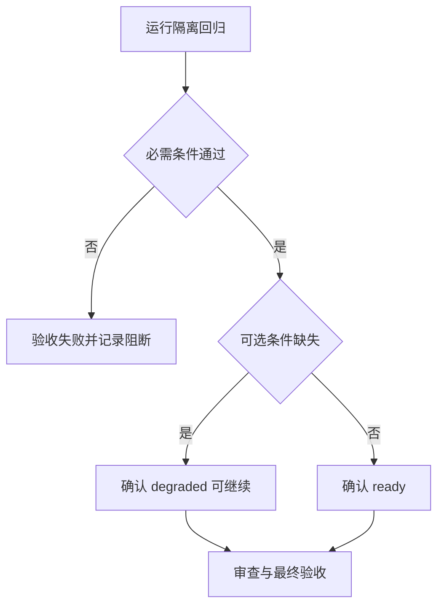

# Windows PowerShell 环境可靠性升级验收标准

验收关注的是环境判断是否更准确，而不是机器上是否装齐所有工具。只要 PowerShell 专项工作所需条件满足，就不能因为不需要的工具、浏览器或第三方条件而卡住。

## 验收条件

| 标识 | 验收条件 | 通过标准 |
| --- | --- | --- |
| AC-PSENV-001 | 可选工具不阻断 | RequiredOnly 通过且可选工具缺失时，结果为 `degraded`、退出码为 `0` |
| AC-PSENV-002 | manifest 精确映射 | 每个包管理器只接收自己已确认的包 ID；未知映射不安装 |
| AC-PSENV-003 | 状态清晰 | `ready`、`degraded`、`blocked`、`busy`、`failed` 有稳定 JSON 与退出码 |
| AC-PSENV-004 | 写入安全 | `WhatIf` 无副作用；JSONC/profile 写入能回滚且不覆盖漂移文件 |
| AC-PSENV-005 | shell 分流正确 | Git Bash 与 WSL launcher 可区分；PATH 不可见不重复安装 |
| AC-PSENV-006 | 测试隔离 | 测试前后真实 profile、Terminal、包和执行策略没有变化 |

## 文档信息

| 字段 | 内容 |
| --- | --- |
| 来源需求 | REQDOC-PSENV-20260713 |
| 当前状态 | active；等待全部实施与审查收口 |
| 验收范围 | 环境结论、事务安全、恢复边界与本地回归 |
| 范围外 | 真实软件下载、浏览器、第三方接口和生产环境 |

## 验收场景

图形目的：说明从环境检查到安全交付的验收顺序。关联 ID：AC-PSENV-001 至 AC-PSENV-006。

## 场景与前置条件

| 场景 | 前置条件 | 通过标准 | 失败标准 |
| --- | --- | --- | --- |
| 必需环境 | PowerShell 7 可用 | RequiredOnly 返回 ready | 返回 blocked 或探针失败 |
| 可选工具 | Extended 有缺项 | degraded、exit 0、marker complete | complete=false 或 exit 非 0 |
| 写入安全 | 临时 Terminal/profile fixture | WhatIf 无写入、rollback 可恢复 | 注释丢失、漂移仍覆盖 |
| 恢复安全 | 假包管理器和未知命令 | 精确 source ID 或 candidate | 猜包、跨 source ID、假成功 |

## 输入与预期结果

| 输入 | 预期结果 |
| --- | --- |
| `SessionEnsure -Policy Extended -SkipToolInstall` | `degraded`，可继续，marker 可复用 |
| `Apply -WhatIf` | 不创建 state、transaction 或配置改动 |
| 已漂移 journal | `rollback_refused`，退出码 13 |
| 未知命令且无 source/package | candidate，不执行安装 |

## 异常与边界条件

| 条件 | 预期处理 |
| --- | --- |
| 活跃状态锁 | 返回 busy，退出码 11 |
| 损坏 manifest 或 journal | 返回 failed，不猜测恢复 |
| Git Bash 不可见但 Windows 命令存在 | 标记 restartRequired，不重复安装 |
| WSL launcher | 不属于 Git Bash，转 WSL 规则 |

## 范围外说明

- 范围外：真实 Winget/Scoop/Chocolatey 下载与安装；本轮用假包管理器检查参数与探针。
- 范围外：浏览器联调、第三方接口、授权账号、测试/预发/生产环境。
- 这些项不适用不是验收阻断，依据是需求的 `review_acceptance_gates`。

## 完成条件、停止条件与交付物

| 类型 | 内容 |
| --- | --- |
| 完成条件 | AC-PSENV-001 至 AC-PSENV-006 都有本地可复验证据 |
| 停止条件 | 任一测试触碰真实 profile、Terminal、执行策略或真实安装时立即停止 |
| 交付物 | Skill 脚本、manifest/schema、测试 runner、审查、最终验收和字典 |

## REQ-AC 追踪矩阵

| REQ/RULE | AC | 对应测试 |
| --- | --- | --- |
| RULE-PSENV-001 | AC-PSENV-001 | TEST-PSENV-002 |
| RULE-PSENV-002 | AC-PSENV-002 | TEST-PSENV-007 |
| RULE-PSENV-003 | AC-PSENV-003 | TEST-PSENV-001、002 |
| RULE-PSENV-004 | AC-PSENV-004 | TEST-PSENV-003、004、005 |
| RULE-PSENV-005 | AC-PSENV-005 | TEST-PSENV-006、008 |
| RULE-PSENV-006 | AC-PSENV-006 | TEST-PSENV-009 |

## 图片资产决策

图片资产决策：N/A + 原因：验收对象是脚本状态和本地命令结果。证据：验收流程已由 Mermaid 和表格完整表达，没有视觉资产需求。

## 不适用项

- 浏览器联调：不适用 + 原因：没有页面功能。证据：需求范围仅含 PowerShell 脚本与本地 fixture。
- 第三方接口和真实软件下载：不适用 + 原因：全部行为由本地 fixture 验证。证据：TEST-PSENV-001 至 TEST-PSENV-009 不调用网络。

## 执行附录

- 验证入口：当轮 `doc/5-tests/` 下的 `run_all.ps1`。
- 真实验证：PowerShell 5.1、PowerShell 7、Git Bash 和假包管理器。
- 审查门槛：没有未解决 P0/P1，且所有 AC 都有对应测试证据。

## 追踪附录

来源：REQDOC-PSENV-20260713，规则：RULE-PSENV-001 至 RULE-PSENV-006。
