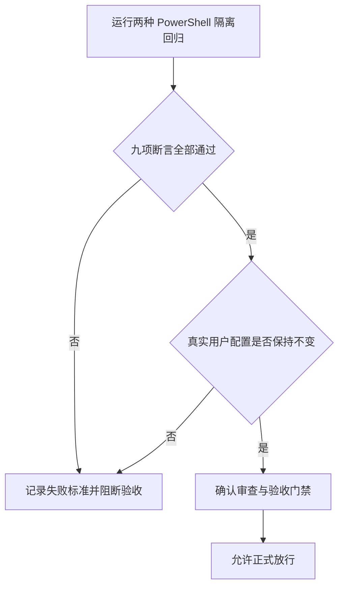

# Windows PowerShell 环境可靠性升级最终验收

本次升级已满足正式放行条件。现在只有真正缺少必需条件时才会阻断；可选工具、浏览器和第三方条件的适用性会被明确记录，而不会把本地工作卡住。两种 PowerShell 的隔离测试均通过，也没有改动用户真实终端或 profile。

## 文档信息

| 项目 | 内容 |
| --- | --- |
| 来源需求 | REQDOC-PSENV-20260713 |
| 验收标准 | ACDOC-PSENV-20260713 |
| 当前切片 | TASK-PSENV-12 |
| 验收范围 | 环境判断、事务安全、恢复边界和本地 PowerShell 回归 |
| 范围外 | 真实软件下载、浏览器联调、第三方接口和生产环境 |

## 验收场景

图形目的：说明从本地隔离测试到最终放行的验收顺序。关联 ID：AC-PSENV-001 至 AC-PSENV-006。

## 场景与前置条件

| 场景 | 前置条件 | 通过标准 | 失败标准 |
| --- | --- | --- | --- |
| 必需环境 | PowerShell 7 可用 | RequiredOnly 返回 ready | 返回 blocked 或探针失败 |
| 可选工具 | Extended 缺少可选项 | 返回 degraded 且 marker 可复用 | complete=false 或退出码非 0 |
| 写入安全 | 使用临时 Terminal/profile fixture | WhatIf 无写入，Rollback 可恢复 | 注释丢失、漂移文件被覆盖 |
| shell 分流 | Git Bash 与 WSL launcher 可识别 | 身份判定正确且不重复安装 | 猜测 shell 类型或错误安装 |

## 输入与预期结果

| 输入 | 预期结果 |
| --- | --- |
| `SessionEnsure -Policy Extended -SkipToolInstall` | 可选工具缺失时为 degraded，marker 可复用 |
| `Apply -WhatIf` | 不创建状态文件，不改写临时配置 |
| 已漂移 journal | 拒绝自动回滚并返回明确失败状态 |
| 未知命令且无 package 映射 | 只记录 candidate，不执行安装 |

## 异常与边界条件

| 条件 | 预期处理 |
| --- | --- |
| 活跃状态锁 | 返回 busy，不重复执行恢复 |
| 损坏 manifest 或 journal | 返回 failed，不猜测恢复 |
| Git Bash 不可见但 Windows 命令存在 | 记录 restartRequired，不重复安装 |
| 真实用户 Terminal/profile 发生变化 | 停止验收并判定隔离失败 |

## 范围外说明

- 范围外：真实 Winget/Scoop/Chocolatey 下载与安装；本轮只使用本地 fixture 和假包管理器。
- 范围外：浏览器联调、第三方接口、授权账号、测试/预发/生产环境。
- 以上项目不适用且不阻断，依据是门禁 YAML 中的适用性判定和本地隔离测试范围。

## 输入材料清单

| 材料 | 作用 | 状态 |
| --- | --- | --- |
| REQDOC-PSENV-20260713 | 需求与安全边界 | 已确认 |
| ACDOC-PSENV-20260713 | 六项通过标准 | 已确认 |
| IMP-OVERVIEW-PSENV-20260713、IMP-CYCLE-PSENV-20260713-04 | 实施范围、顺序和闭环 | 已收口 |
| TEST-PSENV-001 至 009 | 本地隔离运行证据 | 两种 PowerShell 均通过 |
| REV-PSENV-20260713 | 当前改动总审查 | 通过 |

## 前置条件检查

| 条件 | 结果 | 依据 |
| --- | --- | --- |
| 实施周期已按顺序收口 | 通过 | 周期 04 记录了最终任务闭环 |
| 真实测试已完成 | 通过 | PowerShell 5.1、PowerShell 7 各九项通过 |
| 审查已完成 | 通过 | 无 P0/P1 |
| 浏览器联调 | 不适用，不阻断 | 原因：没有网页或交互范围。证据：来源仅包含 PowerShell 脚本与本地 fixture。 |
| 第三方验证 | 不适用，不阻断 | 原因：没有网络调用或真实安装。证据：runner 只使用临时文件和假包管理器。 |

## 逐条验收判定

| 验收项 | 判定 | 证据 |
| --- | --- | --- |
| AC-PSENV-001 可选工具不阻断 | 通过 | RequiredOnly ready；Extended 缺可选项为 degraded 且 marker 可复用 |
| AC-PSENV-002 manifest 精确映射 | 通过 | fake Scoop 只收到 Fixture.Scoop，未接收 Winget ID |
| AC-PSENV-003 状态清晰 | 通过 | ready、degraded、busy、blocked 与固定退出码由 runner 覆盖 |
| AC-PSENV-004 写入安全 | 通过 | WhatIf 零写入；JSONC 注释保留；回滚和漂移拒绝通过 |
| AC-PSENV-005 shell 分流正确 | 通过 | Git 安装目录的 bash.exe 与 MINGW/MSYS 身份验证通过 |
| AC-PSENV-006 测试隔离 | 通过 | 测试前后真实 Windows Terminal hash 相同 |

## 实施闭环证据

| 周期 | 最小任务 | 实现 | 测试 | 审查 | 验收 |
| --- | --- | --- | --- | --- | --- |
| CYCLE-PSENV-04 | TASK-PSENV-10 | 状态、事务、映射与规则已同步 | parser 与 runner 通过 | 已审查 | 通过 |
| CYCLE-PSENV-04 | TASK-PSENV-11 | 隔离 runner 已落盘 | 两个 shell 各九项通过 | 已审查 | 通过 |
| CYCLE-PSENV-04 | TASK-PSENV-12 | 文档、字典与门禁已收口 | 本地校验通过 | 已审查 | 通过 |

## 遗留项与阻断项

- 遗留项：无。
- 阻断项：无。
- 不适用项：浏览器联调、第三方接口、真实下载和授权环境；原因与依据已写入 YAML 门禁，不影响正式放行。

## 验收结论

验收结论: 通过，允许正式放行。

## 完成条件、停止条件与交付物

| 类型 | 内容 |
| --- | --- |
| 完成条件 | AC-PSENV-001 至 AC-PSENV-006 全部通过，且两种 PowerShell 的九项测试均通过 |
| 停止条件 | 任一测试触碰真实用户 profile、Terminal、执行策略或真实安装时立即停止 |
| 交付物 | Skill 脚本、状态契约、manifest/schema、测试 runner、审查、验收和字典 |

## REQ-AC 追踪矩阵

| REQ/RULE | AC | TASK | TEST | REVIEW | 验收结论 |
| --- | --- | --- | --- | --- | --- |
| REQ-PSENV-001、RULE-PSENV-001、003 | AC-PSENV-001、003 | TASK-PSENV-10、11 | TEST-PSENV-001、002 | REV-PSENV-20260713 | 通过 |
| REQ-PSENV-002、RULE-PSENV-002、005 | AC-PSENV-002、005 | TASK-PSENV-10、11 | TEST-PSENV-006、007、008 | REV-PSENV-20260713 | 通过 |
| REQ-PSENV-003、RULE-PSENV-004、006 | AC-PSENV-004、006 | TASK-PSENV-10、11、12 | TEST-PSENV-003、004、005、009 | REV-PSENV-20260713 | 通过 |

## 通过标准

- AC-PSENV-001 至 AC-PSENV-006 全部通过。
- 审查无 P0/P1，PowerShell 5.1 与 PowerShell 7 均完成九项隔离断言。

图片资产决策：N/A + 原因：验收对象是脚本状态与本地测试结果。证据：没有页面、截图、原型或视觉对比要求。

## 重验触发条件

- 修改 manifest 的策略、来源映射、状态或退出码。
- 修改 Terminal/profile 事务、回滚 hash 或 shell 分流逻辑。
- 修改隔离 runner、降低测试覆盖，或把本地 fixture 改为真实外部环境。

## 执行附录

- 真实验证入口：`doc/5-tests/2026-07-13_214235/windows-powershell-environment-rules/scripts/run_v2_environment_tests.ps1`。
- 验证环境：本机 PowerShell 5.1、PowerShell 7、Git Bash 与临时目录；不连接第三方、测试、预发或生产环境。
- 停止边界：真实用户 profile、Terminal、执行策略或软件安装出现任何变化时，验收立即失效并回到实施周期。

## 追踪附录

| REQ/RULE | AC | TASK | TEST | REVIEW | 验收结论 |
| --- | --- | --- | --- | --- | --- |
| REQ-PSENV-001、RULE-PSENV-001、003 | AC-PSENV-001、003 | TASK-PSENV-10、11 | TEST-PSENV-001、002 | REV-PSENV-20260713 | 通过 |
| REQ-PSENV-002、RULE-PSENV-002、005 | AC-PSENV-002、005 | TASK-PSENV-10、11 | TEST-PSENV-006、007、008 | REV-PSENV-20260713 | 通过 |
| REQ-PSENV-003、RULE-PSENV-004、006 | AC-PSENV-004、006 | TASK-PSENV-10、11、12 | TEST-PSENV-003、004、005、009 | REV-PSENV-20260713 | 通过 |
