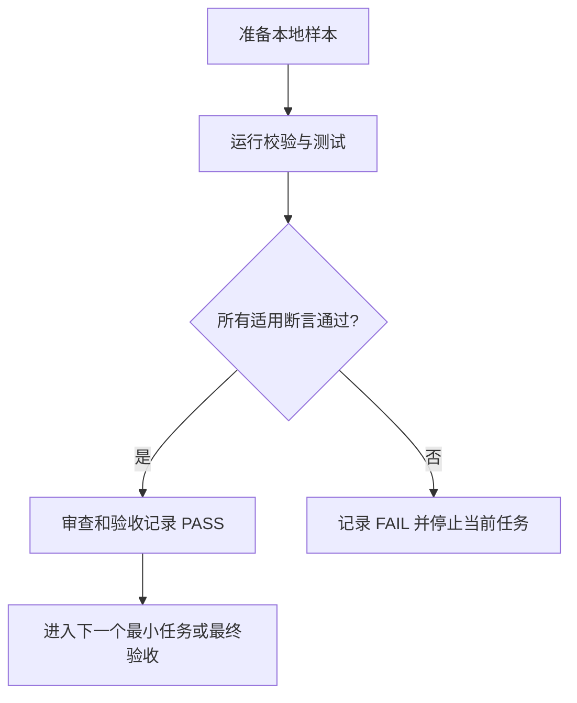

# 白话文档生成分层契约增强验收标准

结论：验收将确认新文档既便于业务阅读，也能保留可核对的执行信息。影响：所有受管文档入口的作者、读者、执行和审查角色。范围：摘要字段、术语说明、附录分层、模板覆盖、本地校验和历史兼容。非范围：不要求批量翻新历史文档，不验收产品行为、浏览器页面或第三方服务。变化：验收从只检查开场存在，提升为检查完整摘要和正确分层。完成标准：全部可观察断言通过，且没有遗漏入口或错误拒绝历史文档。术语说明：历史兼容指未修改的旧文档继续按原规则使用；本地校验指只在当前工作区运行的自动检查。验证状态：验收标准已确认，待实现完成后执行。

## 图片资产决策

图片资产决策：N/A + 原因：验收对象是文字结构、模板映射和本地命令结果，不含需要目视判断的产物；证据：本文件的验收流程图与表格可完整表达所有判定关系。

## 文档信息

| 字段 | 内容 |
| --- | --- |
| 来源对象 | `REQ-PLAIN-20260714-001` |
| 验收范围 | 白话正文、术语解释、附录分层、模板覆盖、校验器、历史兼容和收口门禁 |
| 验收环境 | local 工作区；不允许使用 test、staging、pre、release 或 production 配置 |
| 角色与权限 | 规则维护者执行命令；审查人员核对结果；普通业务读者只阅读正文，不执行命令 |
| 样本来源 | 本次新增文档、全部受管模板、校验器单元测试中的正反 fixtures |
| 图片资产决策 | N/A + 原因：验收对象是结构、文本和本地命令结果；证据：流程关系由 Mermaid 和决策表可完整表达 |

## 验收目标与判定原则

- 每个 `AC-*` 只允许得到 `PASS` 或 `FAIL`。
- 通过标准：命令退出成功，所述断言全部满足，且没有替代证明掩盖适用失败。
- 失败标准：命令非零、预期失败样本通过、正例失败、追踪缺口、正文泄漏、模板漏项或未修改历史文档被错误拒绝。
- 范围外：批量历史迁移、产品运行行为、浏览器联调和第三方调用均为 N/A + 原因：不属于 `REQ-PLAIN-20260714-001`；证据：需求的非范围表和门禁元数据。

## 验收场景

### 场景与前置条件

| 场景 | 前置条件 | 输入动作 | 可观察结果 |
| --- | --- | --- | --- |
| 新文档白话正文 | 新建符合 profile 的 Markdown fixture | 运行校验器 | 固定信息槽位、单段正文、术语解释和验证状态均被识别 |
| 附录分层 | fixture 同时含业务正文、执行信息和追踪信息 | 运行正反例 | 正确分层通过；正文泄漏或附录错位失败 |
| 模板覆盖 | 完整模板注册表与各模板文件存在 | 运行注册表静态测试 | 每个受管入口均有正文与附录落点 |
| 历史兼容 | 未修改的历史样本文档存在 | 运行兼容回归 | 不要求补字段，不产生新的失败 |

### 输入与预期结果

| AC ID | 关联需求/规则 | 输入与动作 | 通过标准 | 失败标准 |
| --- | --- | --- | --- | --- |
| `AC-PLAIN-001` | `REQ-PLAIN-001`、`DEC-PLAIN-001` | 构造完整业务正文并运行校验 | 一段正文同时表达结论、影响、范围、非范围、变化、完成标准、术语说明和验证状态 | 缺任一信息、出现两段正文或空术语说明必须 FAIL |
| `AC-PLAIN-002` | `REQ-PLAIN-001`、`RULE-PLAIN-001` | 输入首次出现的技术术语 | 术语紧随普通中文解释，业务读者不需查看附录即可理解 | 术语无解释或仅在追踪区出现解释必须 FAIL |
| `AC-PLAIN-003` | `REQ-PLAIN-002`、`DEC-PLAIN-002` | 输入命令、样本、日志、SQL、接口报文和稳定 ID | 技术操作进入执行附录，稳定 ID/矩阵/证据进入追踪附录 | 业务正文出现受禁止的技术信息必须 FAIL |
| `AC-PLAIN-004` | `REQ-PLAIN-002`、`RULE-PLAIN-002` | 输入带附录的文档 | 通用附录唯一且位于末尾，已有专用附录保持职责 | 重复附录或非末尾附录必须 FAIL |
| `AC-PLAIN-005` | `REQ-PLAIN-003`、`DEC-PLAIN-003` | 运行模板注册表静态测试 | 全部受管入口有唯一映射，且每项含正文、执行附录、追踪附录位置 | 入口漏项、重复映射或字段缺失必须 FAIL |
| `AC-PLAIN-006` | `REQ-PLAIN-004`、`DEC-PLAIN-005` | 运行校验器单元测试 | 正例通过，摘要缺字段、术语未解释、正文泄漏和附录错位负例均失败 | 任一负例被放行或正例被拒绝必须 FAIL |
| `AC-PLAIN-007` | `REQ-PLAIN-004`、`DEC-PLAIN-004` | 运行历史兼容回归 | 未修改历史文档不因新增字段失败；新建或修改文档按新契约校验 | 误伤历史文档或跳过新文档校验必须 FAIL |
| `AC-PLAIN-008` | `REQ-PLAIN-005`、`RULE-PLAIN-003` | 运行字典刷新、合规、审查和最终验收门禁 | 所有规定门禁有 PASS 证据，追踪链无孤立项 | 任一必需门禁缺失或 FAIL 仍宣称放行必须 FAIL |

## 异常与边界条件

| 场景 | 异常或边界 | 预期结果 | 清理或回滚 |
| --- | --- | --- | --- |
| 术语判定 | 普通中文词不是技术术语 | 不强制生成无意义解释；测试样本明确白名单和标记格式 | 删除该 fixture，不修改契约之外的模板 |
| 历史兼容 | 历史文档仅被读取、未被修改 | 校验不要求新增元数据或固定摘要字段 | 保持文件字节不变 |
| 注册表 | 新增受管入口但未登记 | 静态测试失败并指出漏项 | 先更新注册表与契约，再允许模板变更 |
| 校验器 | 规则出现误伤或漏检 | 当前任务停止，记录 `GAP-PLAIN-*` 并回开需求决策 | 回滚当前任务的脚本、测试和模板改动 |

## 范围外说明

| 项目 | 判定 | 原因与证据 |
| --- | --- | --- |
| 运行时产品功能测试 | N/A | 没有产品代码或运行行为改动；依据 `BOUND-PLAIN-OUT-002` |
| 浏览器和视觉验收 | N/A | 没有 UI、原型、截图或空间布局；依据图片资产决策 |
| 第三方与非 local 环境 | N/A | 所有验证均可由本地 Python 与仓库 fixtures 完成；依据 `REQ-PLAIN-004` |

## 验收流程图

图形目的：说明每项验收从输入、校验、二值判断到停止或放行的路径。关联 ID：`AC-PLAIN-001` 至 `AC-PLAIN-008`。

异常覆盖：任何失败都只允许回到关联需求、模板或校验器任务；不得通过人工口头说明绕过二值结果。

## REQ-AC 追踪矩阵

| 需求/规则 | 验收 | 实施周期/任务 | 测试 | 证据 |
| --- | --- | --- | --- | --- |
| `REQ-PLAIN-001`、`RULE-PLAIN-001` | `AC-PLAIN-001`、`AC-PLAIN-002` | `CYCLE-PLAIN-01` / `TASK-PLAIN-01` | `TEST-PLAIN-001` | `EVIDENCE-PLAIN-004` |
| `REQ-PLAIN-002`、`RULE-PLAIN-002` | `AC-PLAIN-003`、`AC-PLAIN-004` | `CYCLE-PLAIN-01` / `TASK-PLAIN-02` | `TEST-PLAIN-002` | `EVIDENCE-PLAIN-005` |
| `REQ-PLAIN-003` | `AC-PLAIN-005` | `CYCLE-PLAIN-02` / `TASK-PLAIN-03` | `TEST-PLAIN-003` | `EVIDENCE-PLAIN-006` |
| `REQ-PLAIN-004`、`RULE-PLAIN-004` | `AC-PLAIN-006`、`AC-PLAIN-007` | `CYCLE-PLAIN-03` / `TASK-PLAIN-05` | `TEST-PLAIN-004`、`TEST-PLAIN-005` | `EVIDENCE-PLAIN-007` |
| `REQ-PLAIN-005`、`RULE-PLAIN-003` | `AC-PLAIN-008` | `CYCLE-PLAIN-03` / `TASK-PLAIN-06` | `TEST-PLAIN-006` | `EVIDENCE-PLAIN-008` |

## 完成条件、停止条件与交付物

| 条目 | 固定条件 |
| --- | --- |
| 完成条件 | `AC-PLAIN-001` 至 `AC-PLAIN-008` 全部为 PASS；追踪覆盖完整；适用审查和最终验收均有证据 |
| 停止条件 | 任一 AC 为 FAIL、P0/P1 决策未冻结、local 命令失败、模板漏项、历史兼容被破坏或出现写集冲突 |
| 交付物 | 更新后的契约、模板、注册表、校验器、单元测试、字典、审查记录和最终验收记录 |
| 回滚 | 每个最小任务仅回滚其允许文件；不删除或重写未修改历史文档 |

## 附录

### 执行附录

| 测试 ID | local 命令 | 样本 | 断言 | 失败预期 | 清理 |
| --- | --- | --- | --- | --- | --- |
| `TEST-PLAIN-001` | `python -m unittest artifact-delivery-gate-rules.tests.test_validate_engineering_docs` | 正例和负例 fixtures | 摘要、术语、附录和兼容断言全部通过 | 缺陷样本必须被拒绝 | 删除仅为当前任务新增的 fixture |
| `TEST-PLAIN-002` | `python artifact-delivery-gate-rules/scripts/validate_engineering_docs.py --profile requirement --doc doc/2-需求/2026-07-14_003130_白话文档生成分层契约增强.md --root .` | 本需求文档 | profile 输出 PASS | 非零退出即 FAIL | 不产生运行时数据 |
| `TEST-PLAIN-003` | `python artifact-delivery-gate-rules/scripts/validate_engineering_docs.py --profile acceptance --doc doc/7-验收/2026-07-14_003130_白话文档生成分层契约增强_验收标准.md --root .` | 本验收标准 | profile 输出 PASS | 非零退出即 FAIL | 不产生运行时数据 |

### 追踪附录

| 证据 ID | 对应验收 | 记录内容 |
| --- | --- | --- |
| `EVIDENCE-PLAIN-004` | `AC-PLAIN-001`、`AC-PLAIN-002` | 完整/缺字段/术语样本的本地测试结果 |
| `EVIDENCE-PLAIN-005` | `AC-PLAIN-003`、`AC-PLAIN-004` | 正文泄漏与附录位置测试结果 |
| `EVIDENCE-PLAIN-006` | `AC-PLAIN-005` | 模板注册表覆盖结果 |
| `EVIDENCE-PLAIN-007` | `AC-PLAIN-006`、`AC-PLAIN-007` | 校验器和历史兼容回归结果 |
| `EVIDENCE-PLAIN-008` | `AC-PLAIN-008` | 字典、合规、审查与最终验收结果 |
