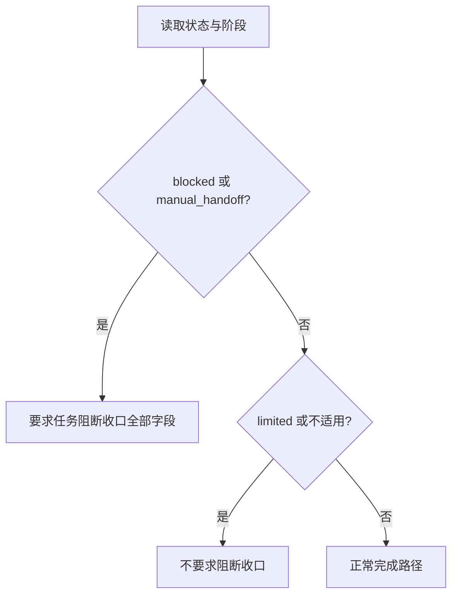

# 任务阻断收口与恢复计划验收标准

结论：阻断任务必须展示完整恢复计划，非阻断任务不得误报。影响：最终回复和正式文档具备一致的可恢复交接。范围：共享契约、生产者、消费者与本地校验。非范围：业务接口和外部环境。变化：新增五个可复核验收场景。完成标准：所有表中场景按断言通过。术语说明：受限状态表示可继续准备但不能正式放行。验证状态：实施中。

## 文档信息

本标准确认阻断任务对用户可见、可恢复、可复验，同时防止非阻断场景被误报。图片资产决策：N/A；原因：验收只验证文本、结构化事实和脚本行为；证据：无视觉交付物。

## 验收场景

| ID | 前置条件与输入 | 执行动作 | 预期结果 |
|---|---|---|---|
| AC-BLK-001 | producer 输出 `blocked`。 | 生成最终总结。 | 末尾出现“任务阻断收口”和明确任务状态。 |
| AC-BLK-002 | 同根因被审查和验收同时引用。 | 进入 compliance 与 summary。 | 仅输出一套去重的恢复计划。 |
| AC-BLK-003 | 同输入无变化复验已用尽。 | 执行失败恢复路由。 | 有尝试记录、停止原因、恢复验证和重入点。 |
| AC-BLK-004 | 阻断审查或最终验收文档缺字段。 | 运行文档校验器。 | 返回 `blocker.closure_missing` 或 `blocker.closure_invalid`。 |
| AC-BLK-005 | `limited` 或 `not_applicable`。 | 运行同一校验和总结。 | 不出现“任务已阻断”，保留现有受限依据。 |

## 场景与前置条件

所有验证仅使用本仓库和 local 工具；N/A：无数据库、HTTP、第三方账号或生产环境连接；原因：本次仅修改规则和本地 Python 校验器；证据：测试命令仅读取工作区 fixture。

## 输入与预期结果

通过标准：所有 AC-BLK-* 的断言通过，阻断文案包含契约全部字段且解决计划有一至三项可执行动作。失败标准：任何真实阻断缺少状态、证据、解决计划或重入验证，或任意非阻断场景出现任务阻断区块。

## 异常与边界条件

运行时 adapter 不具备安全恢复能力时必须输出 `manual_handoff`；不能以构造成功结果替代健康检查。文档状态为 `blocked` 但没有收口区块时必须由 validator 阻断。

## 范围外说明

N/A：不验证具体业务 API、数据库、浏览器或生产环境；原因：没有业务运行行为变更；证据：变更范围仅为 Skill、reference、模板、Python validator 和测试。

## 验收决策图

图形目的：说明 AC-BLK-004 与 AC-BLK-005 的判定。关联 ID：AC-BLK-004、AC-BLK-005。

## REQ-AC 追踪矩阵

| 需求/规则 | 验收 | 测试 |
|---|---|---|
| REQ-BLK-001, RULE-BLK-005 | AC-BLK-001 | TEST-BLK-001 |
| REQ-BLK-002, RULE-BLK-002 | AC-BLK-002 | TEST-BLK-002 |
| REQ-BLK-003, RULE-BLK-003 | AC-BLK-003 | TEST-BLK-003 |
| REQ-BLK-004, RULE-BLK-001 | AC-BLK-004 | TEST-BLK-004 |
| REQ-BLK-005, RULE-BLK-004 | AC-BLK-005 | TEST-BLK-005 |

## 完成条件、停止条件与交付物

完成条件：共享契约、所有 producer、最终消费者和 validator 均引用同一口径，且真实测试通过。停止条件：P0/P1 字段缺失、状态边界不一致、测试失败或需要非 local 外部依赖。交付物：本需求文档、验收标准、实施文档、Skill 资产和本地测试证据。
