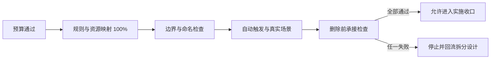

# 验收标准：Skill 体积治理与职责拆分

结论：以“体积可控、规则不丢、触发不漂移、路径不越界、旧入口可安全下线”为验收主线；影响：决定拆分后的 skill 是否能被普通执行模型稳定使用；范围：预算、候选、映射、通用测试入口、引用和删除门禁；非范围：不验收本轮未实施的真实 skill 资产行为；变化：将拆分结果从“目录存在”提升为可追溯、可触发、可删除的完整交付，并把 fixture 越界作为失败条件；完成标准：所有适用验收项通过，暂缓项保留证据；术语说明：旧 skill 是冻结对照基线，新 skill 集合是拆分后的平级入口，fixture 是当前测试时间戳目录内的离线样本；验证状态：通用测试入口的当前任务验收已完成，完整 skill 拆分仍未开始。

## 文档信息

| 字段 | 内容 |
|---|---|
| 来源需求 | `doc/2-需求/2026-07-16_114619_Skill体积治理与拆分.md` |
| 验收标准 ID | `AC-SKILL-SPLIT-20260716` |
| 当前状态 | `in_progress`；周期 01 的测试入口验收已完成，真实 skill 拆分仍未验收 |
| 实施授权 | 是；覆盖统计、候选矩阵、测试脚本、fixture 和 README 证据，不覆盖真实 skill 资产修改、删除、字典刷新或 Git 历史写入 |

## 场景与前置条件

| 前置条件 ID | 条件 | 证据 | 不满足时处理 |
|---|---|---|---|
| `BOUND-SKILL-AC-001` | 需求文档已冻结预算、候选、顺序和删除门禁 | `doc/2-需求/2026-07-16_114619_Skill体积治理与拆分.md` | 回到需求文档，不进入拆分实施 |
| `BOUND-SKILL-AC-002` | 实施总览和八个周期文档已落盘并能互相回指 | `doc/3-实施/2026-07-16_114619_Skill体积治理与拆分_实施总览.md` 与周期文档索引 | 回到实施规划，不执行 skill 修改 |
| `BOUND-SKILL-AC-003` | 本轮已获得继续执行计划证据的授权，但未获得真实 skill 资产实施授权 | 用户明确要求“按计划执行”，当前任务边界锁定在 `TASK-SPLIT-01-03` 的测试入口和 fixture | 允许验收入口契约，不修改真实 skill 资产 |

## 输入与预期结果

| 输入 | 预期结果 | 通过判定 |
|---|---|---|
| 全仓 skill 体积和默认文本包报告 | 每个 skill 获得预算等级、职责判断和处置结论 | 预算、职责和处置三项均可追溯 |
| 旧 skill 原子规则、特例和资源清单 | 每条对象有唯一主承接新 skill、等价性说明和迁移动作 | 覆盖率 100%，无孤立对象 |
| 正向、反向、边界和真实场景样本 | 新 skill 能自动命中且不抢相邻职责 | required 全命中、forbidden 全不命中 |

## 异常与边界条件

| 场景 | 失败预期 | 必须回流 |
|---|---|---|
| 体积超限但无法证明两个独立职责组 | 不拆 skill，记录按需 references 或资源治理结论 | CYCLE-SPLIT-01 |
| 映射存在多个主落点或资源无法归类 | 旧 skill 保持冻结，不允许删除 | 对应候选周期的原子化任务 |
| 新 skill 自动触发稳定超过 3 个入口 | 判定拆分过细或 description 重叠 | 候选分类与路由设计 |
| Codex CLI、字典脚本或真实场景依赖不可用 | 标记 `limited` 或阻断，不以人工阅读替代 | 对应周期测试任务 |

## 验收场景

| 场景 ID | 验收对象 | 通过标准 | 失败标准 |
|---|---|---|---|
| `AC-SKILL-SPLIT-001` | 体积预算 | 所有 skill 输出 `SKILL.md`、reference、文本包分级；超过阈值的 skill 均有进入/暂缓结论 | 只报文件大小，不区分职责或资源类型 |
| `AC-SKILL-SPLIT-002` | 候选进入门槛 | 每个进入 skill 都有两个以上独立触发职责组、主次边界和停止拆分条件 | 只有“文档很长”的主观判断 |
| `AC-SKILL-SPLIT-003` | 规则映射 | 原子规则、特例、边界和资源 100% 有主落点；组合承接有说明 | 存在孤立规则、弱化语义或悬空资源 |
| `AC-SKILL-SPLIT-004` | 命名和描述 | 新名称由独立 description 反推，能脱离旧 skill 上下文理解 | 机械沿用旧前缀或 description 仍混合两类职责 |
| `AC-SKILL-SPLIT-005` | 自动触发 | 应命中样本全部命中正确新 skill；不得命中禁止项；相邻边界样本无抢入口 | 需要额外口头补充才能命中、命中错误或漏命中 |
| `AC-SKILL-SPLIT-006` | 真实场景 | 至少一个真实 skill 场景完成旧/新等价对照，输出行为一致 | 只做静态目录检查 |
| `AC-SKILL-SPLIT-007` | 删除前承接 | 覆盖 100%、多轮测试通过、字典/引用清理通过、旧入口不再被依赖 | 先删除后验证，或仍需旧 skill 才能解释职责 |

### 当前任务 `TASK-SPLIT-01-02` 验收口径

- 正式预算基线固定为 84 个 skill；磁盘目录 111 个、扩展种子 27 个单独记录，不得混入正式预算数量。
- `candidate-matrix.yaml` 必须能回指报告哈希、预算策略、候选顺序、旧/新 skill 路径、决策 ID、当前矩阵测试 `TEST-SPLIT-002` 和后续周期任务/测试入口。
- 4 个 `enter_split` 正式候选必须各有两个 `proven` 独立职责组；`2d-asset-design` 只能作为扩展种子 P1 例外保留，不能伪装成正式 84 个基线条目。
- `TEST-SPLIT-002` 仅负责四份工程文档 profile 与候选矩阵结构/边界断言；不存在的 `validate_skill_split.py --mode mapping` 不得作为当前验收入口。

### 当前任务 `TASK-SPLIT-01-03` 验收口径

- Python 入口必须支持 `all`、`size`、`mapping`、`trigger`、`pre-delete`、`post-delete`；`all` 必须按固定顺序执行五类模式。
- PowerShell wrapper 必须支持 `-Phase all|pre-delete|post-delete`、`-RepoRoot`、`-CasesRoot` 和 `-Help`，并将 `-CasesRoot` 转发给 Python `--cases`。
- 正向验收必须证明 size 的 84/111/27 统计、mapping 哈希和关键 token、5 个 trigger fixture 的 required/forbidden、pre-delete/post-delete 状态均通过。
- 边界验收必须证明报告/矩阵路径不能离开 `--root`，fixture 根不能离开当前测试时间戳目录；越界命令必须非 0 并输出 `[失败]` 或 `[FAIL]`。
- 当前验收只证明测试入口和离线 fixture 契约，不证明新 skill 已创建、规则已迁移、旧 skill 已删除或字典已刷新。

## 完成条件、停止条件与交付物

### 完成条件

- `TEST-SPLIT-001` 至 `TEST-SPLIT-006` 均通过或明确标记 `N/A + 原因 + 证据`。
- P0/P1 候选完成规则映射和新 skill 触发验证。
- 旧 skill 删除前检查通过，且 `skill-dictionary` 生成物与源目录一致。
- 文档、skill、references、scripts、agents 和测试证据均为 UTF-8，关键文件可回读。

当前任务 `TASK-SPLIT-01-03` 的完成条件：Python/PowerShell help、all、pre-delete、post-delete 和 `py_compile` 退出码与输出符合预期；size/mapping/trigger/pre-delete/post-delete 五类模式通过；仓库路径和 fixture 路径越界负向断言通过；README、周期文档和证据槽位真实同步；当前只读审查和任务验收均无 P0/P1；不进入 CYCLE-SPLIT-02。

### 停止条件

- 任一原子规则、特例或资源无法找到唯一主承接。
- 自动触发出现漏命中、抢入口或平均命中稳定超过 3 个 skill。
- 新 skill 的 `SKILL.md` 或默认文本包仍超过硬阈值且没有不可拆证据。
- 测试入口、Codex CLI、字典脚本或文档校验器失败。
- 出现未获授权的 skill 删除、字典刷新或规则文件写入。

### 交付物

| 交付物 | 必须包含 |
|---|---|
| 候选分析 | 体积统计、职责组、优先级、暂停项和证据 |
| 拆分方案 | 新 skill description、名称、边界、分类二分依据 |
| 覆盖映射 | 原规则 ID、特例、资源、主落点、等价性、组合覆盖 |
| 测试证据 | 静态覆盖、边界路由、触发样本、真实场景 |
| 删除前检查 | 主承接、次承接、旧入口、引用清理和删除动作 |

## 通过标准与失败标准

### 通过标准

- `AC-SKILL-SPLIT-001` 至 `AC-SKILL-SPLIT-007` 全部满足。
- 任何暂缓 skill 均有当前证据、暂停理由、重新评估条件和不误拆边界。
- 旧 skill 只有在映射与测试全部通过后才进入删除动作。

### 失败标准

- 任何原规则、特例、脚本、资源或边界声明无落点。
- 仅通过人工阅读、build、lint 或字典刷新宣称拆分完成。
- 将资源多但职责单一的 skill 机械拆分，导致平均命中超过 3 或重复触发。
- 计划阶段直接进入编码、删除、提交或推送。

## 范围外说明

- `imagegen`、`windows-wsl-execution-rules`、`implementation-review-rules`、`autonomous-execution-rules`：本轮只做暂缓审计，不验收拆分。
- `implementation-planning-rules`：本轮只验收复评条件，不验收新 skill 生成。
- 业务项目运行测试、外部接口、生产环境：`N/A + 原因 + 证据`，不进入验收范围。
- 图片资产决策：`N/A + 原因 + 证据`：验收对象是规则、触发和文档证据，不涉及 UI、截图或视觉产物。

## REQ-AC 追踪矩阵

| 需求 | 验收 | 证据/测试 |
|---|---|---|
| `REQ-SKILL-SIZE-001` | `AC-SKILL-SPLIT-001` | `TEST-SPLIT-001` / `EVIDENCE-SKILL-BASELINE-20260716` |
| `REQ-SKILL-SPLIT-001` | `AC-SKILL-SPLIT-002` | `TEST-SPLIT-002` / `EVIDENCE-SKILL-ROLE-20260716` |
| `REQ-SKILL-SPLIT-002` | `AC-SKILL-SPLIT-003` | `TEST-SPLIT-003` / `EVIDENCE-SKILL-MAPPING-20260716` |
| `REQ-SKILL-SPLIT-003` | `AC-SKILL-SPLIT-004` | `TEST-SPLIT-004` / `EVIDENCE-SKILL-NAMING-20260716` |
| `REQ-SKILL-SPLIT-004` | `AC-SKILL-SPLIT-005`、`AC-SKILL-SPLIT-006` | `TEST-SPLIT-005`、`TEST-SPLIT-006` |
| `REQ-SKILL-SPLIT-005` | `AC-SKILL-SPLIT-007` | `TEST-SPLIT-007` / `EVIDENCE-SKILL-DELETE-20260716` |

## 验收流程图

图形目的：说明验收只能按预算、映射、触发、真实场景和删除前检查顺序推进。关联 ID：`AC-SKILL-SPLIT-001` 至 `AC-SKILL-SPLIT-007`。

## 本轮计划变更同步

- `CHG-SPLIT-20260717-001`：验收入口从“仅计划草案”切换为当前统计任务的进行中状态；`TEST-SPLIT-001` 只验收 84 个 skill 的统计 JSON、字段完整性、UTF-8 和指纹证据。
- `CHG-SPLIT-20260717-002`：测试任务根目录切换为当天时间戳 `doc/5-tests/2026-07-17_155229/`；中文说明与 ASCII 真实测试资产分置，验收通过前不得写入旧日期目录。
- `CHG-SPLIT-20260717-003`：当前验收切片切换到 `TASK-SPLIT-01-02`；候选矩阵补齐正式/扩展种子边界、候选顺序、路径和双层测试追踪；`TEST-SPLIT-002` 收敛为四份工程文档 profile 与矩阵断言。
- `CHG-SPLIT-20260717-004`：当前验收切片切换到 `TASK-SPLIT-01-03`；`TEST-SPLIT-003` 收敛为五类通用入口、PowerShell `-CasesRoot` 转发、路径越界负向断言和 pre/post-delete fixture 契约；不改变真实 skill 拆分结果。
- 影响边界：不改变预算阈值、候选分级、删除门禁和后续周期验收；完整 skill 拆分仍未完成。
- Mermaid 检查：现有验收流程图描述的是候选进入、验证和删除前门禁，本轮只改变执行状态和测试资产路径，图形语义保持一致。

## 追踪附录

- 来源：`SRC-SKILL-SPLIT-20260716`。
- 需求：`REQ-SKILL-SIZE-001`、`REQ-SKILL-SPLIT-001` 至 `REQ-SKILL-SPLIT-005`。
- 本验收标准已随实施收口重验：`AC-SKILL-SPLIT-001`~`006` 在 `CYCLE-SPLIT-01`~`06` 各周期验证矩阵中通过；`AC-SKILL-SPLIT-007`（删除门禁）在用户授权后随 `TASK-SPLIT-02-06`/`03-04`/`04-06`/`05-05`/`06-05` 完成真实删除与 post-delete 回归，全部通过。详见实施总览 `CHG-SPLIT-20260721-001` 与各周期证据文件。
