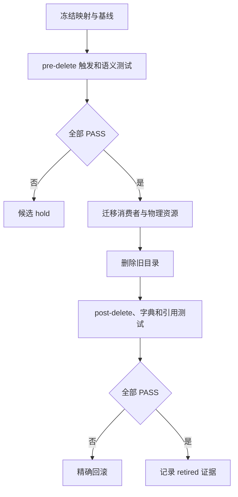

# 六域 Skill 结构精简与自动触发保持验收标准

结论：本验收确认精简后仍保持原有路由和保护语义，只删除被完整替代的旧 Skill；影响：自动路由、文档、测试和后续研发任务均依赖验收结论；范围：候选清单、触发、保护语义、消费者、物理删除、字典和文档门禁；非范围：不验收业务功能、外部接口、数据库、图片资产和 Git 历史；变化：使用可复核的通过或失败结论替代主观判断；完成标准：全部适用验收项通过，任一高优先级失败均禁止退役对应旧 Skill；术语说明：删除前检查是旧目录仍存在时的验证，删除后检查是旧目录移除后的验证；验证状态：验收口径已冻结，迁移从周期 01 开始。

## 文档信息

图片资产决策：N/A + 原因：本任务不涉及图片生成、编辑或引用；证据：本文文档信息、范围和执行附录均声明无图片资产。

| 字段 | 内容 |
| --- | --- |
| 验收对象 | `SRC-SKILL-STREAMLINE-20260721-001` |
| 验收等级 | L3。 |
| 环境 | `F:\luode-skills` local 仓库。 |
| 图片资产 | N/A + 原因：没有图片资产。 |

## 验收场景

| AC ID | 追踪 | 场景与动作 | 通过标准 | 失败标准 | 清理与回滚 |
| --- | --- | --- | --- | --- | --- |
| `AC-SS-001` | `REQ-SS-001`,`007` | 校验 36 个 Skill 分类。 | source、target、action、trigger、语义、consumer、hash、rollback 完整。 | 缺 P0 字段。 | 删除草稿 mapping。 |
| `AC-SS-002` | `REQ-SS-002`,`008` | 对退役 Skill 原触发运行正例。 | 唯一命中目标主入口。 | 未命中、旧入口或多入口命中。 | 恢复源目录。 |
| `AC-SS-003` | `REQ-SS-003` | 扫描保护语义。 | 触发、习惯、授权、安全、local、输出、停止均可定位。 | 语义只在待删目录。 | 补回 canonical locator。 |
| `AC-SS-004` | `REQ-SS-005`,`010` | 扫描 active consumers。 | 无非归档旧引用。 | 残留旧名称。 | 还原或更新消费者。 |
| `AC-SS-005` | `REQ-SS-006`,`011` | 删除后执行 post-delete。 | 脚本、references、templates、字典无断链。 | 缺失资源。 | 精确恢复当前候选。 |
| `AC-SS-006` | `REQ-SS-012` | 需求样本。 | intake 承接发现/缺口，boundary/change 保留。 | 模糊需求直接实施。 | 恢复需求候选。 |
| `AC-SS-007` | `REQ-SS-013` | Plan Mode 和执行推进。 | planning 唯一，autonomous 独立。 | planning 多入口。 | 恢复 planning 细则。 |
| `AC-SS-008` | `REQ-SS-014` | 测试资产和专项测试样本。 | test-strategy 管资产，专项能力保留。 | 误触发旧入口。 | 恢复测试候选。 |
| `AC-SS-009` | `REQ-SS-015` | Bug 发现、缺口、断言、日志、断点。 | intake route 正确，复现/根因独立。 | 清理或停止要求丢失。 | 恢复 Bug 候选。 |
| `AC-SS-010` | `REQ-SS-016` | 三类审查样本。 | 按阶段唯一命中。 | 任一审查互相替代。 | 恢复审查契约。 |
| `AC-SS-011` | `REQ-SS-016` | 前置与最终验收样本。 | 两阶段保持独立。 | 无测试证据提前放行。 | 恢复验收边界。 |
| `AC-SS-012` | `REQ-SS-017` | 字典与文档 gate。 | 生成资产、UTF-8、profile 通过。 | 手改生成物或 gate 失败。 | 修复源文件重跑。 |

## 场景与前置条件

| 条件 | 内容 |
| --- | --- |
| 角色 | 主 agent 执行 local 检查；审查者复核；用户定义范围。 |
| 环境 | `F:\luode-skills`，只使用 local 配置归属。 |
| 样本 | manifest、Skill descriptions、references、active consumers、fixtures。 |
| 权限 | 不读取或输出任何凭据。 |

## 输入与预期结果

| 输入类别 | 样本 | 预期 |
| --- | --- | --- |
| 旧触发正例 | 模糊想法、测试目录、临时 debug 日志。 | 命中目标 route。 |
| 相邻域负例 | 最终验收、数据库字段、Git 提交。 | 不误入当前合并 route。 |
| 物理删除 | retire 目录。 | post-delete PASS。 |
| 保护语义 | local、授权、输出、停止。 | canonical locator 存在。 |

## 异常与边界条件

| 场景 | 预期 |
| --- | --- |
| target owner 缺失 | FAIL，候选 hold。 |
| consumer 未更新 | FAIL，不删除源目录。 |
| shared asset owner 不明 | FAIL，不迁移或删除。 |
| Obsidian 未注册 | N/A + 原因：本验收使用仓库 local 资产，vault 沉淀不构成通过前提。 |
| `.codex/config.toml` 被改动 | FAIL，任务范围污染。 |

## 范围外说明

- 外部服务联调：N/A + 原因：仅验证仓库内路由和 local fixture。
- 数据库迁移：N/A + 原因：不改数据模型。
- 图片生成：N/A + 原因：无图片资产。
- Git 历史：N/A + 原因：当前轮无授权。

图形目的：说明旧 Skill 删除前后的验收门禁；关联 `AC-SS-002` 至 `AC-SS-005`。

图形目的：用于说明本任务流程；关联 ID：REQ-SS-001。

## REQ-AC 追踪矩阵

| REQ/RULE | AC | 周期 | TEST |
| --- | --- | --- | --- |
| `REQ-SS-001`,`007` | `AC-SS-001` | `CYCLE-SS-01` | `TEST-SS-001` |
| `REQ-SS-002`,`RULE-SS-001`~`003` | `AC-SS-002`,`003` | 全部 | `TEST-SS-002`,`003` |
| `REQ-SS-005`,`006`,`RULE-SS-007` | `AC-SS-004`,`005` | `CYCLE-SS-02`~`06` | `TEST-SS-004`,`005` |
| `REQ-SS-012`~`016` | `AC-SS-006`~`011` | 对应领域 | `TEST-SS-006`~`011` |
| `REQ-SS-017` | `AC-SS-012` | `CYCLE-SS-06` | `TEST-SS-012` |

## 完成条件、停止条件与交付物

- 完成条件：`AC-SS-001` 至 `AC-SS-012` 全部 PASS；11 个旧 Skill 已退役；无活跃旧引用。
- 停止条件：触发、保护语义、consumer、物理资源或 local 红线失败。
- 交付物：manifest、fixture、测试日志、审查报告、最终验收报告、字典和项目记忆。

## 执行附录

- local 命令、样本、断言、失败预期、清理和回滚记录到本轮 `doc/5-tests/` 目录。

## 追踪附录

- 所有 `AC-SS-*` 在 manifest 中关联候选、测试、证据路径和状态。
