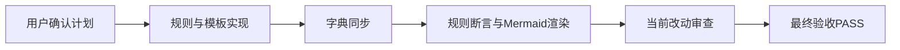

# 最终验收：最终总结图形化优先升级

结论：本轮升级通过最终验收，可以作为已完成但未提交的改动交付；影响：复杂最终总结会先展示图形化主链路，简单任务仍保持精简；范围：目标 Skill 规则、模板、条件、示例、默认提示、规划表和字典同步；非范围：不包含其他业务 Skill 改造、图片资产、浏览器联调或 Git 提交；变化：最终总结从文字结构优先升级为内容驱动的图形优先表达；完成标准：用户计划中的功能、兼容性和机器验证项全部通过，当前审查无 P0/P1；术语说明：图形化总览是放在文字执行证据之前的 Mermaid 流程、时序、状态或依赖图；验证状态：19 项规则断言、8 个图真实渲染、Skill 结构校验和独立审查均已通过。

## 文档信息

| 字段 | 内容 |
|---|---|
| 来源对象 | `SRC-SUMMARY-VISUAL-20260722-001` |
| 文档 ID | `FA-SUMMARY-VISUAL-20260722` |
| 当前切片 | reasoning-summary-structure-rules 图形化优先升级最终验收 |
| 当前状态 | accepted |

图片资产决策：N/A + 原因：本轮仅使用 Mermaid 文本图，不生成或交付位图资产；证据：正文与附录均无图片文件、图片清单或图片链接。

## 完成标准

- 功能验收、兼容性验收和机器验证全部通过。
- 当前改动审查无 P0/P1，保护语义和 Markdown-only 约束保持不变。
- 当前轮未获得 Git 提交授权，因此只放行“已验证未提交”的最终状态。

## 输入材料清单

| 类型 | 输入 |
|---|---|
| 来源对象 | 用户在当前任务中提供的《推理总结结构闸门升级：图形化优先输出》实施计划 |
| 实现结果 | 目标 Skill、references、agents、规划表和生成字典当前 diff |
| 测试结果 | 19 项规则断言、quick validator、YAML 解析、8 个 Mermaid 图真实渲染、diff check |
| 审查结果 | `doc/6-审查/2026-07-22_001048_reasoning-summary-structure-rules_图形化优先升级当前改动总审查.md` |

## 验收流程

图形目的：展示来源计划、实现、测试、审查和最终放行的闭环。
关联 ID：`ACCEPT-SUMMARY-VISUAL-001`、`EVIDENCE-SUMMARY-RENDER-001`

## 前置条件检查

| 前置条件 | 结论 | 依据 |
|---|---|---|
| 实现完成 | 通过 | 计划范围内文件均已更新 |
| 真实测试完成 | 通过 | 8 个 Mermaid 图由 CLI 真实解析并生成非空 SVG |
| 规则行为验证完成 | 通过 | 19 项断言覆盖触发、排序、回退和保护语义 |
| 审查完成 | 通过 | 初审问题全部关闭，独立窄复审 PASS |
| 工作树边界明确 | 通过 | 保留既有改动，不提交、不重置、不回滚非目标内容 |

## 功能验收判定

| 验收项 | 结论 | 证据 |
|---|---|---|
| 复杂流程先出现图形化总览 | 通过 | 固定顺序和复杂任务正例 |
| 流程使用 `flowchart` | 通过 | 图形选择矩阵与模板 |
| 跨角色交互使用 `sequenceDiagram` | 通过 | 时序图模板真实渲染 |
| 状态迁移使用 `stateDiagram-v2` | 通过 | 状态图模板真实渲染 |
| 执行依赖使用执行/依赖图 | 通过 | 图形选择矩阵 |
| 量化数据不虚构 | 通过 | 不可靠时要求 N/A、原因、证据和表格回退 |
| 简单任务不强制造图 | 通过 | 简单任务完整正例 |
| 图形包含目的和关联 ID | 通过 | 主规则、模板和示例均强制要求 |
| 图文术语一致 | 通过 | 发送前自检和反例驳回规则 |
| 图形不替代执行证据与结论 | 通过 | 固定输出顺序保留全部必填字段 |

## 兼容性验收判定

| 验收项 | 结论 |
|---|---|
| 原有固定总结字段保留 | 通过 |
| 无阻断时改动点位于普通总结末尾 | 通过 |
| 真实阻断时阻断区块最后 | 通过 |
| `limited/not_applicable` 不误报阻断 | 通过 |
| Obsidian 成功态只在真实 CLI 动作后出现 | 通过 |
| 非法下一步和等待文案仍被禁止 | 通过 |
| Markdown-only 约束保留 | 通过 |
| 原有 protected semantics 未删除 | 通过 |

## 机器验证判定

| 验证 | 结论 | 结果 |
|---|---|---|
| Skill quick validate | 通过 | `Skill is valid!` |
| 字典生成 | 通过 | `implemented_total=73`、`planned_missing=0`、`seed_total=33` |
| YAML 解析 | 通过 | `openai.yaml parsed: OK` |
| 规则断言 | 通过 | 19 / 19 |
| Mermaid CLI | 通过 | 8 / 8，SVG 非空 |
| 目标范围 `git diff --check` | 通过 | 本轮目标文件无 whitespace error |
| 全仓库 `git diff --check` | 受限 | 本轮范围外 `PROJECT_HISTORY.md:97` 存在末尾空行，不影响目标功能验收但不提供整体提交放行 |
| 独立审查 | 通过 | P0=0、P1=0，全部历史发现 CLOSED |

## 遗留项与阻断项

- 遗留项：Obsidian bridge 因 `VAULT_NOT_REGISTERED` 无法沉淀跨项目知识；项目本地稳定记忆已更新，不影响本轮放行。
- 遗留项：全仓库 `PROJECT_HISTORY.md:97` 存在本轮范围外的末尾空行问题；目标文件专项检查通过，但当前任务不提供全仓库提交放行。
- 阻断项：无。

## 最终结论

- 最终验收结论：通过。
- 当前状态：目标范围已完成、已验证、已审查、未提交。
- Git 边界：当前轮没有提交授权，保持工作树改动未提交。

## 验收结论

- 通过标准：复杂任务先图后文，简单任务免图，兼容性和机器验证全部满足。
- 验证结论：19 项规则断言、8 个 Mermaid 真渲染、quick validate、字典生成和目标范围 `git diff --check` 全部通过。
- 审查结论：当前改动总审查和独立窄复审均为 PASS，P0/P1 为零。

## 重验触发条件

以下任一情况发生时，必须重新验收：图形触发条件、固定字段顺序、阻断 owner、合法后续规则、图形数量上限、量化回退口径或 Mermaid 模板发生变化。

## 执行附录

- local 命令：`python -X utf8 .system/skill-creator/scripts/quick_validate.py reasoning-summary-structure-rules`
- local 命令：`python -X utf8 skill-dictionary/generate_dictionary.py`
- local 命令：`npx.cmd --offline --yes @mermaid-js/mermaid-cli`
- local 命令：对本轮目标路径执行 `git diff --check -- <paths>`；全仓库检查结果作为范围外遗留记录
- 失败恢复证据：默认 GBK 读取失败后改用 `python -X utf8`；含递归清理的临时命令被策略拒绝后改用唯一临时目录；两个入口均已按原成功标准复验通过。

## 追踪附录

| 来源 | 决策 | 验收 | 证据 |
|---|---|---|---|
| 用户图形优先计划 | 内容驱动、Mermaid 优先、简单任务免图 | `AC-SUMMARY-VISUAL-001` | 规则断言、模板和正反例 |
| 用户兼容性要求 | 保留阻断、后续、Obsidian、Markdown-only 语义 | `AC-SUMMARY-COMPAT-001` | 独立审查 PASS |
| 用户机器验证要求 | 结构、字典、diff 和 Mermaid 真解析 | `AC-SUMMARY-MACHINE-001` | quick validator、8 个 SVG、diff check |

| 需求 | 周期 | 任务 | 测试 |
|---|---|---|---|
| `REQ-SUMMARY-VISUAL-001` | `CYCLE-SUMMARY-VISUAL-001` | `TASK-SUMMARY-VISUAL-001` | `TEST-SUMMARY-VISUAL-001` |
