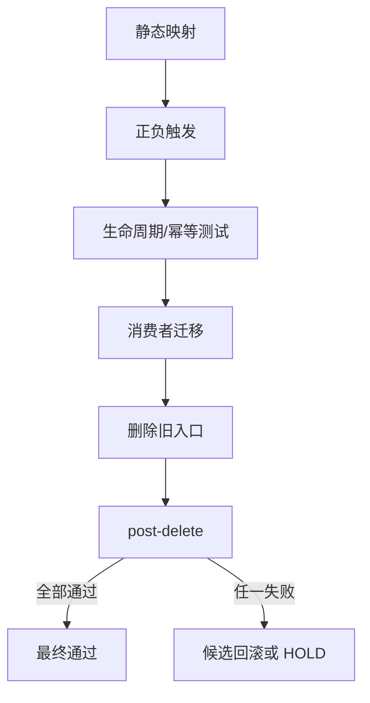

# 总控层 Skill 精简合并与单向路由验收标准

结论：验收以规则零丢失、自动触发兼容、单向路由和删除后无活跃消费者为准；影响：任何不通过项都会阻止对应旧 Skill 删除；范围：18 个候选、2 个退役入口、16 个触发样本、物理资产、字典和工程证据；非范围：不验收业务功能、数据库或外部服务；变化：按候选逐项给出通过、失败、未验证或阻断；完成标准：全部验收场景通过，且基线、触发与删除后校验均返回有效结果；术语说明：范围外是本任务不改变的业务域；验证状态：标准已冻结，真实验收待实施完成。

## 文档信息

图片资产决策：N/A + 原因：本验收标准只描述 Markdown Skill 规则与本地验证结果；证据：验收范围没有图片输入、生成或交付。

| 字段 | 内容 |
| --- | --- |
| 来源需求 | `REQ-TC-20260722` |
| 验收对象 | 总控层 Skill、消费者、字典、验证资产 |
| local 环境 | `F:\luode-skills` |
| 第三方验证 | N/A + 原因：无外部服务 |

## 验收目标与判定原则

- 通过标准：保护语义有唯一 Owner、触发兼容、消费者清零、资产完整、机器验证通过。
- 失败标准：规则丢失、触发漂移、授权弱化、旧消费者残留或删除后验证失败。
- `limited` 与 `not_applicable` 不作为真实阻断；明确必需且无替代验证才阻断。

## 前置条件

| ID | 前置条件 | 未满足处理 |
| --- | --- | --- |
| `AC-TC-PRE-001` | manifest、inventory、fixtures 存在 | 阻断 |
| `AC-TC-PRE-002` | baseline valid=true | 阻断资产删除 |
| `AC-TC-PRE-003` | 每个候选有回滚定位和冻结写集 | 候选 `HOLD` |

## 验收场景

图形目的：说明总控层候选从静态映射、触发验证、生命周期验证到消费者迁移和删除后复验的验收顺序。

关联 ID：`AC-TC-001` 至 `AC-TC-008`、`REQ-TC-001` 至 `REQ-TC-005`。

| AC ID | 场景 | 输入 | 预期结果 | 失败标准 |
| --- | --- | --- | --- | --- |
| `AC-TC-001` | 并行与子代理合并 | 可并行/条件并行/串行及真实代理生命周期 | 只命中 parallel Owner，计划/启动/完成/关闭一致 | 双入口、重复启动或关闭缺失 |
| `AC-TC-002` | 项目自举合并 | 仅规则缺失、仅记忆缺失、同时缺失、全部存在 | 单 Owner 双路由，重复运行无重复内容 | 历史覆盖、非受管内容丢失或第二入口残留 |
| `AC-TC-003` | 压缩上下文恢复 | 压缩摘要且近期事实完整/缺失 | 默认不命中 recent；缺事实才条件命中 | 无条件 recent 预热 |
| `AC-TC-004` | 最终输出唯一 Owner | completed/limited/blocked/用户要求建议 | 只有 reasoning summary 定义最终区块 | 多 Owner 复制模板 |
| `AC-TC-005` | 每轮命中与 Git 隔离 | 普通任务、当前轮 Git、历史轮 Git | hit 首个命中；Git 只认当前轮 | 历史授权继承 |
| `AC-TC-006` | 代码收口纵深校验 | 代码改动、工具调用、纯文档 | 注释/实现审查/代码收口按适用性触发 | 静态验证宣称功能可用 |
| `AC-TC-007` | 删除后消费者和资产 | 两个旧目录删除 | 活跃引用为 0，资产位于目标 Owner | 孤立引用或资产缺失 |
| `AC-TC-008` | 字典与工程文档 | 生成器与 profile | planned_missing=0，文档 profile 通过 | 手改字典或文档失败 |

## 异常分支场景

- 子代理环境不支持：实际启动为 0，明确回退串行，不伪报并行。
- 写集冲突：停止启动并由主 Agent 串行裁决。
- 旧消费者未清零：旧目录保持或恢复，禁止 post-delete 通过。
- Obsidian 阻断：只影响 vault 沉淀，不替代 local 工程证据。

## 范围外场景

- 业务需求、Bug、接口、数据库、前端和图片能力均为范围外。
- Git commit/push 为范围外，除非用户在后续当前轮明确授权。
- CodeGraph 自动准备时机改变为范围外，本轮只允许保持等价引用。

## REQ-AC 追踪矩阵

| REQ/RULE | AC |
| --- | --- |
| `REQ-TC-001`,`RULE-TC-003` | `AC-TC-001` |
| `REQ-TC-002`,`RULE-TC-004` | `AC-TC-002` |
| `REQ-TC-003`,`RULE-TC-005` | `AC-TC-003` |
| `REQ-TC-004`,`RULE-TC-006`,`RULE-TC-007` | `AC-TC-004`,`AC-TC-006` |
| `REQ-TC-005`,`RULE-TC-001`,`RULE-TC-002`,`RULE-TC-008` | `AC-TC-005`,`AC-TC-007`,`AC-TC-008` |

## 完成条件、停止条件与交付物

- 完成条件：`AC-TC-001` 至 `AC-TC-008` 全部通过。
- 停止条件：任一 P0/P1、触发空洞、消费者残留、资产无 Owner 或 validator 失败。
- 交付物：需求、实施总览、七周期、测试资产、任务证据、审查、最终验收、项目记忆更新。
