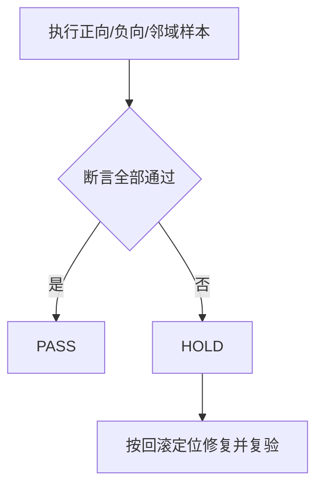

# 需求域 Skill 精简实施前置验收标准

结论：以触发、职责、消费者、引用和回滚证据作为放行门槛；影响：防止“简化”弱化自动触发、用户习惯或保护规则；范围：四个需求 Owner、相邻消费者和专项测试资产；非范围：业务功能验收、线上接口和最终发布验收；变化：为每个迁移周期建立可执行 AC；完成标准：全部前置验收场景通过；术语说明：PASS 表示满足全部断言，HOLD 表示候选保持不删除；验证状态：实施中。

## 文档信息

图片资产决策：N/A + 原因：验收只验证 Skill 文本、路径和本地脚本；证据：无图片交付。

| 字段 | 内容 |
| --- | --- |
| 验收对象 | `REQ-REQ-DOMAIN-20260722` |
| 入口 | `doc/5-tests/2026-07-22_231500/requirement-domain-streamlining/validate_requirement_domain_streamlining.py` |
| 通过状态 | `PASS` |

## 前置条件

- 用户已确认实施计划，当前轮允许修改 Skill 资产但没有 Git 写历史授权。
- 基线 commit、核心 SHA-256、write set 和回滚定位已经冻结。
- 所有验证只读取 local 仓库与本地脚本。

## 验收场景

| AC ID | 场景 | 前置条件 | 输入与预期结果 | 通过标准 | 失败标准 |
| --- | --- | --- | --- | --- | --- |
| `AC-REQ-001` | 新需求自动接入 | 四个 Skill 存在 | 粗略 idea 命中 intake/initial-discovery | aliases 保留且 route 明确 | 仅点名 Skill 才命中 |
| `AC-REQ-002` | 关键缺口回流 | discovery 已完成 | 信息缺字段且影响方向命中 gap-routing | 一次推进一个关键问题 | agent 猜测补答案 |
| `AC-REQ-003` | 专项边界 | 范围/兼容性不清 | 命中 boundary，不被 intake 吞并 | 专项 Owner 保持独立 | 路由被吞并 |
| `AC-REQ-004` | 专项拆分 | 多模块、多接口 | 命中 splitting | 只输出切片和依赖 | 直接拥有实施文件命令 |
| `AC-REQ-005` | 需求变更 | 已确认需求改变 | 命中 change 并使旧结论失效 | 回流重规划 | 偷塞当前实现 |
| `AC-REQ-006` | 旧消费者清零 | 已完成迁移 | 扫描运行文件 | gap/discovery 活跃旧名为 0 | 任意活跃残留 |
| `AC-REQ-007` | Gap 资产唯一 | 迁移快照删除 | 直接 references 可解析 | 单一正文 Owner | 双正文或缺路径 |
| `AC-REQ-008` | 负向邻域 | 原实现不符合原需求 | 进入 Bug 域而非 change | 邻域排除通过 | 误触 change |
| `AC-REQ-009` | 运行合规 | 任意 Skill 修改 | Quick Validate 和字典通过 | planned_missing=0 | 资产孤立/字典失败 |
| `AC-REQ-010` | 停止与回滚 | 用户停止或门禁失败 | 不继续扩散，候选 HOLD | 证据和定位可用 | 继续或伪报完成 |

## 验收目标与判定原则

- 通过必须同时满足正向、负向、邻域竞争和生命周期场景。
- 静态检查不等于运行能力；自然语言 fixtures 和真实扫描必须执行。
- 文档落盘不代表最终业务验收通过。

## 异常分支场景

- validator 入口失败：记录执行失败，不无变化重试；修复输入后复验。
- Obsidian 未注册：记为阻断沉淀，不改用直接 vault 文件操作。
- 任一 Skill Quick Validate 失败：候选保持 HOLD，不删除资产。

## 范围外场景

- 业务功能、数据库、外部接口、浏览器和生产环境不在本次验收范围。

## 完成条件、停止条件与交付物

| 项目 | 完成标准 | 停止条件 |
| --- | --- | --- |
| 触发 | 所有 aliases 有目标 Owner | 正/负向触发失败 |
| 消费者 | 旧活跃名称为 0 | 仍有运行文件引用旧名 |
| 资产 | references 全部存在，无迁移快照 | 双 Owner 或孤立资产 |
| 交付 | validator 五阶段、Quick Validate、字典、审查通过 | P0/P1 或无回滚定位 |

## REQ-AC 追踪矩阵

| REQ | AC | CYCLE/TASK | TEST |
| --- | --- | --- | --- |
| `REQ-REQ-001/002` | `AC-REQ-001/002` | `CYCLE-REQ-03/TASK-REQ-03-01` | `TEST-REQ-TRIGGER-001` |
| `REQ-REQ-003` | `AC-REQ-003/004/005` | `CYCLE-REQ-04/TASK-REQ-04-01` | `TEST-REQ-NEIGHBOR-001` |
| `REQ-REQ-004/005` | `AC-REQ-006/007` | `CYCLE-REQ-02/TASK-REQ-02-01` | `TEST-REQ-CONSUMER-001` |
| `REQ-REQ-005` | `AC-REQ-009/010` | `CYCLE-REQ-06/TASK-REQ-06-03` | `TEST-REQ-FINAL-001` |

图形目的：展示前置验收从场景验证到 PASS/HOLD 的判定流程。

关联 ID：`AC-REQ-001` 至 `AC-REQ-010`。

